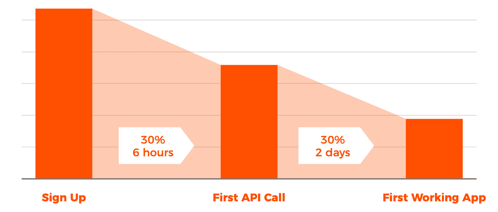

# 每个平台团队都应该跟踪的 13 个 API 指标

> 原文：<https://www.moesif.com/blog/technical/api-metrics/API-Metrics-That-Every-Platform-Team-Should-be-Tracking/>

## 识别关键 API 指标

当涉及到 API 时，每个团队都需要跟踪不同的 KPI。对基础设施团队来说重要的 API 度量将不同于对 API 产品或 API 平台团队来说重要的 API 度量。度量标准也可以依赖于 API 在产品生命周期中的位置。最近发布的一个 API 将更加关注改进设计和使用，同时牺牲可靠性和向后兼容性。维护已被企业团队广泛采用的 API 的团队可能会更关注推动每个客户采用额外的功能，并优先考虑可靠性和向后兼容性，而不是设计。

一般来说，有三到四个团队关心 API 度量

### 基础设施/开发运营

确保服务器正在运行，有限的资源得到正确分配，可能需要多个工程团队。

### 应用工程/平台

API 开发人员负责向 API 添加新功能，同时调试 API 业务逻辑中的应用程序特定问题。这些产品可以是 API 即服务、面向合作伙伴的插件和集成、集成到更大产品中的 API，或者其他东西。

### 产品管理

API 产品经理负责规划 API 特性，确保构建正确的 API 端点，并利用工程时间和个人限制平衡客户(无论是内部还是外部)的需求。

### 业务/增长

面向业务的团队(如营销和销售)不会考虑 API 端点，相反，他们最感兴趣的是客户采用，确保他们成功地使用 API，他们来自哪里，以及看到哪些用户可能是新的销售机会。

## 基础设施 API 指标

这些指标中有许多是应用性能监控(APM)工具和基础设施监控公司(如 Datadog)关注的焦点。

### 1:正常运行时间

虽然最基本的指标之一，正常运行时间或可用性是衡量服务可用性的黄金标准。许多企业协议包括 SLA(服务水平协议)，正常运行时间通常包含在其中。很多时候，你会听到“三个 9”或“四个 9”这样的术语，这是一种衡量每年正常运行时间与停机时间的方法。

| 可用性% | 每年停机时间 |
| --- | --- |
| 99%(“两个九”) | 3.65 天 |
| 99.9%(“三个九”) | 8.77 小时 |
| 99.99%(“四个九”) | 52.60 分钟 |
| 99.999%(“五个九”) | 5.26 分钟 |

当然，从四个 9 到五个 9 远比从两个 9 到三个 9 难，这就是为什么除了最关键的(也是最昂贵的)服务之外，你不会看到五个 9。也就是说，某些服务实际上可以有更短的正常运行时间，同时确保在不影响您的服务的情况下优雅地处理中断。例如，Moesif 的设计使得它可以继续从我们的 SDK 收集数据，即使在网站和仪表板完全中断的情况下。即使在我们的收集网络崩溃的最坏情况下，SDK 也会在本地排队，不会导致应用程序中断。

正常运行时间通常通过 ping 服务或综合测试来衡量，如通过 [Pingdom](https://www.pingdom.com) 或 [UptimeRobot](https://uptimerobot.com/) 。您可以将探测器配置为以固定的时间间隔(如每分钟)运行，以探测特定的端点，如`/health`或`/status`。此端点应该具有基本的连接性测试，例如到任何后备数据存储或其他服务的连接性测试。

这些指标可以使用像 [Statuspage.io](https://statuspage.io) 这样的工具发布在你的网站上。事实上，Moesif 使用了一个基于 Lambda 的[开源状态页面](https://github.com/ks888/LambStatus)。

还有更复杂的 ping 服务，称为合成测试，可以执行更复杂的测试设置，如运行特定序列并断言响应有效负载具有某个值。请记住，虽然合成测试可能不代表真实世界的客户流量。您可以在保持高正常运行时间的同时拥有一个有缺陷的 API。

> 什么是**合成监听**？顾名思义，它是一组预定义的 API 调用，服务器(通常由监控服务的提供者之一)触发这些调用来调用您的服务。虽然这并不能反映用户的真实体验，但是按照预期查看这些 API 的顺序是很有用的。

### 2: CPU 使用率

CPU 使用率是最经典的性能指标之一，可以代表应用程序的响应能力。高服务器 CPU 使用率可能意味着服务器或虚拟机超额订阅和过载，也可能意味着您的应用程序中存在性能缺陷，如太多自旋锁。基础设施工程师使用 CPU 使用率(以及它的姐妹指标，内存百分比)来进行资源规划和衡量整体运行状况。某些类型的应用，如高带宽代理服务和 API 网关，自然比其他指标具有更高的 CPU 使用率，以及涉及大量浮点数学的工作负载，如视频编码和机器学习工作负载。

当您在本地调试 API 时，您可以通过 Windows 上的[任务管理器(或 Mac](https://en.wikipedia.org/wiki/Task_Manager_(Windows)) 上的[活动监视器)轻松查看系统和进程的 CPU 使用情况。但是在服务器上，你可能不希望运行`top`命令。这就是各种 APM 提供商可以发挥作用的地方。APM 包括一个代理，您可以将它嵌入到您的应用程序中或服务器上，该代理可以捕获 CPU 和内存使用等指标。它还可以执行其他特定于应用程序的监控，如线程分析。](https://support.apple.com/en-us/HT201464)

在查看 CPU 使用率时，重要的是查看每个虚拟 CPU(即物理线程)的使用率。不平衡的使用可能意味着应用程序没有正确线程化或者线程池大小不正确。

许多 APM 提供程序允许您用多个名称标记应用程序，以便您可以执行汇总。例如，您可能希望对每个虚拟机指标进行细分，如 *my-api-westus-vm0* 、 *my-api-westus-vm1* 、 *my-api-eastus-vm0* 等，同时将这些指标汇总到一个名为 *my-api* 的应用中。

### 3:内存使用

与 CPU 使用率一样，内存使用率也是衡量资源利用率的一个很好的指标，因为 CPU 和内存容量是物理资源，不像指标那样更依赖于配置。内存使用率极低的虚拟机可以缩小规模，或者为其分配额外的服务来消耗额外的内存。另一方面，高内存使用率可能表明服务器超载。传统上，大数据查询/流处理和生产数据库比 CPU 消耗更多内存。事实上，每个虚拟机的内存大小是一个很好的指标，可以用来衡量批量查询需要多长时间，因为更多的可用内存可以减少检查点、网络同步和磁盘分页。在查看内存使用情况时，您还应该查看页面错误和 I/O 操作的数量。一个容易犯的错误是，应用程序被配置为最多只分配一小部分可用物理内存，这可能导致人为的高页面虚拟内存抖动。

## 应用程序 API 指标

### 4:每分钟请求数(RPM)

RPM(每分钟请求数)是比较 HTTP 或数据库服务器时经常使用的性能指标。通常，您的端到端 RPM 会比宣传的 RPM 低得多，这更像是一个简单的“Hello World”API 的上限。因为服务器不会考虑对数据库、第三方服务等进行 I/O 操作所产生的延迟。虽然有些人喜欢吹嘘他们的高 RPM，但工程团队的目标应该是效率，并试图降低这一点。某些需要许多 API 调用的业务功能可以合并到较少数量的 API 调用中，以减少这个数量。像在一个请求中批量处理多个请求这样的常见模式非常有用，可以确保您拥有灵活的分页模式。

您的 RPM 可能会根据一周中的某一天甚至每天的某个小时而有所不同，尤其是如果您的 API 适用于其他在夜间和周末使用率较低的业务。RPM 还有其他相关术语，如 RPS(每秒请求数)和 QPS(每秒查询数)。

### 5:平均和最大延迟

跟踪客户体验的最重要的指标之一是 API 延迟或运行时间。虽然基础设施级别指标(如 CPU 使用率)的增加可能实际上并不对应于用户感知的响应速度的下降，但 API 延迟肯定会。跟踪延迟本身可能无法让您完全了解延迟增加的原因。重要的是跟踪 API 的任何变化，比如发布新的 API 版本、添加新的端点、模式变化等等，以找到延迟增加的根本原因。

因为当只查看总延迟时，有问题的慢速端点可能会被隐藏，所以按路线、地理位置和其他领域查看延迟细分非常重要。例如，您可能有一个`POST /checkout`端点，其延迟随着时间的推移而缓慢增加，这可能是由于没有正确索引的 SQL 表大小不断增加。然而，由于对`POST /checkout`的调用量很低，这个问题被您的`GET /items`端点掩盖了，它被调用的次数远远多于结账端点。类似地，如果您有一个 GraphQL API，您会希望查看每个 GraphQL 操作的平均延迟。

我们将延迟归入应用程序/工程，尽管许多开发人员/基础架构团队也会考虑延迟。通常，基础架构人员会查看一组虚拟机的总延迟，以确保虚拟机不会过载，但他们不会深入了解特定于应用程序的指标，如每条路由。

### 6:每分钟错误数

与 RPM 类似，Errors per Minute(或 error rate)是每分钟调用非 200 系列状态代码的 API 的次数，对于衡量 API 的错误和易错程度至关重要。为了跟踪每分钟的错误，了解发生了什么类型的错误很重要。500 个错误可能意味着您的代码发生了不好的事情，而许多 400 个错误可能意味着来自设计或记录不良的 API 的用户错误。这意味着在设计你的 API 时，使用合适的 [HTTP 状态码是很重要的。](https://www.restapitutorial.com/httpstatuscodes.html)

您可以进一步深入查看这些错误的来源。来自一个特定地理区域的许多 *401 未授权*错误可能意味着僵尸程序正试图入侵您的 API。

## API 产品指标

API 不再仅仅是一个与微服务和 SOA 相关联的工程术语。API 作为一种产品正变得越来越普遍，尤其是在那些希望在与新合作伙伴和收入渠道的竞争中胜出的 B2B 公司中。API 驱动的公司需要看到的不仅仅是错误和延迟等工程指标，以了解他们的 API 是如何使用的(或者为什么他们没有像计划的那样快被采用)。确保构建正确功能的角色在于 *API 产品经理*，这是许多 B2B 公司争相填补的新角色。

### 7: API 使用增长

对于许多产品经理来说，API 使用(以及独特的消费者)是衡量 API 采用的黄金标准。一个 API 不应该只是没有错误，而是应该逐月增长。与每分钟的请求不同，API 使用应该以更长的时间间隔(如几天或几个月)来衡量，以了解真实的趋势。如果衡量月环比 API 增长，我们建议选择 28 天，因为这可以消除周末与工作日使用量以及每月天数差异造成的任何偏差。例如，二月可能只有 28 天，而前一个月有整整 31 天，导致二月*看起来*使用率较低。

### 8:独特的 API 消费者

因为一个月的 API 使用量的增加可能只归因于一个客户账户，所以衡量 *API DAU* (每月活跃用户)或*API*的唯一消费者是很重要的。这一指标可以为您提供新客户获取和增长的总体状况。许多 API 平台团队将 API MAU 与他们的 web MAU 相关联，以获得完整的产品健康状况。如果 web MAU 的增长速度远远超过 API MAU，那么这可能意味着在新解决方案的集成或实施过程中存在漏洞。当公司的核心产品是 API 时尤其如此，比如许多 B2B/SaaS 公司。另一方面，API MAU 可以与 API 使用相关联，以了解增加的 API 使用来自哪里(新客户与现有客户)。

像 Moesif 这样的工具可以跟踪个人用户和 API，还可以将他们与 T2 公司或 T4 组织联系起来。

### 9:按 API 使用情况列出的顶级客户

对于任何专注于 B2B 的公司来说，跟踪顶级 API 消费者可以给你带来巨大的优势，让你了解你的 API 是如何使用的，以及哪里有追加销售的机会。许多有经验的产品领导者都知道，许多产品表现出幂律动力学，少数超级用户的使用量与其他人相比不成比例。毫不奇怪，这些超级用户通常会给你的公司带来最多的收入和有机推荐。

这意味着跟踪你的前 10 个客户实际上在用你的 API 做什么是很重要的。您可以根据他们呼叫的端点以及呼叫方式进一步细分。他们是否比非高级用户更多地使用特定的端点？也许他们在你的 API 中找到了他们的啊哈时刻。

### 10:原料药保留

你应该在你的产品和工程上花更多的钱，还是应该在增长上投入更多的钱？留存和流失(留存的反义词)可以告诉你走哪条路。与存在流失问题的产品相比，具有高产品保留率的产品更接近产品市场契合度。与订阅保留不同，产品保留跟踪产品(如 API)的实际使用情况。虽然这两者是相关的，但它们并不相同。一般来说，产品流失是订阅流失的主要指标，因为没有发现 API 价值的客户可能会被年度合同所困，而不会积极使用 API。API 留存率应该高于 web 留存率，因为 web 留存率将包括已经登录但还没有必要集成平台的客户。而 API 保留着眼于集成后的客户。

### 11:第一个 Hello World 时间(TTFHW)

TTFHW 是一个重要的 KPI，不仅用于跟踪您的 API 产品健康状况，还用于跟踪您的整体[开发者体验，也称为 DX](/blog/api-guide/api-developer-experience/) 。特别是如果你的 API 是一个吸引第三方开发者和合作伙伴的开放平台，你要确保他们能够尽快启动并运行他们的第一个*啊哈*时刻。TTFHW 测量从第一次访问您的登录页面到通过您的 API 平台进行第一笔交易的 MVP 集成需要多长时间。这是一个跨职能的指标，跟踪市场营销、文档和教程，直到 API 本身。

### 12:每个业务事务的 API 调用

虽然对于许多产品和业务指标来说，越多越好，但保持每次业务交易的通话次数尽可能低是很重要的。这个指标直接反映了 API 的*设计*。如果一个新客户必须进行 3 次不同的调用并将数据拼凑在一起，这可能意味着 API 没有正确的端点可用。当设计一个 API 时，重要的是要从业务交易或者客户想要达到的目标的角度来考虑，而不仅仅是特性和端点。这也可能意味着当涉及到[过滤和分页时，你的 API 不够灵活。](/blog/technical/api-design/REST-API-Design-Filtering-Sorting-and-Pagination/)。

### 13: SDK 和版本采用

许多 API 平台团队可能也有一堆他们维护的 SDK 和集成。与只有 iOS 和 Android 作为核心移动操作系统的移动设备不同，你可能有 10 个甚至数百个 SDK。在推出新功能时，这可能会成为维护的噩梦。您可以有选择地向最受欢迎的 SDK 推出关键功能，而向不太受欢迎的 SDK 推出不太重要的功能。当涉及到贬低某些端点和特性时，测量 API 或 SDK 版本也很重要。在没有咨询他们为什么要使用的情况下，您不会想要贬低您的最高付费客户正在使用的终端。

## 业务/增长

业务/增长指标可以类似于产品指标，但侧重于收入、采用和客户成功。例如，您可能不想按 API 使用情况查看前 10 名客户，而是想按收入查看前 10 名客户，然后按他们的端点使用情况查看。为了跟踪业务增长，像 Moesif 这样的分析工具支持使用来自 CRM 或其他分析服务的客户数据来丰富用户资料，以便更好地了解谁是 API 用户。

## 结论:

对于任何构建和使用 API 的人来说，跟踪正确的 API 度量标准是至关重要的。如果没有正确的工程和产品工具，大多数公司不会推出新的网络或移动产品。类似地，如果没有检测和跟踪正确的 API 指标的方法，您也不会想要启动一个新的 API。有时一个团队的 KPI 可以融入到另一个团队中，就像我们在 API 使用度量中看到的那样。对于同一个基本指标，可以有不同的看法。然而，团队应该专注于为他们的团队寻找正确的度量标准。例如，产品经理不应该担心 CPU 的使用，就像基础设施团队不应该担心 API 的保留一样。像 [Moesif API Analytics](https://www.moesif.com/solutions/track-api-program) 这样的工具可以帮助您通过快速安装 SDK 来开始测量这些指标。

*[要了解更多 API 分析，请参阅本系列的第 1 章:掌握 API 分析——开发者漏斗](/blog/technical/api-analytics/Mastering-API-Analytics-for-API-Programs-Chapter-1/)*

*[继续本系列的第 2 部分:掌握 API 分析-群组保持分析](/blog/technical/api-analytics/Mastering-API-Analytics-for-API-Programs-Chapter-2/)*