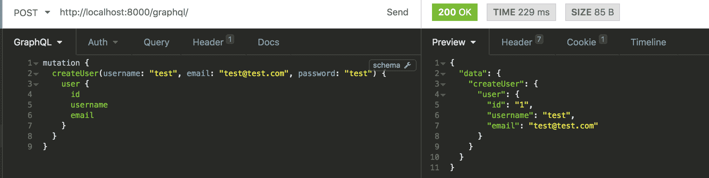
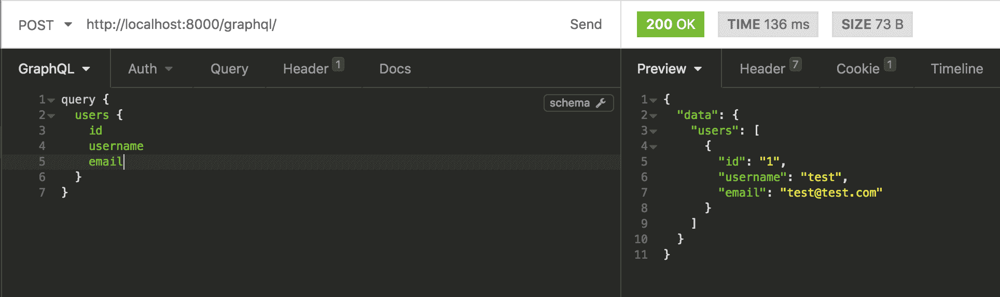
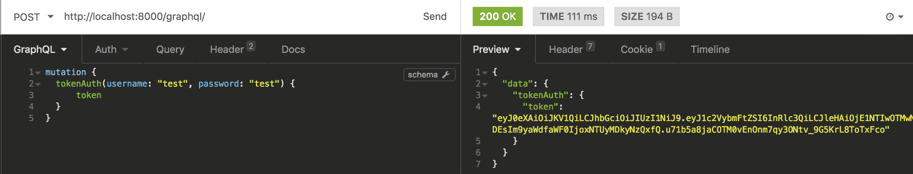
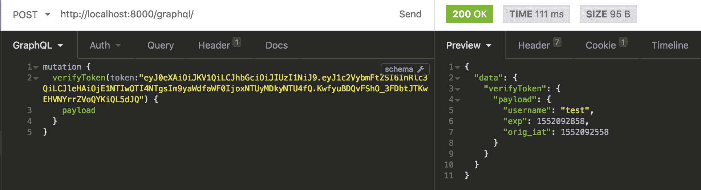
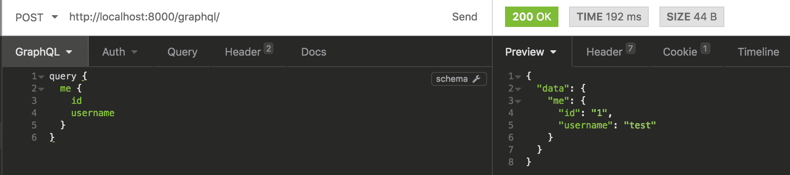

# Python 和 GraphQL 入门——第 2 部分

> 原文：<https://www.moesif.com/blog/technical/graphql/Getting-Started-with-GraphQL-Part2/>

本教程假设您熟悉使用 Django 和 Graphene 的 GraphQL 和 Python。如果没有，你可以参考之前的文章[Python 和 GraphQL 入门](/blog/technical/graphql/Getting-Started-with-Python-GraphQL-Part1/)

在本教程中，我们将讨论认证。Django 有一个内置的用户概念，所以我们需要通过向服务器发送数据来创建用户。

我们将创建一个新文件夹`users`和新文件`schema.py`

```py
from django.contrib.auth import get_user_model
import graphene
from graphene_django import DjangoObjectType

class UserType(DjangoObjectType):
    class Meta:
        model = get_user_model()

class CreateUser(graphene.Mutation):
    user = graphene.Field(UserType)

    class Arguments:
        username = graphene.String(required=True)
        password = graphene.String(required=True)
        email = graphene.String(required=True)

    def mutate(self, info, username, password, email):
        user = get_user_model()(
            username=username,
            email=email,
        )
        user.set_password(password)
        user.save()

        return CreateUser(user=user)

class Mutation(graphene.ObjectType):
    create_user = CreateUser.Field() 
```

当使用突变向服务器发送数据时，我们将发送`username`、`password`和`email`。服务器将返回创建的带有所有信息的`User`对象，客户端可以询问它想要的字段。

在执行它之前，我们需要将新的突变放在根文件`schema.py`中。

```py
import graphene
import events.schema
import users.schema

# Query for getting the data from the server. class Query(events.schema.Query, graphene.ObjectType):
    pass

# Mutation for sending the data to the server. class Mutation(users.schema.Mutation, events.schema.Mutation, graphene.ObjectType):
    pass

# Create schema schema = graphene.Schema(query=Query, mutation=Mutation) 
```

使用失眠症执行下面的代码，我们可以看到新用户被创建。



## 查询用户

为了列出所有用户，我们将创建一个查询并发送给服务器。

我们将把以下内容添加到`users/schema.py`文件中。

```py
class Query(graphene.ObjectType):
    users = graphene.List(UserType)

    def resolve_users(self, info):
        return get_user_model().objects.all() 
```

我们还将更新根查询类以支持用户查询。

```py
class Query(users.schema.Query, events.schema.Query, graphene.ObjectType):
    pass 
```

我们将向服务器发送一个查询来列出所有用户。



## 用户认证

在 Django 中，默认情况下使用会话启用身份验证。我们将使用`django-graphql-jwt`库在 GraphQL 中实现 JWT 令牌。

当用户注册或登录时，标识用户的一段数据被发送给用户。当需要身份验证时，用户应该在请求的 HTTP 授权头中发送相同的令牌。

我们将通过在`settings.py`文件中添加一个新的中间件来配置`django-graphql-jwt`。在同一个文件中，我们将添加身份验证后端设置。

```py
MIDDLEWARE = [
    # After django.contrib.auth.middleware.AuthenticationMiddleware...
    'graphql_jwt.middleware.JSONWebTokenMiddleware',
]

# Authentication backends AUTHENTICATION_BACKENDS = [
    'graphql_jwt.backends.JSONWebTokenBackend',
    'django.contrib.auth.backends.ModelBackend',
] 
```

> *什么是 Moesif？ [Moesif](https://www.moesif.com/features/graphql-analytics) 是最先进的 REST 和 GraphQL 分析平台，被数以千计的平台用来衡量您的查询执行情况，并了解您最忠实的客户正在使用您的 API 做什么。*

接下来，我们将导入库并更新`Mutation`类，使`schema.py`文件中包含以下变量。

```py
import graphene
import graphql_jwt

# Mutation for sending the data to the server. class Mutation(users.schema.Mutation, events.schema.Mutation, graphene.ObjectType):
    token_auth = graphql_jwt.ObtainJSONWebToken.Field()
    verify_token = graphql_jwt.Verify.Field()
    refresh_token = graphql_jwt.Refresh.Field() 
```

该文库产生三种突变:

我们将使用`TokenAuth`来验证用户的用户名和密码，并获得 JSON Web 令牌。



我们将使用`VerifyToken`来验证作为参数传递的令牌是有效的令牌。



`RefreshToken`将在更新的过期时间内为未过期的令牌生成新令牌。

## 测试身份验证

为了测试我们的身份验证是否有效，我们将创建一个名为`me`的查询，如果登录，它将返回用户的信息，否则将抛出一个错误。

首先，我们将在`schema.py`文件的查询类中添加`me`查询。

```py
class Query(graphene.ObjectType):
    me = graphene.Field(UserType)
    users = graphene.List(UserType)

    def resolve_users(self, info):
        return get_user_model().objects.all()

    def resolve_me(self, info):
        user = info.context.user
        if user.is_anonymous:
            raise Exception('Authentication Failure!')
        return user 
```

为了进行测试，我们需要使用`tokenAuth`突变获得一个令牌，并通过添加前缀`JWT`在我们的查询中使用 HTTP 授权头。


我们将添加带有令牌内容的 HTTP 授权头，前缀为单词`JWT`。


最后，我们将进行`me`查询，该查询将识别我们的用户。



我们能够创建用户并与他们一起登录。如果我们在没有 HTTP 头的情况下进行查询，我们会得到错误消息。

好吧，就让我玩玩吧！要查看 GraphQL 的运行情况，您可以从 GitHub 克隆并运行这个示例应用程序[。](https://github.com/Moesif/moesif-graphene-django-example)

在下一篇教程中，我们将讨论如何监控 GraphQL APIs。同时，如果您有任何问题，请联系 [Moesif 团队](mailto:team@moesif.com)。

本系列前情提要:

*   [Python 和 GraphQL 入门第 1 部分](/blog/technical/graphql/Getting-Started-with-Python-GraphQL-Part1/)