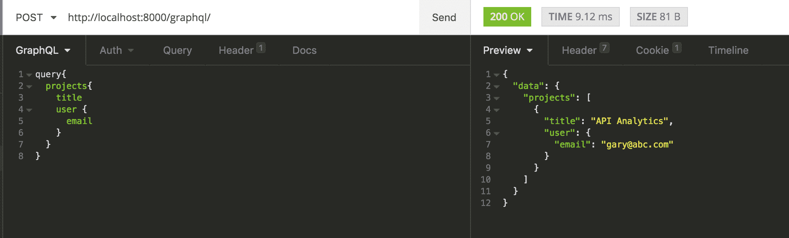
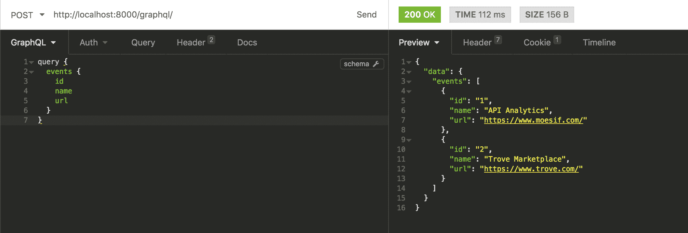
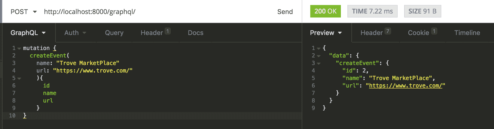
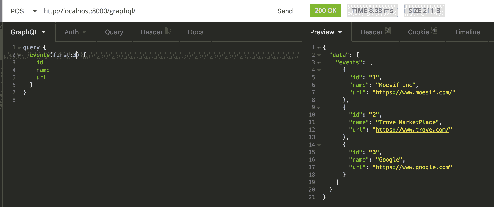
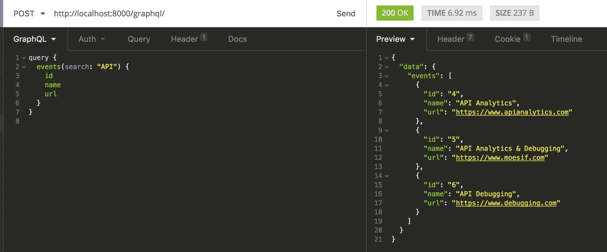
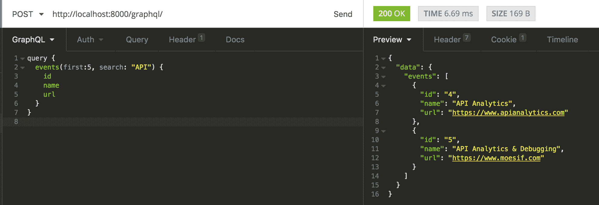

# Python 和 GraphQL 入门——第 1 部分

> 原文：<https://www.moesif.com/blog/technical/graphql/Getting-Started-with-Python-GraphQL-Part1/>

自从脸书提出 GraphQL 以来，它就一直被认为是 REST APIs 的替代品。最近 [Github](https://githubengineering.com/the-github-graphql-api/) 也宣布了对他们的一个 API 的 GraphQL 支持。因为 GraphQL 不仅仅是 REST 的进化替代品，所以这篇博客将有助于介绍 GraphQL 的基础知识，并使用 Python Django 和 Graphene 开发 GraphQL APIs。

## GraphQL 简介

GraphQL 是什么？

> GraphQL 是一种强类型查询语言，描述了如何请求数据。GraphQL 将所有东西都声明为图。你要求你想要的，然后你会得到你期望的。不多不少。

考虑一个有两个表`projects`和`user`的数据库。项目包含字段`title`和`project_name`，而`user`包含字段`user_name`和`email`。

现在，如果您想知道项目的标题和与该项目相关的用户电子邮件，该怎么办呢？你的第一直觉是什么？除非已经创建了 API 端点，否则您可能会对`GET /projects`和`GET /users`进行 HTTP 调用。在客户端，您可以在收到两个查询后进行连接。一些 REST API 可能会提供一些灵活性，比如`GET/projects?include=user`。然而，这样的查询需要提前整合到 API 的设计中。如果您的查询更加模糊，比如获取与项目相关的用户的经理电子邮件，该怎么办？GraphQL 允许您准确地声明查询所需的实体和相关实体，并且可以在单个客户端到服务器中完成，从而减少 API 的“闲聊”和往返延迟。



> 作为一种强类型查询语言，它允许您确定需要什么数据，从而避免与未充分利用的数据相关的问题。

GraphQL 有时被视为 API 理解的革命性方式。与使用严格定义的端点(如 REST API 的情况)不同，通过单个客户机/服务器往返来接收必要的数据，这确保了前端和后端团队之间的平稳工作流。换句话说，客户机可以准确地指定它需要什么，而不是让服务器创建客户机可能查询什么的人工查询。

听起来很刺激，不是吗？如果您目前正在使用 REST API，并且想知道迁移到 GraphQL 是否能解决您的业务问题，请查看这篇对 REST 与 Graph 架构的深入分析。

## 入门指南

继续之前，请确保您安装了 Python 3.6。

### 我们要建造什么？

在这篇博客中，我们将使用 Django 和 Graphene 创建一个示例项目。 [Graphene](http://graphene-python.org/) 是 Python 的 GraphQL 框架。该项目将具有以下特点:

*   `Events`有`name`和`url`字段的创作
*   搜索和过滤`Events`数据

### 创建您的本地环境

在使用 Python 时，我们建议使用虚拟环境来将所有项目的依赖项与其他项目隔离开来。

```py
conda create -n graphql python=3.6 anaconda # Create the environment
source activate graphql # Activate the environment 
```

### 安装依赖项

```py
pip install django==2.0.2 graphene==2.0.1 graphene-django==2.0.0 django-filter==1.1.0 
```

## 配置石墨烯 Django

在`{django_project_name}/settings.py`上，添加以下内容:

```py
INSTALLED_APPS = (
    # At the end of all the default packages
    'graphene_django',
) 
```

在文件底部添加:

```py
GRAPHENE = {
    'SCHEMA': '{django_project_name}.schema.schema',
} 
```

## 创建一个`Event`应用

在`{django_project}`根上，创建`events`应用程序

```py
python manage.py startapp events 
```

接下来，我们需要定义数据库和 Django 之间的层。

```py
# Defining Event model class Event(models.Model):
    name = models.TextField(blank=True)
    url = models.URLField() 
```

最后，我们需要配置 Django 在`{django_project_name/settings.py}`文件上使用新的`events`应用程序:

```py
INSTALLED_APPS = (
    # After the graphene_django app
    'events',
) 
```

### 创建数据库表

```py
python manage.py makemigrations
python manage.py migrate 
```

打开 Django shell `python manage.py shell`并创建一些数据。

```py
from events.models import Event
Event.objects.create(name='API Analytics', url='https://www.moesif.com/')
Event.objects.create(name='Trove Marketplace', url='https://www.trove.com/') 
```

## 介绍失眠/图形 1

我们可以使用 REST 客户端或浏览器中的图形交互界面来运行查询。

## 创建您的第一个模式

当开始使用 GraphQL 时，我们的第一个问题是如何构建我们的 GraphQL 服务器？由于 GraphQL 已经作为[规范](https://graphql.github.io/graphql-spec/October2016/)发布，我们可以用任何编程语言构建服务器。

模式是可能包含多个字段的对象的集合。每个字段都通过返回值的解析器进行计算。字段的解析函数将访问数据库并返回一个对象。

模式是严格类型化的，描述了所有可能接收到的数据。GraphQL 查询模式和您的数据库结构没有连接。

为模式创建文件`{django_project_name}/schema.py`。

```py
import graphene
import events.schema

# Query for getting the data from the server. class Query(events.schema.Query, graphene.ObjectType):
    pass

# Create schema schema = graphene.Schema(query=Query) 
```

## 创建您的第一个查询

> GraphQL 查询语言完全是关于选择对象上的字段。

我们从“根”对象开始，并在其上选择`events`字段。从事件返回的对象中，我们将选择`id`、`name`和`url`字段。



## 创造你的第一个突变

> 向服务器发送数据的过程称为变异。

定义突变类似于我们定义查询的方式。我们可以定义您可以发送到服务器的数据。突变方法将使用用户发送的数据在数据库上创建一个事件。



再次尝试查询数据，您将看到新事件被创建。

> 查询和变异定义了 GraphQL API 的入口点。每个 GraphQL 服务都有一个查询类型，可能有也可能没有突变类型。

## 搜索和过滤

一旦我们有了数据，我们就可以根据需求进行搜索和过滤。我们可以搜索第一/最后“n”个记录，跳过“n”个记录或搜索任何术语。

只有事件 Id 和名称字段的最后 n 条记录:



在名称或 url 字段中搜索特定术语:



我们还可以一起搜索和过滤:



好吧，就让我玩玩吧！要查看 GraphQL 的运行情况，您可以从 GitHub 克隆并运行这个示例应用程序[。](https://github.com/Moesif/moesif-graphene-django-example)

在下一个教程中，我们将讨论更多关于认证的内容。同时，如果您有任何问题，请联系 [Moesif 团队](mailto:team@moesif.com)。

本系列的下一篇:

*   [Python 和 GraphQL 入门第 2 部分](/blog/technical/graphql/Getting-Started-with-GraphQL-Part2/)