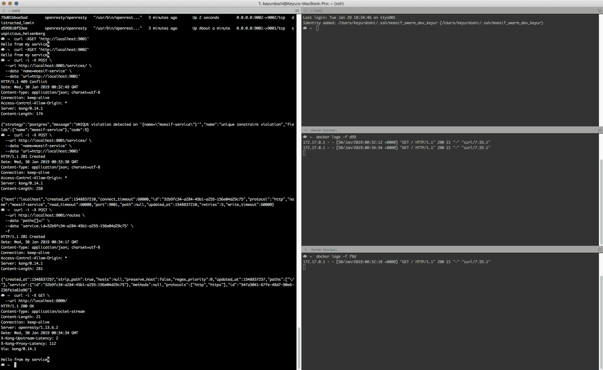
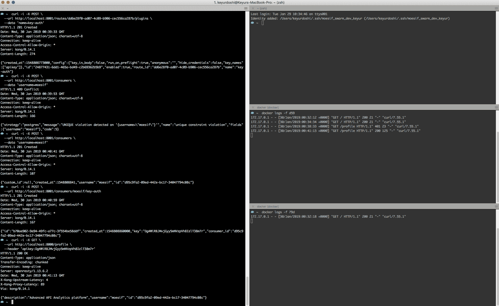
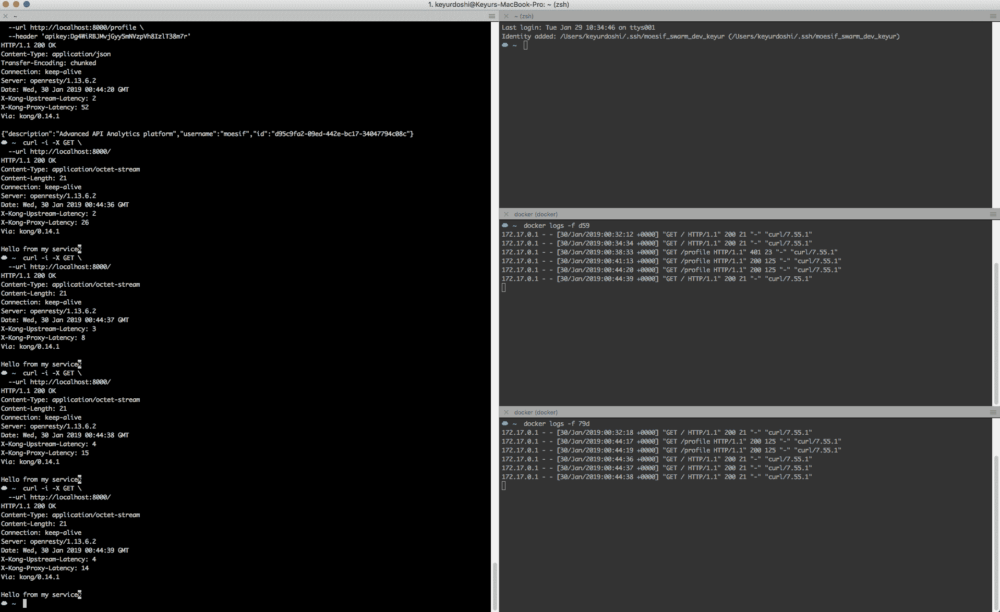
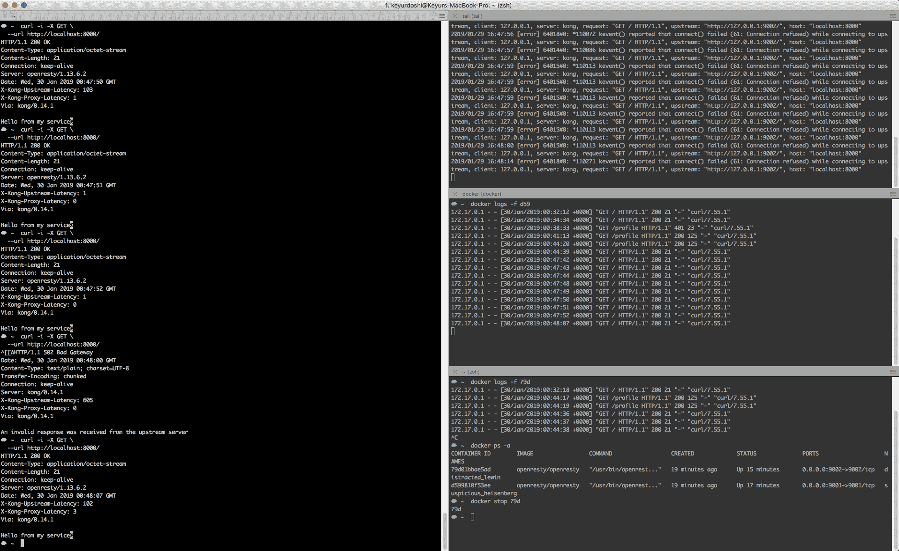

# 使用 Docker 实现 Kong API 网关的负载平衡

> 原文：<https://www.moesif.com/blog/technical/kong/Load-Balancing-using-Kong-API-Gateway-with-Docker/>

为了打破单一应用架构的僵化，开发人员正大量转向微服务。微服务是大型软件中的小型、独立、松散耦合的模块，它们通过 API 相互通信。微服务架构提供容错能力，支持连续交付，并能够跨多个区域扩展以确保高可用性。

在本文中，我们将展示一个例子，说明如何使用最流行的 HTTP 服务器之一 NGINX 作为核心构建的一个流行的开源 API 网关来实现负载平衡。通过 Kong，您可以从一个集中的位置获得更多的控制，以处理身份验证、速率限制、数据转换等事项，即使您拥有多个微服务，而不是典型的负载平衡器。

## 为什么要负载平衡？

负载平衡是高可用性基础设施的关键组成部分，用于将用户的请求负载分布在健康主机的多个服务上，以便没有主机过载。

单点故障可以通过引入负载平衡器和服务副本来缓解。每个服务都将返回相同的响应，因此无论调用哪个服务，用户都会收到一致的响应。

Kong 为多种服务提供了不同的负载平衡请求方法——基于 DNS 的方法、循环法和基于哈希的平衡方法。基于 DNS 的方法将以这样的方式在 DNS 中配置域，即用户对域的请求分布在一组服务中。循环法会将负载均匀有序地分配给主机。当使用基于散列的平衡方法时，Kong 将充当服务注册中心，通过一个 HTTP 请求来处理服务的添加和删除。

## 在本地设置孔

Kong 可安装在多种操作环境中。根据您当前使用的环境设置 Kong。关于如何安装孔的更多细节

## 设置服务

我们将启动两个服务，它们将是两个 NGINX 实例。我们会拉基于 NGINX 和 LuaJIT 的 OpenResty 官方 docker 镜像。

```py
docker pull openresty/openresty 
```

让我们启动两个服务，并将其映射到不同的端口

```py
docker run -p 9001:9001 -d openresty/openresty
docker run -p 9002:9002 -d openresty/openresty 
```

在配置服务之前，我们将安装软件包。

```py
docker exec -it <container> /bin/bash

apt-get update
apt-get install vim
apt-get install libnginx-mod-http-ndk nginx-common libnginx-mod-http-lua 
```

现在，我们将使用两个端点`/`和`/profile`来配置服务，我们将分别验证和监听端口`9001`和`9002`。我们将更新`etc/nginx/conf.d/default.conf`的配置文件。

```py
listen <port_number>;

location / {
      return 200 "Hello from my service";
    }

location /profile {
  content_by_lua_block {
    local cjson = require "cjson"
    local consumer_id = ngx.req.get_headers()["X-Consumer-ID"]
    if not consumer_id then
      ngx.status = 401
      ngx.say("Unauthorized")
      return
    end

    ngx.header["Content-Type"] = "application/json"
    ngx.say(cjson.encode{
      id = consumer_id,
      username = "moesif",
      description = "Advanced API Analytics platform"
      })
  }
} 
```

我们将重新启动服务，以确保反映最新的配置更改。

```py
docker restart <container> 
```

如果我们根据配置点击它们，我们将很快看到服务的响应。

```py
# Service A
curl -XGET 'http://localhost:9001'

# Service B
curl -XGET 'http://localhost:9002' 
```

这个想法是让两个服务成为彼此的副本，这样我们就可以在它们之间负载平衡我们的流量。

## 启动孔

我们将从 Kong 开始，将通过 Kong 的流量代理为反向代理，而不是直接访问 NGINX 实例。

为此，我们必须向代理端口`8000`和管理端口`8001`发出请求。

### 创建服务

我们将创建一个名为`moesif-service`的服务。

```py
curl -i -X POST \
  --url http://localhost:8001/services/ \
  --data 'name=moesif-service' \
  --data 'url=http://localhost:9001' 
```

### 创建路线

我们将创建一个接受流量的路由，并将从该路由收到的所有流量发送给上面创建的服务。

```py
curl -i -X POST \
  --url http://localhost:8001/routes \
  --data 'paths[]=/' \
  --data 'service.id=<service-id>' \
  -f 
```

此时，我们能够通过 Kong 将流量代理到 port `9001`服务。

```py
curl -i -X GET \
  --url http://localhost:8000/ 
```



太棒了，我们实际上是通过 Kong 将流量代理到上游，因为 Kong 将在响应中添加几个报头。

我们还可以将流量代理到任何上游端点，这使得 Kong 完全透明，因为它不关心我们发送哪个请求，只要它匹配我们在路由中定义的规则，它就会将该请求代理到上游。在我们的例子中，它是`/`,这基本上意味着通过 Kong 的每个请求都将被代理到端口`9001`服务。

现在让我们谈谈我们在上游定义的另一个端点`/profile`。

如果我们想强制每个请求通过`/profile`上游被认证，我们可以创建一个路由并在该路由上应用`key-auth`插件。

### 创建路线

```py
curl -i -X POST \
  --url http://localhost:8001/routes \
  --data 'paths[]=/profile' \
  --data 'service.id=<service-id>' \
  -f 
```

为了尽可能的灵活，Kong 有一个配置参数来定义我们是否剥离请求路径，默认为 true。这意味着`/profile`被代理为上游的`/`。因此，我们必须通过一个简单的补丁请求来禁用它。

```py
curl -i -X PATCH \
  --url http://localhost:8001/routes/<service-id> \
  --data 'strip_path=false' 
```

现在，如果我们向`/profile`发出请求，它将正确地向上游的`/profile`发出请求。

```py
curl -i -X GET \
  --url http://localhost:8000/profile 
```

现在让我们将`key-auth`插件应用于`/profile`路线。

```py
curl -i -X POST \
  --url http://localhost:8001/routes/<service-id>/plugins \
  --data 'name=key-auth' 
```

我们需要在调用`/profile`端点时传递 API 键，因为我们必须创建消费者。

```py
curl -i -X POST \
  --url http://localhost:8001/consumers \
  --data 'username=moesif' 
```

为了获得 API 密钥，我们将发出一个 POST 请求

```py
curl -i -X POST \
  --url http://localhost:8001/consumers/<username>/key-auth 
```

我们用 API-key 作为头向`/profile`发出请求，

```py
curl -i -X GET \
  --url http://localhost:8000/profile \
  --header 'apikey:<apikey>' 
```

我们可以看到,`/profile`已经过身份验证，并按照上游配置返回响应。



您已经观察到另一个服务处于空闲状态，没有接收任何流量。这里的目标是平衡两个服务之间的流量负载。

我们不打算使用基于 DNS 的负载平衡，而是使用类似于 NGINX 中的`upstream`模块的`upstreams`手动完成。我们必须给出的唯一参数是`name`，在我们的例子中是`localhost`。因此，每个主机名为`localhost`的服务都将通过上游代理，这将做出负载平衡决策。

```py
curl -i -X POST \
  --url http://localhost:8001/upstreams \
  --data 'name=localhost' 
```

我们将为这两个端口添加目标，并开始在服务之间代理负载平衡流量。

```py
curl -i -X POST \
  --url http://localhost:8001/upstreams/<upstream-id>/targets \
  --data 'target=localhost:9001' 
```

现在，如果我们通过 kong 发出请求，它将在两个服务之间实现负载平衡。



如果我们关闭其中一个服务，Kong 将使用重试机制。但是在某些情况下，如果我们在相同的上游用尽所有的重试，仍然可能有错误。在监控 Kong 日志时，您可以看到 Kong 正在做出的决定。它正试图与第二个上游通信，但未能成功，并重试对第一个上游的请求。我们的负载平衡槽的大小相当大，可能需要一段时间来访问另一个服务。在这种情况下，我们必须继续发送更多的请求。



要了解如何使用您的 API，捕获 API 请求和响应并记录到 Moesif，以便通过 Kong 轻松检查和实时调试您的 API 流量。有关如何安装 Moesif 插件的更多详细信息，请查看此[方法](/blog/technical/kong/Using-AI-Powered-API-Analytics-with-Kong-API-Gateway/)。

同时，如果您有任何问题，请联系 [Moesif 团队](mailto:team@moesif.com)