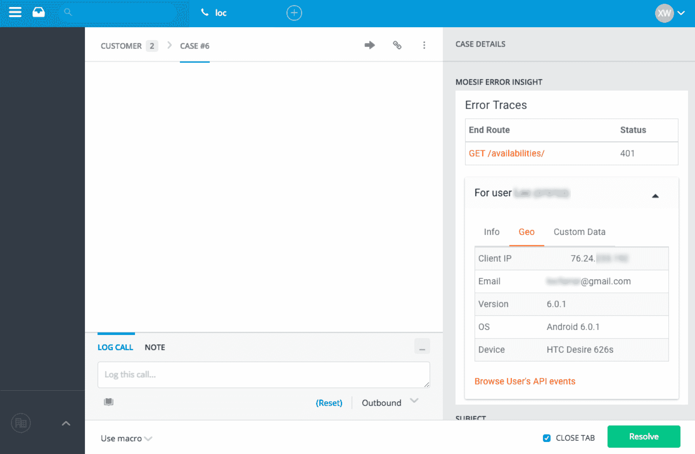
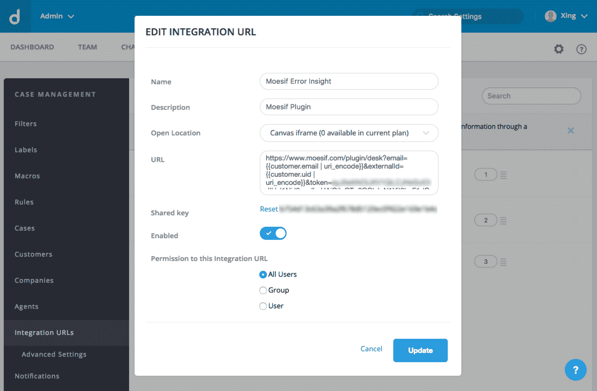

# 利用 Moesif 的 Desk.com 集成快速调试技术支持问题

> 原文：<https://www.moesif.com/blog/integrations/desk/Debug-Technical-Support-Issues-Quickly-With-Moesif-Desk-Integration/>

Moesif 的[Desk.com](https://www.desk.com/apps/moesif)插件和设置指南的快速概述，可自动将错误跟踪、设备上下文和客户事件导入 Desk.com 票据

### 使用 Moesif 和 Desk.com 的好处

*   Moesif 是一个针对 RESTful APIs 和应用程序的错误分析工具，可以帮助您快速解决技术支持问题。

*   通过快速周转时间而不是因不完整的日志数据而停滞不前，确保您的客户取得成功。借助 Moesif 的托管服务，您可以了解客户的 API 历史、错误跟踪和深入的根本原因分析。

*   通过[Desk.com](https://www.desk.com/apps/moesif)集成，Moesif 将详细的上下文信息发送到您的 Desk.com 票据中，如客户遇到的错误跟踪、版本信息和设备信息。

*   在 Desk.com 代理面板中立即查看客户票证中的错误，而无需求助于手动日志搜索。

### 如何设置 Desk.com 的 Moesif

本安装指南专门针对 moes if Desk.com 集成。对于一般 Moesif 信息，查看[产品特性](/features)和[开发者文档](/developer-documentation/)了解更多信息。

1.  登录您的 Moesif.com 帐户，获取您的令牌。你会在*你的 Moesif 账户*->-*设置*->-*插件设置*中找到你的 Desk.com 积分令牌

2.  在 Desk.com Dash 上，转到*管理* > *案例* > *集成 URL*，然后添加新的。

在编辑集成 URL 表单中，输入以下内容(用 Moesif 中的令牌替换 **YOUR_TOKEN** ):

| 田 | 价值 |
| --- | --- |
| 开放位置 | 画布 iFrame |
| 统一资源定位器 | `https://www.moesif.com/plugin/desk?email={{customer.email &#124; uri_encode}}&externalId={{customer.uid &#124; uri_encode}}&token=YOUR_TOKEN` |

### 结束语

随着公司寻求竞争优势，客户体验变得越来越重要。不要让缓慢的技术问题解决引起客户不满。有了 Moesif 和 Desk.com，即使出现问题，您也能确保您的客户保持满意。