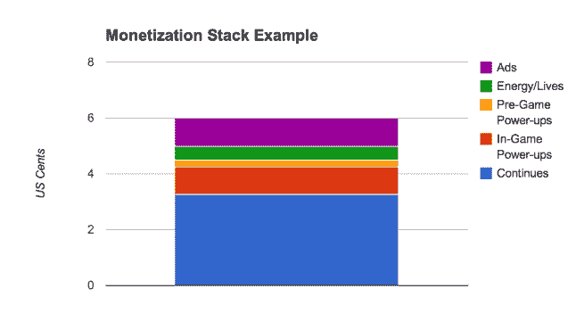

# 使用货币化堆栈来分析和规划游戏收入

> 原文：<https://www.moesif.com/blog/product-management/games/Using-Monetization-Stack-To-Analyze-and-Plan-Game-Revenues/>

### DARPU 和货币化栈的一个例子

人们衡量一款游戏(或其他产品)的关键指标之一被称为 DARPU(通常只是 ARPU)，即每用户日平均收入。取决于游戏的类型，以及游戏的优化程度，ARPU 可能会有很大的不同。将货币化堆栈视为对 ARPU 有贡献的功能/类别的分解。

我们来看一个因果街机游戏的例子。它有 6 美分的 ARPU。在下面的图表中，我们可以看到每个功能对总收入的贡献。广告是不言自明的。游戏有能量，哪种像生命，哪种在这个游戏里玩出水平都是需要的。在你不得不购买能量/生命来继续尝试之前，它限制了你可以失败的次数。这款游戏也有游戏前的能量补充，这意味着当你选择一个级别玩时，你有机会购买能量补充(想想《糖果粉碎传奇》中的“彩色炸弹”、“水母”和“条纹包裹”)。此外，该游戏提供了游戏内的电源，这意味着当你在游戏过程中，你可以购买额外的电源(想想《糖果粉碎传奇》中的“棒棒糖锤”)来帮助你。该游戏还提供了继续当你没有通过水平，并得到一个机会，继续玩，以击败水平。在这个游戏中，这些功能都贡献了不同的数额。

### 研究和计划:

在你的游戏发布后，你可以获得真实的盈利数据，但即使在你开始设计游戏之前，你也需要考虑你的筹码最有可能是什么样子。当你推销一款游戏时，你经常会被问到这个问题:你如何赚钱？货币化堆栈可以帮助你回答这个问题。

根据你正在开发的游戏的类型，赚钱的筹码会有所不同。卡牌游戏(例如 Ayakashi，巴哈姆特之怒)或 4X 游戏(例如霍比特人或卡米洛特王国)的货币化堆栈将与投资和快速游戏(例如 Farmville)或街机游戏(例如糖果粉碎)非常不同。同一个游戏在不同的平台(web vs. iOS vs. Android)或不同的市场(中国 vs .美国)可能有不同的 ARPU，但通常情况下，货币化的比例看起来还是一样的。

虽然在每一个类型中，不同的游戏会赚取不同的金额，但是如果你在这个类型中观察足够多的游戏，模式就会出现。

每个流派中的最佳游戏将在同一市场的同一平台上实现相同范围的盈利。有经验的游戏制作人或产品经理通常会知道对于某一类型的游戏来说什么是好的 ARPU。例如，最佳街机/休闲游戏在 iOS 上的 DARPU 值可能在 6-8 美分之间。

更深层次的分析和研究将揭示每个主要功能/类别对货币化堆栈的贡献。这里，往往也有格局。这仍然是一个估计，但是你会感觉到一个相似的特性会给 ARPU 带来多大的贡献。例如，广告通常会将 1 美分归因于 ARPU。在许多街机游戏中，如《糖果粉碎传奇》，“继续”将比游戏中的能量增加更赚钱，这反过来将比游戏前的能量增加贡献更多的收入。Continue 机制特别强大且经过验证，通常会贡献 50%到 60%的 ARPU。(虽然我不知道 CCS 的确切数字，也不能透露我管理的游戏的确切货币化堆栈，但我做过足够多的街机游戏，知道这是一个很好的估计。)

根据你的研究数据，你可以创建你计划的货币化堆栈，更自信地回答你将如何赚钱的问题，并证明这些数字是正确的。

堆栈如何影响设计考虑:

在您的规划阶段，货币化堆栈(即使只是一个估计或目标)将帮助您优先考虑功能。甚至可能放弃一些功能。举例来说，如果我们知道游戏中的能量提升通常比游戏前的能量提升更赚钱，也许更多的想法应该放在“游戏中的能量提升”上。

如果你知道在大多数街机游戏中，继续机制是收入的主要来源，那么思考继续在你的游戏中意味着什么是很重要的。对于糖果粉碎传奇，这是额外的举动；对于 Ruby Blast，这是额外的时间。对于其他游戏来说，可能不是很直接。这将需要获胜条件的设计(击败一级意味着什么)来适应这种机制。在游戏设计(尤其是获胜条件)出炉后，再想尝试添加这个就难多了。我看到很多因果/街机游戏没有这个功能，那么他们是把钱留在桌子上。

游戏启动后，货币化堆栈可用作诊断工具。例如，如果你的 ARPU 不如同类游戏高，那么你可以通过数据查看你的实际盈利情况。通常你会发现一个类别的贡献没有预期的多，或者没有竞争对手的多，也许这个功能设计得很糟糕。这将有助于您集中资源修复这些功能。它还可能会显示你的货币化堆栈与其他游戏的货币化堆栈之间的差距。您可以尝试通过添加正确的功能来缩小差距。

### 警告:

1.  蚕食效应:我们不能期望不断增加货币化功能，并期望收入不断增加。举个例子:如果特征 A 贡献了 1 美分，但是特征 B 贡献了 0.5 美分。实现功能 A 和功能 B 不一定会总共贡献 1.5 美分。

2.  ARPU(和盈利栈)只是一个衡量你游戏好坏的标准。不要忽略其他指标，如保留率。有时候这是一种交换。当你收紧夹点，你增加了 ARPU，但有时你减少了保持力。

### 结论:

1.在计划阶段/推介阶段，使用货币化堆栈作为工具来回答你如何在 F2P 游戏中赚钱并设定目标的问题。做研究，找出其他游戏的盈利情况。

1.  在游戏设计/制作阶段，使用货币化堆栈来帮助指导您的功能优先级并确定最佳解决方案。

2.  游戏推出后，使用货币化堆栈作为衡量标准，看看你如何与竞争对手和你的目标相抗衡。

#### 笔记

此外，我写的这篇和其他几篇关于货币化的文章发表在 gamasutra 上。