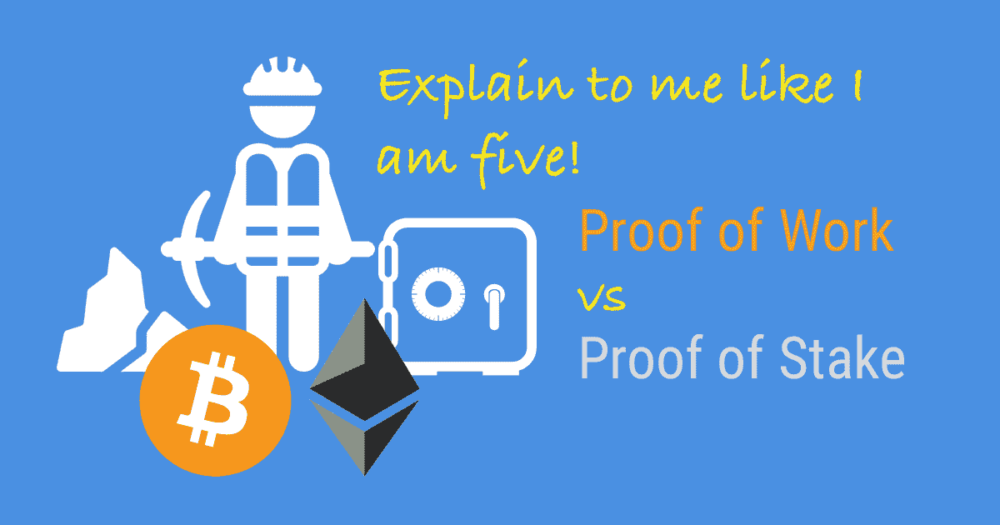

# 工作证明与利益证明解释得像我五岁一样

> 原文：<https://www.moesif.com/blog/blockchain/beginner/Prrof-of-Work-vs-Proof-of-Stake-like-I-am-five/>

嗯，我们看到很多在线论坛要求一个“解释-喜欢-我-五”的工作证明和股份证明的文章。所以这是我的尝试。

## 工作证明

假设幼儿园里有一群孩子，他们维护着一叠叠的积木玩具，他们都有同一叠积木的复制品，他们想确保所有的积木都按同样的顺序摆放。

有人想在木块上加一个新木块，木块会发给所有的孩子，还有一道数学题。所有的孩子都试图解决数学问题(采矿)。解决该问题也验证了该块是有效的。然而，解谜的唯一方法是蛮力和运气。第一个解决的人会得到一颗糖(采矿费)。一旦数学难题解决了，就很容易验证解答是否正确。如果超过 50%的孩子验证了这个积木是正确的，那么他们都会把这个积木放在积木的顶端。从而确保只添加一致同意的块(共识)。

如果一个坏孩子想把坏积木(或替换好积木)插入堆栈中，他必须说服/贿赂超过 51%的孩子跟着做，*和*在积木上为每个积木重做所有的数学智力题，这可能是非常昂贵的。工作证明阻止了坏演员对区块链的篡改。

## 利害关系证明

在上面的工作证明中，一个缺点是每当需要添加一个新的块时，所有的孩子都非常努力地工作，希望能够幸运地成为第一个解决它的人。大多数孩子只是在浪费时间和精力，因为如果他们不是第一个解决问题的人，他们的工作就会被扔掉。

在*赌注证明*中，当有人想添加一个新的木块，每个人都做验证工作，每个人挑选一个孩子作为“验证者”，验证者决定木块是否有效，如果有效，每个人都添加到他们木块的顶部。

那么如何选择验证器呢？每个想成为验证者的孩子都会把糖果放进一个共享的水池里。这叫做他们的赌注。这个小组随机选择验证者，但是对那些投入更多糖果作为赌注的孩子来说，被验证的可能性更高。假设鲍勃放了 10 颗糖果，爱丽丝只放了 5 颗，那么鲍勃更有可能被选中。(取决于实现方式，其他因素可能会影响概率，例如 Bob 拥有那些糖果多长时间，而 Charles 也放了 10 颗糖果。)

如果 Bob 被选为验证者，他成功地验证了新块，他将获得额外的糖果作为费用(这通常要少于押金)。一段时间后，在没有发现不良活动后，他的股份(或存款)将被退还给他。

我们如何防止坏孩子插入坏块(或者替换好块)，或者我们如何信任 Bob 这个验证者批准坏块？在此期间，如果 Bob 被批准的坏块发现，他的 10 颗糖果的存款将被取走。

**Moesif 是最先进的 API 分析平台，支持 Web3 JSON-RPC、GraphQL、REST 等。成千上万的平台公司利用 Moesif 进行调试、监控和发现见解。**

[了解更多](https://www.moesif.com?utm_source=blog)