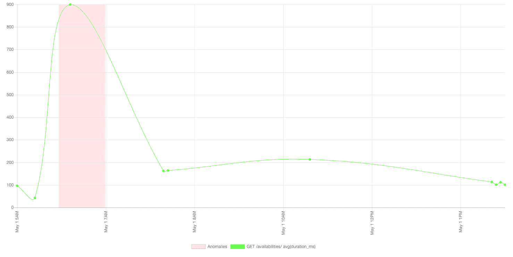
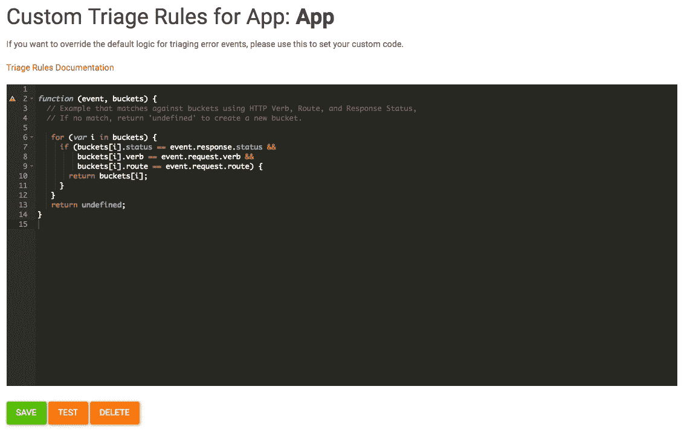

# 四月产品更新:以太坊 Web3 和 GraphQL API 支持，异常可视化，自定义分类规则

> 原文：<https://www.moesif.com/blog/announcements/features/Product-Updates-Ethereum-Web3-and=GraphQL-API-Support-Anomaly-Visulizations-Custom-Traige-Rules/>

在过去的几个月里， [Moesif](https://www.moesif.com) 团队不断推出新功能来帮助您的 API 调试和监控需求，包括将我们的核心平台支持扩展到 Ethereum Web3、JSON-RPC 和 GraphQL APIs、异常检测和可视化、丰富的警报以及更多定制。

### 对 GraphQL 的支持

Moesif 现在有了对 GraphQL 的原生支持。Moesif 会将您的 GraphQL 操作解析成其各自的组件，以便您可以应用 REST APIs 已经提供的所有强大的分析。GraphQL 将生成已定义查询的大部分责任从服务器转移到了客户端。GraphQL APIs 可以从客户端接收成百上千个不同的查询模式，因此增加了使用 Moesif 等强大的 API 分析工具来了解 API 行为的必要性。

[查看 Moesif 的文档以获得 GraphQL 支持](https://www.moesif.com/docs/platform/graphql/)

### 支持以太坊网站 3

像 GraphQL 一样，我们对区块链和 DApps(去中心化应用)的增长感到超级兴奋。然而，即使是区块链应用程序也需要对智能合约和区块链的交互进行强大的监控和分析。

Moesif 现在通过监控应用程序与 Web3 API (JSON-RPC)的交互来支持构建在以太坊之上的 DApps。

[查看 Moesif 关于以太坊 Web3 API 支持的文档](https://www.moesif.com/docs/platform/ethereum-web3/)

### 指标异常可视化和丰富的警报

我们大大改进了异常检测和监控。您可以轻松查看最近异常的摘要，并为每个跟踪的指标绘制图表，如下所示:

异常警报现在丰富了可视化，让你有一个更好的概览。该图表包含在发送给所有渠道的警报中，包括电子邮件、Slack 和 SMS。

[查看 Moesif 的异常检测文档](https://www.moesif.com/docs/api-monitoring/metric-anomaly-detection/)

### 自定义分类规则/脚本

如果您不喜欢 Moesif 用于分类错误的默认逻辑，您现在可以创建一个自定义的 Javascript 函数来定义您的分类逻辑。选择中的任何字段

[查看 Moesif 的文档以创建自定义分类规则](https://www.moesif.com/docs/error-triage/custom-triage-rules/)

[查看自定义分类规则的文档](https://www.moesif.com/docs/error-triage/custom-triage-rules/)

### 结束语

还有许多其他改进，包括:

*   更高级的搜索过滤器，包括否定过滤器。
*   [误差汇总分析](https://www.moesif.com/docs/error-triage/aggregations/)
*   对云代理的改进
*   许多 UI 改进

我们还修复了许多错误:

*   即使第三方 cookies 被禁用(Safari 中的默认设置), Moesif 现在也能工作
*   云代理现在可以处理超长 URL
*   门户网站 api 和培训的正常运行时间改进
*   精确的事件计数和会话计数报告
*   更快、更准确的警报电子邮件，同时避免虚假警报
*   Moesif-express 现在可以正确保存用户了

我们一直在努力让 Moesif 变得更好，更棒。这些功能中有许多是基于您的反馈，但是我们总是希望从您那里听到更多您想看到的功能。

Moesif 是最先进的 API 分析平台。成千上万的平台公司利用 Moesif 进行调试、监控和发现见解。

[了解更多](https://www.moesif.com?utm_source=blog)