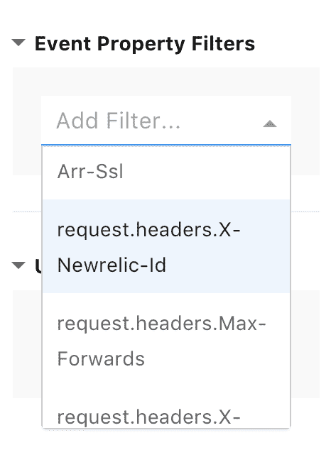
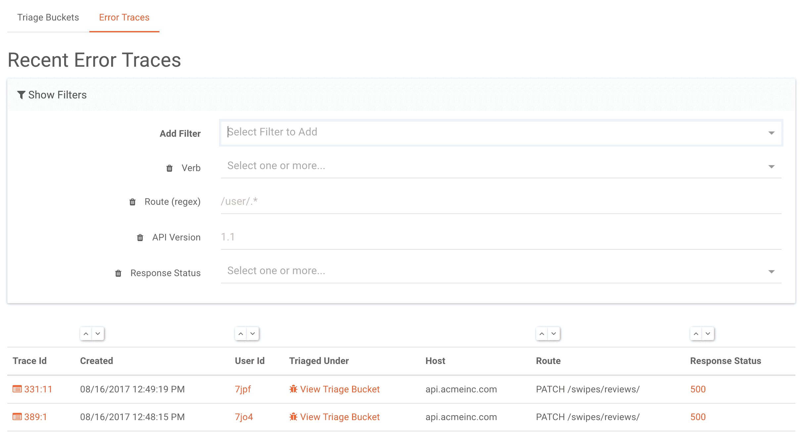
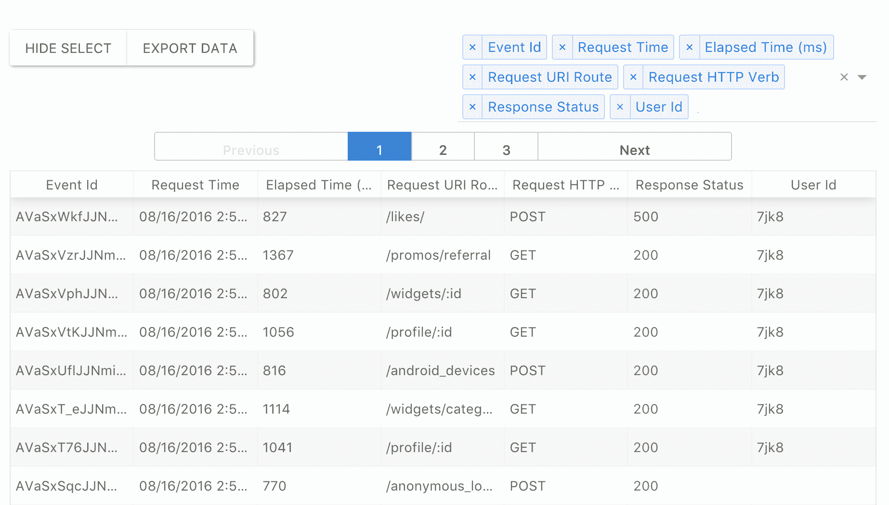
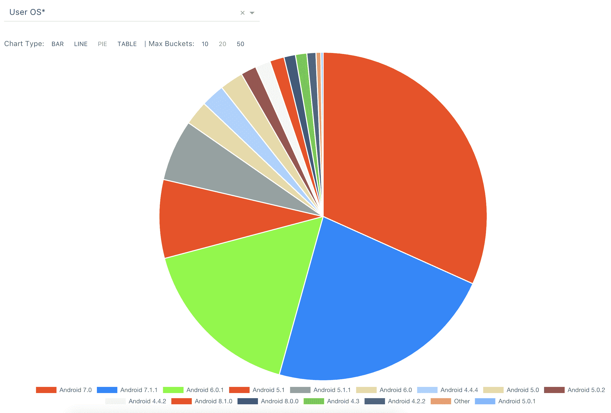

# 产品更新:API 分段、跟踪和桶过滤器、数据导出等。

> 原文：<https://www.moesif.com/blog/announcements/features/Product-Updates-Trace-And-Bucket-Filters-Export/>

Moesif 团队很兴奋地宣布了一系列客户一直要求的新功能。

### 动态过滤器:

现在，您可以通过任何字段(包括自定义元数据和自定义 HTTP 头)过滤和分段 API 数据。Moesif 根据您的数据动态智能地生成这些过滤器。

类似地，我们修改了 dash UI，使其数据密度更大，即使在显示大量数据时也是如此，同时使分类桶(一起分析的错误)和错误跟踪更容易搜索、过滤和排序。

### 表格视图和数据导出

对于 API 搜索和用户搜索，您现在可以选择想要以方便的表格格式查看哪些列。我们还添加了将数据导出到 CSV 或 JSON 文件的功能，以获得更大的灵活性。

### 细分分析

现在，您可以使用分段视图根据任何自动生成的字段来分析数据。您可以在条形图、折线图、饼图等中可视化您的数据。像表格视图一样，您可以将您的细分分析导出到 CSV 或 JSON。

### 结束语

我们一直在努力让 Moesif 变得更好，更棒。这些功能中有许多是基于你的反馈，并且总是喜欢[听到](mailto:support@moesif.com)你想看到什么功能。

您是否花费大量时间调试客户问题？
Moesif 使 RESTful APIs 和集成应用的调试更加容易

[了解更多信息](https://www.moesif.com?utm_source=blog)