# 在 Moesif 中利用用户指标的 4 种方法

> 原文：<https://www.moesif.com/blog/technical/api-analytics/4-Ways-To-Leverage-User-Metrics-In-Moesif/>

没有用户，产品毫无意义。那么为什么这么多组织事后才分析 API 和用户行为指标呢？我的理论是，他们只是没有合适的工具来实际收集、分析和使用这些使用指标。

有如此多的产品旨在改善用户体验和客户满意度，像 Moesif 这样的工具正是我们所需要的。有了 Moesif，我们可以收集有意义的用户数据，发现数据中的价值，甚至在平台内对一些数据采取行动。令人印象深刻的是它是多么容易做到。

这篇文章将着眼于 Moesif 中的 4 个核心功能，它们可以帮助您、您的组织和您的用户获得更好的结果。唯一需要的先决条件是你已经将你的 API 与 Moesif 集成，并且已经设置了用户跟踪。

设置用户跟踪后，导航至用户屏幕将为您提供 4 个选项，您可以使用这些选项来利用基于用户的指标:

*   用户查找(和群组)
*   用户漏斗
*   用户保持率
*   用户构成

这些都可以让你深入了解你的产品做得怎么样，如何让你的产品更好，谁在使用你的产品，等等。

让我们一个接一个地看看这些关键特性。

## 用户查找(和群组)

能够识别和探索使用您系统的用户是非常重要的。了解谁在使用你的系统，他们是如何使用的，以及他们的个人趋势会带来巨大的价值。

使用 Moesif，您可以使用**用户查找**屏幕过滤掉特定用户，并在更精细的层次上进行深入探索。当您第一次来到屏幕时，您会看到一个未过滤的用户列表:

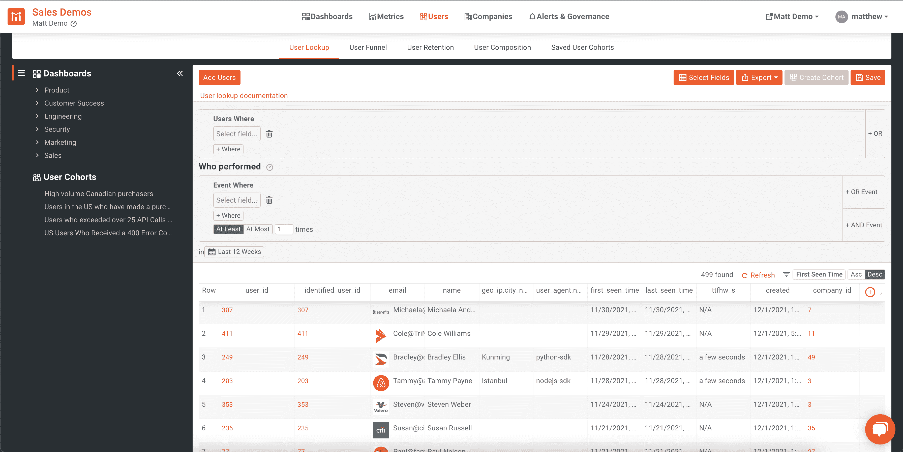

从该列表中，您可以创建按单个用户标准进行过滤的过滤器，如“GeoIP”或“上次查看时间”，或者过滤满足特定事件标准的用户，如在过去 24 小时内遇到 HTTP 4XX 错误的用户。

为了实现第一个示例，我们可以查找“最后一次看到时间”在一周之前的用户。看起来会像这样:

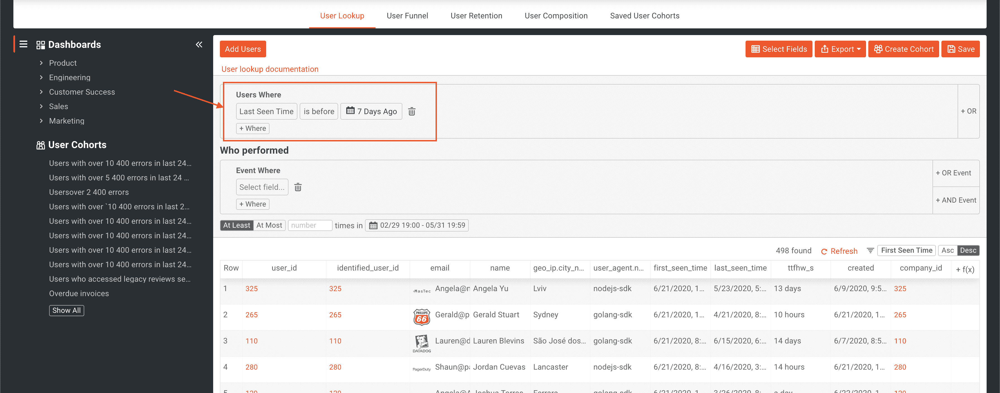

创建过滤器后，页面底部显示的用户将自动更新。我们还可以在“谁执行了”过滤器下添加第二个标准，以便为查询添加更多的过滤。为此，我们将额外添加一个过滤器，仅包括居住在美国的用户(通过使用他们请求的 **GeoIP)。国家代码**。现在我们的过滤器看起来像这样:

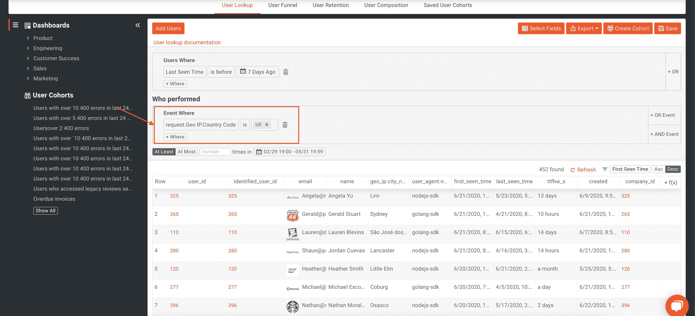

现在，我们将只显示美国地区中“最后一次看到时间”在一周之前的用户。

如果我们发现这些标准可能对其他功能有用，或者是我们想要关注的东西，我们可以将其保存为群组。

> 保存的群组是符合某些特定标准的用户(或公司)的动态列表。这些标准可以是特定的用户/公司属性，或者基于用户/公司在 API 调用和用户操作方面的表现。因为这些列表是动态的，所以 Moesif 会在后台不断更新它们。

我们还可以查看特定的用户。为此，我们只需在列表中找到一个用户，单击他们的 **user_id** ，然后查看显示一些关键指标和详细信息的概述页面。在这里，您可以看到诸如“首次显示时间”、“上次显示时间”、用户元数据和其他重要信息。

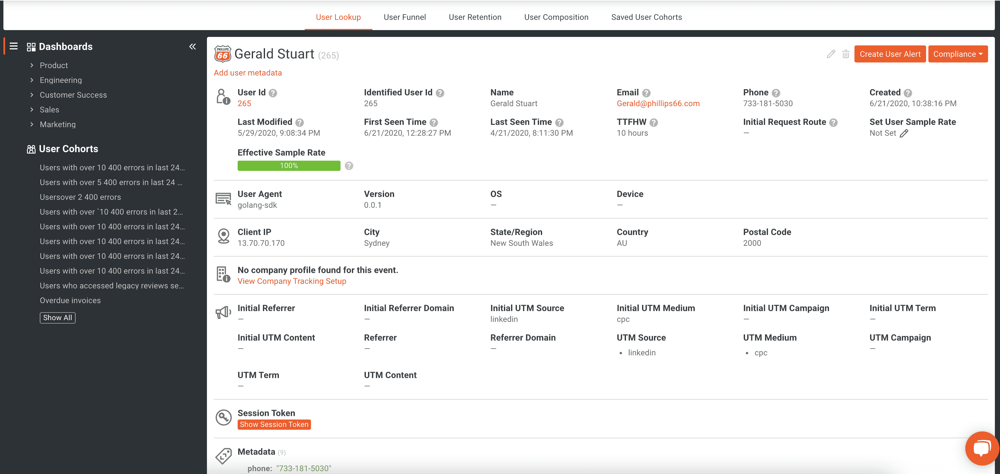

用户查找功能和群组允许您轻松过滤和浏览您的用户。如果您想了解更多信息，请查看我们的文档。

## 用户漏斗

当用户在应用程序漏斗的不同阶段导航时，能够跟踪用户是一种很好的方式，可以看到什么是有效的，什么是无效的，以及用户在漏斗中的位置。

使用 Moesif，您将设置漏斗的不同阶段，可能是某些 API 调用，以跟踪用户的进度。这方面的一个例子可以是用户执行 3 个步骤的流程:

*   Login

    > The user logs in to the system

    by calling **/logging in to the** endpoint.
*   Purchase

    > Users decide to purchase products by calling the **/purchases** endpoint.

*   Subsent Purchases

    > The user decides to conduct two additional purchase transactions through the **/purchases** endpoint.

这些步骤中的每一步都代表了漏斗的关键部分。通过跟踪用户从漏斗的一个阶段到下一个阶段的移动，您可以更准确地确定痛点或问题，战略性地对流量进行更改以增加转化率，并通过查看指标变化来准确地测试流量的更改。

在 Moesif 中设置这个非常简单。一旦进入应用程序的**用户**仪表盘，我们将点击**用户漏斗**。

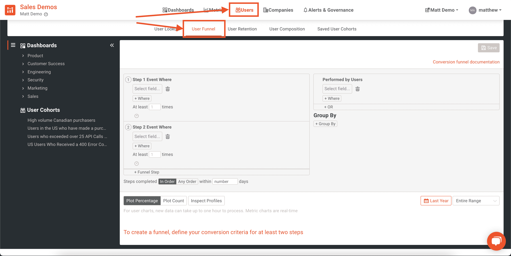

在这里，我们将定义决定漏斗每个步骤的 3 个步骤/标准。

具体来说，我将确保每次对 purchases 的调用都返回一个 **HTTP 200 OK** 响应，这样我们就知道购买成功了。我们不想将不成功的电话计入我们的漏斗指标。

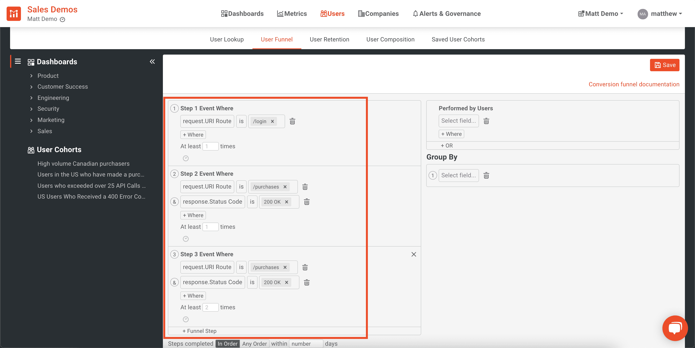

由此，你可以看到用户完成的漏斗的每一步，以及进入下一步平均需要多长时间。

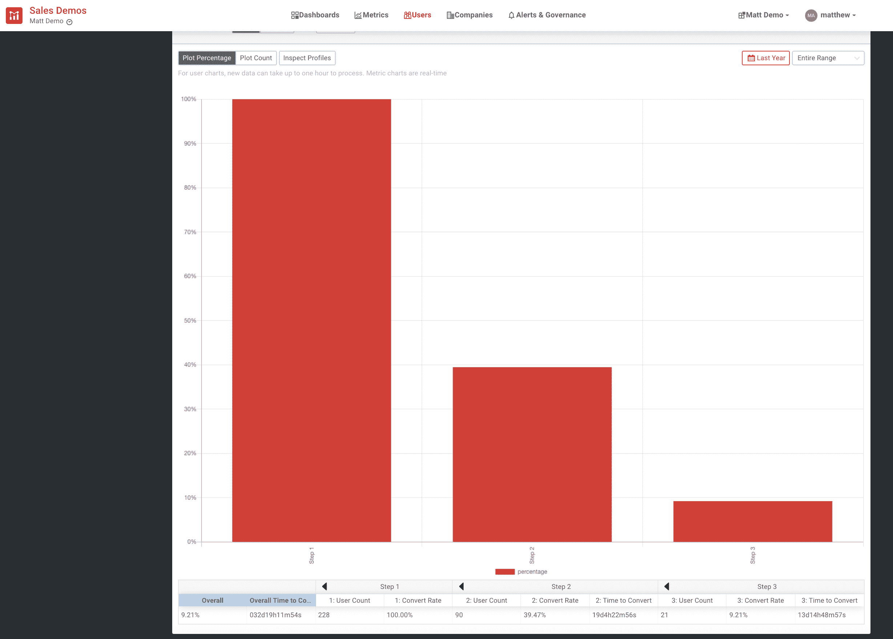

我们可以从这个漏斗中看到，用户完成整个漏斗平均需要将近 33 天。我们还发现，只有大约 9.21%的用户通过了我们的整个漏斗。

为了更深入地挖掘用户渠道，[深入我们的文档](https://www.moesif.com/docs/user-analytics/conversion-funnel-analysis/?utm_campaign=Int-site&utm_source=blog&utm_medium=body-cta&utm_term=4-ways-to-leverage-user-metrics-in-moesif)。

## 用户保持率

利用用户指标的另一种方法是深入挖掘用户保持度。这些指标让你可以跟踪你留住用户的情况，但不仅仅是检查他们是否仍然注册了这项服务。

活跃用户倾向于逗留、升级和推广你的产品。确保你的产品能够促进这种类型的互动，这是留住客户的关键。

使用 Moesif，您首先需要确定显示活跃用户和回头客的标准。例如，你可以说**的第一个动作**是当用户第一次登录应用程序时，随后的每次登录都是他们的**返回动作**。随着时间的推移，你将能够看到每天有多少用户返回。

您还可以进一步挖掘，尤其是如果您的应用程序或业务是基于事务的。在这样的场景中，您可以让用户第一次调用 **/purchases** 端点作为他们的**第一个动作**。当他们执行另一个对**/购买**的调用时，这将是他们的**返回动作**。这意味着用户正在获得价值，因为他们继续积极购买你的产品。

> 因为你最了解你的业务，你将是确定用户何时第一次感受到价值，以及之后什么事件可以被视为他们继续获得价值的最佳人选。

要在 Moesif 中设置保留分析，您需要导航到**用户**屏幕，并选择**用户保留**选项卡。

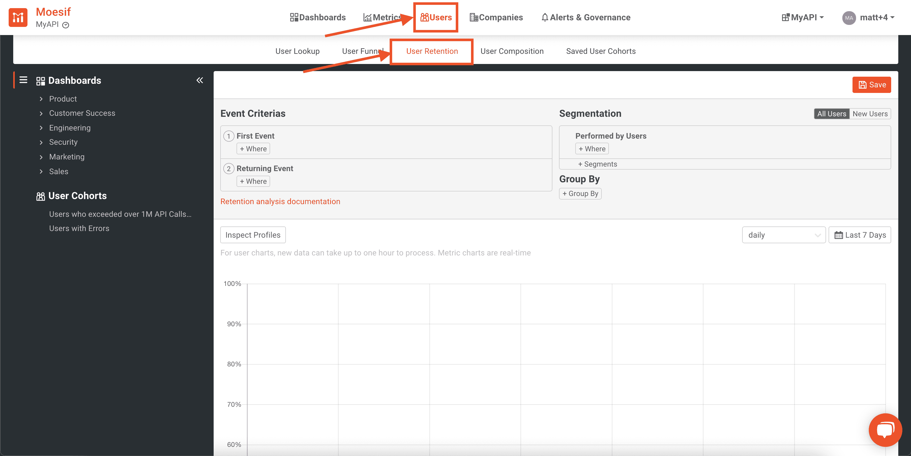

在这里，您将定义您的第一个事件。在这个例子中，我们将使用第一个事件作为用户第一次购买。这被定义为对**/购买**端点的调用。我们的**返回事件**将是用户执行额外购买的时候。

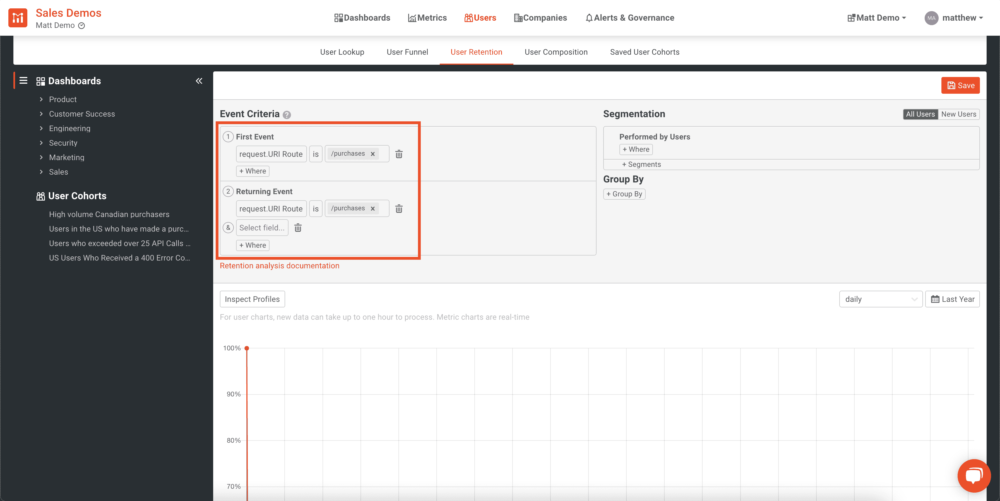

我们还将按 **user_agent.name** 对结果进行分组，以便我们可以看到哪些平台的保留率最好和最差。

最后，我们希望包括过去 12 周的指标，并每天查看保留情况。为此，我们将图表右上角的下拉列表中的以下值设置为**“每日”**和**“过去 12 周”**。

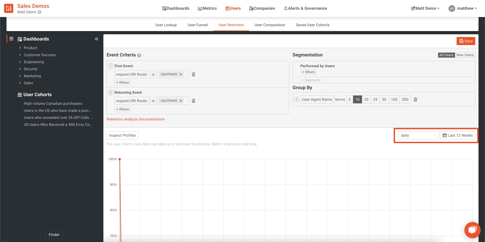

从上面的输出中，我们可以看到基于用于访问平台的用户代理的每日保留率。

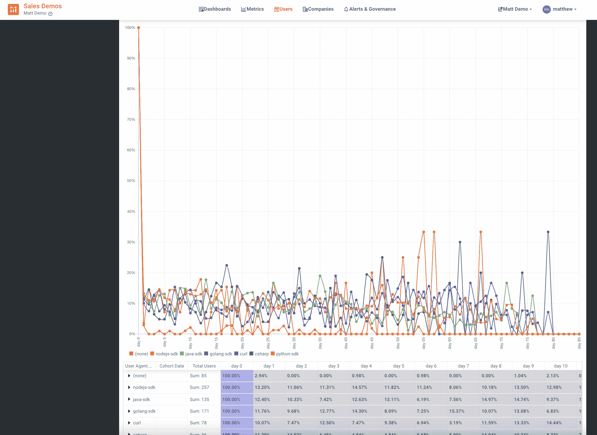

准确的保留分析有助于跟踪您的组织在尝试和改进时保留率的变化。在分析您的业务健康状况时，跟踪留存率是一个要考虑的关键指标。

有关如何在 Moesif 中创建保留分析的更多信息，[请查看我们的文档](https://www.moesif.com/docs/user-analytics/cohort-retention-analysis/?utm_campaign=Int-site&utm_source=blog&utm_medium=body-cta&utm_term=4-ways-to-leverage-user-metrics-in-moesif)。

## 用户构成

一旦你探索了你的个人用户，你的漏斗指标，你的留存率，你可能想弄清楚你的用户构成。

用户构成可以让你深入了解你的用户群。您可以保持很高的级别，将大的细分市场组合在一起，也可以通过非常特殊的指标和标准过滤您的用户，从而降低级别。

可以按特定的用户属性(如公司或位置)或执行特定事件的用户来筛选用户组合。

这里有一个例子，我正在过滤来自加拿大的用户，他们已经成功地从一个 API 接收到一个 **HTTP 200 OK** 响应:

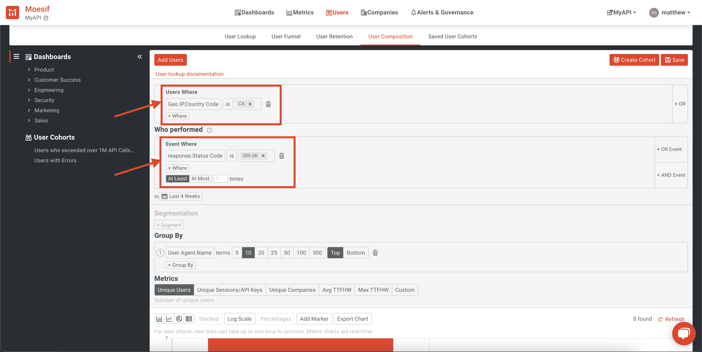

一旦您设置了过滤标准，您可以通过按特定标准对结果进行分组以及通过按标准设置**分组来进一步挖掘。这方面的一个例子可以是按用户代理(流量来自哪个平台)、按国家、按公司或任何其他可能的分组进行分组。您可以选择是显示分组的顶部还是底部，以及要包含多少条目。例如，您可能只想显示分析中排名前 10 的公司的用户构成。**

如果您根据包含时间度量的标准选择一个**分组，那么您可以根据包含 1 天、7 天、1 周和 1 个月时间间隔的 **date_histogram** 对数据进行分组。**

为了补充上面的例子，我添加了一个按分组的**，它将按用户的公司域名对结果进行分组，并显示前 5 名的结果。**

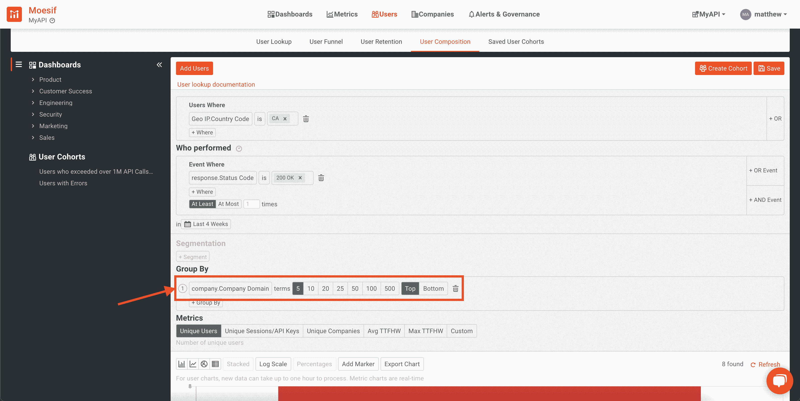

最后，这个查询的结果将根据您选择的任何指标显示。Moesif 有一些预定义的方法以及创建自定义方法的能力。这将是在结果可视化或图表中显示的指标。预定义的指标包括:

*   **唯一用户**
*   **唯一会话/API 密钥**
*   **独特的公司**
*   **平均 TTFHW**
*   **最大 TTFHW**

除了上面的例子，我们将确保选择的是**唯一用户**指标。

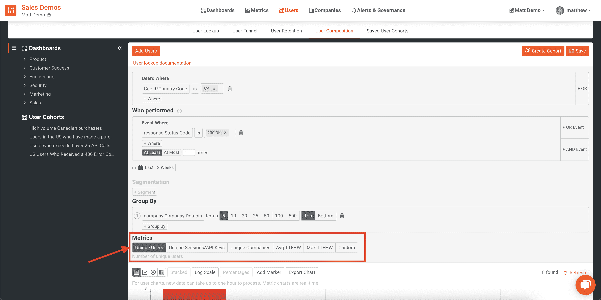

选择所有过滤器后，结果将是加拿大的用户收到了一个 **HTTP 200 OK** 状态代码。该结果集将按用户**公司域名**分组，并显示前 5 个结果。最后，显示的结果将显示这些公司拥有的符合过滤器的**唯一用户**。

结果看起来会像这样:

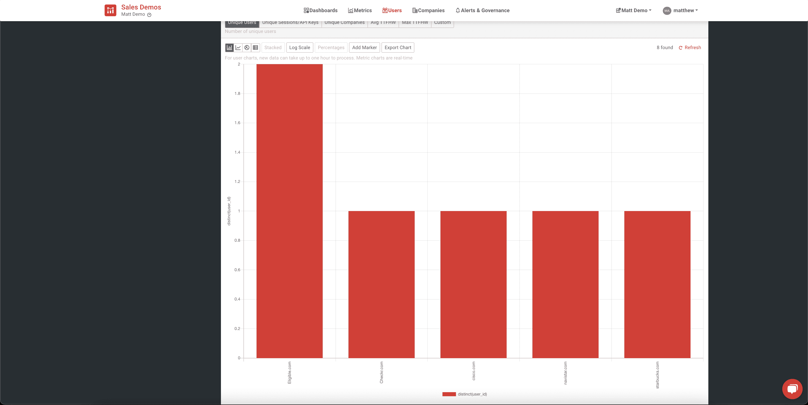

在此图表中，我们可以看到基于样本数据集的上述标准的结果。

通过使用 Moesif 中的**用户构成**功能，您可以获得有价值的见解，显示您当前的用户统计数据，并可以操作过滤器来查找您的用户群中不同细分市场的非常精确的详细信息。

## 将这一切结合在一起

有了 Moesif 中的这 4 个工具，您将能够看到支持您的业务所需的一切。你将很容易获得对你的用户以及他们与你的产品的互动的深刻见解。概括来说，我们涵盖了:

*   **User Lookups/Cohorts**

    > Find users quickly and easily and find their details according to what they have done on your platform. Very similar to CRM-style solutions, but with the ability to search based on what they do, instead of just creating filters and saving the result list based on their attributes, also known as saved user groups

*   **User funnels**

    > Define the steps of creating user funnels in the application and track the conversion rate of each step.

*   **User retention**

    > Create an analysis that tracks user retention to ensure that users actively use the product. This is not just to track subscriptions or similar metrics, but actually allows you to define criteria to ensure that your users get value from products, which is the main factor of retention.

*   **User Composition**

    > It is easy to explore the composition of user groups by setting standards, filtering and sorting results. Create excellent visuals and diagrams to show who is using your product and how they are using it.

想开始吗？只需登录 Moesif，尝试这些伟大的功能。还没有账户？[注册免费试用](https://www.moesif.com/signup?utm_campaign=Int-site&utm_source=blog&utm_medium=body-cta&utm_term=4-ways-to-leverage-user-metrics-in-moesif),点击几下鼠标，开始探索您的用户分析。