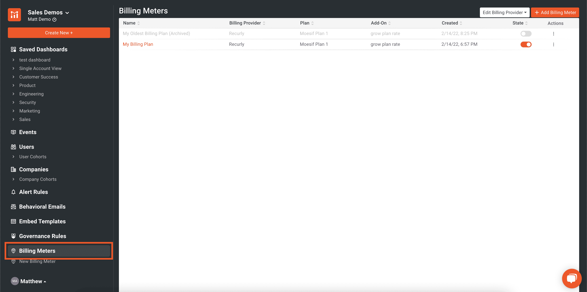
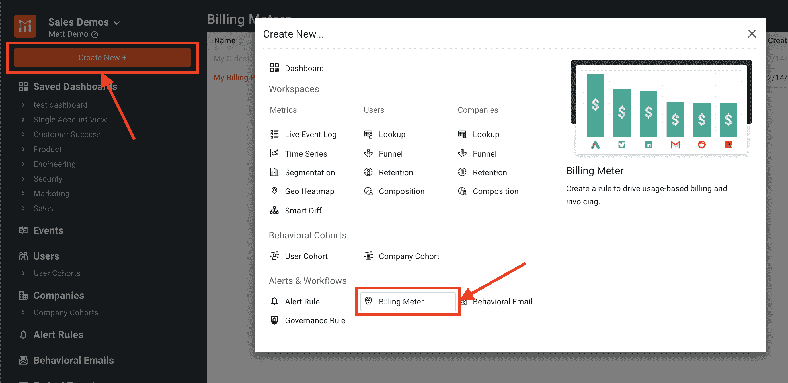
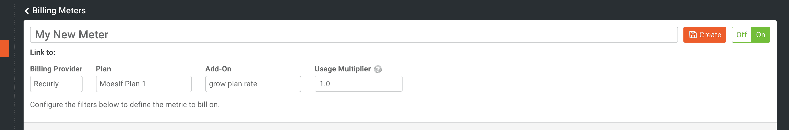
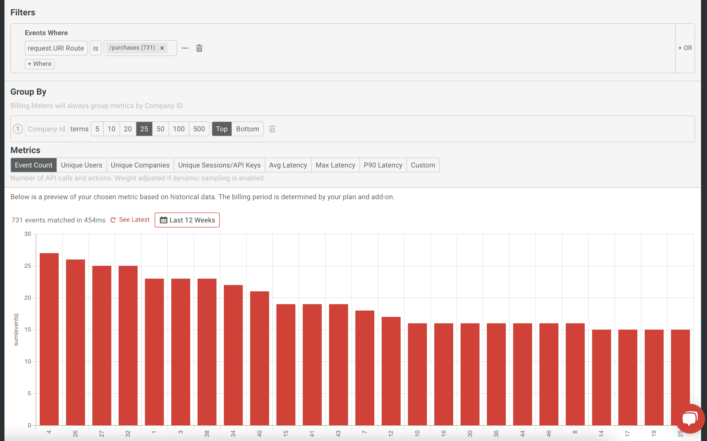

# 实现基于使用的 API 计费的简单方法终于出现了

> 原文：<https://www.moesif.com/blog/developer-platforms/self-service/A-simple-way-to-implement-usage-based-API-billing-is-finally-here/>

**计量计费**终于在 Moesif 中实现了，我们非常兴奋能够推出这一[最新功能](https://www.moesif.com/solutions/metered-api-billing?utm_campaign=Int-site&utm_source=blog&utm_medium=body-cta&utm_term=billing-feature-announcement)。我们一直在努力提供一种平稳而简单的方法，通过允许在 Moesif 中跟踪的使用情况由您最喜欢的计费提供商进行计量和计费，来将您的 API 货币化。Moesif 可以计算使用数据并将其发送给计费提供商，以便您的客户可以根据其使用情况准确计费。

**Moesif 中的计量计费**是跟踪客户使用您的 API 和应用程序并收取费用的最简单方式。该解决方案需要**无代码**，只需几行配置，您就可以开始运行了。让我们进一步了解我们的最新功能，以及您为什么想要使用它！

## 什么是计量计费？

**计量计费**是一项允许 Moesif 用户计量其 API 或 web 使用情况并根据使用情况向用户收费的功能。一个例子可以是现收现付的方法，在这种方法中，每个 API 调用向用户收取特定的费用。用户还可以选择实施分层计费方法，这种方法允许特定的使用层级，并允许根据用户的使用层级向用户收费。

> 您还可以实现自定义操作来跟踪任何任意指标，如“*接收的千兆字节*”或“*处理的分钟*”。

在计费期结束时，使用量被累加并发送给计费提供商，以便用户可以为其使用付费。**计量计费**是公司以后付费方式将其 API 货币化的方式。任何被 Moesif 跟踪的 API 都可以使用**计量计费**轻松实现货币化。

> Moesif 实际上每小时向计费提供商发送使用数据。然后，计费提供商将汇总使用数据并为其计费。

## 为什么在 Moesif 中使用计量计费？

**计量计费**并不是一个新概念，使用相当广泛。然而，创建计量计费解决方案通常非常复杂，需要精确的分析、数据管道以及与计费提供商的集成。整个设置可能需要相当多的应用程序、数据馈送、基础架构，更不用说工程和支持时间了。

幸运的是，Moesif 包含了计量计费系统所需的所有数据，并支持与计费提供商的直接集成。这为您的所有计量计费需求提供了无缝的“一站式”服务。Moesif 收集你所有的 API 使用数据，并按用户和公司进行跟踪。有了它，Moesif 就可以轻松地计算给定时间间隔内的使用量，并将数据传递给支持的计费提供商，以计算使用量并收取费用。

Moesif 还允许用户创建高度独特的过滤器，以便用户可以针对特定的端点及其使用方式进行计费，例如基于正文或标题内容、路由或 Moesif 支持的任何其他过滤标准进行计费。Moesif 提供了一种高度可定制和灵活的方法来为用户的 API 使用计费。

## 在 Moesif 哪里可以找到？

**moes if 中的计量计费**可通过计费仪表选项卡下的左侧导航菜单访问。单击该菜单项会将用户带到一个屏幕，您可以在其中添加您的第一个计费计数器或显示当前创建的计数器。

您可以通过使用**创建新按钮**并选择**计费表**来创建新的计费表。这将带您进入新计费计数器创建屏幕。

## 它是如何工作的？

在 Moesif 中启动并运行**计量计费**只需几分钟。下面是让它工作所需的步骤的高级概述:

### 配置账单提供商

您的第一步将是配置您的账单提供商。您需要在您的帐户中设置好您的计划和附加服务。这些信息将被导入 Moesif，这样当您将帐户连接到 Moesif 时，您就可以将它们分配到计费表中。

> 其中一部分还要求您设置任何 webhooks 或其他连接，这是计费提供商和 Moesif 所要求的，以确保系统准备好处理平台之间的通信。当您将账单提供商添加到 Moesif 时，将会概述这一点。

### 创建新的计费计数器

如上所述，创建计费指示器有几种方式(包括使用左侧导航菜单中的 Create New 按钮)。您需要命名您的计费表，然后继续添加您的计费提供商详细信息。

> 如果您已经将您的计费提供商添加到 Moesif 中，它将显示在创建新计费计数器屏幕上的计费提供商详细信息部分。如果没有，系统会提示您从同一屏幕上的付费提供商下拉列表中添加您的提供商。

在本例中，我已经设置了一个计费计数器，并为该用途应链接到的计划添加了计费提供商详细信息。

### 配置要计费的过滤器和指标

接下来，您将配置哪些使用将计入您的计费计数器。第一步是[创建您的过滤器](https://www.moesif.com/docs/api-analytics/?utm_campaign=Int-site&utm_source=blog&utm_medium=body-cta&utm_term=billing-feature-announcement#filters)，就像您在 Moesif 中创建图表一样。例如，您可能希望只对发送到特定 API 路由的 API 调用计数进行过滤。

最后一步是指定您想要跟踪的指标。这是您向客户收取费用的指标。一般来说，事件计数是常见的选择，但也存在其他选项，包括独特的用户，独特的公司。您还可以使用自定义元数据字段制定自己的指标，例如跟踪消耗的带宽或其他指标。

下面我设置了一个过滤器和指标来跟踪对 **/purchase** API 端点的调用的事件计数。

### 保存您的计费表

设置好计费表后，我们现在可以将基于过滤器的使用情况与我们指定的计费计划关联起来。在计费周期结束时，Moesif 将对使用情况进行统计，并将这些数据传递给计费提供商，以便他们进行计费。

我们的最后一步是保存计费指示器，使其处于活动状态。保存后，使用数据将从 Moesif 中收集的使用指标中自动传递到计费系统。

## 试一试！

要试用它，只需登录 Moesif 并导航到**计费表**选项卡来设置您的第一个计费表。随着我们功能的扩展，希望所有您喜欢的计费提供商都加入到 Moesif 中，这样您就可以快速轻松地将您的 API 货币化。还没有账户？只需[注册](https://www.moesif.com/signup?utm_campaign=Int-site&utm_source=blog&utm_medium=body-cta&utm_term=billing-feature-announcement)即可在几分钟内开始。有关**计量计费**和可能配置的更多信息，您也可以查看[我们的文档页面](https://www.moesif.com/docs/metered-billing/?utm_campaign=Int-site&utm_source=blog&utm_medium=body-cta&utm_term=billing-feature-announcement)！