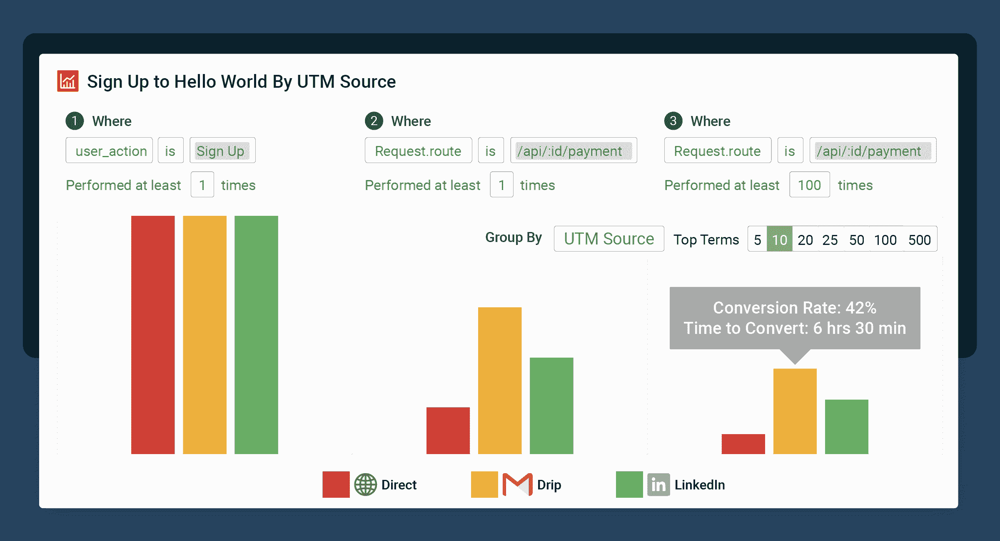

# 开发者旅程中的 API 分析

> 原文：<https://www.moesif.com/blog/api-product-management/developer-experience/API-Analytics-Across-the-Developer-Journey/>

每个 API 产品经理都希望尽可能多的开发人员采用和使用他们的 API。他们希望他们能够快速到达 Hello World，并在此过程中拥有出色的开发人员体验(DX)。当然，更大的目标是能够将 API 的成功与公司更大的目标联系起来。对于许多人来说，尽管他们的初衷是好的，但他们的衡量标准过于简单、狭隘，并且基于过时的参与模式。

借助完整的 API 分析，您可以在整个旅程中指导 API 用户——从注册和教育到 Hello World 和应用部署。通常，仅仅有人开始使用你的 API 是不够的。相反，你希望他们完全利用它。API 的原始用法并不能说明您的整体客户体验的全部。您可以使用分析来仔细规划每个 API 的设计，改善每个开发人员的体验，并最大化您产品的成果。

## 推动更多开发者从 API 注册走向成功

开发人员通常可以选择要集成的 API，或者是否要集成。当你成功吸引了一个注册你的 API 的用户时，你需要做的是让开发者进入下一步。你需要同时记住这种微观上的成功，同时也要在整个 API 旅程中着眼于宏观上的成功。

作为 API 提供者，您希望确保每个创建帐户的开发人员成功地将您的 API 集成到他们的应用程序中。API 分析可以让您:

*   改进 API Onboarding
*   帮助开发者更快到达 Hello World
*   鼓励使用更多的 API 特性和端点

其中一些你可能很熟悉。你可能在没有太多数据的情况下尝试它们。深度集成的最终成功是大多数 API 产品经理没有跟踪的——可能是因为它是不可见的。

## 改进 API Onboarding

从用户生成 API 密匙到他们将您的 API 集成到他们的应用程序中，会发生很多事情。借助 API 分析和用户界面数据(例如通过 Moesif 的 [Pendo integration](https://www.moesif.com/blog/product-management/onboarding/How-To-Build-A-Personalized-Developer-Experience-To-Onboard-Developers-Faster/) )，您可以在开发人员入职时跟踪他们，从旅程的不同点收集数据，例如:

*   当用户注册一个 API 账户时
*   当用户生成 API 密钥时
*   入职流程中包含的每个步骤或页面
*   当用户第一次调用 API 时

您应该仔细查看 API 和用户数据，以确定哪种入职流程最适合大多数开发人员。用户在入职时需要做的决定越少越好。尝试先提供有限的入职选项，然后根据提供的数据扩展入职路径。

通过分析 API 和用户数据来个性化入职，然后发送适时的定制电子邮件——这很容易通过像 [HubSpot](https://www.moesif.com/blog/technical/developer-journey/How-to-Improve-Developer-Experience-by-Guiding-Developers-With-Customer-Lifecycle-Emails-using-Moesif-and-Hubspot-or-Salesforce/) 或 [SendGrid](https://www.moesif.com/blog/developer-marketing/behavioral-emails/Using-Sendgrid-with-Moesif-API-Analytics-to-Send-Behavioral-Emails/) 和 Moesif 的[行为电子邮件](https://www.moesif.com/blog/developer-marketing/behavioral-emails/An-Email-Marketing-Campaign-that-Drives-API-Integration/)这样的应用程序来完成。

最初的入职培训可能会让开发人员无所适从。API 分析的下一步应该是获得洞察力，以帮助那些开发人员更快地进入 Hello World。

## 帮助开发者更快到达 Hello World

查看您的 API 数据，您可能会发现一些开发人员在从预集成阶段过渡到沙盒阶段(第一个 Hello World (TTFHW)时遇到了困难。TTFHW 是您需要跟踪的最重要的 API 指标之一，减少这个时间应该是优先考虑的事情。一系列问题可能会增加开发人员到达他们的第一个 Hello World 的时间。

这些潜在问题包括:

*   API 错误
*   您的 SDK 中的错误
*   用户实现 API 的方式存在缺陷

通过 API 分析，您可以跟踪 API 的使用情况，并观察开发人员在使用您的 API 时的行为。您可以找到用户犯错的地方，并帮助他们克服任何障碍。例如，一些开发人员在使用特定的 API 端点后是否会访问您的文档页面？使用这些数据来改进您的文档，使其与他们更相关。你可能需要帮助一些开发者进入第一个 Hello World，所以通过相关的内容和帮助向他们提供大量关于你的 API 的信息。

有些用户可能永远也到不了第一个 Hello World。这是 TTFHW 如此重要的另一个原因，因为它可以预示最终的开发人员流失。你需要了解你的 API 用户在哪些方面挣扎，然后帮助他们保持在正确的轨道上。用你的 API 分析创建一个漏斗，并标记动作，不仅指示一个成功的 Hello World，还指示不止一个呼叫的迹象。

很多 API 产品经理止步于 Hello World，不去探索更多更深层次的成功。或者，有时这些后续信号更加手动，如销售对话。通过探索跨多个端点的使用，您可以鼓励开发人员采用额外的 API 特性。

## 鼓励使用更多的 API 特性和端点

开发人员通常从几个核心端点开始，通常不知道 API 必须提供的一切。一个应用程序的长期成功通常需要超越 API 单一领域的集成。使用 API 分析来跟踪哪些端点没有得到开发人员的重视。然后使用触发式电子邮件和内容营销向开发者介绍你的整个 API。

例如，您可以向一些用户发送一封电子邮件，其中包含产品页面、文档或视频短片的链接，解释未使用的特定终端的优势。提供额外内容，解释应用程序将从该端点功能中获得的价值。定期通过自动邮件向开发人员介绍新的和未使用的端点，鼓励他们使用更多的 API 特性。

识别更深层次集成的另一种方法是通过 SDK。您可以提取 API 头来确定每个头的使用量。进一步划分第一次 API 调用日期，以确定您的产品是否已经被集成到一个活动项目中。

一旦你有了可用的 API 分析数据，有很多方法可以解释它。除了跟随开发人员的旅程，您还可以依靠数据来做出更好的 API 产品决策。

## 利用数据做出更好的 API 产品决策

当您能够看到整个开发过程时，您就可以根据实际的 API 使用情况来做出产品决策。您可以了解 API 的“热点”和较少使用的部分，然后相应地计划未来的更新。随着 [API 产品管理](https://www.moesif.com/solutions/api-product-management)成为一个更新的领域，你需要一个能够理解你想要回答的独特问题的工具。例如，您可能想知道:

*   按 API 使用情况列出的顶级客户
*   每个客户使用的终端
*   [端点弃用的含义](https://www.moesif.com/blog/ebooks/how-to-properly-deprecate-an-api-using-moesif/)
*   哪些营销渠道推动了 API 的实际使用

有了这些数据(您可能会寻找其他数据)，您可以探索当前的结果并满怀信心地进行产品更新。当您考虑整个开发人员之旅时，您将重新审视指标，以帮助更多的开发人员不仅迈出重要的第一步，而且更全面地将您的 API 集成到他们的系统中。

使用 Moesif API Analytics 开始构建优秀的 API。[了解更多](https://www.moesif.com/)。