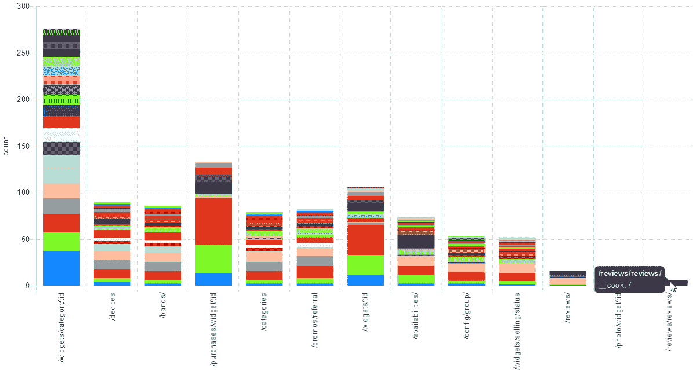

# 特性弃用的 API 最佳实践

> 原文：<https://www.moesif.com/blog/best-practices/api-analytics/API-Best-Practices-For-Feature-Deprecation/>

*TL；DR 与您的用户交流！*

大多数以写软件为生的人都有一个共同点；他们不想永远支持他们曾经实现的所有东西。

软件业的一小部分人试图利用这种做法为自己谋利，并试图走一条不同的路——操作系统尽可能长时间地与旧软件兼容。“Linux 不会打破用户空间”，Windows 带有兼容的运行模式，macOS 甚至有 Rosetta，一个允许你运行在他们转换到 Intel CPUs 之前创建的软件的软件。

甚至一些云提供商试图将反对意见降到最低，这样他们就可以随时说“我们不会让你失望的。”

停止提供 API 特性可能是个好主意，这有多种原因，但不是像微软或亚马逊这样规模的公司就足以成为在某个时间点停止提供部分 API 的理由。

## 什么是弃用？

贬低一个功能意味着我们告诉用户他们不应该再使用这个功能，因为它将在未来的某个时候消失。

## 我们应该问自己什么问题？

说到弃用，技术人员通常会考虑实现细节。

“如何在 GraphQL 中将我的字段标记为不推荐使用？”

“我的 REST 端点是否有一个弃用标头？”

虽然这些问题的答案带来了很好的沟通工具，使我们能够防止 API 的新用户使用这些不推荐的功能，但更大的问题是现有用户会发生什么。

他们甚至会检查 API 中的弃用消息吗？

问题往往是这样的措施会导致沟通不足。_“我们宣布了一个新的主要版本，并将一些端点标记为不推荐使用，每个人都知道会发生这种情况，所以这应该足够了。”

所以这些是更重要的问题:

*   谁在使用该功能？
*   我们保持特色有多难？
*   我们的客户愿意花多少钱来保存它？
*   如果我们保留它，而不是扔掉它，对我们的影响有多大？
*   我们希望以多快的速度移除该特征？
*   我们的客户需要多少时间来适应这些变化？

## 谁会受到贬值的影响？

对贬值的影响有个感觉是很重要的。实现这一目标的一个方法是尽快把消息传出去。

写电子邮件、博客文章、GitHub 问题和推文，看看我们的用户怎么想。我们应该与我们的用户保持持续的对话，但是当它可能导致沮丧时，它就特别重要。

另一种方法是使用像 Moesif 这样的 [API 分析服务来找出这些特性的使用量。](https://www.moesif.com/features/api-analytics?utm_source=blog)

我们来看下面这个 Moesif API Analytics 的截图:

这里我们看到了 API 端点的堆叠条形图。每种颜色代表一家使用我们 API 的公司，其大小显示了该公司在过去 28 天内向该端点发送的请求数。我们一眼就能看出哪些是关键的 API 端点，谁在使用它们。

如果我们想弃用`/reviews/reviews`端点，我们会发现只有一家公司使用它，我们可以直接与他们讨论我们的弃用想法。

通常不赞成某个功能的主要原因之一是没有人使用它，所以这甚至可以是询问用户想法的第一步。

## 在贬低之前先和受影响的人谈谈

接下来，我们应该向受影响的人伸出援手。我们有分析数据，可以直接与使用这些功能的人交谈，如果我们在社交媒体上宣布了一项弃用计划，那么目前没有使用该功能的人可能会说出来，因为他们计划在未来使用它。

也可能是潜在客户说*这个*特性对于他们首先考虑我们的 API 是必不可少的。

收集了用户的输入后，可以结合公司内部需求来计划折旧。

## 宣布反对

下一步是通知用户弃用正在发生。

对于许多公司来说，这是第一步，他们写了一篇博客文章，希望每个受影响的人都会阅读，但这还不够！

如果我们使用 [Moesif API analytics](https://www.moesif.com/features/api-analytics?utm_source=blog) ，我们可以检查谁在使用我们想要弃用的特性。通常，我们有与我们的用户或公司帐户相关联的电子邮件地址，所以我们可以直接向功能用户发送邮件，这可能是最直接的方式。

写博客文章，发微博，制造 GitHub 问题，给所有用户发邮件都没有错，因为这向你的用户表明了你的关心。

然后，我们可以使用我们的 API 类型给出的技术来最终将这些特性标记为不推荐使用。

还有:**别忘了更新文档！**

## 用限电唤醒其他人

传达反对意见的最后一种方式是限制用电。

我们写了电子邮件，在社交媒体上宣布，并最终将我们的端点和字段标记为不推荐使用。

但是，如果我们有几千个用户，总会有一些用户将我们过滤为垃圾邮件，不会在社交媒体上关注我们，也不会检查 API 是否会返回反对警告。

为了唤醒他们，我们可以使用一种叫做**断电**的技术。它的工作原理如下:

我们检查不推荐使用的特性使用率低的时段。在此期间，我们会根据使用频率禁用这些功能几个小时或几分钟，然后再重新打开。

这可以在最终关闭该功能之前的一两个月完成，并导致对用户的监控出现峰值。

让阅读我们电子邮件和社交媒体的用户了解这一点也很重要，这样我们就不会被他们关心的信息所淹没。

## 结论

始终保持对话畅通无阻！

如果我们与人交谈，他们也会把我们看作人，而不仅仅是不知名的公司，即使他们的观点与我们不同。

对我们周围发生的事情和我们的 API 有一种感觉是很重要的。