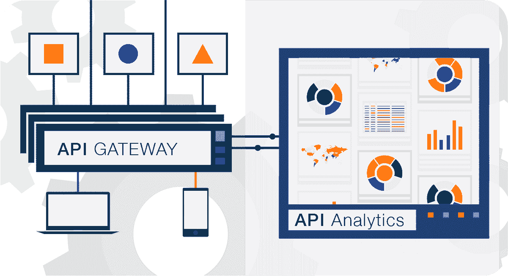

# API 管理 vs API 网关，API 分析和监控适合哪里？

> 原文：<https://www.moesif.com/blog/technical/api-tools/API-Management-vs-API-Gateway-and-where-does-API-Analytics-and-Monitoring-fit/>

在过去的几年里，API 驱动的业务出现了爆炸式增长。有创收的 API，开发者平台，合作伙伴市场，甚至内部 API 支持单页应用。

随着这种爆炸，API 工具也有了很大的增长，以帮助这些公司尽快将其 API 平台推向市场，并在任何竞争中胜出。工具的增加很大程度上反映了我们在移动时代看到的情况。然而，随着这种爆炸式增长，现在有越来越多的工具和解决方案来构建和发展 API 和平台。

此外，像 API 网关这样的工具既可以用作面向公众的 API 的代理，也可以表现得像在各种内部服务之间编排的*服务网格*。本指南旨在提供各种 API 工具的概述。

## api 网关

API 网关是位于 API 前面的 HTTP 服务器/代理服务器，它提供了管理、路由和保护 API 和服务的中心位置。API 网关应该部署在集群中，这样您就可以通过添加更多的机器来水平扩展系统，并确保高可用性。API 网关通常是内部设备，但现代的网关通常基于开源或开放核心模型。比如 Kong 基于 NGINX，Express Gateway 基于 Node.js Express。

还有来自云供应商的专有的基于云的解决方案，如 AWS API Gateway 和 Azure API Management。通常，API 网关会执行以下操作:

### 认证和速率限制

部署 API 网关的主要目的是提供一种安全的方法来访问您的 API 并防止恶意活动。如果您的 API 需要认证，API 网关提供了一种简单的方法来为每个消费者生成和管理 API 密钥。没有正确凭证访问您的 API 的客户端将获得一个`401 Unauthorized`。为了确保公平性，可以实施诸如速率限制之类的安全策略，例如每个 API 密钥每分钟 100 个请求的限制。可以基于 API 密钥、通过 IP 地址(如果没有添加身份验证层)或其他自定义策略来实施速率限制。您甚至可以包括额外的安全策略，如 bot 检测，并防止 HTTP 负载过大。

### 缓存和 CORS 策略

缓存使您的 API 平台能够处理更多的客户端并吸收高峰流量。某些类型的内容(如电子商务和旅游)可以从缓存中受益匪浅。银行和金融服务等其他行业可能无法从缓存中受益，因此您需要进行成本效益分析，看缓存对您的应用程序是否有意义。可以实施诸如 CORS(跨源资源共享)之类的其他策略，以允许从 web 浏览器访问 API。

### 数据验证和转换

API 网关提供了一种向 API 添加数据转换规则的中央机制。数据转换可以是简单的 URL 重写，如从 api.example.com/search 到 search.example.com，也可以是更复杂的转换规则，如从 XML 到 JSON 的转换。如果您已经有了许多想要作为 API 公开的遗留内部服务，即使遗留服务使用的是更老的内容格式，比如 XML 而不是 JSON，这也是很方便的。

除了数据转换，一些 API 网关还可以结合 end 来避免 API 链接。这使您的客户能够利用像`GET /user/me`这样的单一公共端点，即使它必须从各种内部服务中获取，如您的身份验证服务、用户服务和计费服务。来自这些内部服务的响应被组合成一个响应返回给客户端。这使得客户更容易使用您的 API，因为他们不必执行 API 链接。一个极端的例子是 Apollo GraphQL，它可以从许多服务中获取许多实体，并将它们组合成一个端点`POST /graphql`

### API Canary 发布/版本控制

与数据转换类似，使用 API 网关，您可以利用 API 网关将用户路由到您的服务的特定版本。这可以通过头字段、路径段如`/v1`或`/v2`来完成，甚至可以处理复杂的 canary 发布，其中一定比例的用户流量被路由到新版本。随着您对该版本信心的增加，用户点击更新 API 版本的比率会慢慢增加。通过执行逐步过渡，您可以最小化新的 API 版本由于功能或性能问题而成为系统范围中断的风险。

## API 分析

一旦你投资了你的 API 平台，你会希望通过构建一个客户实际采用的、没有 bug 的 API 平台来确保你的投资得到回报。像 [Moesif](https://www.moesif.com) 这样的 API 分析解决方案通过为您提供创造产品销售线索增长所需的必要可见性和报告来补充您的 API 网关。这包括你的客户如何使用你的 API，他们是谁，以及哪些营销渠道引导他们进行整合。除了报告之外，API analytics 通常还包括实时监控功能，因此当问题发生时，您可以保持警惕。

虽然 API 管理和 API 网关解决方案是为基础设施和站点可靠性工程而设计的，但 API 分析通常面向更广泛的技术和非技术用户，包括产品、工程和支持。正因为如此，像 Moesif 这样的 API 分析供应商更有可能采用 SaaS 管理解决方案，而不是本地解决方案，但也可以是本土解决方案。查看我们的[指南，了解何时构建和购买 API 分析解决方案。](https://www.moesif.com/blog/financial/procurement/When-to-Build-vs-Buy-an-API-Analytics-Solution/)

### API 产品分析

产品分析使您能够跟踪和了解关键 API 指标，如您的 API DAU(每日活跃用户数)、您的顶级客户正在使用的终端以及关键终端的 90%延迟。一些 API 分析工具提供了更复杂的分析，如群组保持分析和漏斗分析，因此您可以跟踪 KPI，如首次 Hello World 的平均*时间*(TTF HW)和转换率，从而了解您的产品的吸引力和粘性。

TTFHW 测量从第一次访问您的登录页面到通过您的 API 平台进行第一笔交易的 MVP 集成需要多长时间。这是一个跨职能的指标，跟踪市场营销、文档和教程，直到 API 本身。

### API 日志记录/调试

除了衡量产品指标，如保留和参与度，API 分析还提供了一种简单的方法来加快调查和调试 API 功能和性能 API 问题。高基数日志分析使您能够使用热图、时间序列、瀑布图和其他图表绘制趋势。一些 API 分析还实时记录完整的 API 调用，因此您可以检查请求和响应头和主体，进行比较，甚至重放失败的事务并生成测试。

### API 监控

许多 API 分析工具还提供 API 监控和警报功能，因此当 API 关闭或运行不正常时，您可以得到通知。与简单运行状况探测的综合监控不同， [API 真实用户监控](https://www.moesif.com/blog/engineering/api-monitoring/The-Difference-Between-Synthetic-API-Monitoring-and-API-Real-User-Monitoring/)根据历史趋势，从您的客户的实际 API 流量中检测异常行为。API 问题可能与业务相关，如关键客户的 API 活动意外减少，也可能与工程相关，如功能或性能问题。具体来说，API 分析侧重于几个关键支柱:

### 团队仪表板

一些 API 分析解决方案提供了一种与技术和非技术团队成员共享和协作仪表板的方式，或者自动沙箱化使用数据，以便您可以以安全的方式直接与外部合作伙伴共享仪表板。通过在面向客户的门户中嵌入 API 调试日志和计划使用信息，客户可以解决问题，而不会让已经不堪重负的支持团队不堪重负。

### 用户和/或公司角色

API 分析工具从您的 CRM、BI 和支持工具中提取数据。这使您的客户成功和支持团队能够通过客户的电子邮件或名称来查找客户的 API 活动，从而快速解决集成问题。用户和公司级别的信息也使您的公司能够集中跟踪各种潜在客户和客户如何集成和坚持使用您的 API。

## API 管理

虽然 API 网关和 API 管理可以互换使用，但严格来说，API 网关指的是单独的代理服务器，而 API 管理指的是在生产中管理 API 的整体解决方案，其中包括一组在集群中运行的 API 网关、一个管理 UI，甚至可能包括其他项目，如供客户注册和生成新 API 密钥的开发人员门户。

管理面板支持几件事情:

1.  能够添加和删除插件，如安全
2.  一种编辑和可视化数据转换(如 XML 到 JSON)的方法
3.  上传和管理 SSL 证书

## 结束语

由于最近新的商业模型和 API 策略的增长，API 领域发生了很多工具改进。更多信息可以在我们的[构建 API 指南](https://www.moesif.com/blog/api-guide/)和[API 分析指南](https://www.moesif.com/blog/api-guide/api-analytics-and-reporting/)中找到。