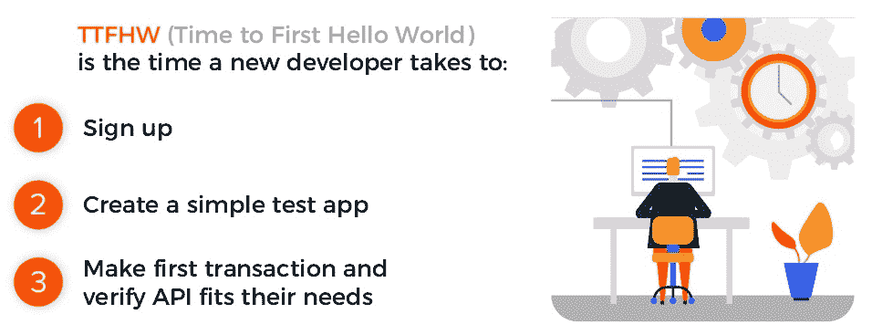

# 衡量 API 平台成功的开发者关系项目的最佳实践

> 原文：<https://www.moesif.com/blog/developer-relations/measure-success/Best-practices-for-Developer-Relations-Programs-to-measure-success-of-an-API-platform/>

每一个开发者关系项目都有一个不同的观点，即应该用什么样的北极星标准来衡量他们平台的成功。一些指标是有效的，而其他指标可能是所谓的*虚荣指标*。这篇文章讨论了你应该或者不应该跟踪哪些指标。

## 衡量什么

开发者关系的目标是确保第三方开发者能够利用你的平台创造有价值的东西。价值可能是主观的，但一些例子包括发布一个新的集成或插件来提高您产品的可用性，或者将您的 API 和 SDK 集成到他们的 web 或移动应用程序中，为他们的客户提供更好的体验。

### 假北极星度量

因为这很难量化，一些开发者关系项目天真地依赖于营销指标，比如页面浏览量和注册人数。这些指标的问题在于，注册你平台的新用户实际上并没有创造任何价值。你可以通过运行一个大型的 Google AdWords 或脸书活动来推动随机注册的涌入，从而轻松破解这些指标。然而，这些用户永远不会集成和利用这个平台。

要真正衡量一个平台的成功，您应该看看两个北极星指标:

1.  每周活跃令牌(或每周活跃用户)
2.  第一个你好世界的时间到了

### 1.每周活动代币(WAT)

为了衡量一个平台的成功，我们应该看它的使用情况。这可能来自您为第三方开发者发布的各种 API 和 SDK，以便与您的平台进行交互。仅仅是生成 API 密钥的行为并不能衡量使用情况，因为即使非开发人员也可以查看 API 密钥，而不会真正使用它们。因此，我们转向*每周活跃的 API 令牌*。由于大多数 API 都将访问权限限制在经过身份验证的用户，因此我们能够跟踪在给定的一周内有多少不同的令牌正在访问我们的 API 平台。

由于单个客户可以创建多个具有不同范围和到期日期的 API 密钥，我们可以进一步将范围缩小到每周活跃的集成公司。当决定在哪里投入更多时间时，开发人员关系团队中的每个人都应该看看这个指标。为了做到这一点，您应该准备好工具，将令牌之类的指标与开发人员的人口统计信息联系起来，例如将开发人员带到您的站点的任何营销渠道、公司关系和规模，甚至是 GitHub stars 之类的社交信息。有了这些信息，你就可以分解 WAT，找出对你的北极星指标贡献最大的是什么。[阅读更多平台团队应该了解的其他指标](/blog/technical/api-metrics/API-Metrics-That-Every-Platform-Team-Should-be-Tracking/)

### 2.第一个 Hello World (TTFHW)的时间到了

其次是每周活跃代币，第一次你好世界的时间，是你的平台整体成功的一个很好的代理。它不仅包括像 WAT 这样的采用和使用，还包括 DevRel 之外的其他功能领域，如营销和支持。

开发者开始使用你的平台的时间越长，他们成功的可能性就越小。难以理解的文档，不清楚的入职后续步骤，或者需要六个小时讲座才能理解基础知识的 API 和 SDK，这些都可能导致 TTFHW 高于预期。[阅读更多关于 TTFHW 和开发者漏斗的内容。](/blog/technical/api-analytics/Mastering-API-Analytics-for-API-Programs-Chapter-1/)

一个有效的 DevRel 程序应该致力于增加每周活动令牌(WAT ),同时减少首次 Hello World (TTFHW)的时间。

## 开发者关系在哪里

由于开发人员关系的目标是确保开发人员能够利用您的平台创造有价值的东西，因此必须格外小心，以确保 DevRel 的目标与更大的部门保持一致。作为一个相对较新的领域，每个公司都有自己的想法，DevRel 应该位于哪里，预算应该来自哪里。

### 营销

在一些公司，开发者关系是营销的延伸。由于这个原因，这些 DevRel 团队拥有大量的广告预算，可以在任何地方推广平台，从脸书广告到大型会议。营销团队的关键指标包括页面浏览量、注册人数和营销合格线索(MQLs)。然而，这些指标在帮助开发人员参与和发现平台的价值方面与开发人员关系团队不一致。因此，这些团队实际上是技术或开发者营销团队，没有太多的*关系*部分。

### 工程

在其他公司，开发人员关系是工程团队的延伸。这些团队负责最新的 API 文档，可能还有 SDK 本身。他们还能够调试和修复开发人员可能遇到的问题，或者创建额外的指南和示例来帮助他们的开发人员社区。不幸的是，由于持续不断的 SDK 变更、文档更新、调试等，这些团队将大部分时间花在了与公司其他队友的交流上，而不是更大的社区。

### 产品

产品的使命是构建一个客户(或开发者)实际采用和使用的产品。他们不断测试各种假设，并根据产品分析数据和客户的定性反馈构建功能路线图。开发人员关系团队不断地收集来自开发人员的反馈以影响路线图，同时他们是第一个知道他们的社区对产品变更是否有任何不满的人。在这种情况下，开发人员关系是产品的延伸，更多的是“在社区中”，而不是集中在构建方面和与内部利益相关者合作。虽然这是与多个平台公司和开发者关系团队合作的偏见，但我们已经看到 DevRel 在与产品而不是其他领域如营销和工程保持一致时表现最佳。毕竟，产品还受到参与度指标的约束，类似于每周活动令牌和首次 Hello World 的时间(产品信息和入职体验可能会对其产生很大影响)。

## 结束语

任何新的计划都需要有正确的指标来指导计划的任务和目标。开发者关系团队也不能幸免于责任。然而，开发人员关系团队有限的运营历史已经创建了一个基于 DevRel 预算来源的从其他部门借用指标的特别系统。创建产品指标，如每周活动令牌，确保 DevRel 能够帮助开发人员参与新的 API 或平台并从中发现价值。