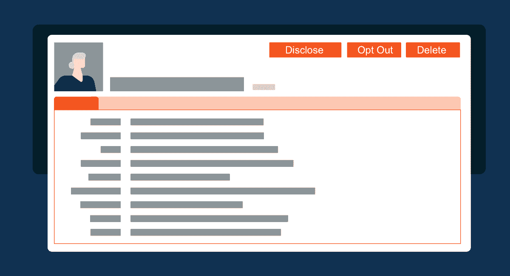

# API 程序的 CCPA 要求和符合性清单

> 原文：<https://www.moesif.com/blog/business/compliance/CCPA-Requirements-and-Compliance-Checklist-for-API-Programs/>

法律免责声明:以上所述并非法律建议。它仅供参考。你应该与法律和其他专业顾问密切合作，以确定 CCPA 可能适用于或不适用于你，以及你应该如何遵守。

## CCPA 要求和符合性清单

加州新隐私法于 2020 年 1 月 1 日生效。现在是检查你是否需要遵守的好时机。如果有，应该采取什么措施来确保平稳运行。

在最基本的层面上，2018 年[加州消费者隐私法案(CCPA)](https://leginfo.legislature.ca.gov/faces/billTextClient.xhtml?bill_id=201720180AB375) 授予加州居民关于如何收集和使用他们的数据的权利。

## CCPA 加大了消费者隐私的赌注

其独特之处在于，这是美国第一部为数据泄露提供赔偿的法规，大大增加了集体诉讼的几率。[参见库利- CCPA 常见问题解答第 3 部分:诉讼、监管行动和责任](https://cdp.cooley.com/ccpa-faqs-part-3-litigation-regulatory-actions-and-liability/)了解更多信息。它还扩大了个人信息的定义，包括一个扩展的项目列表，甚至是*推论*(准个人身份信息)。

> 个人信息包括… **从数据来源得出的推论**“创建反映消费者偏好、特征、心理趋势、偏好、倾向、行为、态度、智力、能力和资质的消费者档案。”

最后，它适用于加州居民(基本上是那些在加州缴纳所得税的人)， [*而不考虑*](https://leginfo.legislature.ca.gov/faces/codes_displaySection.xhtml?sectionNum=17014.&lawCode=RTC "California definition of resident: §17014 of Title 18 of the California Code of Regulations") 他们的数据被收集时所在的位置。

其他 11 个州也在效仿加州，他们自己版本的数据隐私法将在 2020 年通过立法机构。即使你认为你不需要遵守今天的 CCPA，加州法律的许多元素可能在不久的将来适用于你。

## 需要遵守吗？

这项规定并不适用于所有企业，而且不像 GDPR，它是一项选择退出的法律；不是选择加入。具体来说，它针对的是拥有加州居民信息并符合以下[标准](https://leginfo.legislature.ca.gov/faces/codes_displaySection.xhtml?lawCode=CIV&sectionNum=1798.140)之一的营利性企业:

*   收入超过 2500 万美元
*   收集超过 50，000 个人、家庭或设备的个人信息
*   至少 50%的收入来自销售消费者信息

CCPA 反对出售或共享个人身份数据，他们将其定义为“出于金钱或其他有价值的考虑，向第三方出售、出租、发布、披露……个人信息”

## 如何遵守？

合规性在很大程度上取决于隐私最佳实践的实施。一般来说，需要满足两方面的要求:

1.  通过隐私声明、服务条款、数据处理协议、政策等告知消费者所收集、披露或出售的个人信息的类别，以及这些信息的用途
2.  实施协议，以便消费者可以请求、查看和删除或以其他方式限制其信息的共享。

我们建议你寻求专业建议来修改你的法律声明，尽管网上有太多的信息可以帮助你。

收到信息请求后，有必要制定以下协议来尊重数据主体的权利:

| 权利 | 要提供什么 |
| --- | --- |
| 披露权 | 有权知道企业收集了哪些关于他们的个人信息，这些信息的来源、用途、是否被披露或出售，以及向谁披露或出售 |
| 删除权 | 删除任何个人信息的权利 |
| 退出的权利 | 选择不允许将个人信息出售给第三方的权利 |
| 不受歧视的权利 | 从企业获得同等服务和价格的权利，即使他们根据法案行使隐私权 |

协议需要在收到可验证请求的 45 天内完成，因此自动化是关键。

## 未能遵守

该法律规定，可以通过两种方式实施处罚:

1.  对于故意违规，每次违规的民事处罚高达 7，500 美元，但有 30 天的补救期，
2.  对于数据泄露，消费者可以单独起诉，也可以集体起诉，每次事件的法定赔偿金额从每位居民 100 美元到 750 美元不等。

将这些数字乘以数百万消费者，损失会迅速增加。

加州司法部长[计算](http://www.dof.ca.gov/Forecasting/Economics/Major_Regulations/Major_Regulations_Table/documents/CCPA_Regulations-SRIA-DOF.pdf)CCPA 将使企业损失 550 亿美元，75%的加州公司将受到影响。通过遵循隐私最佳实践并从一开始就符合 CCPA 的规则和政策，可以降低成本。

## CCPA 如何影响 API 程序？

CCPA 不仅仅停留在一个面向消费者的网站。作为 API 计划的一部分，您可能已经在为 API 日志记录和监控、用户行为分析、安全检查和其他关键业务活动收集个人身份信息。这意味着您需要审核您的内部流程和数据管理，以确保它们符合 CCPA(和 GDPR)的要求。幸运的是，CCPA 已经根据第 1798 条定义了 7 类业务目的，具体如下:

1.  审核与消费者的互动
2.  安全性
3.  调试/维修
4.  某些短期用途
5.  履行服务
6.  技术开发的内部研究
7.  质量和安全维护和验证

这意味着，只要你不出售或分享个人信息以换取金钱或同等价值的东西，如果你只利用 API analytics 所属的 7 个类别之一的数据，你的风险就较低。因为即使是用于合法业务目的的数据也会使您的组织面临风险，所以确保您拥有正确的流程和基础架构来处理 CCPA 和 GDPR 的请求非常重要。

有助于这一过程的一种方法是用生成数据的用户来标记组织内的每一条数据。像 [Moesif](https://www.moesif.com) 这样的 API 分析服务今天已经这样做了，以使合规性自动满足数据主体的请求。这使得非技术用户只需点击[几下](https://www.moesif.com/enterprise/gdpr-compliance)就能处理 CCPA 主题请求，而不是让您的内部数据工程团队过载 CCPA 主题请求。

## 原料药的重要程序

### 不允许匿名访问

不允许匿名访问你的 API。否则，您可能很难审核是谁访问了这些数据，这不仅是为了遵守 CCPA，也是为了帮助进行安全审查。您的 API 应该只允许注册用户访问数据，这通常是通过某种 API 键或令牌来完成的。API 的每个用户都应该有一个主要联系人。

### 记录对个人数据的访问

作为 API 监控和分析基础设施的一部分，您应该记录对个人数据的每次读写操作。CRUD APIs 是实现这一点的自然方法，因为无论客户端是什么(web 应用程序、合作伙伴程序、内部消费者等)，每次访问都必须通过您的 API。您还应该在一段时间后停用或使用*假名*这些数据。

### 不要使用 excel 或手工处理

不要只是将主题请求存储在 Google Sheet 或 Excel 文档中，然后让开发人员手动删除。任何存储个人数据的数据基础设施都应该有一组干净的 API 或 UI 来处理数据主体请求，并在操作完成时有时间戳的审计日志，以确保您的内部流程不会出错。审计日志应该能够在法庭上站得住脚。

*选择退出的权利*对于试图实现 CCPA 合规性的组织来说，请求是一个棘手的问题，因为数据和工程团队不仅需要构建基础架构来访问和删除用户的历史数据，还需要基础架构来防止未来的数据收集。当扩展到每天数十亿次 API 调用时，必须正确实现这种数据抑制逻辑。

虽然，你可能无法在截止日期前达标，但许多其他人也有同样的情况，据一些人[估计](https://www.emarketer.com/content/very-few-us-businesses-are-ccpa-ready)高达 50%。好消息是强制执行要到 2020 年中期才会生效。鉴于加州司法部长[最近的声明](https://www.reuters.com/article/us-usa-privacy-california/california-ag-says-privacy-law-enforcement-to-be-guided-by-willingness-to-comply-idUSKBN1YE2C4)，现在开始为时不晚。