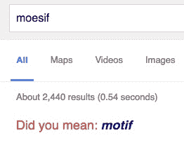

# 缓存失效和事物命名:创业命名指南

> 原文：<https://www.moesif.com/blog/startups/branding/Cache-Invalidation-And-Naming-Things/>

### 给创业公司命名

创办一家公司时，首先要做的事情之一就是想出一个名字。对于 Moesif，我们在最终确定名字之前等了一会儿，但是我们不想等太久，因为太多的事情都依赖于一个真实的名字。不形成法定名称很难合并。没有公司，就没有法人实体可以开立银行账户、接受投资、发行股票和发放薪酬。这只是一个合法的名称，你总是可以为其他名称提交一个“做生意”,但最好在开始时使用正确的合法名称，以尽可能保持样板。此外，一旦决定了名称，您就可以注册域名、为员工设置电子邮件以及开设帐户。您可能不希望您的 Mailchimp 和 MixPanel 帐户位于个人电子邮件下，并且希望开始使用标准命名约定，例如以 com.moesif 开头的 moes if Java 包。

### 重要因素

首先，你要写下你最想成为的 5 个或 10 个名字，然后使用下面的一些策略来缩小范围。

#### 有效性

在我们讨论其他因素之前，必须首先提供名称。我不会把我的公司命名为 Square，因为会有侵犯注册商标的法律后果，而且域名、github 名称等也不会出现。幸运的是，有一个工具[https://namechk.com](https://namechk.com)可以同时检查许多常见的服务，以查看该名称是否可用，如 Twitter 句柄、Github 名称、域名等。你仍然需要检查以确保你的名字没有侵犯现有的商标。

#### SEO/SERP

搜索引擎优化(SEO)和搜索引擎结果页面(SERP)是创业所需的硬艺术之一，但也是一个非常重要的增长渠道。一些行业比电子商务等其他行业更依赖 SEO，但 SEO 通常对大多数初创公司都很重要。如果我用谷歌搜索 Moesif，只有 2440 个结果。如果有人搜索 Moesif，我不必在 SEO 优化方面努力确保 Moesif 在搜索结果的第一页。如果我选择类似于 Errorless 的东西，已经返回了 500，000 个结果。总会有像 mint.com 这样的创业公司逆潮流而动，但你只需要制定出你的 SEO 策略。即使你的主要平台是移动应用而不是网站，应用商店优化(ASO)也同样重要。

#### 记忆和拼写

这是一个棘手的问题，因为独特的名称有利于搜索引擎优化可能会违背一个不同的因素:容易记住和容易拼写。

##### 拼写很难出错

你的名字和它的发音一样吗？如果你在建立一个社交网络，你是在依靠病毒式增长。如果你的 iOS 应用程序的一个用户在酒吧向他/她的朋友展示该应用程序，你要确保他/她的朋友在第二天早上能记住该应用程序的名称。如果很难拼写，那么他/她可能会放弃尝试通过谷歌或应用程序商店找到它。如果应用程序的名称是“Happi ”,朋友可能不记得它是如何拼写的，而只是搜索“happy”。Tumblr 可能运气不错，但情况可能并不总是如此。

##### 难以颠倒顺序

假设你有一家 SaaS 公司，名字叫 Cloudfire，它是由两个词组合而成的。这很容易拼写，所以没有问题；然而，还有第二个问题。反过来说，Firecloud 听起来也是一个很好的名字。这可能会导致一些早期的混淆，因为 Firecloud 和 Cloudfire 听起来都像合法的名称。这并不意味着你不能组合两个词来创造一个名字，不正确的排序应该听起来很尴尬，导致排序大多是单向的。脸书听起来比书呆子好多了。Mixpanel 也很不错，因为 Mixpanel 听起来比 Panelmix 好得多

#### 使用数据

杰夫·贝索斯有一句名言，他选择以字母“A”开头的名字，因为许多目录都是按字母顺序排列的。想想有多少次你在价格聚合器上找到一个产品，然后按字母顺序列出可用的商家。在名字的第一个字母中可能有其他的暗示，正如红点[http://tomtunguz.com/startup-names/](http://tomtunguz.com/startup-names/)的汤姆·通古兹所展示的，他试图将投资额与初创公司名字的第一个字符联系起来。尽管请记住，与任何数据挖掘一样，相关性并不总是意味着因果关系。

#### 不要自我设限

Loggly 是一个可爱的名字，听起来很滑稽，也是几年前发生的名词+“-ly”潮流的一部分；然而，一个问题是它可能过于自我限制。Loggly 是描述性的，但是如果 Loggly 扩展到日志之外呢？例如，Splunk 关注的不仅仅是服务器日志。这并不意味着这就是一切，结束一切，因为 Loggly 仍在前进。

#### 小心趋势。

拉夫·劳伦的服装能够经受住时间的考验，尽管可能不如普拉达或其他品牌时尚。当提到命名的趋势时要小心。有一段时间，许多初创公司在名称中添加“实验室”，以隶属于贝尔实验室等知名实验室。一个游戏工作室可能意味着有许多单独的实验，其中一些游戏会失败，但有一个有希望成为热门。随着时间的推移，“实验室”变得被过度使用，人们认为添加实验室稀释了公司的核心使命，因此在公司名称中添加“实验室”不再流行。同样，“-ly”的名字也曾流行过一段时间，但现在听起来已经过时了。

#### 个人关系

如果有个人关系(除了创始人的名字)，这使它更像一个商店，那么这可能是一个好处。我们的下一篇文章将解释为什么 Moesif 与创始人的背景有关。

#### 谢谢

我们感谢我们的精选测试版客户，他们一直在试用 Moesif，为我们提供了宝贵的反馈，使调试变得更加容易。

您是否花费大量时间调试客户问题？
Moesif 使 RESTful APIs 和集成应用的调试更加容易

[了解更多信息](https://www.moesif.com?utm_source=blog)