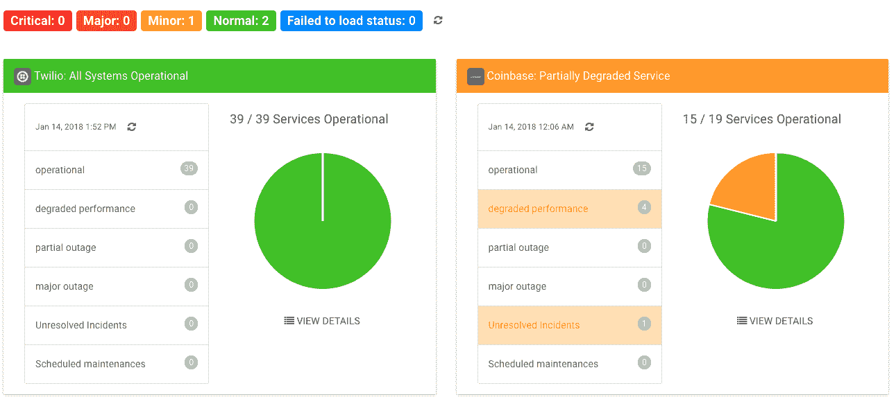
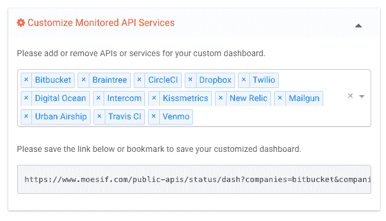

# 创建聚合仪表板以监控您的第三方 API

> 原文：<https://www.moesif.com/blog/technical/api-status/Creating-Aggregate-Dashboards-to-Monitor-Your-Third-Party-APIs/>

Moesif 发布了一个免费工具,可以用来监控你的第三方 API。许多 API 提供商都有自己的状态仪表板，如 status.dropbox.com 的[或 status.box.com 的](https://status.dropbox.com)[或](https://status.box.com)。但是，每一个都托管在单个公司的域中。有时，您只是想要集中或全局地查看您所依赖的所有服务的运行状态，这正是该工具的用武之地。

## 背景

随着 API 和 SaaS 的增长，一个公司能够将他们的许多非核心产品功能外包给第三方。从 CI/CD 到支付处理的一切都可以外包给第三方。然而，公司现在比以往任何时候都更加依赖这些服务的可靠性。

例如，电子商务移动应用程序可以依赖 [Braintree 的正常运行时间](https://status.braintreepayments.com)或 [Recurly 的正常运行时间](https://status.recurly.com)进行支付， [Twilio 的正常运行时间](https://status.twilio.com)或 [Mailgun 的正常运行时间](http://mailgun.statuspage.io)进行短信和电子邮件，甚至 [CircleCI 的正常运行时间](https://status.circleci.com)进行持续集成。

由于这些依赖性，了解这些服务的状态和可用性至关重要。虽然这些公司中的许多都为他们的客户提供了状态页面，但将这些数据统一到一个集中的仪表板中并不容易。

这就是为什么我们创建了一个免费的工具，它可以在一个仪表板中监控多个 API 和服务。

## 主仪表板

主仪表板为您提供了您选择进行监控的所有 API 和服务的高级视图。服务和 API 由五个主要的状态代码组成:*运行*、*次要*、*主要*、*关键*、*维护*。

对于每项服务，都有每项服务组件的状态摘要，以及未解决事件和任何正在进行的维护的突出显示。

## 选择服务

您可以使用右上角的下拉多选来选择要监控的服务。只需搜索或选择您想要监控的服务。该网址可以加入书签并共享。当您重新访问该 URL 时，将显示您之前选择的相同服务。请务必将您的自定义仪表板加入书签，或者保存链接并与其他人共享。

## 查看服务详细信息

您可以单击某项服务来查看更多详细信息。详细视图将包含每个*组件*的状态细分，以及过去*事件*和*维护*事件的列表。还有一个用于即将进行的*定期维护*的部分。

您还可以根据各种数据进行排序和过滤，例如:状态、影响、更新时间、解决时间等等。

## 将来的

我们确实意识到当前的[受支持组织列表](https://www.moesif.com/public-apis/status/list?utm_source=blog)并不完整。我们将继续添加您正在使用的缺失服务或 API。为了帮助我们确定优先顺序，请随时[联系我们](mailto:support@moesif.com)，让我们知道应该添加哪些内容。

许多这样的状态页面都是使用类似 ping 的服务创建的。然而，pings 无法让您深入了解具体的 API 流量或错误发生的原因。如果你想对 API 进行深度分析和错误监控，我们无耻地推荐我们的主要产品: [Moesif API analytics](https://www.moesif.com?utm_source=blog) 。:)

**Moesif 是最先进的 API 分析平台，支持 GraphQL、REST 等。成千上万的平台公司利用 Moesif 进行调试、监控和发现见解。**

[了解更多](https://www.moesif.com?utm_source=blog)