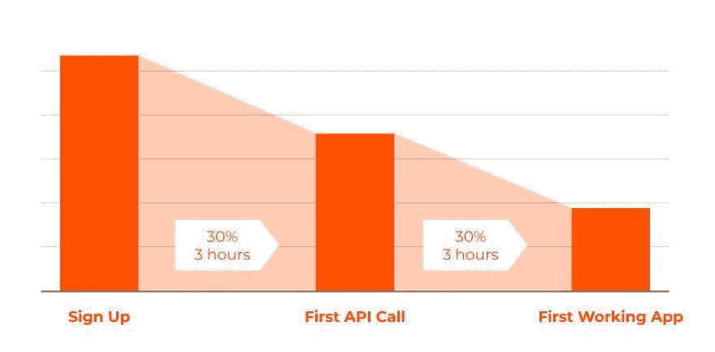
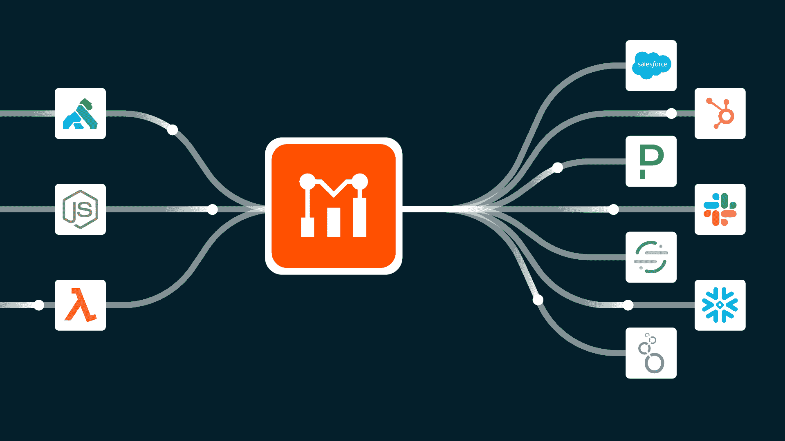
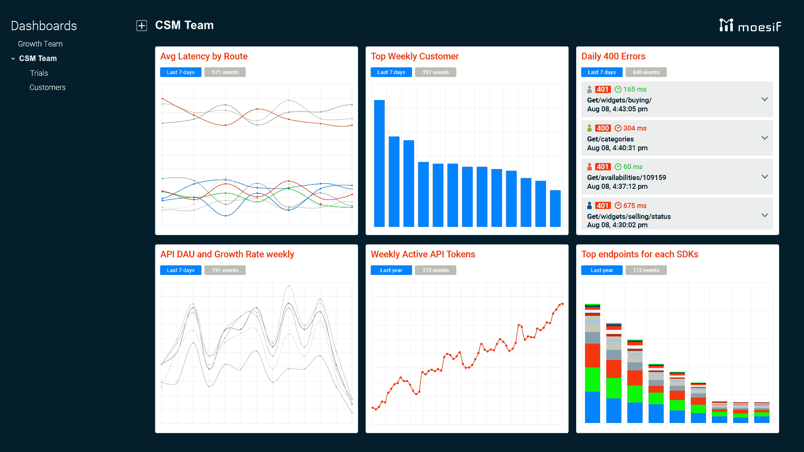
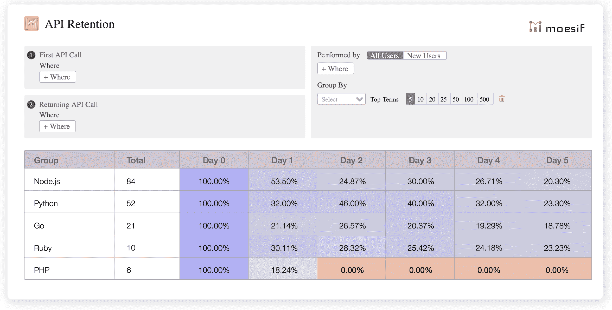

# 数据驱动的客户成功管理以及 API 如何提供客户健康的领先指标

> 原文：<https://www.moesif.com/blog/customer-success/monitoring/Data-Driven-Customer-Success-and-How-API-Data-Provide-the-Leading-Indicator-of-Account-Health/>

*通过使用 API 分析平台，客户成功管理(CSM)团队可以主动帮助客户实现他们的目标，这反过来又鼓励他们续订和升级合同。相反，在经济衰退时期，这些相同的平台可以帮助 CSM 专业人员识别并最大限度地减少客户流失。通过以客户为中心的 API 分析，让您的客户爱上您是轻而易举的事情:集成将更快，支持将更及时，流失风险将被自动标记，并且您将被设置为提供真正的持续价值。*

客户成功源于客户管理。在软件产品的旧世界里，你卖了它，然后他们放你鸽子，如果你幸运的话，客户经理会每年拜访客户一次，除非你的产品爆炸了。谁想要一个生气的顾客？

在基于订阅和消费的软件和服务(SaaS 和云)的新世界中，技术是复杂且不断发展的，因此客户需要持续的帮助来适应和实现价值。客户价值实现是让客户不断回头客的飞轮。CSM 是加速飞轮的动力。但是，如何让客户喜欢你，并不断回来呢？

## 主动的 CSM 团队

Olivia 是一家领先的订阅管理提供商的 CSM 经理，她颠覆了这一模式。就像销售一样，她的团队是超级主动的，而不是被动的。她有爱她的顾客，而不是生气的顾客。为了达到这一点，她遵循了三步走的方法:

1.  **了解客户的业务**。尽可能多地收集他们的信息。使用 Datafox、Alexa、网络抓取和 intro 调用来真正理解它们的全部内容。
2.  在整合过程中，尽可能毫不费力地帮助顾客**竖起你的产品**。因为你已经熟悉了他们的产品，显然也熟悉了你自己的产品，所以你会知道他们最关心的特性，以及可能存在的集成问题，甚至在它们出现之前。
3.  通常，你的客户不会充分利用你的产品。您还将发布新功能。关键问题是要了解你的客户，然后确定该功能是否与他们相关。通过保持领先并让他们了解适合他们的最新和最棒的功能，您将**继续提供真正的价值**。

> “如果我确实遇到了不高兴的客户，那么至少我知道他们可以和我的 CSM 团队谈谈。我的客户告诉我发生了什么，为什么他们不开心，让我放松一下，这样我就可以解决问题了。”奥利维亚，CSM 经理

## 轻松整合

没有成功的整合，就没有新客户。相反，通过快速整合，你会得到一个满意的客户，并且更有可能升级他们的计划。CSM 的首要工作是确保产品尽可能快速、轻松地集成。

通过使用能够识别和理解常见错误模式的工具，可以避免糟糕的客户体验。同样，如果确实出现了问题，最佳实践表明应该快速对它们进行分类。

更好的 API 分析工具，如 Moesif 的工具，能够深入了解单个客户如何使用您的 API，他们在哪里卡住了，它是如何发生的，以及可以做些什么来减轻它。通过快速解决集成问题，客户可以更快地部署，在几个小时内就能开发出第一个可用的应用程序，而不是几天或几周。

## 灌输数据驱动的文化

分享信息导致更多的理解。在您的 CSM 团队中、与公司的其他利益相关者以及直接与客户共享关键指标和 SLA，可以在公司范围内以及与客户之间建立更加共生的关系。

通过连接到 Salesforce、Marketo 和 Zendesk 等工具，可以编织更丰富的客户花毯，并且使用 Moesif 等工具，可以在单一窗格中进行管理。

## 账户健康状况的领先指标

通过 API 分析，CSM 团队可以收集关于客户账户健康状况的独特见解。不仅可以跟踪哪些客户最近集成，您还可以更深入地挖掘使用统计数据，如每周活跃令牌或每周活跃用户。这提供了用户和公司级使用的更完整的图片。通过监控谁在加速平台使用，您可以在关键客户准备追加销售时获得早期警报。

如果可以的话，不要纠结于 SQL 和复杂的可视化工具，只需点击一个按钮，就可以创建实时仪表盘来监控帐户健康状况。Moesif 提供了一套仪表板，可以显示您和 CSM 团队关心的所有关键使用指标。

## 衰退期间将流失风险降至最低

在经济衰退期间，识别和最小化客户流失风险变得比漏斗增长顶部更重要。很多时候，你可以通过重新安排已经注册和/或正在付费的客户/潜在客户的优先次序来获得额外的增长。通过采用一个分析平台，自动跟踪哪些帐户的平台使用率低或其他指标不合格，当情况不乐观且客户有流失风险时，就有可能收到警报。需要注意的事项包括:

*   API 使用率逐年下降的客户
*   仅访问一个或两个终端的客户
*   查看下降较高的 SDK 可能表明存在缺陷或缺少文档
*   具有大量错误或延迟(如未经授权的错误)的客户
*   尚未访问您的主要价值创造端点的客户

## 继续提供价值

在 Olivia 帮助最近的一个关键客户整合后，她不只是试图给他们发广告进行追加销售，而是带来了他们如何更好地使用她的产品的想法。她在公司的产品路线图中倡导这一点，并让他们了解未来的发展。

> CSM 是贵公司内部客户的*声音，所以倾听他们的担忧并推动产品变革。*

在她亲自进行的高管业务回顾中，她与他们分享了他们的季度平台使用情况仪表板，并回顾了他们的支出，查看了对他们来说重要的其他问题。

## 结论

CSM 团队在销售和支持之间架起了桥梁，是基于订阅的软件新世界中的一个关键因素。

Moesif API analytics 为 CSM 团队提供了必要的工具，帮助他们了解客户使用情况和参与趋势等，衡量客户健康状况，防止流失，并发展关键合作伙伴关系，所有这些都在一个统一的平台中完成。