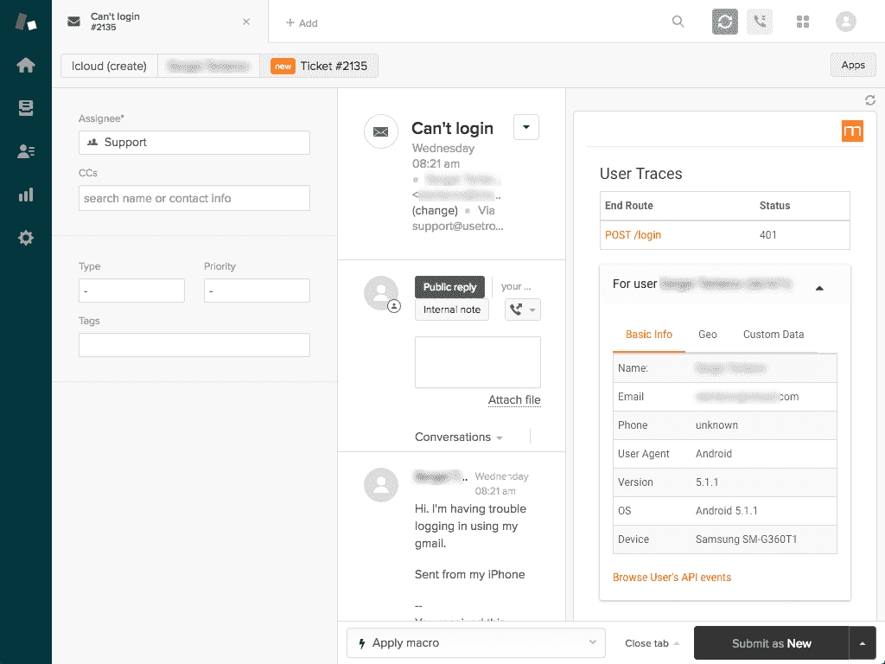

# 使用 Moesif 的 Zendesk 集成有效地调试应用程序错误

> 原文：<https://www.moesif.com/blog/integrations/desk/Debug-App-Errors-Efficiently-Using-Zendesk-Integration/>

Moesif 的 ZenDesk 集成和设置指南的快速概述，自动查看 Zendesk 标签中的 HTTP 错误跟踪和应用程序 API 历史

### 使用 Moesif 和 Zendesk 更快地解决技术问题:

*   Moesif 是一个针对 RESTful APIs 和集成应用程序的调试工具，可以帮助您快速解决技术问题。

*   该集成将用户配置文件数据(如浏览器、设备信息、SDK 版本和地理位置)直接导入到 Zendesk 票证中，以避免与客户进行冗长的电子邮件线程来获取调试信息。

*   查看终端用户的 HTTP 请求历史和任何错误，这样您就不必浪费时间手动搜索应用程序日志。

*   在 Zendesk tickets 中即时访问 Moesif 的深度错误分析和分类信息。

### 如何用 Zendesk 设置 Moesif

本安装指南专门针对 Moesif Zendesk 集成。对于一般 Moesif 信息，查看[产品特性](/features)和[开发者文档](/developer-documentation/)了解更多信息。

1.  登录您的 Moesif.com 帐户，获取您的应用程序 ID。你可以在*设置*->-*插件设置*的 APPLICATION_ID 下找到

2.  转到 Zendesk 的 Marketplace 上的 [Moesif integration](https://www.zendesk.com/apps/moesif-error-insights) 并点击 install。

3.  将*插件设置*中的集成令牌粘贴到 Zendesk 插件字段中。

### 结束语

公司希望提供出色的客户体验，以增加客户保留率并确保忠诚满意的客户。不要让未解决的技术问题将客户推向竞争对手。通过使用 Moesif 和 Zendesk 实现流程自动化，确保您能够快速解决客户问题。