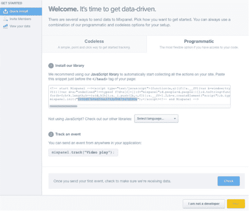
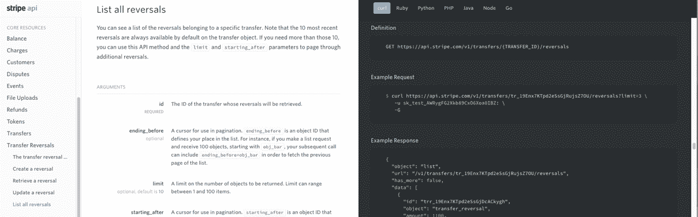
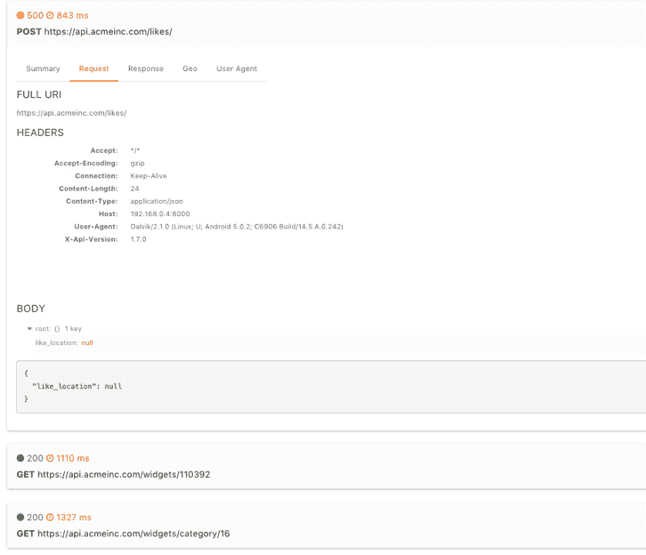

# 开发者体验:4 个可用性技巧

> 原文：<https://www.moesif.com/blog/technical/developer-experience/Developer-Experience-4-Usability-Tricks/>

### 什么是开发者体验(DX)？

API 开发者体验是第三方开发者使用平台或服务的整体体验，包括 API 设计、可用性和情感体验等项目。

### 为什么重要？

现在越来越多的公司开放 API，考虑 DX。与移动优先的 UX 浪潮类似，公司正在意识到 API 可以成为额外收入渠道的有力工具。在竞争激烈的世界里；然而，公司需要吸引拥有出色体验的开发者，以区别于过去刻板的企业应用。今天的开发人员在制定业务线决策方面拥有更大的权力，而这些决策过去是委托给其他业务部门的。

这些例子从可用性的角度为 API 供应商展示了良好的开发者体验。值得注意的是，这篇文章中的一些公司只是作为例子，与 Moesif 没有任何关系。

#### 1.测量第一个 hello world 的时间(TTFHW)

快速的集成时间对于确保开发人员满意非常重要。人们很容易忘记，开发人员集成您的服务并不只是为了好玩。他们出于个人或商业原因使用你的服务。你的服务是一个工具，应该很容易上手。衡量新开发人员集成您的服务所需的平均时间。需要 30 分钟还是 12 小时？如何降低这个指标？看看 [Mixpanel](https://mixpanel.com) 。他们在接纳新客户方面做得很好:

*   指定完成漫游之前的确切步骤数，没有歧义。
*   在示例代码中直接嵌入 API 令牌，可以快速复制/粘贴以开始使用。
*   提供首选安装语言的快速选择
*   验证集成以防止漏船。

记下复制/粘贴的次数，因为它们会累加。开发人员不需要首先复制/粘贴库名，然后是 API 基 url，然后是示例代码，最后是 API 键，等等。

此外，验证是防止早期流失的关键。如果开发人员的集成不起作用，通过电子邮件指导他们提供帮助甚至联系比让开发人员沮丧地离开更容易。你已经在努力招聘开发人员，不要强迫他/她离开。

#### 2.有效地沟通和教育

不要错误地认为你的开发人员和你一样熟悉你的 API。好的文档总是很重要的，但是也应该对不同的专业水平感同身受。一个刚开始新的集成的前端 web 开发人员可能不像已经开发 web 服务多年的后端工程师那样熟悉 RESTful API 架构。一组不同的文档，如演练、视频和典型的 3 栏文档，确保每个开发人员都可以通过他们熟悉的最佳方法进行学习。

看看像 [Stripe](https://stripe.com/docs/api) 和 [Twilio](https://www.twilio.com/docs/api) 这样的公司，它们都为自己的 API 提供了很好的文档。

例如，条纹:

*   有授权、错误和语言的快速链接。
*   不强迫用户寻找基本 API URL。每个端点都有完整的 URL*api.example.com/some_resource/{id}*，而不仅仅是路径。
*   这是一个允许利用强大的浏览器搜索跳转的单一页面。

[T2】](https://stripe.com/docs/api)

像在侧边栏中放置粘性 API 令牌或在 CURL 命令中嵌入它们这样的小事可以确保您的开发人员能够快速找到他们想要的东西。

#### 3.让开发人员更容易调试

调试 API 问题总是一件痛苦的事，但是对于不熟悉 API 的开发人员来说就更难了。给你合适的工具，比如 Moesif 的 API 调试器，让你的开发者生活得更好，他们会感谢你的低流失率，并告诉他们的同事你的 API 是多么容易调试和使用。

[T2】](https://moesif.com/features?utm_source=blog)

当你的开发者成功了，你也成功了。换句话说，通过提供更易于集成和使用的 API，您可以更快地为您的公司创造收入。

#### 4.需要时给予及时的帮助

开发者现在希望通过公共 Slack 频道等工具获得即时帮助。不要只依赖电子邮件，要全渠道。监控像 [Stack Overflow](https://stackoverflow.com) 或者 Quora 这样的公共论坛。甚至推荐你的开发者用你公司的名字来标记帖子。这允许您的开发人员支持团队定期检查这些站点的相关问题。

此外，它有助于在内部记录一切！对于任何集成，总会有问题，但是开发人员在寻求帮助时并不总是提供重现问题的说明。你应该能够找到开发者问题的根本原因，而不需要一长串来回的电子邮件来询问额外的信息。

### 结束语

开发者体验一如既往的重要，不应该被轻视。如果你没有好的开发者体验，你的竞争对手会。请继续关注我们下一篇关于开发者体验的文章。