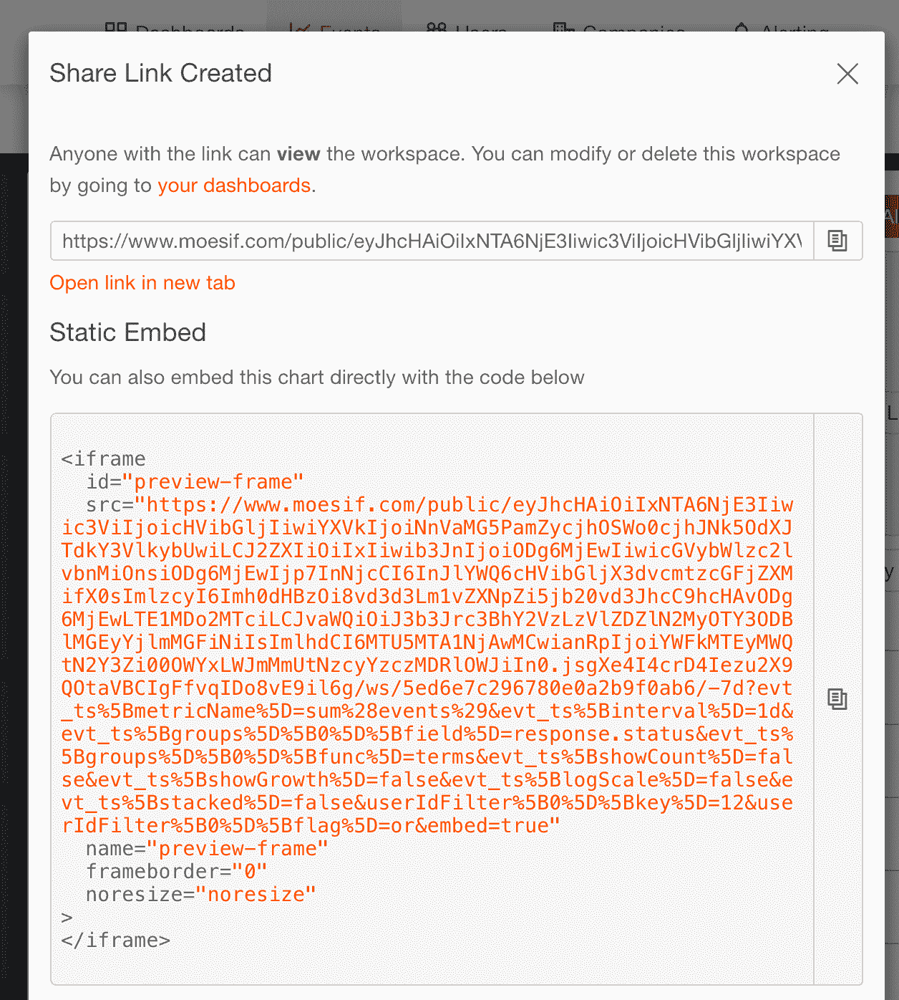
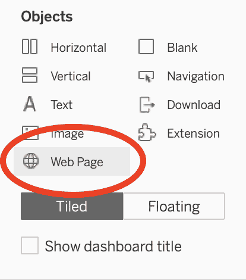
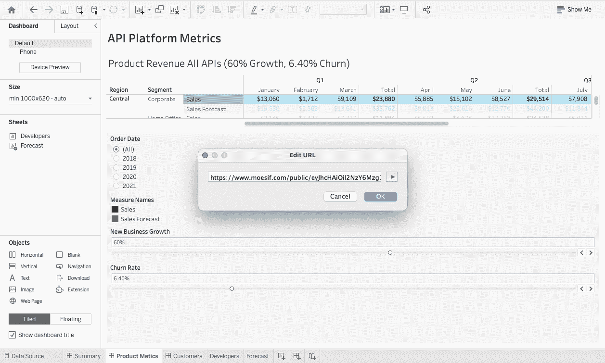
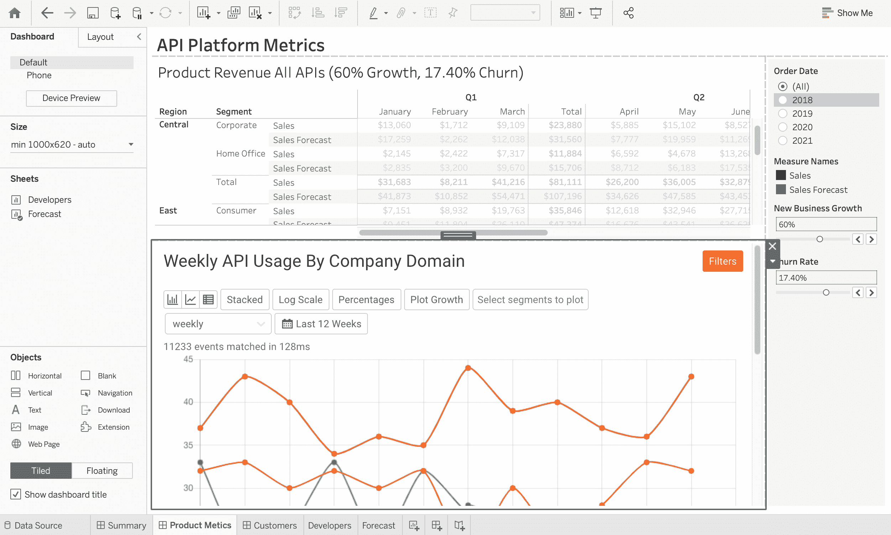
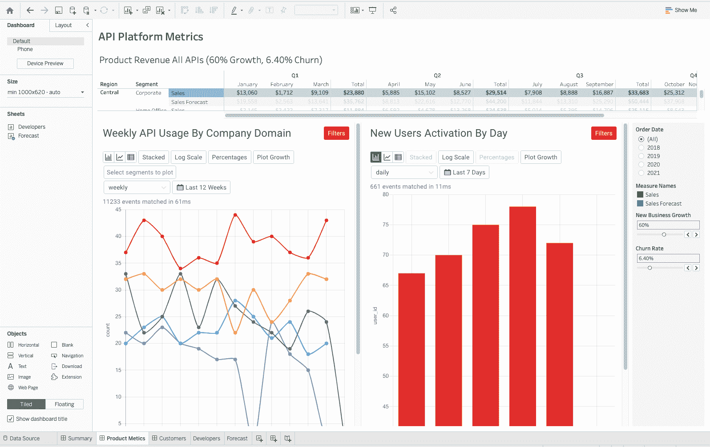

# 在表格中显示 Moesif 报告

> 原文：<https://www.moesif.com/blog/technical/dashboards/Display-Moesif-Reports-Within-Tableau/>

作为产品领导者，没有比用图形显示关键数据更好的方式来展示你的 API 平台的价值了。如果你已经在使用 Tableau，很容易从 Moesif 的仪表板中提取关键图表，或[工作区](https://www.moesif.com/docs/api-dashboards/creating-a-dashboard/#definitions)，并将其插入到你的可视化平台中。

来自 Moesif 的信息将作为*网页对象*插入 Tableau。网页对象是基于微软 IE 的全功能网络浏览器窗口，因此，窗口中的所有按钮、链接和导航功能将像普通浏览器一样运行。

本指南将带您完成在 Tableau 仪表板中设置和显示 Moesif 工作区所需的步骤:就像 1-2-3 一样简单。

## 第一步。Moesif 的工作空间公共链接

在 Moesif 的 API 分析平台[中，为您想要跟踪的指标创建一个工作空间](https://www.moesif.com/docs/api-dashboards/creating-a-dashboard/)。

将工作空间另存为[公共工作空间](https://www.moesif.com/docs/api-dashboards/creating-a-dashboard/#public-workspaces)。

我们将使用*共享链接*，如下所示，将工作区直接嵌入 Tableau 中。

## 第二步。Tableau 的 Web 对象

一旦你创建了 Tableau 仪表板，你需要[插入](https://help.tableau.com/current/pro/desktop/en-us/actions_dashboards.htm#interactively-display-a-web-page-in-a-dashboard-create-in-tableau-desktop)一个新的网页对象。

点击*对象*下的*网页*图标，如下图所示，将其拖动到仪表盘上您想要插入 Moesif 工作空间的位置。

释放图标时，会出现一个弹出窗口。在步骤 1 中输入来自*共享链接*的 URL。

应该会出现 Moesif 工作区。调整 Tableau 仪表板中的图块大小，以最佳方式显示您的新指标。

## 第三步。添加更多工作区

重复步骤 1 和 2，用 Moesif 的关键指标填充 Tableau 仪表板，展示 API 平台的价值。

以下示例显示了产品经理的现有 Tableau 仪表板，其中插入了两个 Moesif 工作区:

*   按公司域分组的每周 API 使用情况
*   新激活的客户

## 在 Tableau 中轻松可视化关键 API 产品指标

数据和分析堆栈已成为您企业解决方案的重要组成部分。Tableau 是一款流行的产品，可以可视化数据仓库中的数据。通过使用 web 页面对象，您现在可以毫不费力地从 Moesif 引入关键的 API 产品指标。

该组合解决方案为您的决策过程提供了单一参考点。