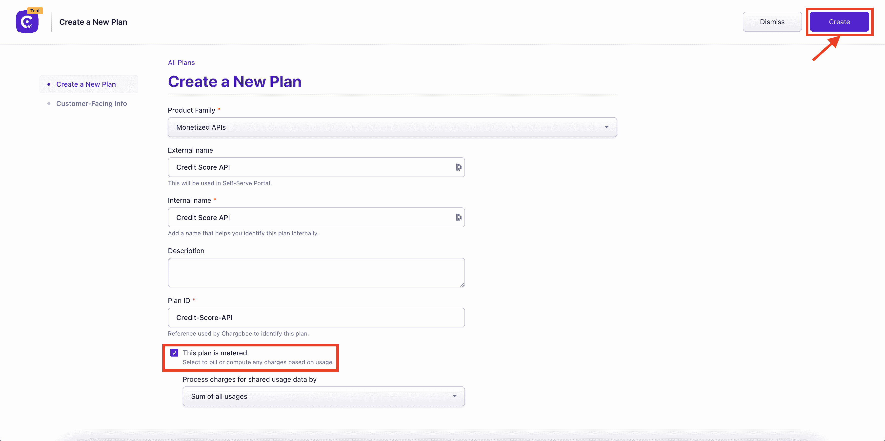
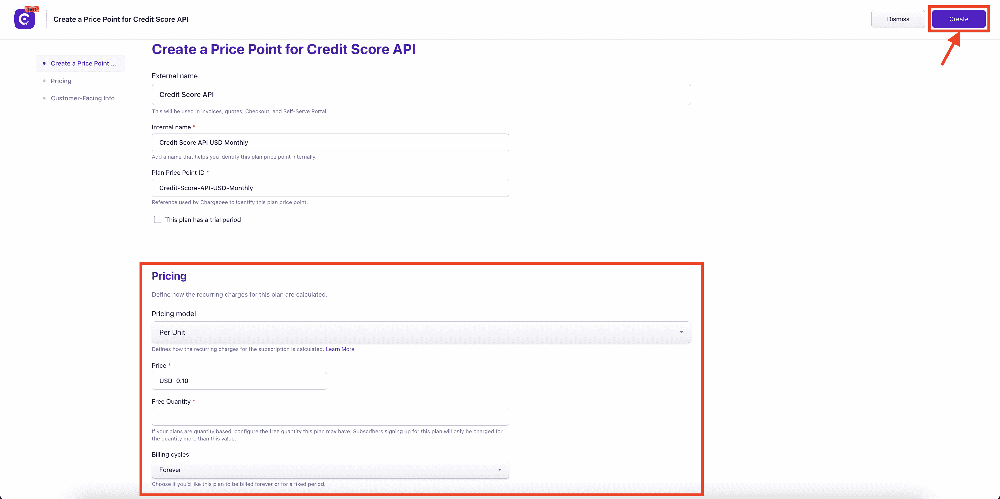
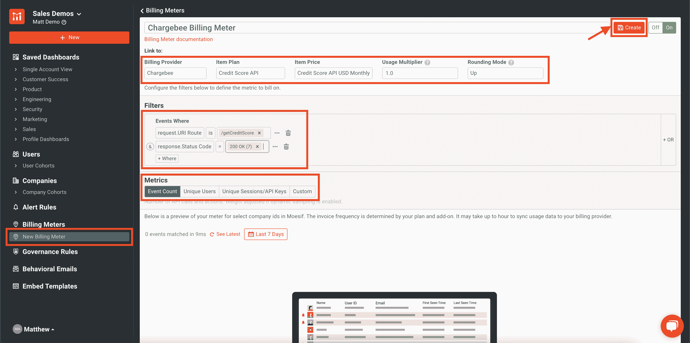

# 使用 Moesif Plus Chargebee 轻松实现 API 货币化

> 原文：<https://www.moesif.com/blog/developer-platforms/chargebee/Easily-Monetize-Your-APIs-With-Moesif-Plus-Chargebee/>

能造出赚钱的东西总是很棒的。最成功的企业通常会找到最简单、最有效的方法来赚钱，同时将成本和支持保持在最低水平。毕竟，最好的企业和产品就是那些知道如何创造收入的企业和产品。许多公司现在希望将他们的 API 货币化作为他们整体货币化战略的一部分。

然而，API 货币化并不总是容易的。它通常需要大量的集成、大量的代码和定制，还会导致巨大的支持负担。当出现账单问题时尤其如此。简而言之，无论是在实施过程中，还是在计费系统启动并运行后，都存在挑战。

如果有一种更简单的方法是可能的呢？在 Moesif，我们最近为**计费表**引入了一项功能。这是一种使用进入 Moesif 的数据来监控用户使用情况、将这些数据发送给计费提供商，并向用户提供准确账单的方法，所有这些工作只是实现定制解决方案所需工作的一小部分。

为了说明它是如何工作的，让我们假设我们有一个 API，我们希望对客户的使用进行收费。作为一个例子，让我们假设我们已经创建了一个新的信用评分 API，公司可以使用它将消费者的信用评级带回他们的应用程序。我们的 API 将是 **/getCreditScore** ，用户将为他们发送到端点的每个查询/调用付费。我们的 API 货币化模型将非常简单，我们将对我们的 **/getCreditScore** 端点的每次调用收取 0.10 美元。

[收款人](https://www.chargebee.com/)将是我们用来向客户开具发票和收取使用费的账单提供商。Chargebee 易于使用，使我们能够轻松设置计划和定价，以遵守上述定价方案。

我们现在将使用 Moesif 来统计端点的使用情况，并将使用指标发送给 Chargebee。然后，被收费人可以使用这些指标，根据指标对应的层级，向客户开出相应的账单，并收取费用。

## 将您的应用和 API 与 Moesif 集成

为了使用 Moesif 中的**计费表**特性，您需要将您的 API 与 Moesif 集成。这是因为 Moesif 将使用存储在其中的指标，然后向 Chargebee 提供它需要的信息。一旦您的 API 与 Moesif 集成，您还可以使用与我们的**计费表**功能配合良好的其他功能，包括[行为电子邮件](https://www.moesif.com/features/user-behavioral-emails?utm_campaign=Int-site&utm_source=blog&utm_medium=body-cta&utm_term=monetize-with-chargebee)、[治理规则](https://www.moesif.com/features/api-governance-rules?utm_campaign=Int-site&utm_source=blog&utm_medium=body-cta&utm_term=monetize-with-chargebee)和[警报](https://www.moesif.com/features/api-monitoring?utm_campaign=Int-site&utm_source=blog&utm_medium=body-cta&utm_term=monetize-with-chargebee)。

如果您目前没有使用 Moesif 来监控您的 API，那么可以用几种不同的方式来完成集成。如果你正在使用 API 网关或 API 管理平台，你可以使用我们众多插件中的一个，它允许你快速向 Moesif 提供分析。如果你没有使用第三方网关或管理平台，或者想在 API 代码层面上做，你可以使用[我们的一个 SDK](https://www.moesif.com/docs/server-integration/?utm_campaign=Int-site&utm_source=blog&utm_medium=body-cta&utm_term=monetize-with-chargebee)。Moesif SDK 将允许您直接从代码中轻松地将 Moesif 与您的节点、Python 或 Java APIs(以及更多的语言和框架)集成。这两种方式都很容易支持。

为了让计费正常工作，您需要部署的另一个 Moesif 特性是实现[用户和公司跟踪](https://www.moesif.com/docs/user-analytics/?utm_campaign=Int-site&utm_source=blog&utm_medium=body-cta&utm_term=monetize-with-chargebee)。通常，这可以通过几个简单的步骤来设置。我们需要启用此功能，以便 Moesif 中的使用数据可以绑定到特定的用户和公司。这是 Chargebee 将用量映射到 Chargebee 内部客户的方式，因此可以对他们进行相应的计费。

一旦您与 Moesif 集成，并启用了用户和客户跟踪，您的下一步将是在 Chargebee 中实际创建您的计划，以便它们可以在 Moesif 中使用。

## 负责创建计划和价格

创建收费帐户并登录后，您可以开始创建您的计划。出于我们的目的，我们需要创建一个包含使用标准定价的价格的计划。

你需要创建一个负责人计划，这是**计量**。价格应该设置为**每月**计费间隔，以便在月底总计使用量。单价也需要设置为 0.10 美元。

例如，设置计划将如下所示:

每月定价详细信息如下所示:

现在，在月末，当 Chargebee 创建发票时，它将合计总使用量并相应地向客户开出账单。当然，在这一点上，我们只定义了计划，但没有人会被收费，因为我们还没有任何使用数据被发送到 Chargebee。

## 将收费对象与 Moesif 集成

我们仍然需要将数据从 Moesif 传递到 Chargebee，反之亦然。有两种机制用于此:webhook 和 Chargebee API。在促进平台之间的数据共享方面，两者各有不同的作用。

通过将 webhook 添加到 Chargebee 中，订阅更新可以发送回 Moesif。通过使用 Chargebee API，Moesif 可以向 Chargebee 发送使用详细信息，还可以在 Chargebee 中检索可用计划和价格的详细信息。这两个联系点是 Chargebee 和 Moesif 集成所需要的。幸运的是，当您将 Chargebee 设置为计费提供商时，Moesif 会带您完成这一步，并提供所有需要的详细信息。具体情况，您也可以查看我们关于 Chargebee integration 的[文档。](https://www.moesif.com/docs/metered-billing/integrate-with-chargebee/?utm_campaign=Int-site&utm_source=blog&utm_medium=body-cta&utm_term=monetize-with-chargebee)

## 设置您的计费参数

一旦您将 Chargebee 集成到 Moesif 中，您就可以设置您的计费表了。对于我们的例子，这将是非常简单的。我们要做的是，每当对 **/getCreditScore** 的 API 调用返回“200 OK”响应时，就向 Chargebee 发送使用指标。这意味着我们将只对成功的呼叫计费，而不会意外地对出现错误的呼叫计费。

一旦我们创建了计费表，每个小时每个客户的使用量将被发送给被计费人。月底，Chargebee 将根据我们的定价结构开具发票，并向用户收费。

> 您还可以使用 Moesif 为每一次成功的通话自动发送行为电子邮件，即使他们即将进入下一个折扣级别。您还可以使用 Moesif 的治理规则来阻止发票过期的用户访问 API，直到他们的发票得到结算。

## 你自己试试吧

如您所见，离易于实现和支持的健壮 API 货币化只有几步之遥。通过同时使用 Moesif 和 Chargebee，您将能够在几分钟内向客户收取使用费，管理订阅，甚至可以使用 Moesif 的其他功能来创建最终的客户体验。我们的计费设置非常简单，甚至不需要任何开发人员的技能就可以完成。

所有 Moesif 用户均可使用**计费表**功能。[立即注册](https://www.moesif.com/signup?utm_campaign=Int-site&utm_source=blog&utm_medium=body-cta&utm_term=monetize-with-chargebee)moes if，立即访问我们的**计费表**功能，开始为您客户的 API 使用计费。如果你已经在使用 Moesif，点击左侧导航菜单中的**计费表**并查看[我们的文档](https://www.moesif.com/docs/metered-billing/?utm_campaign=Int-site&utm_source=blog&utm_medium=body-cta&utm_term=monetize-with-chargebee)以显示让你将 API 货币化的具体步骤。