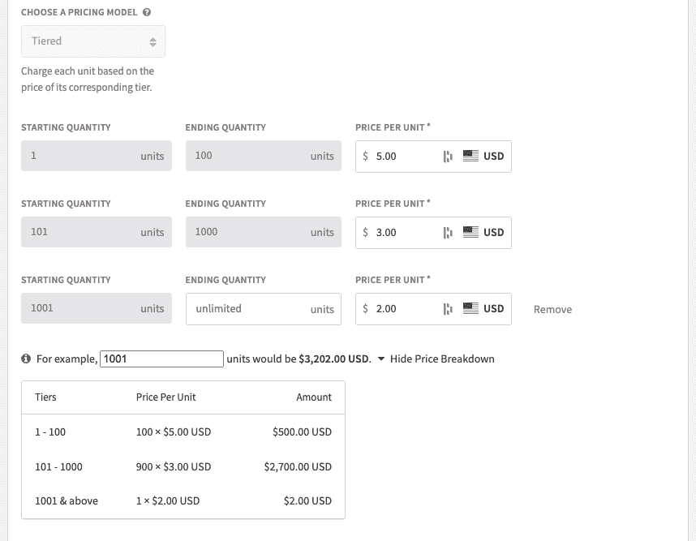
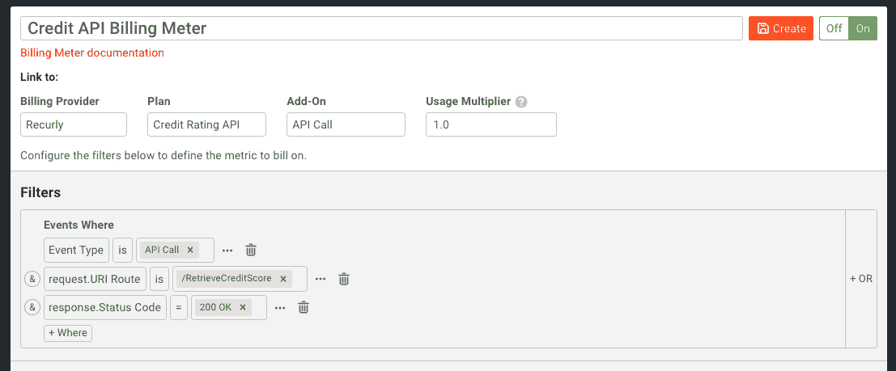

# 用 Moesif Plus Recurly 轻松赚钱

> 原文：<https://www.moesif.com/blog/developer-platforms/recurly/Easily-Monetize-Your-APIs-With-Moesif-Plus-Recurly/>

能造出赚钱的东西总是很棒的。最成功的企业通常会找到最简单、最有效的方法来赚钱，同时将成本和支持保持在最低水平。毕竟，最好的企业和产品就是那些知道如何创造收入的企业和产品。许多公司现在希望将他们的 API 货币化作为他们整体货币化战略的一部分。

然而，API 货币化并不总是容易的。它通常需要大量的集成、大量的代码和定制，还会导致巨大的支持负担。当出现账单问题时尤其如此。简而言之，无论是在实施过程中，还是在计费系统启动并运行后，都存在挑战。

如果有一种更简单的方法是可能的呢？在 Moesif，我们最近为**计费表**引入了一项功能。这是一种使用进入 Moesif 的数据来监控用户使用情况、将这些数据发送给计费提供商，并向用户提供准确账单的方法，所有这些工作只是实现定制解决方案所需工作的一小部分。

为了说明它是如何工作的，让我们假设我们有一个 API，我们希望对客户的使用进行收费。作为一个例子，让我们假设我们已经创建了一个新的信用评分 API，公司可以使用它将消费者的信用评级带回他们的应用程序。我们的 API 将是 **/RetrieveCreditScore** ，用户将为他们发送到端点的每个查询/调用付费。

我们的 API 货币化模型将非常简单。我们将有 3 个使用层级来决定向用户收取多少费用:

*   每月 1-100 次查询(每次查询 5 美元)
*   每月 101-1000 次查询(每次查询 3 美元)
*   每月 1001 次以上的查询(每次查询 2 美元)

这种分级定价模式很常见，使用的服务越多，折扣就越大。

[Recurly](https://recurly.com/) 将是我们用来为客户的使用开具发票和收费的计费提供商。Recurly 易于使用，将允许我们轻松地设置计划和附加组件，以遵守上述定价方案。

我们现在将使用 Moesif 来统计端点的使用情况，并将使用情况度量发送给 Recurly。Recurly 随后可以使用这些指标，根据指标对应的层级，向客户开出相应的账单，并收取费用。

## 将您的应用和 API 与 Moesif 集成

为了使用 Moesif 中的**计费表**特性，您需要将您的 API 与 Moesif 集成。这是因为 Moesif 将使用存储在其中的指标，然后递归地反馈它需要的信息。一旦您的 API 与 Moesif 集成，您还可以使用与我们的**计费表**功能配合良好的其他功能，包括[行为电子邮件](https://www.moesif.com/features/user-behavioral-emails?utm_campaign=Int-site&utm_source=blog&utm_medium=body-cta&utm_term=monetize-with-recurly)、[治理规则](https://www.moesif.com/features/api-governance-rules?utm_campaign=Int-site&utm_source=blog&utm_medium=body-cta&utm_term=monetize-with-recurly)和[警报](https://www.moesif.com/features/api-monitoring?utm_campaign=Int-site&utm_source=blog&utm_medium=body-cta&utm_term=monetize-with-recurly)。

如果您目前没有使用 Moesif 来监控您的 API，那么集成可以通过几种不同的方式来完成。如果您使用的是 API 网关或 API 管理平台，您可以使用我们众多插件中的一个，该插件允许您快速向 Moesif 提供分析。如果您不使用第三方网关或管理平台，或者想在 API 代码级别使用，您可以使用我们的 SDK 之一[。Moesif SDK 将允许您直接从代码中轻松地将 Moesif 与您的 Node、Python 或 Java APIs(加上许多、许多语言和框架)集成在一起。两种方式都很容易支持。](https://www.moesif.com/docs/server-integration/?utm_campaign=Int-site&utm_source=blog&utm_medium=body-cta&utm_term=monetize-with-recurly)

为了让计费正常工作，您需要部署的另一个 Moesif 特性是实现[用户和公司跟踪](https://www.moesif.com/docs/user-analytics/?utm_campaign=Int-site&utm_source=blog&utm_medium=body-cta&utm_term=monetize-with-recurly)。通常，这可以通过几个简单的步骤来设置。我们需要启用此功能，以便 Moesif 中的使用数据可以绑定到特定的用户和公司。这就是 Recurly 如何将使用情况映射到 Recurly 内部的客户，因此他们可以相应地被计费。

一旦您与 Moesif 集成，并启用了用户和客户跟踪，您的下一步将是在 Recurly 中实际创建您的计划，以便它们可以在 Moesif 中使用。

## 在递归中创建计划和附加组件

创建递归帐户并登录后，您可以开始创建您的计划。出于我们的目的，我们需要创建一个计划，其中包括使用分层定价的附加产品。

您需要在 Recurly 中创建一个后付费(在计费周期结束时收到的付款)的计划，价格是每单位。除此之外，对于我们的定价方案，我们将创建一个具有分层定价方案的附加组件。递归地看起来是这样的:

现在，在月末，当 Recurly 创建发票时，它将基于这些层来这样做。当然，在这一点上，我们只定义了计划，但没有人会被收费，因为我们还没有任何使用数据被发送到 Recurly。

% include cta_section.html 摘录= '轻松集成计量计费' image =img/posts/CTA/CTA-monitoring . SVG ' button _ text = '了解更多' URL = ' https://www . moes if . com/solutions/Metered-API-Billing？UTM _ campaign = Int-site & UTM _ source = blog & UTM _ medium = body-CTA & UTM _ term = money-with-recurly ' % }

## 与 Moesif 递归集成

我们仍然需要从 Moesif 到 Recurly 获取数据，反之亦然。有两种机制用于此:webhook 和 Recurly API。在促进平台之间的数据共享方面，两者各有不同的作用。

通过将 webhook 添加到 Recurly 中，订阅更新可以发送回 Moesif。通过使用 Recurly API，Moesif 可以向 Recurly 发送使用细节，还可以在 Recurly 中检索可用计划和附加组件的细节。这两个接触点是 Recurly 和 Moesif 集成所需要的。幸运的是，当您将 Recurly 设置为计费提供商时，Moesif 会带您完成这一步，并提供所有需要的详细信息。关于细节，你也可以查看我们关于递归集成的[文档。](https://www.moesif.com/docs/metered-billing/integrate-with-recurly/?utm_campaign=Int-site&utm_source=blog&utm_medium=body-cta&utm_term=monetize-with-recurly)

## 设置您的计费参数

一旦你递归地集成到 Moesif 中，你就可以设置你的计费表了。对于我们的例子，这将是非常简单的。我们要做的是，每当对 **/RetrieveCreditScore** 的 API 调用返回“200 OK”响应时，将使用度量发送给 Recurly。这意味着我们将只对成功的呼叫计费，而不会意外地对出现错误的呼叫计费。

一旦我们创建了计费表，每个小时每个客户的使用量将被发送到 Recurly。在月底，Recurly 将根据我们的分级价格结构创建发票，并向用户收费。

> 您还可以使用 Moesif 为每一次成功的通话自动发送行为电子邮件，即使他们即将进入下一个折扣级别。您还可以使用 Moesif 的治理规则来阻止发票过期的用户访问 API，直到他们的发票得到结算。

## 你自己试试吧

如您所见，离易于实现和支持的健壮 API 货币化只有几步之遥。通过一起使用 Moesif 和 Recurly，您可以在几分钟内向客户收取使用费，管理订阅，甚至可以使用 Moesif 的其他功能来创建最终的客户体验。我们的计费设置非常简单，甚至不需要任何开发人员的技能就可以完成。

所有 Moesif 用户均可使用**计费表**功能。[立即注册](https://www.moesif.com/signup?utm_campaign=Int-site&utm_source=blog&utm_medium=body-cta&utm_term=monetize-with-recurly)moes if，立即访问我们的**计费表**功能，开始为您客户的 API 使用计费。如果你已经在使用 Moesif，点击左侧导航菜单中的**计费表**并查看[我们的文档](https://www.moesif.com/docs/metered-billing/?utm_campaign=Int-site&utm_source=blog&utm_medium=body-cta&utm_term=monetize-with-recurly)以显示让你将 API 货币化的具体步骤。