# 利用 NodeJS、Stripe 和 Moesif 实现端到端 API 货币化

> 原文：<https://www.moesif.com/blog/api-monetization/stripe/End-To-End-API-Monetization-With-NodeJS-Stripe-And-Moesif/>

许多 API 开发者和公司都在努力寻找简单的方法来建立系统，以使他们的 API 货币化。有些很简单，但不可定制，有些很复杂，需要大量的工程工作才能真正运行起来。

为了让事情变得更简单，Moesif 几个月前创建了一个名为 Billing Meters 的功能，它提供了大量的可定制性，但只需要最少的代码和工程工作。

对于这个实际上可以开箱即用的例子，我们将使用 Moesif、NodeJS 和 Stripe 向用户收取 API 使用费。对于这种设置，有一些假设:

*   您的计算机上安装了 NodeJS
*   您有一个有效的 Stripe 帐户
*   您有一个有效的 Moesif 帐户

从外观上看，设置非常简单。我们将创建一个 **/register** 端点，它:

*   在条带中注册用户
*   为该用户订阅产品
*   在 Moesif 中注册用户和公司
*   创建一个 JWT 来认证/授权对我们货币化终端的呼叫

我还为它创建了一个小小的前端，它是一个简单的表单，通过调用 **/register** 端点来注册用户，然后为新注册的用户显示生成的 JWT。

## 1 -以条纹形式创建您的产品和价格

我们将采取的第一步是创建一个 Stripe 产品和价格。最好先完成这一步，因为当您将 Stripe 集成到 Moesif 中时，您已经有了一些 Moesif 的定价计划。然后，可以将定价计划与 Moesif 计费仪表中设置的特定计费标准相关联。

要创建产品和价格，请登录 Stripe 并进入 Stripe UI 中的**产品**页面。在那里，点击右上角的 **+添加产品**按钮。


然后，您可以添加产品的详细信息和价格。您产品的表单将有几个要填写的字段。

### 产品资料

#### 名字

*   这是您产品的名称。在下面的例子中，我们使用名称“我的 API”。

#### 描述

*   此字段是可选的，但您可以在此输入产品的简要描述。在下面的例子中，我们使用了“这是一个货币化的 API”的描述。

#### 图像

*   可以选择上传一张图片，帮助您轻松识别产品页面上的商品。在这个例子中，我们将使用默认的占位符图像。

### 定价信息

#### 定价模型

在 Stripe 中可以设置一些不同的定价模式。这些定价模型包括:

*   **标准定价**
    *   如果您希望对每个 API 调用收取相同的费用，请使用此选项。


*   **套餐定价**
    *   如果您按包或一组单位对 API 使用收费，请使用此选项。例如，您可以将其设置为每 1000 次 API 调用收取 10 美元。每当用户超过 1000 个 API 调用阈值时，他们就要再支付 10 美元。


*   **分级定价**
    *   使用分级定价层，这可能会导致订单中的某些产品价格不同。例如，您可能对前 100 个单位收取$10.00，然后对接下来的 50 个单位收取$5.00。如今，这仅适用于经常性价格。

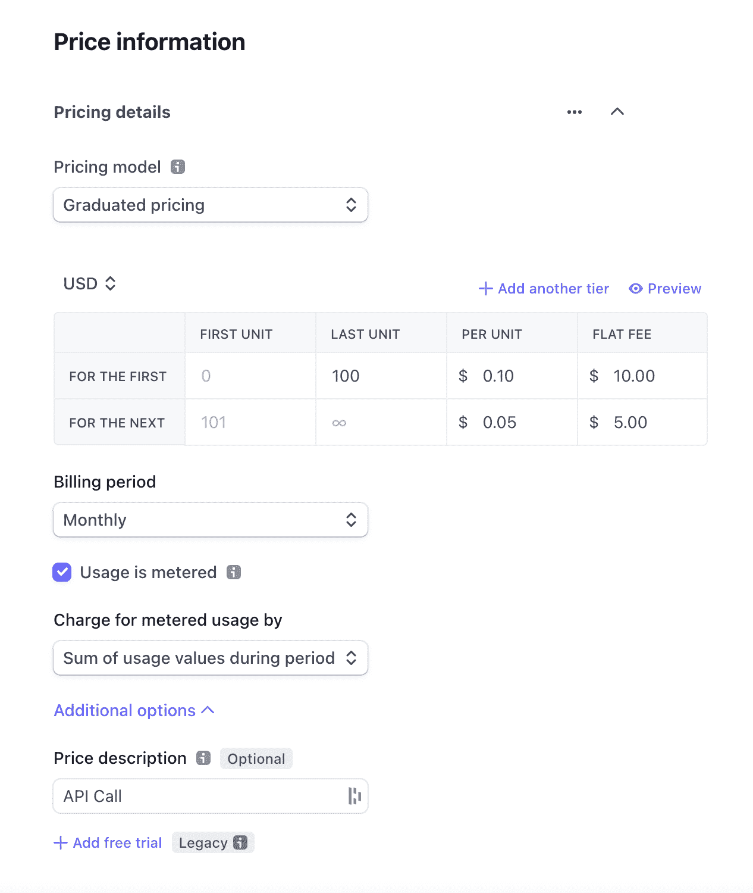

*   **批量定价**
    *   如果您根据售出的总数量对每个单位收取相同的价格，请使用。例如，50 个单位的单价为 10.00 美元，100 个单位的单价为 7.00 美元。

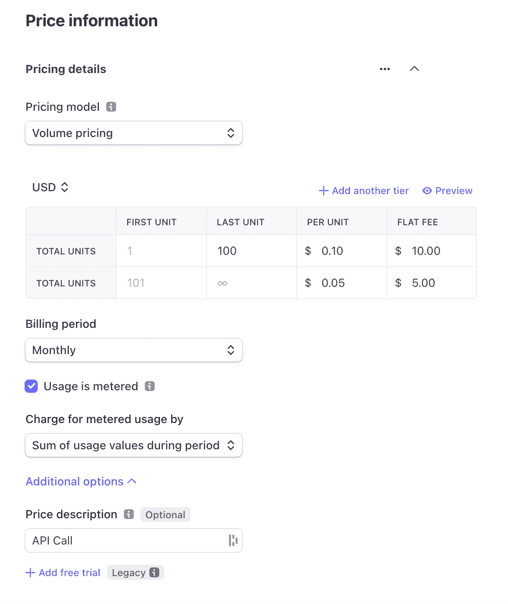

#### 价格

根据所选的定价模型，可以在此字段中设置价格。

#### 计费周期

计费周期可以设置为:

*   **每日**
*   **每周一次**
*   **每月**
*   **每 3 个月一次**
*   **每 6 个月一次**
*   **每年**
*   **客户**

对于您的 Moesif 配置，我们建议将计费周期设置为每月**月**。我们还建议，如果您正在使用 Moesif 的计费计量功能，请同时选中**用量被计量**框。

#### 按计量使用收费

一旦选择了**用量计量**复选框，将出现计量用量收费选项。此字段允许您选择计量使用的计算和收费方式。该字段的可用值为:

*   **期间使用值总和**
    *   在整个计费周期中，用户都要为其记录的使用付费
*   **期间的最近使用值**
    *   根据计费周期结束前记录的最后一次使用情况向用户收费
*   **最近使用值**
    *   在每个计费周期结束时，用户需要为在整个订阅周期中记录的最后一次使用付费
*   **期间最大使用值**
    *   用户按计费周期内记录的最高金额付费

> Moesif 计费仪表的最佳设置是将该值设置为时间段内使用值的总和，因为 Moesif 每小时向条带报告使用情况

#### 价格描述

这是一个可选字段，但建议填写。您可以在这里简单描述您的价格。这将使您更容易理解您在 Moesif 的计费表中选择的价格，尤其是在一种产品有多个价格的情况下。

输入产品和价格的所有详细信息后，您可以点击屏幕右上角的**保存产品**。


当您创建产品时，您将能够在**产品**屏幕上查看和编辑它们。

## 2 -启用 Moesif-条带集成

一旦你的产品和价格确定下来，是时候开始整合 Stripe 和 Moesif 了。要开始在 Moesif 中配置 Stripe，请转到**计费表**页面，并点击屏幕右上角的**编辑计费提供商**下拉菜单。


这将打开条带配置屏幕，引导您完成集成。在这个屏幕上，您可以获得将 Stripe 插入 Moesif 所需的所有信息。配置的每个步骤都包含在模式中。

### 将 Moesif webhook 添加到条带

集成的第一步是将 Moesif webhook 添加到 Stripe 的配置中。添加此功能允许 Stripe 向 Moesif 发送订阅更新。

要将 Moesif webhook 添加到 Stripe，从右上角点击**开发者**，然后在左侧菜单中点击 **Webhooks** 。这将把你带到**网页挂钩**页面，在那里你可以查看现有的网页挂钩并添加新的。要添加新的 webhook，我们将单击屏幕底部的**添加端点**按钮。


从这里，我们将插入我们的 Moesif API 端点 URL，并配置要监听的事件。您需要将 Moesif Webhook URL 复制到**端点 URL** 字段，然后点击 **+选择事件**按钮。


> 这些细节都可以在前面提到的 Moesif 中的条带配置页面上找到。

您应该选择**客户**下的选项进行**选择所有客户事件**。之后，点击屏幕底部的**添加事件**按钮。


此后，您将返回到添加端点详细信息的原始屏幕。滚动到屏幕底部，单击**添加端点**将端点保存到条带。


### 将条带 API 细节插入 Moesif

为了让 Moesif 向 Stripe 中的订阅添加使用量，我们需要向 Moesif 中添加 Stripe API 细节。这是在 Moesif 的条带配置屏幕中完成的，与我们之前使用的屏幕相同。


目前，Moesif 仅支持条带 API 的版本 **2020-08-27** ，因此字段默认为**条带 API 版本**字段。

对于 **Stripe API 密钥**字段，您需要从 Stripe 中检索 API 密钥以将其插入。从**开发者**界面，与我们在上一步中使用的界面相同，您将点击 **API 键**。然后，您将能够在屏幕上的**秘密密钥**或生成的**受限密钥**字段中看到您的 API 的私有密钥。两个键都可以用。


从 Stripe 复制密钥后，您将把这个密钥粘贴到 Moesif 中的 **Stripe API 密钥**字段。完成后，回到 Moesif，你可以向下滚动到屏幕底部，点击**保存**保存配置。


至此，Moesif 中的条带集成已经完成，您可以开始使用它了。

> 或者，您也可以在 Moesif 中定制**客户 ID 源**。默认设置将适用于本指南，不需要进行任何更改。如果您确实需要定制它，这些设置允许您指定如何将条带**订阅**和**客户**对象映射到 Moesif 中的**公司 ID** 和**用户 ID** 。

## 3 -创建计费计数器

一旦您在 Moesif 中激活了条带集成，您就可以开始设置您的计费表了。在 Moesif 中创建的计费表做两件事:根据特定的标准跟踪使用情况，并向计费提供者报告使用情况。Moesif 允许您相对容易地设置非常简单和非常复杂的计费表。

要创建计费表，在 Moesif 中，您将导航至**计费表**屏幕。您可以从左侧菜单中完成此操作。


在计费表屏幕上，点击屏幕右上角的 **+添加计费表**。


下一个屏幕是您可以实际输入计费表标准的地方。


该屏幕上的字段包括:

*   **计费电表名称**
    *   这是您的新计费仪表的 Moesif 内部名称
*   **账单提供商**
    *   在此下拉列表中，您可以选择要将您的使用指标发送给哪个计费提供商。
*   **产品(仅条纹)**
    *   在这里，您可以选择您在 Stripe 中设置的产品，您希望您的使用指标与该产品相关联。
*   **价格(仅条纹)**
    *   计费计数器的计费提供者设置中的最后一个字段，您可以在这里选择要将您的使用指标绑定到哪个价格。
*   **过滤器**
    *   在过滤器配置下，您将配置您的计费标准，以仅包括符合特定标准的请求。
*   **指标**
    *   在这里，您可以选择希望计费的指标。可用选项包括:
*   **事件计数**
    *   这将增加符合过滤标准中列出的标准的每个事件的使用量。
*   **唯一用户**
    *   每当唯一用户发送符合过滤标准的请求时，这将增加使用量。对于每个唯一用户，无论该用户的事件计数是多少，计数都将增加 1。
*   **独特的公司**
    *   每当一家独特的公司发送符合过滤标准的请求时，这将增加使用量。对于每个唯一的公司，无论该公司的事件计数如何，计数都将增加 1。
*   **唯一会话/API 密钥**
    *   每当使用唯一的会话或 API 键来发送符合过滤标准的请求时，这将增加使用量。对于每个唯一的会话或 API 键，无论该特定会话或 API 键的事件计数如何，计数都将增加 1。

> 指标下还有其他选项，但以上 4 个选项最适用于基于使用的计费。

例如，在本指南中，我们将创建一个计费计量器，用于过滤单个端点的流量，以及请求收到成功 HTTP 200 响应的位置。我们将使用**事件计数**指标来确保每个请求都被添加到计数中并被发送到计费提供者。

在 Moesif 中，计费表的配置如下所示。


然后，我们将单击**创建**。这将创建并激活**计费表**。然后，当您返回计费表仪表板时，您将看到新的计费表出现。

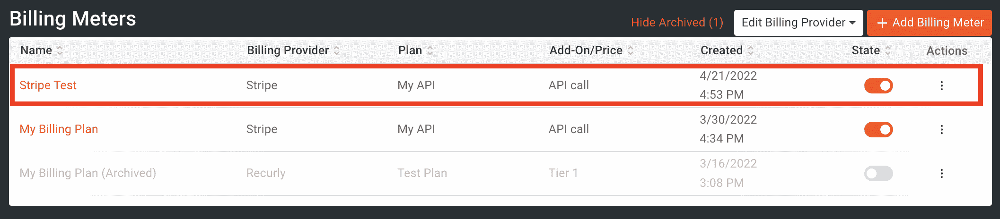

Moesif 现在将汇总使用情况，并将这些详细信息发送给 Stripe。现在计费表已经配置好了，我们将设置一个流程让用户注册、订阅并创建一个 JWT，这样他们就可以使用我们的货币化 API。

## 4 -创建/register 端点

我们将构建自己的流程，而不是使用预先构建的入职流程，例如通过 API 网关中的开发人员门户。我们将创建一个名为 **/register** 的端点，然后我们可以用它来装载想要使用 API 的用户。结果将是用户收到一个他们可以使用的 JWT，它将跟踪他们的使用情况。

由于我们使用 Moesif、Stripe 和 NodeJS 作为我们整体解决方案的一部分，我们需要确保每个组件都能正常工作。

端点将执行以下操作:

*   创建带条纹的客户
*   为新客户订阅条带中的 API 订阅
*   在 Moesif 中创建 CompanyID(这将是条带订阅 ID)
*   在 Moesif 中创建 UserID(这将是 Stripe 客户 ID)
*   创建一个带有包含条带客户 ID 的`id`字段的 JWT

> 如果您在 Moesif 和其他系统中已经有了您想要使用的用户和公司标识符，而不是使用 Stripe 的客户和订阅作为您的 id，您可以在 Moesif 中的 Stripe 配置设置下这样做。

在本例中，我将使用 Express 创建一个简单的 NodeJS API 来完成上述任务。

### 创建国家预防机制项目

首先，我们将创建一个名为 moesif-monetization 的文件夹，我们将在其中添加 API 代码。然后我们将运行`npm init`来转变 moesif 货币化，这样我们就可以在我们的项目中使用 npm。为此，您将在 moesif-monetary 目录中运行以下命令。

```py
npm init 
```

> 创建 npm 项目时，您可以根据需要填写详细信息或使用默认值。

然后，您应该会在 moesif-monetary 文件夹中看到一个 package.json 文件。

现在，在您喜欢的 IDE 或文本编辑器中打开这个目录。在本教程的剩余部分，我将使用 VS 代码进行所有的编码。

### 添加项目依赖项

现在，我们将使用正确的依赖项编辑 package.json 文件。在 package.json 中，我们将在 dependencies 对象下添加以下条目。

```py
 "dependencies": {
   "@stripe/stripe-js": "^1.29.0",
   "body-parser": "^1.20.0",
   "cors": "^2.8.5",
   "dotenv": "^16.0.0",
   "express": "^4.17.1",
   "express-jwt": "^5.3.1",
   "http": "0.0.1-security",
   "jsonwebtoken": "^8.5.1",
   "moesif-nodejs": "^3.1.14",
   "path": "^0.12.7",
   "stripe": "^8.219.0"
 } 
```

保存文件，然后导航到终端并运行:

`npm install`

现在，您的依赖项将被引入到项目中，并添加到 node_modules 文件夹中。这些依赖项将帮助我们调用 REST 端点，连接到 Stripe 和 Moesif，生成和验证 jwt，以及我们将构建到应用程序中的各种其他功能。

### 创建。环境文件

我们不会将条带键和其他静态值硬编码到我们的应用程序中，而是将它们抽象到一个. env 文件中。我们可以使用添加到名为 **dotenv** 的 **package.json** 中的依赖项来实现这一点。

在根目录下，创建一个名为**的文件。env** 。在这个文件中，我们将添加几个条目，其中包含代码中使用的键和值。

```py
STRIPE_KEY="sk_test_XXX"
STRIPE_PRICE_KEY="price_XXX"
MOESIF_APPLICATION_ID="YOUR_MOESIF_APP__ID"
TOKEN_SECRET="YOUR_TOKEN_SECRET” 
```

这里的值可以在以下位置找到:

`STRIPE_KEY` *这可以在我们之前为计费表获取条带和 Moesif 集成密钥的相同位置找到。实际上，您可以为两者使用同一个键，或者创建一个**受限键**，其范围正好是每个功能所需的范围。*

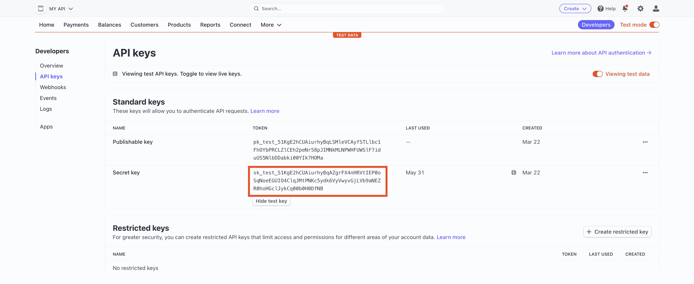

`STRIPE_PRICE_KEY` *这将是您之前在 Stripe 中创建的**价格**的价格键。这可以通过转到条带中的产品并从 **API ID** 列中获取值来找到。*


`MOESIF_APPLICATION_ID` *这可以在 Moesif 中找到，方法是转到屏幕左下方的菜单链接(会显示你的名字)并选择 **API 键**。*


*该密钥将出现在**采集器应用 Id** 下的页面上。*


这将是用于生成和验证 jwt 的一部分的秘密。这可以是您喜欢的任何字符串，但是，出于生产目的，您最好使用 NodeJS **Crypto** 库来生成这个字符串。

用四个键值对填充文件后，保存文件。在本教程的剩余部分，我们不需要再接触这个文件。

### 创建 app.js 文件

在我们的应用程序的根目录中，我们将创建一个 **app.js** 文件(如果还没有创建的话)。在这个文件中，我们将添加下面的代码来添加我们的依赖项并创建一个基本的 REST 端点。

```py
require('dotenv').config();
const express = require('express');
const path = require("path");
const bodyParser = require('body-parser');
const moesif = require('moesif-nodejs');
const Stripe = require('stripe');
// npm install express-jwt@5.3.1
const ejwt = require('express-jwt');
// npm install jsonwebtoken
const jwt = require('jsonwebtoken');

const app = express();
app.use(express.static(path.join(__dirname)));
const port = 3000;

const stripe = Stripe(process.env.STRIPE_KEY);
var jsonParser = bodyParser.json();

const moesifMiddleware = moesif({
 applicationId: process.env.MOESIF_APPLICATION_ID,
 identifyUser: function (req, _res) {
   return req.user ? req.user.id : undefined;
 },
});

app.use(moesifMiddleware);

app.post('/register', jsonParser,
 async (req, res) => {
 }
)

app.get('/test-service/',
  ejwt({ secret: process.env.TOKEN_SECRET, algorithms: ["HS256"] }),
  (_req, res) => {
    res.status(200)
    res.send('this is a response');
  }
)
app.listen(port, () => {
 console.log(`Example app listening at http://localhost:${port}`);
}) 
```

在上面的代码中，我们是:

*   导入一些依赖项
*   配置条带依赖关系
*   配置 Moesif 中间件，包括实现 **identifyUser** 函数，从 JWT 中提取`id`字段，以便在 Moesif 中进行用户跟踪
*   创建**/寄存器**端点(还没有任何逻辑)
*   创建一个简单的**/测试服务**端点(这将是我们的货币化 API)
*   将我们的应用程序设置为在端口 3000 上运行，并启动我们的节点应用程序

> 你会注意到我们有 **process.env.STRIPE_KEY** 、**process . env . moes if _ APPLICATION _ ID**和 **process.env.TOKEN_SECRET** 。这些值将来自。我们在最后一步中创建的 env 文件。

**/测试服务**端点使用 **express-jwt** 依赖来验证附加到请求的 jwt。如果你不熟悉 **express-jwt** 的工作方式，可以查看他们的 [github](https://github.com/auth0/express-jwt) 来找到更多信息。

### 实现/register 终结点

我们的下一步是实现 **/register** 端点。这个端点将在我们生成的 JWT、条带和 Moesif 之间创建绑定。结果将是一个生成的 JWT，它将使用情况与 Moesif 中的用户相关联，然后报告给 Stripe。

我们流程中的第一步是创建 Stripe 中的客户。我们将使用我们的 Stripe JS 依赖来做到这一点。我们将使用请求正文中的参数(电子邮件、名字、姓氏)通过使用 **stripe.customers.create** 函数在 Stripe 中创建客户。然后，我们将把创建的客户存储在一个自定义变量中，这样我们就可以访问 Stripe 中生成的**客户 ID** 。

```py
const customer = await stripe.customers.create({
     email: req.body.email,
     name: `${req.body.firstname}  ${req.body.lastname}`,
     description: 'Customer created through /register endpoint',
   }); 
```

接下来，我们将为这个新用户订阅我们之前在 Stripe 中创建的 API 订阅。我们将使用**stripe . subscriptions . create**函数，并使用从之前的函数调用中生成的**客户 ID** 来订阅它们。这将返回一个**订阅**对象，其中包含一个我们稍后会用到的 ID。

```py
 const subscription = await stripe.subscriptions.create({
     customer: customer.id,
     items: [
       { price: process.env.STRIPE_PRICE_KEY },
     ],
   }); 
```

在 Stripe 中创建了我们的客户和订阅之后，我们将使用 Moesif 中间件来创建用户，并将他们的相关详细信息添加到 Moesif 中。首先，我们将调用 Moesif 中间件的 **updateCompany** 函数，将条带 **subscription.id** 映射到 Moesif 中的 **companyId** 。

```py
 var company = { companyId: subscription.id };
   moesifMiddleware.updateCompany(company); 
```

然后，我们将对 **updateUser** 函数执行类似的步骤，并使用它将条带 **customer.id** 映射到 **userId** ，将条带 **subscription.id** 映射到 **companyId** ，并将我们收集的关于用户的一些其他元数据映射到 Moesif。

```py
 var user = {
     userId: customer.id,
     companyId: subscription.id,
     metadata: {
       email: req.body.email,
       firstName: req.body.firstname,
       lastName: req.body.lastname,
     }
   };
   moesifMiddleware.updateUser(user); 
```

我们的下一步是生成附加了 Stripe 客户 ID 的 JWT。为此，首先，我们将创建一个从 jsonwebtoken 依赖项调用 jwt.sign 函数的函数。这个名为 **generateAccessToken** 的方法将创建一个 JWT 供我们与端点一起使用。

```py
const generateAccessToken = async (id) => {
 const token = await jwt.sign(id, process.env.TOKEN_SECRET);
 console.log(token);
 return token;
} 
```

在我们的/register 端点中，我们将调用我们的 **generateAccessToken** 函数，并传递 Stripe 客户 ID 以将其注入 JWT。我们将在将用户和公司添加到 Moesif 的最后一段代码的下面执行此操作。

```py
const token = await generateAccessToken({ id: customer.id }); 
```

可选地，一旦创建了 JWT，我们将把它添加到我们的 Moesif 用户元数据中，以便于使用。不建议在生产环境中使用这种方法，但在测试您的设置时会有所帮助，如果您丢失了之前生成的 JWT，可以不生成新的。

```py
var user = {
     userId: customer.id,
     metadata: {
       jwt: token,
     }
   };
   moesifMiddleware.updateUser(user); 
```

最后，我们将向调用者返回一个 **200 OK** 响应，在响应体中包含 JWT。

```py
 res.status(200)
   res.send({ jwt: token }); 
```

完整的端到端功能如下所示:

```py
const generateAccessToken = async (id) => {
  const token = await jwt.sign(id, process.env.TOKEN_SECRET);
  console.log(token);
  return token;
}

app.post('/register',
 jsonParser,
 async (req, res) => {
   // create Stripe customer
   const customer = await stripe.customers.create({
     email: req.body.email,
     name: `${req.body.firstname}  ${req.body.lastname}`,
     description: 'Customer created through /register endpoint',
   });

   // create Stripe subscription
   const subscription = await stripe.subscriptions.create({
     customer: customer.id,
     items: [
       { price: process.env.STRIPE_PRICE_KEY },
     ],
   });

   // create user and company in Moesif
   var company = { companyId: subscription.id };
   moesifMiddleware.updateCompany(company);

   var user = {
     userId: customer.id,
     companyId: subscription.id,
     metadata: {
       email: req.body.email,
       firstName: req.body.firstname,
       lastName: req.body.lastname,
     }
   };
   moesifMiddleware.updateUser(user);

   // generate new jwt for user
   const token = await generateAccessToken({ id: customer.id });

   // [optional] update user profile with jwt
   var user = {
     userId: customer.id,
     metadata: {
       jwt: token,
     }
   };
   moesifMiddleware.updateUser(user);

   res.status(200)
   res.send({ jwt: token });
 }
) 
```

有了这些，我们现在可以实际测试我们的端点，以确保每一部分都按预期工作。结果应该是一个注册用户与相关的 JWT，将记录和报告使用数据到条纹。让我们继续测试它。

## 5 -向/register 端点发送测试请求

一旦您的 **/register** 端点被编码和部署，就该测试它了。现在我们将简单地使用 Postman 来发送请求。我们的请求将包含一个 JSON 请求体，该请求体将包含:

*   西方人名的第一个字
*   姓
*   电子邮件

当然，这是我们在 Stripe 和 Moesif 中配置我们的系统和配置文件以及生成 JWT 所需的最少信息。您可以根据特定用例的需要轻松添加更多字段。

在 Postman 中，我们将使用以下信息创建我们的请求:

**请求类型:** `POST`

**端点 URL:** `http://localhost:3000/register`

**请求正文:**

```py
{
   "firstname": "Userfirstname",
   "lastname": "Userlastname",
   "email": "test@test.com"
} 
```

一旦所有东西都插入到 Postman 中，它应该看起来像下面这样:

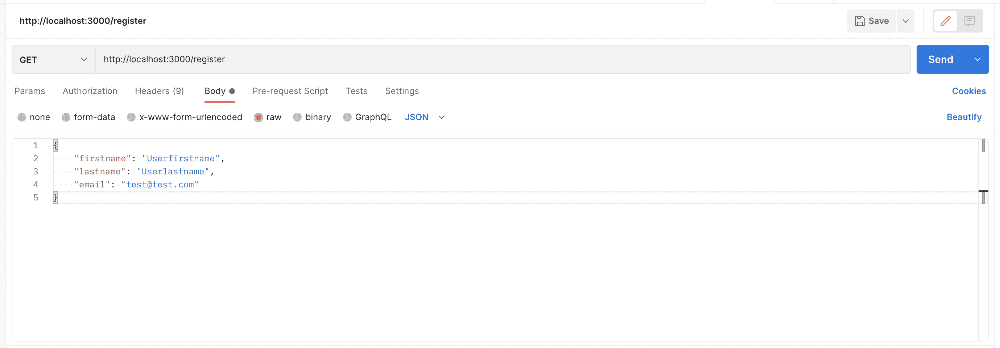

发送请求后，响应应该包含新注册用户可以使用的 JWT。

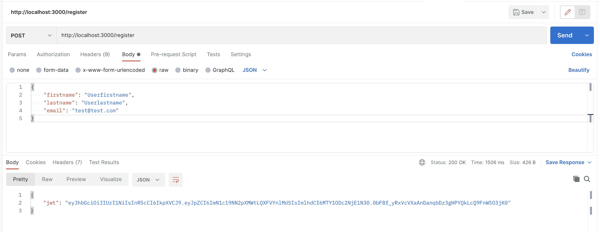

我们现在将检查 Stripe，以确保我们向客户注册的信息正确输入到 Stripe 中。

重新登录 Stripe，您将导航至**客户**屏幕。您应该会在列表中看到新创建的用户。


单击列表中新添加的客户。在下一个屏幕上，您应该看到该客户也订阅了您的 API 订阅。


检查完成后，我们可以放心地假设我们的 **/register** 端点正在 Stripe 中正确地设置我们的用户帐户和订阅。

## 6 -使用生成的 JWT 调用您的 API

我们的下一步是实际使用我们生成的 JWT。然后，我们将确认所有正确的信息都已添加到 Moesif 中。我们正在确认的数据包括:

*   条带客户 ID 映射到 Moesif 用户 ID
*   条带订阅 ID 映射到 Moesif 公司 ID
*   Moesif 包含用户配置文件中的条带元数据

### 使用邮递员发送请求

接下来，让我们使用 Postman 或另一个平台向 **/test-service** 端点发送一个请求。这是我们在上面的步骤 3 中为其设置计费计量器的端点。

在《邮差》中，我们将:

*   将**/测试服务** API 端点作为请求 URL
*   选择授权选项卡
*   选择类型作为不记名令牌
*   填充令牌详细信息
*   将令牌设置为从我们的/register 调用收到的 JWT

下面是 Postman 中填充请求配置的一个示例。

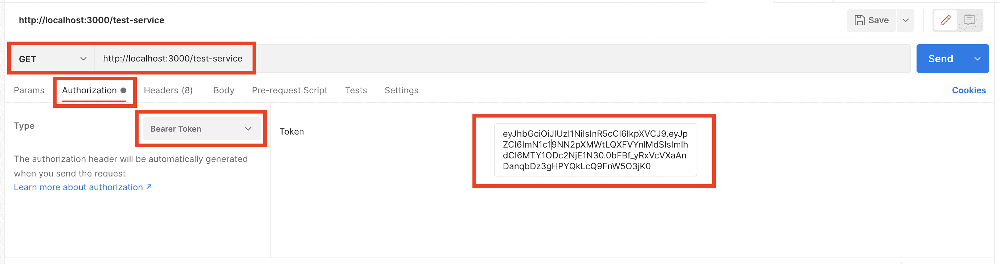

要将请求发送到我们的端点，请单击 send。

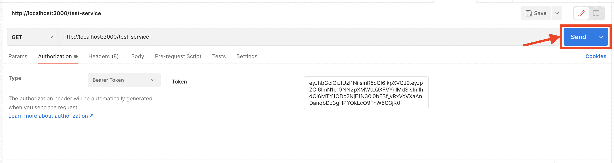

一旦发送，API 调用分析应该在 Moesif 着陆。

### 确认 Moesif 收到了请求信息

回到 Moesif，您将导航到**实时事件日志**屏幕。您可以通过点击**新建**按钮并选择**实时事件日志**来完成此操作。

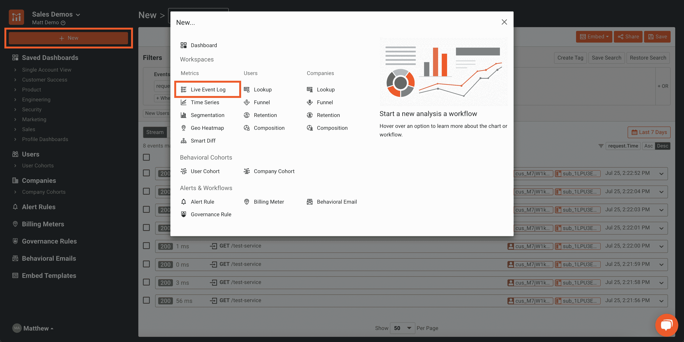

在这个屏幕上，您应该会看到您刚刚发送的请求。您应该会看到该条目包含一个用户 ID 和一个公司 ID，其中填充了 Stripe 用户和订阅 ID。条目应该如下所示:

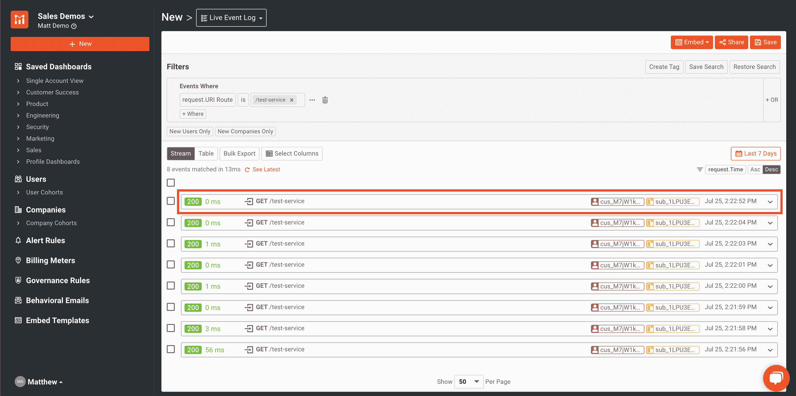

> 客户 ID 看起来像“库斯 _XXXX ”,订阅 ID 看起来像“sub_XXXX”。

如果您单击实时事件日志屏幕上条目中显示的用户 ID，您将进入用户资料页面。在此页面上，我们将确认条带元数据是否存在。我们需要在配置文件中添加一个新列来显示条带数据。为此，在个人资料页面，点击 **…更多操作**按钮，然后点击**自定义个人资料的布局**。


然后，我们将为条带元数据添加一个新列。您将单击屏幕最右侧的 **+** 按钮来创建一个新列，我们将在其中添加条带元数据。


> 您可能需要向右滚动才能看到它，这取决于您的分辨率和屏幕大小，以便看到+按钮。

然后，您将深入到**元数据>条带>客户>创建**，并在新行中使用该字段。我还改变了一个更适合的列图像。您可以通过点击图片并选择最合适的图片进行定制。


您还可以添加其他字段，但是目前仅这一个字段就足以告诉我们 Moesif 正在正确地从 Stripe 接收数据。

> 如果您没有看到条带元数据条目作为可用字段，请等待几分钟。如果几分钟后条带元数据不存在，请确保 Moesif 中的条带配置是正确的。在确认或编辑它之后，尝试创建一个新用户并再次发送请求以确认集成正在工作。

在这一点上，我们现在已经确认我们的 API 调用正在工作，并且在 Moesif 中使用了正确的用户和公司详细信息。我们还确认了 Stripe 正在将数据发送回 Moesif，这些数据被正确地映射到相应的用户配置文件，这是通过 Moesif 中的 Stripe 元数据确认的。

## 7 -创建前端

接下来，我们想添加一个简单的小前端，这样我们就不需要通过邮递员调用我们的 JWT。我们将制作一个快速的小注册表单，然后返回一个 JWT 供我们新注册的用户使用。

### 将您的前端文件添加到应用程序

在应用程序的根目录中，我们将添加两个文件。我们将添加一个**index.html**和一个**索引. js** 。


### 添加您的路由以提供静态 html 文件

在 **app.js** 文件中，我们将添加一个路由来服务静态 HTML 文件。在我们的 **/register** 端点代码下面，我们将添加另一个端点。添加以下代码:

```py
app.get("/", function (_req, res) {
 res.sendFile(path.join(__dirname, "index.html"));
 res.sendFile(path.join(__dirname, "index.js"));
}); 
```

现在，当您导航到 [http://localhost:3000/](http://localhost:3000) 时，这段代码将加载网站(一旦我们插入了代码)。

### 编写前端表单和逻辑

最后，让我们添加前端 HTML 和 JavaScript 功能的代码。在 index.html 文件中，我们将添加如下所示的标记:

```py
<!DOCTYPE html>
<html lang="en">
 <head>
   <meta charset="utf-8" />
   <meta name="viewport" content="width=device-width, initial-scale=1" />
   <meta name="theme-color" content="#000000" />
   <meta
     name="description"
     content="Moesif Embedded Dashboard example"
   />
   <title>None React App Example</title>
 </head>
 <body>
   <noscript>You need to enable JavaScript to run this app.</noscript>
   <h1>
     Moesif Monetization Example
   </h1>
   <div id="form-input">
     email: <input id="email-input" placeholder="email" />
     first name: <input id="firstname-input" placeholder="first name" />
     last name: <input id="lastname-input" placeholder="last name" />
     <button onClick="submitRegistration()">Register</button>
   </div>
   <div id="apikey-output"></div>
   <p id="error-message"></p>
   <script src="index.js"></script>
 </body>
</html> 
```

这个标记将显示一个允许用户输入电子邮件、名字和姓氏的表单。它还有一个 Register 按钮，该按钮将为 **submitRegistration()** 调用 JavaScript 函数。该函数将在我们的 **index.js** JavaScript 文件中。

**index.js** 文件将如下所示:

```py
async function submitRegistration() {
   const email = document.getElementById("email-input").value;
   const firstname = document.getElementById("firstname-input").value;
   const lastname = document.getElementById("lastname-input").value;
   const errorElement = document.getElementById("error-message");
   const apikey = document.getElementById("apikey-output");

   var body = { email, firstname, lastname };
   console.log(body);
   var response = await fetch('http://localhost:3000/register', {
     method: 'post',
     body: JSON.stringify(body),
     headers: {'Content-Type': 'application/json'}
   });
   var data = await response.json();
   console.log(data);

   apikey.innerHTML = data.apikey;
 } 
```

该函数将从表单中获取输入，将其发送到我们的 **/register** 端点，并在屏幕上显示返回的 JWT。

## 8 -测试前端

要测试前端，保存您的代码更改并重启服务器。然后，在浏览器中，导航到 [http://localhost:3000/](http://localhost:3000/) 。然后，您将看到表单出现。


### 填写表单字段并提交

现在表单已经加载到屏幕上，请填写字段并单击 Register 按钮。这将获取信息，将其发送到我们的 **/register** 端点，并给我们生成的 JWT。

> 建议您使用一个不同的电子邮件，而不是之前通过 **/register** 端点直接创建 JWT 时使用的电子邮件。

### 确认 JWT 回来了

单击提交按钮后，几秒钟后，JWT 应该会返回到 UI。

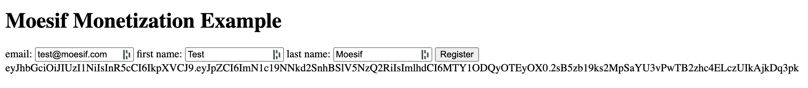

## 9 -向您的货币化 API 发送请求

我们将再次希望确保所有东西都与我们的 UI 一起工作，直到我们的后端系统。为此，只需重复从**步骤 6** 开始的步骤，以确认用户和公司 id 已正确填充，并且为该用户和新 JWT 返回了条带元数据。

## 10 -确认所有部件工作正常

尽管这是可选的，但这一步可能有助于解决我们之前步骤中可能出现的任何问题。这里有几件事需要检查，以确保一切正常。通过 UI 创建新用户并使用生成的 JWT 调用 API 后，请确认以下内容:

### 成条纹状

*   确认已经使用您在 UI 中输入的详细信息在 Stripe 中创建了一个客户
*   确认客户订购了正确的产品和价格

### 在默西迪斯

*   您的 API 调用被记录在 Moesif 的实时事件日志中
*   您的 API 调用在 Moesif 的用户和公司字段中分别有 Stripe 客户 ID 和订阅 ID。
*   确认在 Moesif 中填充了条带元数据

## 11 -检查条带的使用情况

最后，几个小时后，最好进入 Stripe，确认使用情况是否被添加到用户订阅中。确保您已经发送了几个请求，以确保您有一些应该发送到条带的数据。

> 从 Moesif 到条带化可能需要几个小时。如果几个小时后 Moesif 中仍然没有数据，请确保您遵循了本指南中概述的所有步骤。这包括确保来自 Moesif 的用户和公司 ID 正确地映射到 Stripe 中相应的密钥。

要检查使用情况，在 Stripe 中，您需要导航到**客户**屏幕，并选择与您进行 API 调用的客户。一旦选中，您应该会看到您通过 **/register** 端点注册的用户的一些活动订阅。我们之前创建的那个叫做**我的 API** 。单击订阅条目。


在下一个屏幕上，点击价格条目旁边的**查看用法**。


现在应该会弹出一个模型，向您显示已经从 Moesif 中剥离的 API 的用法。


> 请记住，Moesif 向 Stripe 报告时会有延迟。如果您的数据还没有，请稍后再回来查看。

## 包扎

货币化一直是一个难以逾越的障碍。许多定制解决方案提供了灵活性，但工程和支持成本非常高。有了 Moesif，API 货币化就有可能在极短的时间内实现。正如本文所展示的，通过一点点配置和最少的代码，我们可以在最短的时间内创建一个生产就绪的后付费货币化方案。