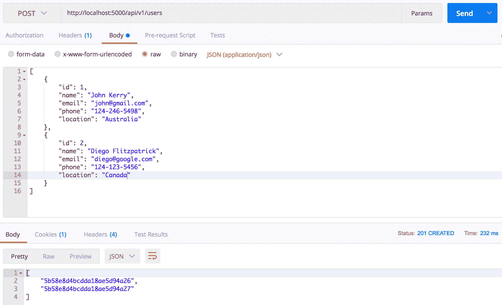
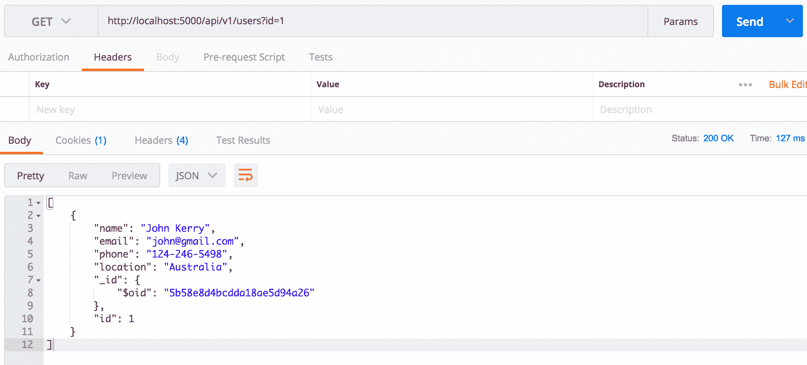
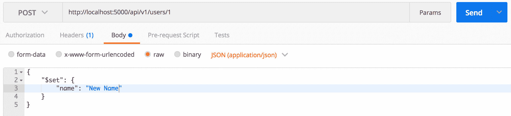
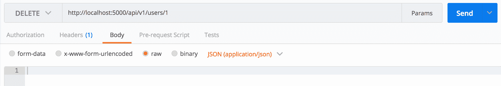
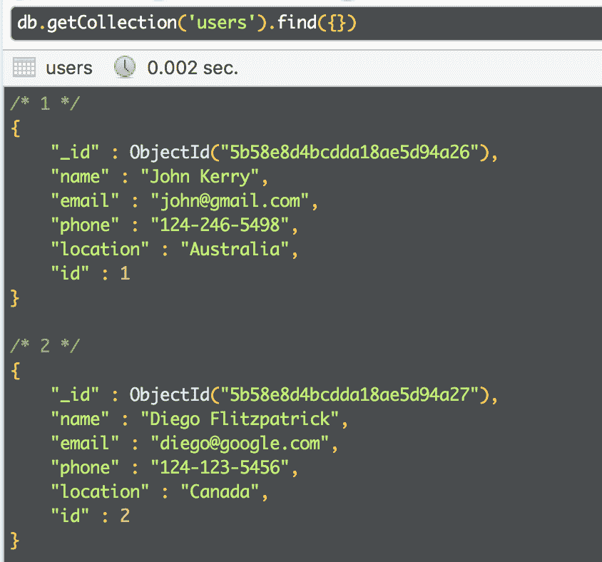

# 使用 Python、Flask 和 MongoDB 创建 RESTful API 指南

> 原文：<https://www.moesif.com/blog/technical/restful/Guide-to-Creating-RESTful-APIs-using-Python-Flask-and-MongoDB/>

## RESTful APIs 简介

在 HTTP 协议上使用 JSON 的 RESTful APIs 是目前最流行的创建 web APIs 的方法。它们使开发人员能够从资源的角度考虑对这些资源的操作，如 CRUD(创建、读取、更新、删除)。然而，还有一些即将出现的 API，比如越来越受许多应用程序欢迎的 GraphQL。

在本教程中，我们将使用 Python 和 Flask 框架构建一个 RESTful API 来创建、读取、更新和删除 Mongo 数据库中的文档(包含用户信息)。

## 入门指南

以下是我们构建 API 所需的工具:

*   Python 3.7
*   邮递员[下载这里](https://www.getpostman.com/)
*   Mongo 数据库[文档](https://docs.mongodb.com/manual/)
*   Robo 3T [下载此处](https://robomongo.org/download)

### 创建您的本地环境

注意:在使用 Python 时，我们建议使用虚拟环境来保持项目的所有依赖项与其他项目的隔离。

```py
conda create -n restfulapi python=3.7 anaconda # Create the environment
source activate restfulapi # Activate the environment 
```

### 安装依赖项

```py
pip install -r requirements.txt 
```

### 启动 MongoDB 服务器

如果您使用的是 MacOS，您可以使用`brew`来启动服务器。

```py
brew services start mongodb 
```

### MongoDB 中的收藏

> 集合类似于传统关系数据库中的表。我们将创建一个*用户*集合来存储用户详细信息，类似于 SQL 中的*用户*表。

### 创建用户

我们将创建一个端点`POST /api/v1/users`，它接收一个 JSON 对象，该对象由用户详细信息组成，如`name`、`email`、`phone`作为请求体中的 JSON。我们还可以设计端点来接受一组用户。

```py
@app.route("/api/v1/users", methods=['POST'])
def create_user():
    """
       Function to create new users.
       """
    try:
        # Create new users
        try:
            body = ast.literal_eval(json.dumps(request.get_json()))
        except:
            # Bad request as request body is not available
            # Add message for debugging purpose
            return "", 400

        record_created = collection.insert(body)

        # Prepare the response
        if isinstance(record_created, list):
            # Return list of Id of the newly created item
            return jsonify([str(v) for v in record_created]), 201
        else:
            # Return Id of the newly created item
            return jsonify(str(record_created)), 201
    except:
        # Error while trying to create the resource
        # Add message for debugging purpose
        return "", 500 
```



单个用户返回实体 id，因此前端可以引用新创建的项目。另一方面，用户数组返回实体 id 数组。

### 读取用户

为了获取我们刚刚创建的用户列表，我们将设计一个端点`GET /api/v1/users`并将搜索标准作为查询字符串参数传递。

```py
@app.route("/api/v1/users", methods=['GET'])
def fetch_users():
    """
       Function to fetch the users.
       """
    try:
        # Call the function to get the query params
        query_params = helper_module.parse_query_params(request.query_string)
        # Check if dictionary is not empty
        if query_params:

            # Try to convert the value to int
            query = {k: int(v) if isinstance(v, str) and v.isdigit() else v for k, v in query_params.items()}

            # Fetch all the record(s)
            records_fetched = collection.find(query)

            # Check if the records are found
            if records_fetched.count() > 0:
                # Prepare the response
                return dumps(records_fetched)
            else:
                # No records are found
                return "", 404

        # If dictionary is empty
        else:
            # Return all the records as query string parameters are not available
            if collection.find().count() > 0:
                # Prepare response if the users are found
                return dumps(collection.find())
            else:
                # Return empty array if no users are found
                return jsonify([])
    except:
        # Error while trying to fetch the resource
        # Add message for debugging purpose
        return "", 500 
```

如果提供了搜索条件，我们将返回用户详细信息，否则我们将尝试返回所有文档(如果存在),否则我们将返回一个空数组。



### 更新用户

现在，我们将设计一个端点`POST /api/v1/users/<user_id>`来更新用户详细信息。

```py
@app.route("/api/v1/users/<user_id>", methods=['POST'])
def update_user(user_id):
    """
       Function to update the user.
       """
    try:
        # Get the value which needs to be updated
        try:
            body = ast.literal_eval(json.dumps(request.get_json()))
        except:
            # Bad request as the request body is not available
            # Add message for debugging purpose
            return "", 400

        # Updating the user
        records_updated = collection.update_one({"id": int(user_id)}, body)

        # Check if resource is updated
        if records_updated.modified_count > 0:
            # Prepare the response as resource is updated successfully
            return "", 200
        else:
            # Bad request as the resource is not available to update
            # Add message for debugging purpose
            return "", 404
    except:
        # Error while trying to update the resource
        # Add message for debugging purpose
        return "", 500 
```

例如，我们想用匹配的`1`来更新文档。



### 删除用户

最后，我们将设计一个端点`DELETE /api/v1/users/<user_id>`来从数据库中删除用户。

```py
@app.route("/api/v1/users/<user_id>", methods=['DELETE'])
def remove_user(user_id):
    """
       Function to remove the user.
       """
    try:
        # Delete the user
        delete_user = collection.delete_one({"id": int(user_id)})

        if delete_user.deleted_count > 0 :
            # Prepare the response
            return "", 204
        else:
            # Resource Not found
            return "", 404
    except:
        # Error while trying to delete the resource
        # Add message for debugging purpose
        return "", 500 
```

我们将指定删除文档的匹配条件。例如，我们想要删除具有`id`匹配`1`的文档



## 处理找不到页面的请求

我们建议用给用户的信息性消息来处理找不到页面的请求。

```py
@app.errorhandler(404)
def page_not_found(e):
    """Send message to the user with notFound 404 status."""
    # Message to the user
    message = {
        "err":
            {
                "msg": "This route is currently not supported. Please refer API documentation."
            }
    }
    # Making the message looks good
    resp = jsonify(message)
    # Sending OK response
    resp.status_code = 404
    # Returning the object
    return resp 
```

如果您想摆弄数据，也可以使用 Robo 3T mongo shell。



要查看 RESTful API 的运行情况，您可以从 [GitHub](https://github.com/Moesif/moesif-flask-mongo-example) 中克隆并运行这个示例应用程序

在下一篇博客中，我们将学习如何授权和认证我们的 API。如果你对使用 Python 开始使用 GraphQL 感到好奇，请参考这个[博客](/blog/technical/graphql/Getting-Started-with-Python-GraphQL-Part1/)。同时，如果您有任何问题，请联系 [Moesif 团队](mailto:team@moesif.com)

Moesif 是最先进的 API 分析平台。成千上万的平台公司利用 Moesif 进行调试、监控和发现见解。

[了解更多](https://www.moesif.com?utm_source=blog)