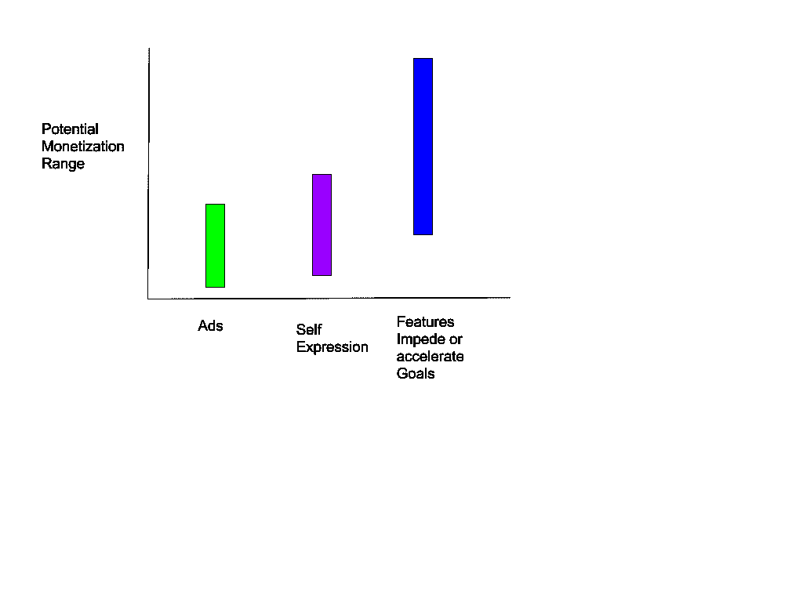
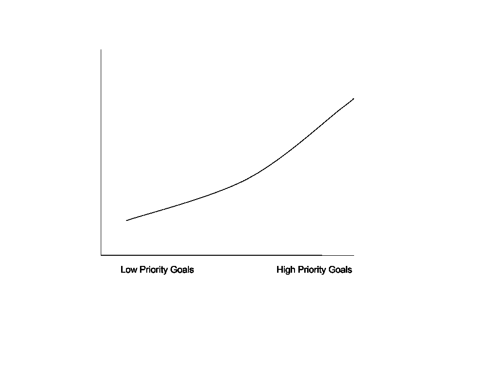
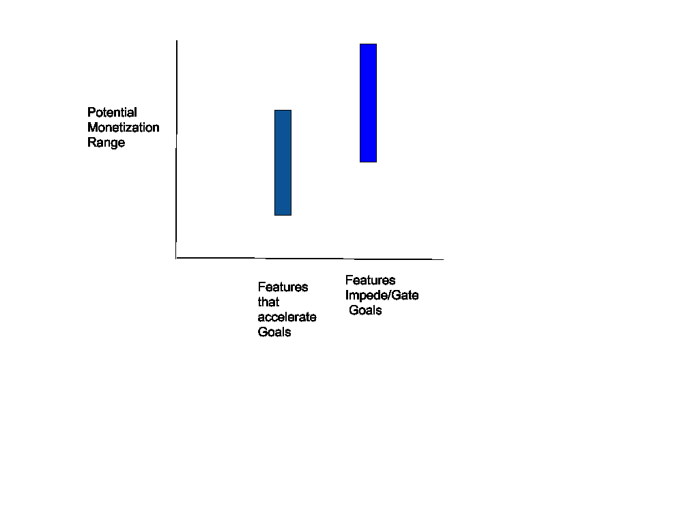

# 消费者应用货币化指南:衡量货币化功能的影响

> 原文：<https://www.moesif.com/blog/product-management/mobile-apps/Guidelines-To-Monetize-Consumer-Apps-Measuring-Monetization-Feature-Impact/>

### 介绍

多年来，我开发了许多游戏和应用程序，研究如何将免费增值应用程序货币化，因此我撰写了这篇文章，总结了一些我们用来评估货币化功能潜在影响的指南。这篇文章还根据我过去工作过并接触过的一些应用和游戏的数据，探讨了指导方针背后的原因。虽然基于手机游戏，但我相信这些准则可以应用到很多手机 app 上。

### 货币化的三种方式

免费增值应用的盈利方式有三种:

*   目标(加速或阻碍目标)。
*   自我表达
*   广告(ad 的复数)

#### 方法的比较

**与目标相关的特征> =与自我表达相关的特征~=广告。**

与目标相关的特性影响最大。对于一般人群，与自我表达相关的特性与广告相当或略好。

自我表达功能可以更好地为女性和年轻人赚钱。通常，如果一款游戏可以从广告中获得 0.01 美元的 DARPU(每用户日平均收入)，那么与自我表达相关的功能可以获得 0.01 美元或 0.02 美元的 DAPRU。然而，自我表现的 DAPRU 通常不会比来自广告的收入贡献多太多。最大的 DARPU 归因仍然来自与目标相关的特征。进球收入的上限通常与游戏的类型有关。对于像 match-3 游戏这样的休闲游戏，目标驱动的收入低于硬核游戏。此外，游戏中的大多数目标都是人为目标，所以真实目标可能比人为目标更容易赚钱。建立人为的目标需要用户的“认同”,通常这并不能保证，也不容易。

### 基于目标的功能

#### 目标的重要性和相关性

**更重要和更常见的目标是，更高的货币化潜力。**

更多的共同目标意味着目标被更多的人分享。例如，在一个约会应用程序中，如果一些人真的多才多艺，他们就不需要过滤特定的类型或个性。然而，每个人都想检查更多的比赛。检查更多匹配的门将比几个特定的过滤器更重要，并且与更大的人群相关。

#### 浇口硬度与 DARPU 和保持力

另一方面，门越硬，达尔普越高。然而，你可能会疏远用户，导致用户保留率下降。虽然这是一种权衡，但令人惊讶的是，你可以取得平衡，让你增加 DARPU 而不损失保留或损失非常少的保留。如果这些门被认为是有趣的、具有挑战性的或激发好奇心的，在某些情况下，它们实际上可以增加记忆。门的硬度应通过实验来测试。

总收入等于 DAU *达尔普，而 DAU 是留存和安装的函数。所以收入可以归结为一个二次函数。最终，二次函数有一个最大值。每种情况都不同，可能需要几次尝试才能收敛到最大值。使用软门，并使水平灵活调整和实验，以找到最大值。

### 自我表达特征

*   表达越明显，货币化定制功能就越能吸引注意力。如果有更多的人看到它，就会有更多的人愿意为此付费。

*   比男性更吸引女性和小孩

### 接近饱和

如果一种方法已经饱和，继续在该领域增加功能将不会带来额外的收入改善。

在一个特定的过去的游戏中，我们出售帮助击败一个水平的工具(能量)。我们卖出了一款工具，它带来了很大一部分收入。然后，我们决定添加更多的工具来帮助击败一个水平。首先，一对夫妇可以帮助。然而，在某个时候增加更多对收入没有帮助。相反，这很伤人，因为用户可能会被选择淹没。

##### 功能蚕食

太多的功能集中在一个目标上会导致自相残杀。

蚕食意味着两个功能可能独立地对贡献收入同样有益。但是，如果两个特性一起实现，那么这两个特性就会相互竞争。你不一定有两倍的收入。

如果唯一的货币化是高级订阅服务，同样的自相残杀问题也适用。如果我们增加了足够多的价值(或足够多的门槛)，额外增值服务的回报将会递减，从而导致更低的付费订阅转化率。在这种情况下，我们可能会考虑增加额外的层级或更直接的应用内购买。自我表达相关的商品可能最适合应用内购买。

### 结束想法

*   最终，这些指导方针可能只是一个“猜测”即使有最好的功能想法/机制。特性是如何实现的，在给定的环境下，如何表现，如何交流，如何定价等等，都将有助于特性的成功。
*   考虑到所有潜在的影响和成本，而不仅仅是与收入相关的影响，实现特定功能仍然是一个商业决策。