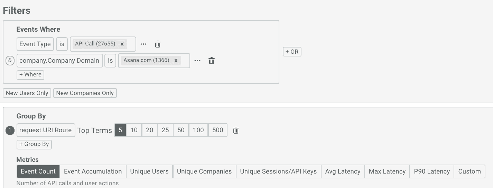
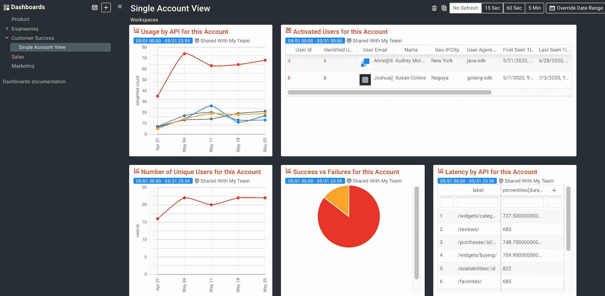
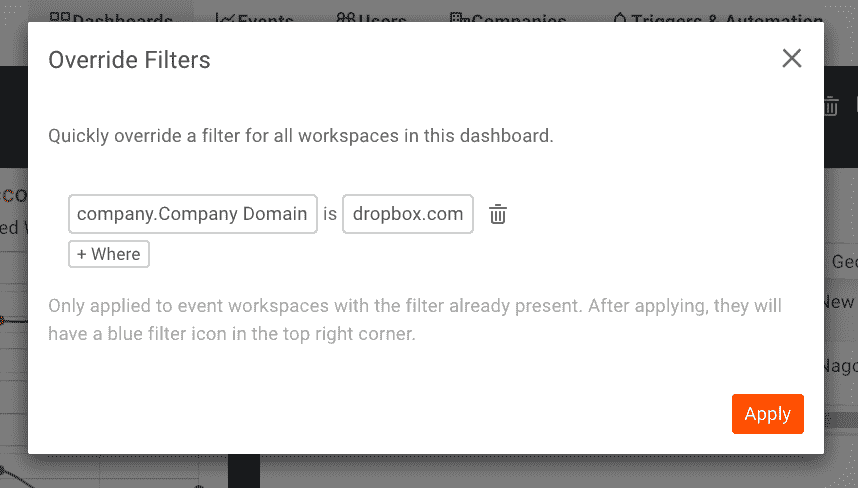
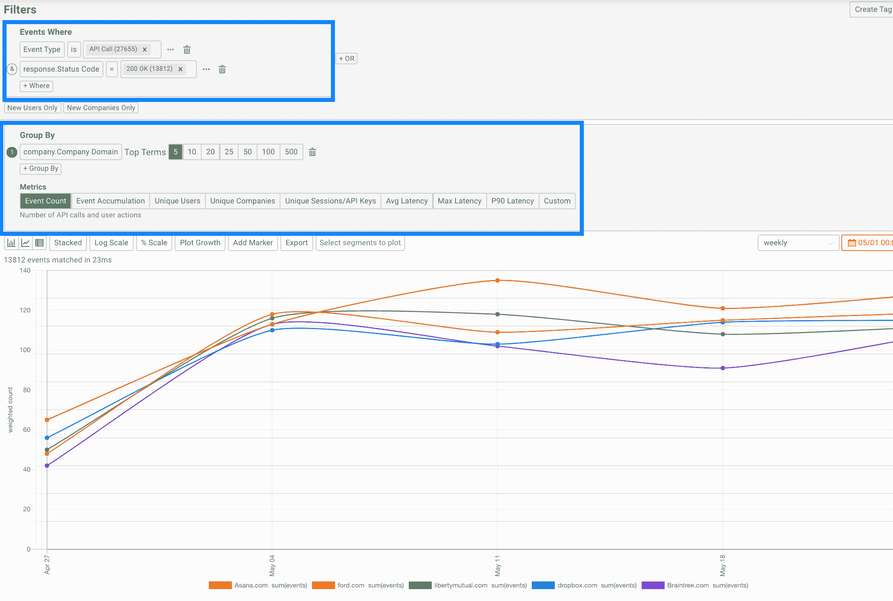

# 客户成功团队应如何监控账户健康和 API 使用情况

> 原文：<https://www.moesif.com/blog/customer-success/monitoring/How-Customer-Success-Teams-Should-Monitor-Account-Health-and-API-Usage/>

为开发者优先或 API 优先的企业引领客户成功与传统的企业软件截然不同。最好的 API 产品被设计成自助式和无人干预的，这意味着一旦实现完成，客户很少需要登录 web 门户。如果您是 Stripe 或 Twilio 客户，您上次登录他们的门户网站是什么时候？希望不是最近，否则这可能意味着一个问题或议题。另一方面，传统的企业解决方案可能会将客户活动席位的增加或减少视为扩张或流失的早期信号。

## API 优先业务的客户成功是什么

API 优先的企业有两种不同的“产品体验”，客户成功需要考虑这两种体验。首先，注册和登录您的门户网站时会有网络体验。然后，还有与 API 平台集成和交互的 API 体验。两者都是“入职体验”的一部分，应该有可衡量的 KPI。然而，API 是驱动长期价值的因素。客户增加了许多席位或团队成员，但从未与平台整合，可能会很快流失(如果已经付费)。

下面是传统企业平台和 API 平台的一些比较。虽然我们使用术语“席位”，但您可以用任何定价单位来代替，如“许可证”、“CPU”或“物理位置”。

### 收入增长的领先指标

| 传统企业软件 | API 平台/开发者平台 |
| --- | --- |
| 活动席位/已用许可证数量的增加 | 有价值的 API 调用增加 |
| 部署到多个地点或更多部门 | 部署到生产或更多应用 |

### 客户流失的领先指标

| 传统企业软件 | API 平台/开发者平台 |
| --- | --- |
| 许多座位的拆除 | 有价值的 API 调用大量减少 |
| 大量非活动席位与活动席位 | 大量低价值的 API 调用与有价值的 API 调用 |

### 入职期间的问题

| 传统企业软件 | API 平台/开发者平台 |
| --- | --- |
| 一个或少量座椅被激活 | 没有进行 API 调用或进行了少量 API 调用 |
| 很多负面支持票 | 堆栈溢出/ Reddit 上的许多负面评论 |

### 糟糕的客户体验

| 传统企业软件 | API 平台/开发者平台 |
| --- | --- |
| 许多应用程序崩溃或用户界面异常 | API 上 400 或 500 个错误的批次 |
| 页面加载缓慢 | 高延迟 API 调用 |
| UI 需要多次点击才能完成一项任务 | API 设计需要许多 API 调用来完成一个事务 |

## 如何使用 Moesif 创建客户成功仪表板

您首先要做的是创建两种类型的仪表板:

1.  所有客户成功指标的“概览仪表板”,用于识别有问题的客户
2.  一个“每个客户仪表板”来放大单个客户的表现

### 仪表板概述

每个 Moesif 帐户都有一个预建的仪表板，使您能够获得以下六个客户成功报告:

| 图表名称 | 描述 |
| 停止发送流量的新用户 | 显示最近注册但最近没有发送任何 API 调用的所有用户，这可能表明客户流失 |
| 第一次 API 呼叫的大客户 | 了解今天激活了哪些大客户 |
| 按用户列出的有错误的顶级 API | 监视那些在 API 中遇到很多错误并且可能需要帮助的用户 |
| 使用 API 最多的公司 | 了解谁是您的 VIP 客户很重要，这样您就可以优先考虑支持 |
| 新用户保持率 | 如果新用户保持率开始下降，这可能意味着严重的产品或客户体验问题 |
| 使用 SDK 的用户保持率 | 产品和客户成功团队应该跟踪有问题的集成，例如错误的 SDK |

这些指标提供了一个很好的起点，但是您可以修改或添加特定于您的 API 业务的仪表板。

### 每个帐户仪表板

每个客户的控制面板有助于您了解客户的表现、他们遇到的问题，并提供您是否应该联系他们的背景信息。因为许多 API 企业有成千上万的客户，为每个帐户手动创建一个仪表板将是一项繁琐的工作。相反，我们可以构建一个主仪表板，然后使用 [Moesif 的过滤器覆盖特性](https://www.moesif.com/docs/api-dashboards/#override-filters)在客户之间切换。

### 第一步。创建主仪表板

在 Moesif 中创建一个新的仪表板，名称为“单一帐户视图”。然后，创建一个针对单个客户的新图表。例如，要显示单个帐户的 API 使用情况报告，请单击“事件”->“时间序列”。添加感兴趣的过滤器和指标，如下所示。

确保您的图表具有针对单个帐户的筛选器，例如通过在公司域上添加筛选器。值是什么并不重要，因为它是一个占位符值。在这种情况下，我们选择`Asana.com`作为占位符值。

继续添加其他图表和指标，直到您的“单一帐户视图”仪表板完成，如下所示:这显示了与`Asana.com`相关的所有指标

### 第二步。在客户之间切换

现在我们已经构建了主控制面板，导航到它，以便我们可以在帐户之间切换。
点击仪表板右上角的*覆盖过滤器*按钮。这将打开一个弹出窗口，选择要覆盖的过滤器，如下所示:

我们可以添加过滤器`company.Company Domain`并输入不同于第 1 步的公司值，如`dropbox.com`，然后单击*应用*

尽管最初的仪表板在`Asana.com`上被过滤，但这将被`dropbox.com`覆盖，如下所示:

在每个单幅图块的右上角，将有一个蓝色的漏斗图标。此图标表示过滤器覆盖已成功应用于图表。

## 如何在帐户的 API 使用发生变化时获得提醒

既然我们已经创建了一些显示帐户运行状况的仪表板，那么当其中一个指标异常时收到警报将会很有帮助，这样客户成功可以更主动地联系客户。

为此，我们可以利用 [Moesif 的监控和警报功能](https://www.moesif.com/features/api-monitoring)。

### 第一步。创建新的时间序列报告

可以将监视器添加到 Moesif 中的任何时间序列图中。进入“事件”->“时间序列”开始创建一个新的报告。在这种情况下，我们希望在特定帐户的 API 流量大幅下降时得到提醒，这可能意味着他们即将流失。

我们应该确保我们正在跟踪*中有价值的* API 调用的减少，这样我们就可以添加一个过滤器来只监控`response.Status Code`为`200 OK`的调用。毕竟，减少 500 个错误是一件好事，并不意味着流失。

我们还想按上面蓝框所示的`company.Company Domain`分组。这确保了我们分别跟踪每家公司。对于指标，我们只需选择`Event Count`。稍后，我们可以为平均延迟等其他指标创建额外的警报规则。

### 第二步。创建警报规则

单击橙色的*警报*按钮，这将打开*创建警报规则*弹出框，如下图蓝色框所示。

因为我们是按公司分组的，所以 Moesif 将单独跟踪 eah 时间序列(即每个公司)。

因为每个公司的 API 使用情况都大不相同，所以利用异常检测的动态警报比静态警报更合适。

对于方向，选择“减少”，因为我们只想在流量减少时得到提醒，而不是增加。稍后，我们可以针对某个帐户的 API 流量增加创建一个单独的警报。

## 结束语

许多工具不是为 API 业务设计的，或者只关注基础设施的健康。如果您关心客户的成功，拥有正确的报告和警报是至关重要的。Moesif 是 API 产品和客户成功团队的头号分析解决方案，可以获得自助式 API 指标，而不会因高昂的实施和维护成本而负担过重。