# 如何集成 Moesif 和 Stripe，轻松实现 API 货币化

> 原文：<https://www.moesif.com/blog/developer-platforms/stripe/How-To-Integrate-Moesif-And-Stripe-To-Easily-Monetize-Your-APIs/>

一旦你决定将你的应用或应用编程接口货币化，你就开始寻找一个简单而强大的付费解决方案。在 Moesif，我们知道计费解决方案实际上很难实施。让你的产品从“0 到货币化”并不总是一条直截了当的道路，即使它应该是。我们的无代码计费方法是一种简单而优雅的方式，可以非常快速地获得向客户收取使用费的能力。简单的货币化是我们从您的应用和 API 中创收的最新功能的前提。我们的最新功能可以在 Moesif 的**计费表**屏幕下找到。

# 为什么要使用计费表？

计量产品的使用情况，并对使用情况收费，是技术产品货币化的最常见方式之一。要做到这一点，您需要监控使用统计数据，将指标发送给账单提供商，然后让账单提供商收集资金。

对于那些已经为其产品实施了基于使用的计费解决方案的人来说，您知道这个过程可能相当复杂。它包括收集大量数据，将这些数据放在正确的位置，收集所欠的资金，如果发票没有支付，则进行治理，以便用户不再能够访问该服务。创建这样的计费系统需要大量的编码、集成、测试和支持工作。

Moesif 通过收集大量可以计费的指标，然后自动按用户和/或公司进行汇总，让您轻松做到这一点。有了 Moesif，您需要准确计费的所有数据都已经存在，这也是我们认为创建计费表功能非常有意义的原因。我们还为您完成了在 Moesif 和 Stripe 之间创建集成的工作。这意味着只需几次点击，你就可以向客户收取使用费。根据复杂程度，您将在几分钟而不是几天甚至几周内拥有计费能力。

# 如何在 Moesif 中创建和使用计费表

一旦你把你的 API 和 Moesif 集成在一起，赚钱就非常简单了。在你与 Moesif 整合之后，有几个步骤可以帮助你获得收入。这些步骤包括:

```py
* Setting up products and prices in Stripe
* Adding the Moesif webhook to Stripe
* Plugging the Stripe API details into Moesif
* Configuring the billing parameters in Moesif
* Activating the billing meter 
```

所有这些步骤都非常直观，只需几分钟。

## 在 Stripe 中设置产品和价格

货币化的第一步是在 Stripe 中实际设置一些产品，以便按使用量计费。要在 Stripe 中设置产品，您需要点击标题菜单中的**产品**。

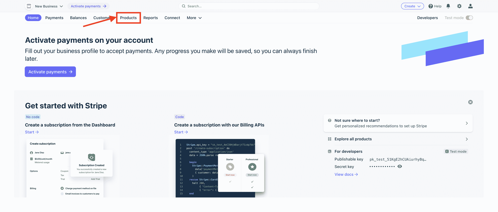

一旦你进入**产品**屏幕，你可以点击屏幕右上角的 **+添加产品**来创建一个新产品。

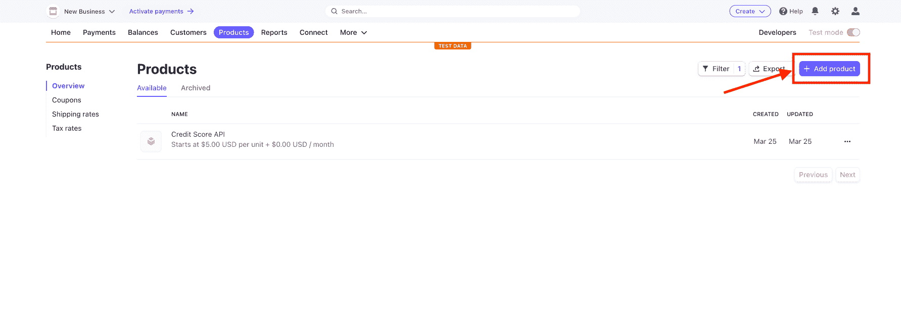

产品可以包含您需要的任何配置，但是您必须确保至少创建一个**价格**条目。**价格**必须配置为:

*   循环的
*   计费周期应为**月**
*   使用是计量的
*   按**时间段**内使用价值总和计量的使用费用
*   建议添加一个**价格描述**

**产品**的配置示例如下所示:

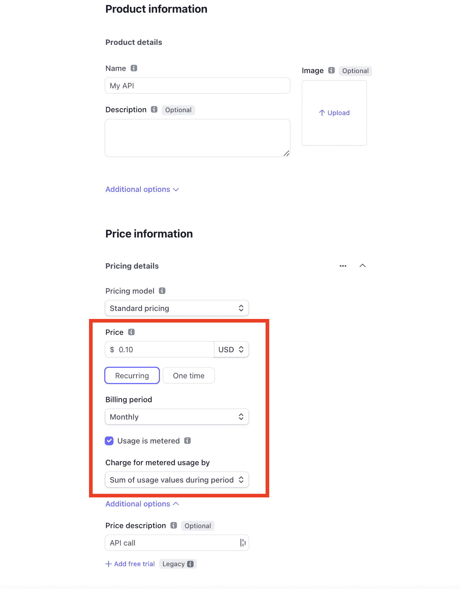

产品配置完成后，点击屏幕右上角的**保存产品**。

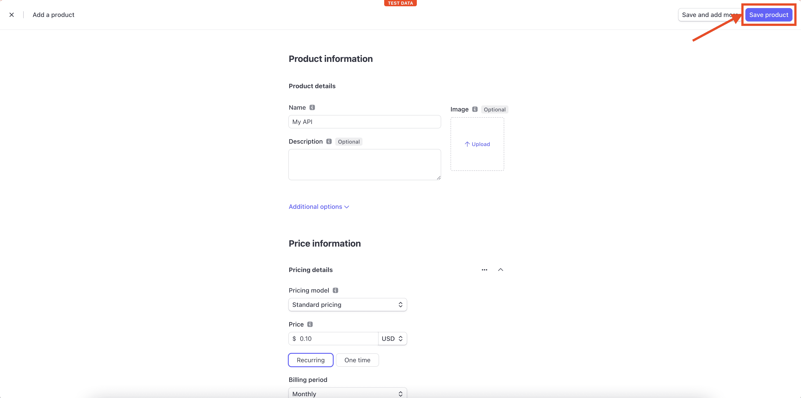

现在，我们有了一个可以和 Moesif 一起使用的产品，并开始为使用计费。

## 在 Moesif 中配置条带

一旦你的产品和价格确定下来，是时候开始整合 Stripe 和 Moesif 了。要开始在 Moesif 中配置 Stripe，请转到**计费表**页面，并点击屏幕右上角的**编辑计费提供商**下拉菜单。


这将打开条带配置屏幕，引导您完成集成。在这个屏幕上，您可以获得将 Stripe 插入 Moesif 所需的所有信息。配置的每个步骤都包含在模式中。

## 将 Moesif webhook 添加到条带

集成的第一步是将 Moesif webhook 添加到 Stripe 的配置中。添加此功能允许 Stripe 向 Moesif 发送订阅更新。

要将 Moesif webhook 添加到 Stripe，从右上角点击**开发者**，然后在左侧菜单中点击 **Webhooks** 。这将把你带到**网页挂钩**页面，在那里你可以查看现有的网页挂钩并添加新的。要添加新的 webhook，我们将单击屏幕底部的**添加端点**按钮。

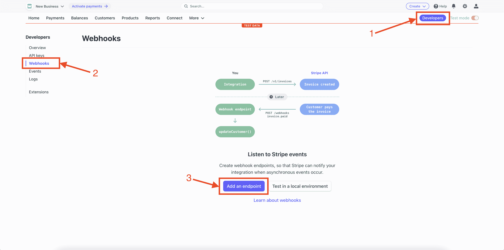

从这里，我们将插入我们的 Moesif API 端点 URL，并配置要监听的事件。您需要将 Moesif Webhook URL 复制到**端点 URL** 字段，然后点击 **+选择事件**按钮。


> 这些细节都可以在前面提到的 Moesif 中的条带配置页面上找到。

您应该选择**客户**下的选项进行**选择所有客户事件**。之后，点击屏幕底部的**添加事件**按钮。


此后，您将返回到添加端点详细信息的原始屏幕。滚动到屏幕底部，单击**添加端点**将端点保存到条带。


## 将条带 API 细节插入 Moesif

为了让 Moesif 向 Stripe 中的订阅添加使用量，我们需要向 Moesif 中添加 Stripe API 细节。这是在 Moesif 的条带配置屏幕中完成的，与我们之前使用的屏幕相同。


目前，Moesif 仅支持条带 API 的版本 **2020-08-27** ，因此字段默认为**条带 API 版本**字段。

对于 **Stripe API 密钥**字段，您需要从 Stripe 中检索 API 密钥以将其插入。从**开发者**界面，与我们在上一步中使用的界面相同，您将点击 **API 键**。然后，您将能够在屏幕上的**秘密密钥**或生成的**受限密钥**字段中看到您的 API 的私有密钥。两个键都可以用。


从 Stripe 复制密钥后，您将把这个密钥粘贴到 Moesif 中的 **Stripe API 密钥**字段。完成后，回到 Moesif，你可以向下滚动到屏幕底部，点击**保存**保存配置。


至此，Moesif 中的条带集成已经完成，您可以开始使用它了。

> 或者，您也可以在 Moesif 中定制**客户 ID 源**。缺省值对于大多数目的来说应该可以，但是如果您确实需要定制它，它将允许您指定如何将条带**订阅**和**客户**对象映射到 Moesif 中的**公司 ID** 和**用户 ID** 。

## 在 Moesif 中配置计费参数

添加与 Stripe 的集成后，您可以在 Moesif 中配置您的计费参数。如果您还没有这样做，您将需要创建一个新的**计费表**。为此，在 Moesif 中，您需要像开始条带集成时一样，单击左侧菜单中的**计费表**链接。

一旦你进入**计费表**屏幕，你将点击 **+添加计费表**按钮开始创建一个新的计费表。

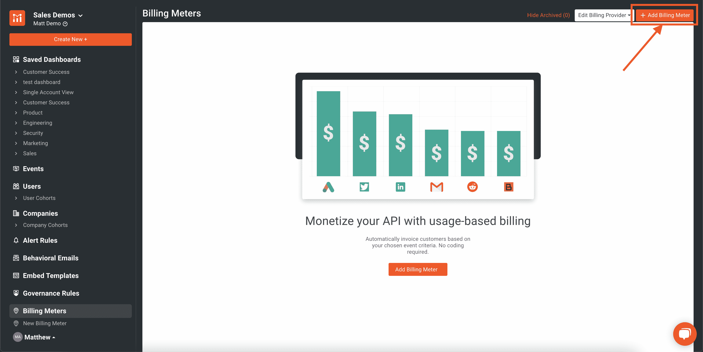

在添加计费计数器屏幕上，您将添加:

*   计费仪表名称
*   账单提供商信息
*   添加过滤器以指定要计费的事件

在下面的示例中，我设置了一个名为 **My Billing Plan** 的计费计划，该计划使用 Stripe 作为我的计费提供商。我还决定对任何响应为 **200 OK** 的 API 调用计费。

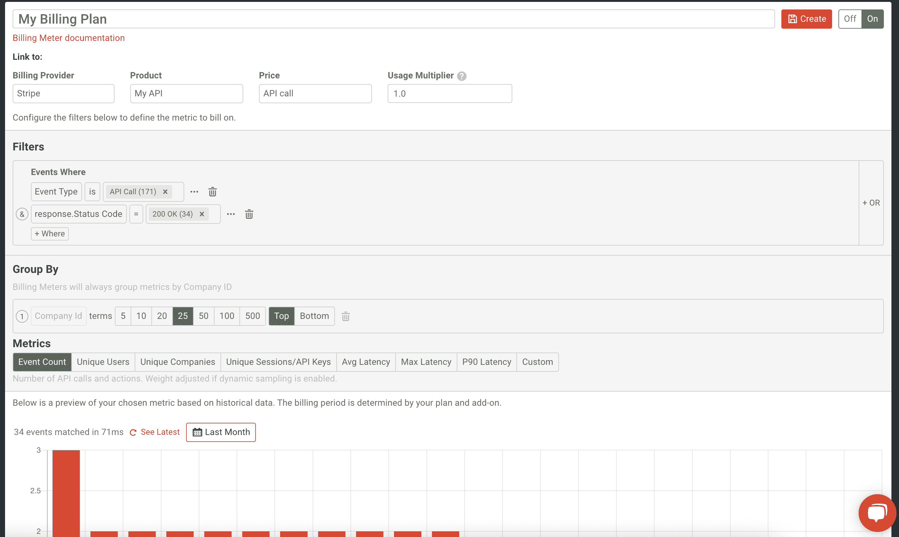

输入详细信息后，您将在屏幕底部看到过滤器输出的可视化表示。虽然计费只会发生在未来，但您将能够从历史上看到您的过滤器如何处理现有数据。这有助于确保，尤其是对于更复杂的过滤，您已经按照您需要的方式配置好了一切。

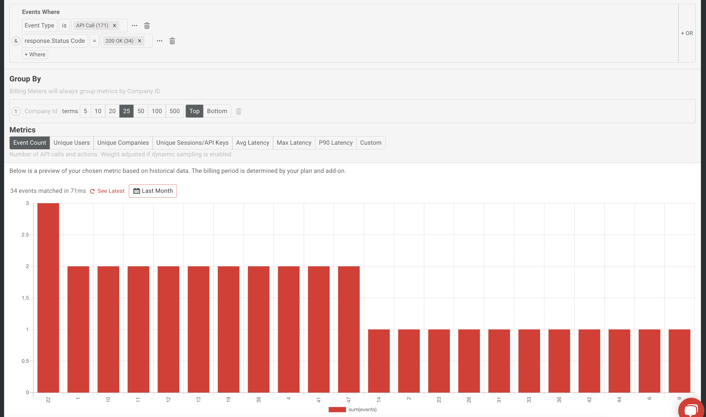

## 激活计费仪表

我们货币化的最后一步是保存和激活计费表。要做到这一点，我们只需要确保在配置页面的顶部打开计费表。

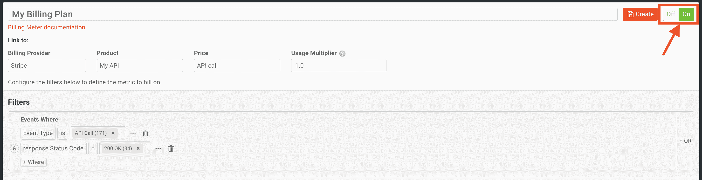

最后，我们需要点击屏幕顶部的**创建**。

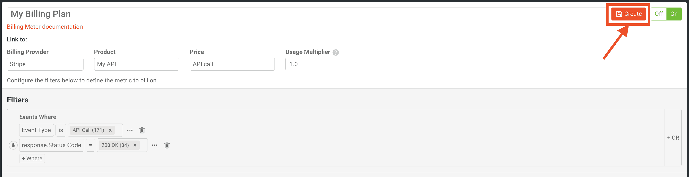

点击 **Create** 按钮后，在弹出的模式中会提示您确认计费表的创建。

> 需要注意的是，一旦创建了计费表，过滤标准和计费提供商的详细信息都不能更改。只有名称可以更改，计费表的状态可以打开和关闭。这是出于合规和审计的目的。计费仪表也不能删除，但如果不再使用，可以存档。

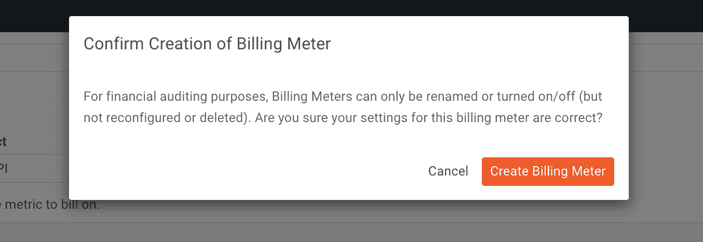

我们现在应该看到我们的新计费表出现在**计费表**主页上。

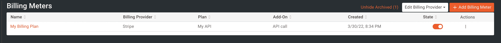

现在，我们已经成功创建了一个计费表，它将开始向条带发送使用数据。这种集成可以在几分钟内完成，不需要任何代码。如需了解更多信息，您也可以查看我们的文档。

# 你自己试试吧！

如果你有一个 API，或者你的产品的任何其他部分，你想赚钱，Moesif 可以帮助你。正如上面的步骤中所提到的，这是一种从你的产品中获得收入的简单而快速的方法。如果您已经在货币化您的产品，并在寻找一个更简单的解决方案，我们的计费功能是简化您的设置和降低您现有货币化工作的支持成本的好方法。

Moesif 还提供了许多与我们的计费功能捆绑得很好的其他出色功能，包括[漏斗指标](https://www.moesif.com/docs/user-analytics/conversion-funnel-analysis?utm_campaign=Int-site&utm_source=blog&utm_medium=body-cta&utm_term=monetize-integrate-stripe)和[留存分析](https://www.moesif.com/docs/user-analytics/cohort-retention-analysis?utm_campaign=Int-site&utm_source=blog&utm_medium=body-cta&utm_term=monetize-integrate-stripe)、[自动化用户行为电子邮件](https://www.moesif.com/docs/behavioral-emails?utm_campaign=Int-site&utm_source=blog&utm_medium=body-cta&utm_term=monetize-integrate-stripe)、[定制指标仪表板](https://www.moesif.com/docs/api-dashboards?utm_campaign=Int-site&utm_source=blog&utm_medium=body-cta&utm_term=monetize-integrate-stripe)和[治理功能](https://www.moesif.com/docs/api-governance-rules?utm_campaign=Int-site&utm_source=blog&utm_medium=body-cta&utm_term=monetize-integrate-stripe)。[立即注册](https://www.moesif.com/signup?utm_campaign=Int-site&utm_source=blog&utm_medium=body-cta&utm_term=monetize-integrate-stripe)开始使用账单和更多功能。