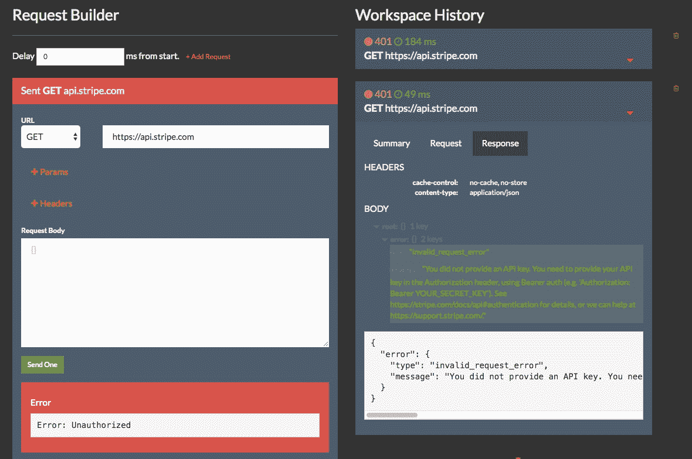
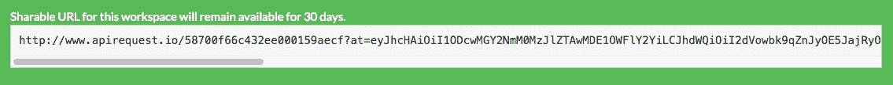

# 如何用 ApiRequest 发出 HTTP 请求并捕获响应？超正析象管(Image Orthicon)

> 原文：<https://www.moesif.com/blog/technical/apirequest/How-To-Make-HTTP-Requests-and-Capture-Responses-with-ApiRequest.IO/>

概述如何使用免费的 [ApiRequest。IO](https://apirequest.io) 工具，用于为调试和测试生成和捕获 RESTful API 请求。您可以与其他人共享您的 API 工作空间，以获得关于 API 错误的帮助。

### 什么是 ApiRequest？木卫一？

这是一个由 Moesif 提供的基于浏览器的免费工具，用于帮助人们调试 API 错误:

*   HTTP 客户端向公共或私有 REST API 发出一系列 HTTP 请求，甚至向本地主机发出请求。

*   请求/响应历史记录保存 30 天，以便您可以重新发送过去的请求。

*   该 URL 是可共享的，因此您可以在调试问题时与同事共享结果。任何拥有该链接的人都可以查看您的工作区。

### 如何发送单个请求

1.  转到 [ApiRequest。IO](http://apirequest.io) 自动创建一个新的工作空间。

2.  在*请求生成器*中输入您想要调用的 API 的 URL。您还可以输入任何 HTTP 请求头和 URL 查询参数。如果像 POST 一样需要主体，您可以为请求主体输入 JSON 有效负载。

3.  点击*发送一条*，结果将保存在右面板的*工作区历史*下。

4.  *工作区历史记录*将在链接下保存 30 天。您可以与同事或开发人员社区分享帮助。您应该看到 HTTP 状态代码、HTTP 头和响应 JSON。

### 高级用法

*请求构建器*允许您创建一系列 API 调用，而不仅仅是一个。如果错误是在特定的请求顺序或时间安排中出现的，这将有所帮助。

| 纽扣 | 细节 |
| --- | --- |
| 添加请求 | 要在序列中添加第二个请求，只需点击*添加请求*按钮。将显示一个新的构建器表单，让您输入第二个 HTTP 请求。 |
| 删除请求 | 要删除序列中的请求，点击*删除请求*按钮。 |
| 延迟(毫秒) | 这是从序列开始的偏移延迟。例如，假设顺序为
**-请求 1:延迟 0
-请求 2:延迟 125 毫秒
-请求 3:延迟 500 毫秒** 这意味着第三个请求将在第一个请求之后 500 毫秒发送。 |

最后，要启动序列，点击*发送全部*按钮。您也可以使用*发送一个*按钮单独发送序列中的特定步骤。

### 为什么创建 ApiRequest。木卫一？

Moesif 创建了 ApiRequest。IO 作为一个免费工具，可以帮助开发者更容易地调试 API。我们自己也支持 API，并多次收到关于特定 API 调用的帮助请求。我们厌倦了将 URL 和 JSON 有效载荷复制粘贴到电子邮件和 Slack 中，然后又不得不复制到 cURL 或 PostMan 中。