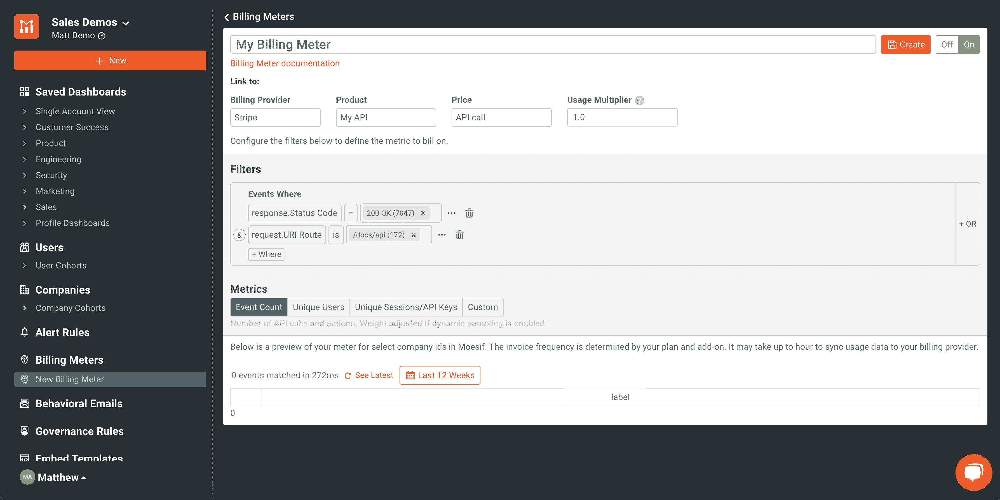
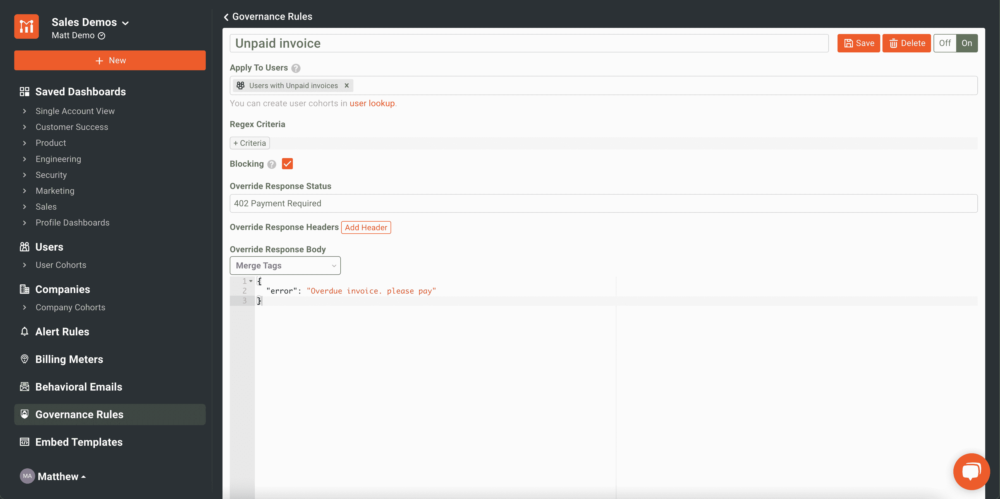
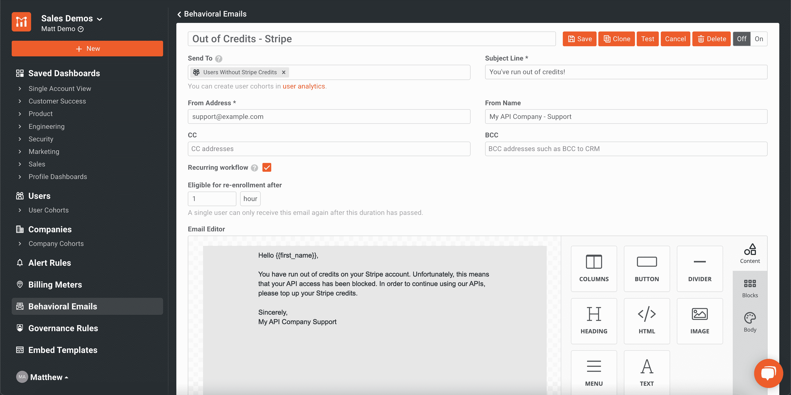
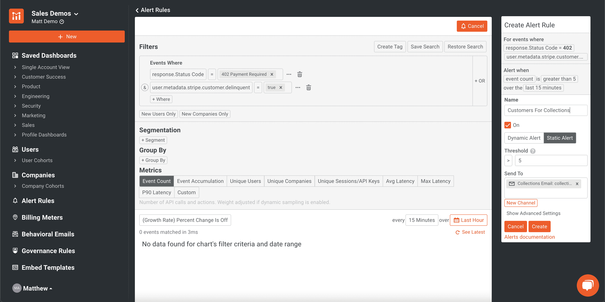

# 如何将你的 API 货币化:选择你的 API 货币化栈

> 原文：<https://www.moesif.com/blog/developer-platforms/api-analytics/How-To-Monetize-Your-APIs-Choosing-Your-API-Monetization-Stack/>

您选择用来启动项目的技术决定了您的产品现在能做什么以及将来能做什么。找到合适的堆栈来构建是您可能面临的最大工程挑战之一。选择一个能让你构建产品并快速推向市场的堆栈是非常好的，除非同样的选择限制了未来产品的可伸缩性和特性。选择一个远远超出您当前和未来需求的堆栈，这可能会导致您在构建最初的项目时遇到困难。必须在您当前的需求和您的产品及未来客户的需求之间取得平衡。

当谈到从 API 中赚钱时，选择正确的堆栈可以帮助您快速启动和运行，并为您的业务及其客户提供灵活性。让我们看看几种方法来评估哪种栈最适合您的 API 货币化需求。

## 什么是 API 货币化？

一切都在 API 上运行，API 经济持续增长。你有你认为其他个人或公司可能想要使用的 API 产品吗？然后，基于使用的计费和 API 货币化是你可能会考虑的事情。当我们谈到 API 货币化时，我们正在考虑如何从我们的 API 中获得收入，无论是通过按用户收费、按 API 调用收费还是其他指标。如果你的商业模式不包括使用你的 API 资源来获得额外的收入，你可能会把钱留在桌子上。API 收入可能是一个非常快速的胜利，特别是如果你有公共 API，可以用于其他业务。

如何收费以及何时收费将取决于您的计费模式。你可以在 API 消费者使用你的 API 后，通过后付费模式向他们收费来赚钱。您也可以决定在预付费或现收现付的计费模式下，预先向 API 消费者收取费用。有许多不同的方法可以从现有的 API 和正在构建的 API 中赚钱。

一旦您决定使用您的 API 来产生更多的收入，您就必须构建一个解决方案来做到这一点。该解决方案可能会有几个移动部分，每个部分都将在您的 API 货币化堆栈中扮演至关重要的角色。

## API 货币化栈看起来像什么？

最简单的形式是，API 货币化栈有两个组件:您的 API 和计费提供者。不幸的是，要使这些工作结合起来，实现起来变得相当困难。为了高效准确地完成这项工作，需要大量的定制和专业知识。

更实际的方法是将解决方案分成 3 个部分:您的 API、跟踪 API 使用的平台和计费提供者。让我们来看看这些组件的作用。

### API

API 是用户的价值所在。这里，当我们谈论“API”时，我们指的是与 API 有关的一切，包括保护 API、速率限制、转换等。通常，API 设置的一部分可能包括某种类型的 API 管理层，如 API 代理或 API 网关。大多数现代企业都在使用 API 网关，如 Kong、Tyk、AWS Gateway 或许多其他替代产品。

### API 分析(用于跟踪使用情况)

随着 API 的使用，您将希望收集关于该使用的指标。由于分析平台会查看每个 API 调用的 API 消耗指标，因此将其作为记录系统来跟踪使用情况并将其发送给计费提供商是有意义的。

### 账单提供商

计费提供商将接收每个客户的使用量，在计费周期内合计金额，开具发票，并收取欠款。

Moesif 是 API 分析的一部分，这大概是事情在高层次上的样子。

## 为您的 API 选择网关或代理

当选择 API 管理的网关或代理时，准确理解您将需要什么功能是很重要的。几乎市场上的每个网关都有一些独特之处，这可能会使它或多或少地适合您的使用情形。要真正深入了解网关与代理的争论，请查看我们整理的[这个](https://www.moesif.com/blog/technical/api-gateways/API-Proxy-Vs-API-Gateway-What-Are-The-Differences-And-Which-Should-You-Use/?utm_campaign=Int-site&utm_source=blog&utm_medium=body-cta&utm_content=how-to-monetize-your-stack)快速分类。

有一点是肯定的，使用 API 网关将使保护和管理 API 比不使用它容易得多。大多数网关都支持各种各样的授权和认证协议来控制 API 访问、用于生成和管理 API 密钥的工具、对速率限制和配额的强大支持，以及其他特性，例如将转换应用于请求和响应的能力。API 管理平台通常还提供一个开发者门户，这样 API 用户就可以很容易地看到哪些 API 是可用的，并可以访问它们。

尽管可以在没有 API 网关或代理的情况下管理 API，但是拥有一个 API 网关或代理意味着您可以建立一种更统一的方式来保护和管理 API。实质上允许您在单一控制台下管理所有与 API 相关的问题。从可扩展性和安全性的角度来看，没有比这更好的解决方案了。

流行的 API 管理工具包括 Kong、Tyk、AWS Gateway、Azure API Management 等等。每一个都有自己的优点和缺点，就像任何其他软件或基础设施一样。有关这些比较的更多信息，请查看[本文]https://www . moesif . com/blog/technical/API-gateways/How-to-Choose-The-Right-API-Gateway-For-Your-Platform-Comparison-Of-Kong-Tyk-API gee-And-Alternatives/？UTM _ campaign = Int-site & UTM _ source = blog & UTM _ medium = body-CTA & UTM _ content = how-to-money-your-stack){:target = " _ blank " }我们写信就是为了帮助您解决这个问题。

## 选择账单提供商

在选择计费提供商时，就像您将任何技术整合到您的堆栈中一样，您应该了解当前和未来的使用案例以及该技术如何支持它们。您应该评估您的产品路线图，并规划出每个解决方案的技术优势和劣势。这里的描绘出了一幅巨大的差异全景图[。您还需要了解如何将计费提供商与您当前的解决方案相集成。不同的提供商有不同的集成方式，这可能会使他们或多或少地适合您的项目。另一个细节是确保计费提供商能够支持你的 API 货币化模型。](https://www.zeni.ai/blog/best-saas-subscription-billing-solution-chargebee-vs-recurly-vs-stripe-billing)

除了技术要求之外，在选择您的提供商时，还应该考虑一些其他的运营因素。这些因素强调如下。

### 费用

对于大多数公司来说，这将是比较技术能力之外的主要因素。如果两个计费平台在技术上都适用于您的项目，那么下一个重点将是成本。

一个平台的成本可以用许多不同的方法来计算。可以采用统一费率、百分比或两者混合的方式。您还需要考虑通过系统的流量，因为这也可能导致折扣，从而使某个提供商更具吸引力。

### 报告

该平台内置的报告工具可以帮助组织的业务部门轻松看到 API 货币化的结果。大多数平台都有最少量的报告，而其他平台则有非常详细的报告。如果你喜欢现成的报告而不是自己开发的，这应该是一个重要的因素。

### 客户支持

如果问题确实发生了，很高兴知道提供商可以提供快速支持来解决问题。您需要确保查看提供商提供的不同支持包、针对次要和主要问题的服务级别协议(SLA)以及一些客户评论，以了解现有用户对支持是否满意。

## 使用 Moesif 将它们整合在一起

在您的 API 和所选择的计费提供者之间架起一座桥梁，这就是 Moesif 的用武之地。Moesif 拥有独特的能力来跟踪使用情况，将其累加，然后将使用记录发送给计费提供商进行收费。这些都可以在 Moesif 中找到，开箱即用。

Moesif 允许全方位服务的 API 货币化。这意味着 Moesif 可以覆盖所有对创建强大的 API 货币化堆栈至关重要的缺口。这包括跟踪使用情况、阻止过期发票帐户的使用、让客户了解使用情况，以及提醒内部团队任何相关行为或可能的追加销售机会。

### 计费仪表

计费仪表是 Moesif 货币化解决方案的核心。计费表允许您描述您希望如何向用户收费，并指定该标准。这些标准可以是特定端点上的计费、请求的特定部分、响应代码、这三者的组合，或者任何其他设想的标准。

一旦计费仪表被设置，它将在预定的时间间隔向计费提供商报告这种使用情况。这可以在几分钟内完成，而且完全不需要编写代码。Moesif 中的计费表目前可以与 Stripe、Recurly 和 Chargebee 集成。随着我们对客户最喜欢的计费提供商的了解越来越多，这些集成选项将会继续增加。

### 管理

治理可以允许 Moesif 在发票过期时阻止调用，或者，如果您正在进行预付费设置，可以在 API 消费者帐户上的信用用完时阻止他们。同样，所有这些都可以在没有代码、没有工程支持的情况下完成，并且可以在几分钟内投入使用。

治理规则可以通过配置一个适合您的确切需求的过滤器并指定您想要覆盖响应的内容来设置。例如，如果用户用完了使用 API 的信用额度，或者有过期的发票，您可以返回 402 Payment Required 状态，以及更详细的 JSON 主体。

### 行为邮件

当用户进入下一个使用层级、接近费率限制或配额，或者信用额度用完时，自动发送电子邮件将变得非常方便。当然，在很多其他情况下，自动化电子邮件也能有所帮助。在 Moesif 中使用行为电子邮件的最大好处是，它可以让客户了解关键事件，同时减轻支持和销售团队的负担，而在过去，他们需要直接联系。

### 警报

除了行为电子邮件，根据公司或用户的行为向不同的内部团队发送通知也是有意义的。为此，我们可以使用 Moesif 来设置由特定标准触发的警报。这些警报可以通过电子邮件和短信发送，也可以通过 Slack、PagerDuty 或定制的 webhook 等替代方式发送。

对于货币化，这可能包括让销售团队知道用户已经准备好根据他们的数量或行为转向新的计划。这也可能意味着向您的财务或收款部门发送一个警报，让他们知道一个拖欠的客户正试图访问一个 API。

## 入门指南

将你的 API 货币化是一项复杂的工程，但并不困难。随着一个伟大的 API 战略和强大的 API 设计，通过使用声誉良好和成熟的技术让您快速进入市场，同时保持高质量，您可以快速推动您的 API 的收入。为您的货币化 API 选择正确的堆栈不仅对于今天的需求至关重要，而且对于确保您有信心扩展到明天也是如此。

无论您选择什么，使用 Moesif 作为 API 货币化策略的中心都可以节省时间和精力，同时为您的最新收入流提供可扩展性和稳定性。今天就通过[注册](https://www.moesif.com/solutions/track-api-program?utm_campaign=Int-site&utm_source=blog&utm_medium=body-cta&utm_content=how-to-monetize-your-stack)来试试我们，开始你的 API 货币化之旅。