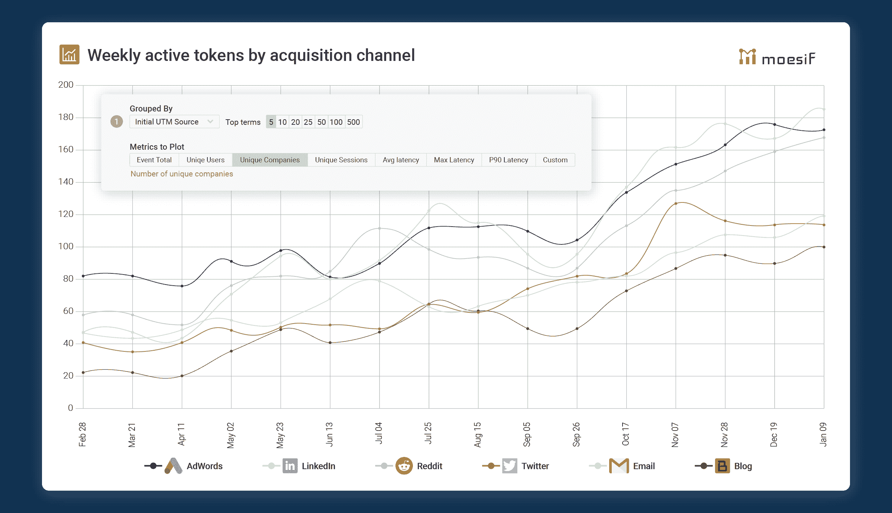

# 如何使用 Moesif API 分析插件最好地监控 Kong 性能和 API 使用情况

> 原文：<https://www.moesif.com/blog/technical/kong/How-to-Best-Monitor-Kong-Performance-and-API-Usage-with-the-Moesif-API-Analytics-Plugin/>

对于任何寻找可靠和可伸缩的 API 提供方式的团队来说，Kong 是一个非常值得推荐的 API 网关。与 Apigee 和 Mulesoft 等更传统的玩家相比，Kong 遵循开放核心模式，高度模块化。

为了最好地优化您的 API 性能，并了解需要进行哪些更改来收回您的投资，建议建立像 Moesif 这样的 API 可观察性和监控系统。传统的监控会回答*已知的未知问题*如每分钟*请求*或状态如*红色、黄色、绿色*，您需要提前知道要探测和测量什么，如增加性能计数器。[另一方面，API 可观察性](/blog/api-engineering/api-observability/What-is-API-Observability/)是一种趋势，使业务和工程团队能够回答*未知的未知*。这些随意的问题源于快速解决复杂的工程和业务挑战的需求。

因为 Moesif 是一个完全托管的 SaaS，所以您的财务需求远低于构建和维护您自己的数据基础设施。不要因为你的内部分析用户因为 Grafana 和 Kibana 的缩放问题而无法访问他们的数据，或者因为你的 Elasticsearch shards 是红色的，就深夜打电话叫醒他们。

Moesif 已经发布了一个 [Kong 插件](https://docs.konghq.com/hub/moesif/kong-plugin-moesif/),使你能够增加 API 的可观察性，并从一个中心点，也就是你的 API 网关监控你的 API，而不会对你的 API 增加任何性能损失。接下来的问题是，你*应该*监控的关键事情是什么？

## 工程度量

首先想到的 API 指标是功能和性能指标。与许多 API 网关和代理服务器一样，Kong 是为高吞吐量 API 设计的，可以扩展到每分钟极高的请求数，但大多数性能问题是由于应用程序速度慢，而不是您的 Kong 基础设施。除非您能够完全控制 API 消费者如何查询您的 API，否则您将会遇到模糊的查询，这会给您的数据存储和处理带来额外的压力。一小群 API 消费者执行过多的全扫描或大型连接会降低 API 基础设施的速度。

### 平均延迟可能具有欺骗性

您可能认为平均延迟是您应该跟踪的第一件事，但是平均 API 延迟是骗人的。持续的高平均延迟可能没问题。每小时或蓝月亮熄灭时变化的延迟可能对您的客户不利。跟踪 90%的延迟，然后按终端或客户进一步细分。像 Moesif for Kong 这样的现代 API 分析解决方案使您能够将 API 调用绑定到单个用户，然后用客户统计数据丰富这些用户

您应该能够根据任意数量的 API 调用参数(比如端点、特定的查询参数，甚至是主体字段)来划分 90%的延迟。

### 监控实际应用程序错误

一旦你掌握了 Kong 的第 90 个百分位数的延迟，是时候看看错误率的趋势了。错误可能意味着许多不同的事情。根据 Kong 和 Moesif 的报告，只要 HTTP 状态大于 400，就可能发生错误。

要在 Moesif 中监控或创建关于 Kong 指标的警报，您可以单击顶部的*警报*按钮。这将打开一个窗口，您可以在其中配置发送警报的位置，并确认您希望在警报中包含的任何过滤器和分组依据。

一旦创建了警报规则，您可以稍后在*警报规则*下查看它。请记住，有许多错误情况更多的是用户错误或糟糕的体验，而不是真正的错误。例如，API 消费者可能不完全理解 API 过滤和分页是如何工作的，导致他们总是得到空的搜索结果。在这些情况下，您应该利用正文过滤器来设置可能暗示不良体验的警报规则，例如重复响应但没有结果。

### 检查 API 调用

实时事件流显示 API 调用进入 Kong 实例的过程。与典型的基础设施指标不同，API 调用自然有大量的字段，每个字段都有大量不同的值。像 Moesif 这样专为 API 设计的分析解决方案是为 API 流量的高基数、高维度分析而设计的。这意味着您可以通过任何 HTTP 头或主体字段来过滤和创建复杂的聚合，这大大减少了手动搜索和 SQL 查询所花费的时间。即使对于位于不同数据中心的 Kong 实例，您也可以获得统一视图的好处。

## 产品和业务指标

工程团队不是唯一需要访问 API 度量的人。无论是产品销售还是客户成功，企业的每个部分都应该利用对客户 API 使用的可见性。像 Moesif 和 Kong 这样的现代 API 分析解决方案使您能够将 API 调用与个人用户(或公司)联系起来，然后用人口统计信息丰富这些用户。这使您能够通过了解谁在调用什么来最大化您的 API 和 Kong 投资的商业价值。这有时被称为用户行为 API 分析或以用户为中心的 API 分析。

### 跟踪按客户细分的 API 使用情况

任何 API 优先的团队首先应该关注的是他们的 API 流量分布。设计为事务性的 API 自然是传递价值的媒介，每个 API 调用都是一个可度量的价值单位。例如，位置 API 可能会让用户付费来提取位置数据。他们执行的位置查询(即 API 调用)越多，用户从使用您的 API 中获得的收益就越多。如果你向你的 API 消费者收费，希望他们支付的最多。像 Twilio 这样的公司就利用了这一点，他们向客户收取每次 API 调用的费用。💰

### 将独特用户归因于获取渠道

一旦你很好的理解了谁是你的顶级 API 用户，你应该开始看看他们来自哪里。如果你把你的 API 当成一个产品，那么产品营销和发展团队需要知道在哪里投入更多的营销资金。要跟踪这一点，您还应该安装 Moesif browser SDK，它可以自动收集网络行为和归属信息，并将它与您的 Kong 指标联系起来。Moesif Kong 集成将根据 [Kong 消费者 id 和消费者用户名](https://docs.konghq.com/hub/kong-inc/key-auth/#upstream-headers)自动跟踪唯一用户。

### 了解您的采用漏斗

如果不显示采用，大多数 API 程序将无法获得继续运行所需的资源。一个伟大的 API 应该有一个高效和有效的伟大的采用和成长故事。然而，API 是一个难以置信的硬推销。大多数开发人员对对外销售和付费营销并不敏感，然而 API 的采用有很高的障碍，因为开发人员需要集成它。这意味着你应该虔诚地追踪你的收养漏斗。Moesif 建议跟踪两个关键指标:

#### 第一个你好世界的时间到了

也称为首次 API 调用时间，首次 Hello World 时间(TTFHW)是 API-first 公司追踪的黄金指标。首次 Hello World 的时间是新开发人员注册并进行第一次 API 调用以使他们能够从您的 API 中获得至少一些价值所需的时间。从商业的角度来看，有些人可能会认为这一次是有价值的。在他们的第一次 API 调用之前，你的开发者用户从你的 API 程序中得到的很少，这对于那些第一次进行 API 调用的开发者来说是很神奇的。

TTFHW 不是你应该关注的唯一指标，还有第二个指标是第一个工作应用程序的时间，或者有时是第一个付费应用程序的时间。这个定义因产品和 API 而异，但非常类似于一个活跃用户。在上面的图表中，我们显示了从他们迈出第一步到他们第一个 Hello World 的时间，看起来是 6 小时 5 分钟。然后，我们可以跟踪从他们的 Hello World 到他们的工作应用程序的时间，我们将其定义为超过 100 个对`/api/:id/payment`的 API 调用

#### 汇率

就像我们可以跟踪转化的时间一样，我们也应该跟踪转化率本身。较高的转换率自然会带来较高的收入。与我们跟踪 TTFHW 类似，您应该跟踪客户旅程中每一步的转化率。然后，您可以像我们之前一样，按人口统计数据进行细分，例如按收购渠道。

## 结束语

使用合适的工具来监控 Kong 不仅对于理解性能，而且对于获得 API 采用和使用的业务可见性都是至关重要的。有了 [Kong integration](https://docs.konghq.com/hub/moesif/kong-plugin-moesif/) ，这种度量标准的收集就可以大规模地自动处理。这使您能够建立更好的 API 产品策略，并更好地支持您的客户。