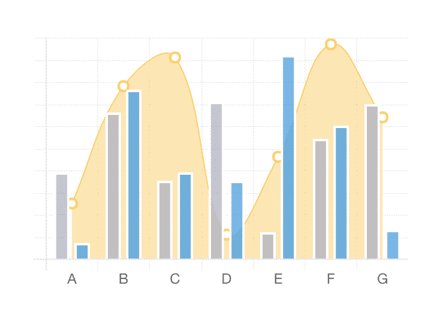
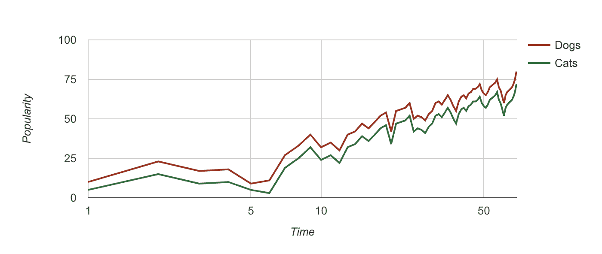
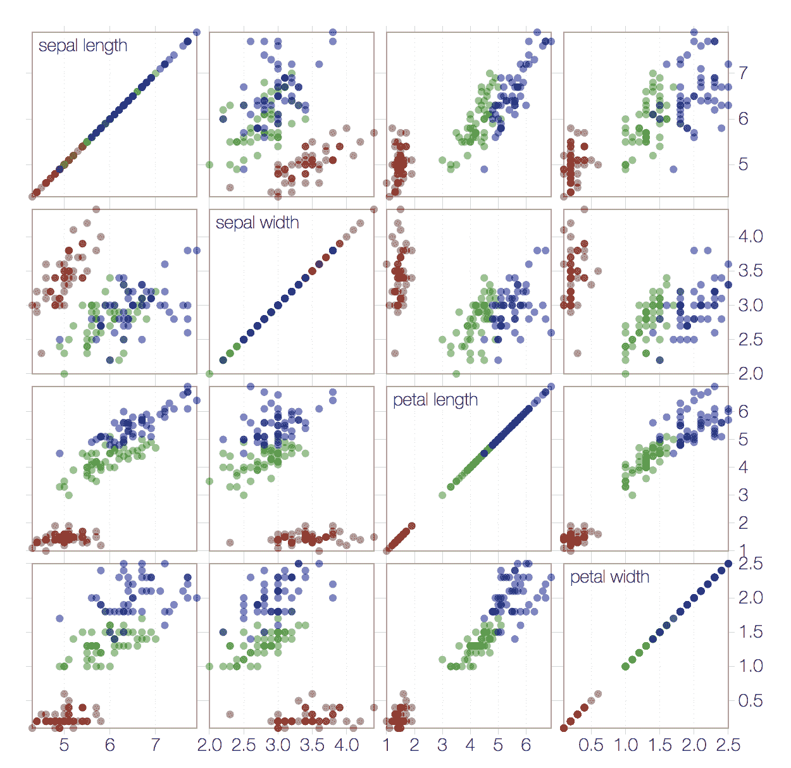

# 如何选择最好的 Javascript 数据可视化库

> 原文：<https://www.moesif.com/blog/technical/visualization/How-to-Choose-the-Best-Javascript-Data-Visualization-Library/>

任何以数据为中心的应用程序都需要 UI/仪表板的数据可视化。对于基于 web 的应用程序，这些库几乎总是 Javascript。获得正确的图表和可视化可能很难，但幸运的是，我们有各种 Javascript 库可供选择，如 D3.js、Chart.js 和 Google Charts。然而，对于每个库来说，都有大量的利弊选择。本指南可以帮助您选择库以及一些最佳实践。

## 要考虑的因素

### 浏览器和设备兼容性

这可能是最重要的因素之一。虽然库支持哪些浏览器和版本是值得考虑的，但是如果你试图支持非常旧版本的浏览器，它可能会使你不能利用最新的特性。你可以看看浏览器的市场份额来决定分界线在哪里。

如果您的应用程序将在网络之外和移动网络上使用，请检查图表是否可以响应，并确保它在移动浏览器上看起来不错。

### UI 框架兼容性

现代的 web 应用前端通常是使用主流的 UI 框架之一来开发的，比如 [Ember](https://www.emberjs.com) 、 [React](https://reactjs.org) 、 [Vue](https://vuejs.org) 或者 [Angular](https://angular.io) 。

取决于您正在使用的框架，您可能希望确保该库能够很好地与它兼容。大多数图表库是框架不可知的。通常，每个主要框架都有包装器。然而，每个框架都有一些奇怪的地方值得验证，因为一些库假设代码只在客户端环境中执行。随着越来越多的现代框架现在支持服务器端渲染，可能需要特殊的技巧来确保只有客户端的库不会加载到服务器端。

### 各种图表类型

有一些图表库只关注一两种类型的图表，比如时间线系列或方向图，但大多数库试图在它所拥有的图表集中包含所有内容。最好的比较是在维基百科上。

如果一个库没有您需要的所有图表类型，使用两个或三个图表库也无妨，但是如果它们是同一个应用程序的一部分，您可能需要使它们在视觉上风格一致。

### 文件大小

Javascript 库需要作为应用程序的一部分下载到客户端。为了获得良好的用户体验，您希望尽可能减小 Javascript 的大小。

所以图书馆的总规模很重要。有几种方法可以缓解这种情况。

1.  您可以尝试明智地进行代码拆分，或者将每个库的加载延迟到需要的时候。Webpack 和其他工具通常是处理这个问题的简单方法。
2.  如果您只需要一种或两种类型的图表，加载一个支持许多图表的大型库可能没有意义。
3.  有些库提供了仅加载所需图表类型的选项。
4.  如果你正在使用`import`，有时你可以加载你需要的特定组件，而不是整个库。

### 表演

如果您计划一次渲染大型数据集，那么性能就很重要。您可以尝试进行基准测试，但是为大型数据集设计的库通常会将性能作为它们的主要特性。

### 风格和定制

对于美学来说，这是一个关于它有多漂亮的更主观的判断。在这篇文章中，我分享了我的一些个人观点。

有些库支持动画，而有些不支持，动画的质量也各不相同。虽然如果你选择使用动画，一定要适度添加，因为它会很分散注意力。

关于视觉效果最重要的方面可能是定制，也就是说，你在多大程度上可以控制风格，以适应你的应用程序的主题和风格。

### 价格、许可和支持

一些最全面的图表库也需要付费许可，通常他们提供免费试用或免费用于非商业用途。就我看到的少数几家而言，价格似乎相当。

对于免费库，它们从免费使用到在 MIT 或 Apache 许可下完全开源都有。它们都不提供任何保证。

付费产品的一个好处是它们会提供支持，但是对于免费库，你很可能会依赖于社区。如果社区足够大(可以看看 Github 上收到的明星数量)，通常会有很多人愿意帮忙。大社区的一大好处是图书馆不太可能被遗弃。

## 流行的免费图书馆

Wikipedia 提供了一个非常好的所有 Javascript 图表库的特性对照表。在这里，我将只进入一些最受欢迎的。

### [Chartjs](http://www.chartjs.org/)

这是最受欢迎的之一。它受麻省理工学院的许可，这是限制最少的许可之一。

图表类型的范围不是很大，只有 8 种，但是它们非常容易使用。

视觉上，它看起来非常漂亮，外观简约而扁平，开箱即用。与其他产品相比，定制有些受限。默认动画做得非常好。它也是有求必应。

它有一个非常大的社区，所以有很多像 React 这样的主要框架的包装器。

它占地面积小，非常适合入门。但是它只是为客户端使用而设计的，所以如果你使用服务器端渲染，你必须确保不要在服务器端使用它。

### [谷歌图表](https://developers.google.com/chart/)

在免费的可视化库中，Google Charts 提供了最大的图表类型集之一。除了典型的折线图、条形图和饼图之外，它还提供了许多不常用的图表，如蜡烛图、日历图、地理图、组织图和树形图。

尽管 Google Charts 是免费的，但它不是开源的，它遵循 [Google API 使用条款](https://developers.google.com/terms/)。有谷歌做后盾，它不太可能被抛弃。

从视觉上看，与 Chartjs 相比，它没有开箱时那种干净简约的外观。但是可以自定义。定制参数的数量因图表类型而异，但是有很多不同的东西可以使用。尽管它不是开箱即用的，但您可以编写代码来调整图形的大小，以便在调整窗口或容器大小时检测事件。

不像其他库，不支持`npm`或`bower`安装，令人失望。相反，它需要通过来自 CDN 的`script`标签包含一个加载器脚本。与其他一些库不同，您使用加载器动态地加载包含您需要的图表类型的包，然后在完成的加载回调:`onLoadCallback`中呈现您的图形。

这有时会使该库使用起来有些笨拙，尤其是如果您有其他要用于渲染的触发器。幸运的是，还有 react 的[包装器。](https://github.com/RakanNimer/react-google-charts/tree/master/src/components)

### D3.js

D3.js 是 Javascript 中数据可视化的黄金标准，它通常是其他库的基础。在 BSD 许可下，它是开源和免费的。

它以陡峭的学习曲线而闻名，并且没有从基础库中提供图表。但是有一个巨大的用户社区，他们互相支持并回答问题，我个人觉得这个库使用起来非常简单有趣。

有一些构建在上面的库，如 [react-d3](http://www.reactd3.org/) 和 C3js，它们提供了与 chartjs 几乎相同的一组现成的图表类型，例如:折线图、条形图、面积图、散点图、饼图。

如果您对可视化有特殊需求，比如新的或独特类型的图表，D3 可能是正确的解决方案。还是那句话，除非万不得已，不要多此一举，先查查有没有另一个满足你需求的库先。

## 付费商业图书馆

这些库通常为个人使用提供免费试用或免费许可，但商业使用需要付费。如果除了希望从社区获得答案之外，你还需要支持，他们可能是不错的选择。市场领导者似乎是 [Highchart](https://www.highcharts.com) 、 [Fusionchart](https://www.fusioncharts.com/) 、[am chart](https://www.amcharts.com/)和 [Anychart](https://www.anychart.com/) 。它们都提供了大量的图表类型，具有大量的定制、集成选项和流行的框架支持。去看看吧。

## 特定框架的可视化库

大多数库不依赖于其他 UI 框架。大多数被设计成呈现一个`div`标签。由于有很多框架，如 JQuery、Ember、Angular 或 React，所以有人为这些库创建了包装器(如前面提到的 react-chartjs 和 react google charts)。然而，有些包装器使用起来很笨拙，有些没有保持最新，最终会增加一层依赖性。

然而，有一些图表库是专门为流行的前端框架设计的，如果你已经在使用这个框架，并且它们有你需要的图表类型，那么它们可能更容易使用。

*   [Flot](http://www.flotcharts.org/) 是 jQuery 特有的。
*   [Ember Charts](http://opensource.addepar.com/ember-charts/) 是建立在 D3.js 之上的 emberjs 框架。
*   [n3 图表](https://n3-charts.github.io/line-chart/#/home)，同样构建在 D3.js 之上，但是是为 Angular 框架构建的。
*   [胜利](http://formidable.com/open-source/victory)是专门为 react 设计的。
*   React-Vis 也是专门为 React 设计的，它来自优步团队。

## 特定的单一图表类型聚焦库。

有一些免费的库专注于一种类型的图表，这种图表做得非常好，我想说出来。

*   [Sigmajs](http://sigmajs.org/) 创建漂亮的图形，即表示节点和网络。
*   Springy.js 专门研究力的方向图，它提供了一个非常“有弹性”的动画。
*   [思慕雪图表](http://smoothiecharts.org/)专注于显示流数据。

## 结论

Javascript 可视化库中的选择数量多得令人不知所措，但这反映了数据可视化对于 web 应用程序的重要性。我们兴奋地看到所有主要的图书馆都在不断改进。

这篇文章并不详尽，所以如果你对选择库时应该考虑的因素和你真正喜欢的库有其他想法，请在下面的评论中告诉我。