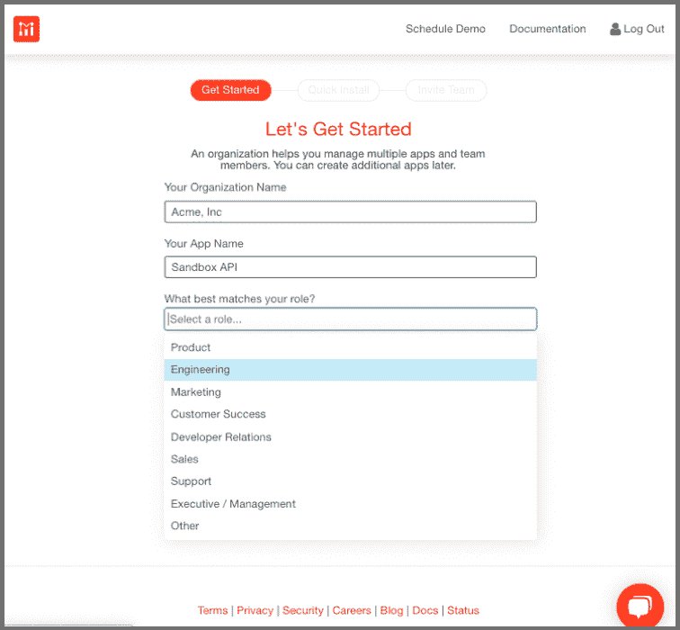
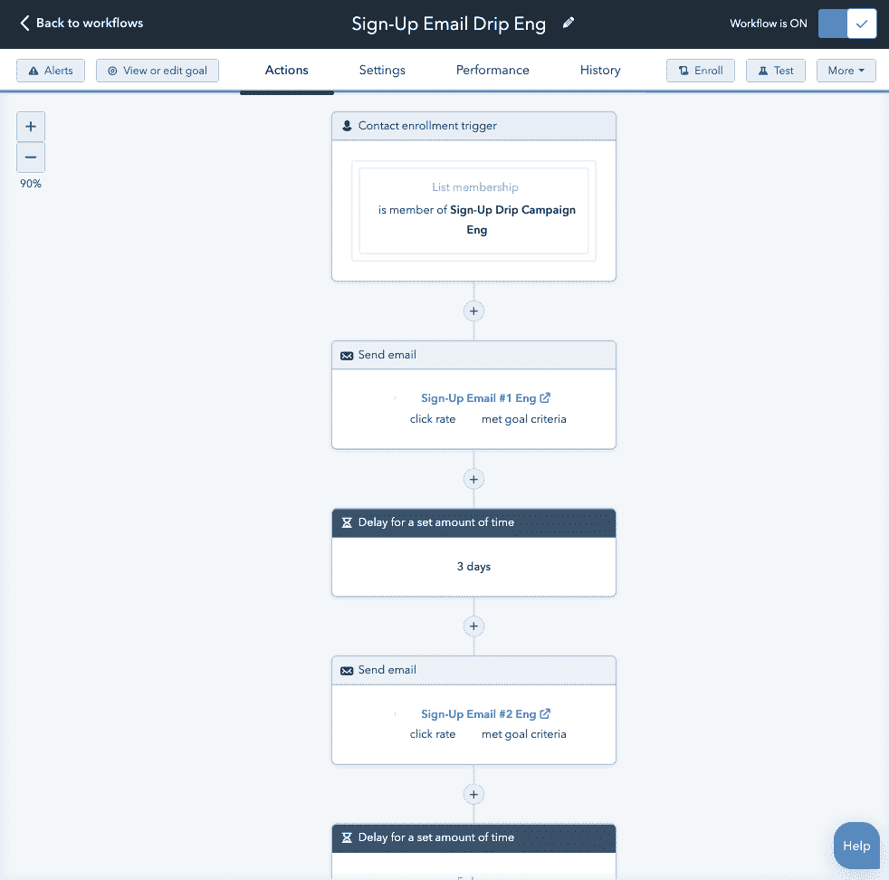

# 如何通过使用 Moesif with Hubspot 或 Salesforce 向开发人员发送客户生命周期电子邮件来改善开发人员体验

> 原文：<https://www.moesif.com/blog/technical/developer-journey/How-to-Improve-Developer-Experience-by-Guiding-Developers-With-Customer-Lifecycle-Emails-using-Moesif-and-Hubspot-or-Salesforce/>

让你的公司成功取决于你的客户能够支持你的产品，并从中获得价值。当你使用集客营销来获得客户时，电子邮件不一定要被归为二等公民。我们认为电子邮件是 B2B 公司与其客户之间最强大的沟通渠道之一。

如果你专注于开发人员，那么你应该认真考虑部署生命周期电子邮件作为产品体验的一个关键组成部分。当您遵循自助服务模式时尤其如此，因为支持扩展的唯一方式是尽可能多地自动化流程。在内部，我们利用自己的 API 分析工具，与 HubSpot CRM 集成，作为催化剂推动开发人员通过采用漏斗。

> 跟踪用户/网站行为，然后利用这些数据推动你的滴滴推广活动——鼓励你的开发者完成整合，尝试你的所有功能

## 构建成功的生命周期电子邮件计划的步骤

通过发送及时和适合阶段的电子邮件，而不是只发送漏斗顶部的电子邮件，你将能够大规模地建立长期的客户关系。这篇博客文章向你展示了我们在 Moesif 是如何做的，并且反过来把我们的客户群扩大到了成千上万的开发者:

### 第一步。将您的 CRM 与 Moesif 集成

Moesif 与 Salesforce 和 HubSpot 集成，因此您可以将 API 参数直接导入 CRM 工具。设置集成时要记住的事项:

*   Moesif 中的用户对应于 HubSpot 中的联系人和 Salesforce 中的帐户，
*   Moesif 中的公司对应于 HubSpot 中的公司和 Salesforce 中的帐户，
*   任何字段都可以从 Moesif 映射到 HubSpot 或 Salesforce 对象

在我们的内部实现中，我们将 Moesif 的 API 分析平台中的许多字段映射到 HubSpot 对象。示例字段包括以下内容:

| 田 | 描述 |
| --- | --- |
| 电子邮件 | 注册时，客户提供他们的电子邮件 |
| 作用 | 在注册过程中，客户提供他们的角色 |
| 计划 | 客户订阅的计划 |
| 首次注册日期 | 当客户首次集成您的平台时 |
| 首次 API 调用日期 | 当他们发出第一个 API 调用时 |

Moesif 支持将任何字段映射到 HubSpot 对象，包括客户第一次与您的平台集成的时间，他们的第一次 API 调用，以及他们使用了多少 API。

### 第二步。根据原则对电子邮件进行分类

不要给每个人都发同样的邮件，往好了说这是浪费时间，往坏了说这是在积极破坏你的客户关系。按角色对您的客户进行细分，然后将信息与他们的特定专业相匹配。许多 API 平台公司主要销售给开发者，但是产品经理、CSM、开发者关系和高管都可能是潜在的买家，或者至少在购买决策中是重要的。

### 第三步。设置电子邮件工作流程

电子邮件工作流是一系列基于用户/网站行为触发的自动化电子邮件。通过从几十个触发器、条件和操作中进行选择，您可以在正确的时间向正确的客户发送正确的电子邮件。利用这些*点滴电子邮件*活动，你可以将潜在客户培养置于自动驾驶状态，并无限扩大你的入职规模。

就像电影行业在 20 世纪 30 年代制定的营销规则 7(他们发现，在你购买产品之前，你需要“听到”广告商的信息至少 7 次)，电子邮件工作流程可以很容易地让你的客户记住你。

最佳实践要求在你的公报中提供真正的价值，而不仅仅是反复要求交易。我们发现，2-3 个目标内容的节奏，然后提供帮助或推广，大约是正确的平衡。

### 第四步。发送基于时间的电子邮件

在自助服务采用中，您的客户应该已经在注册过程中输入了他们的角色。我们竭尽全力为每一类客户创建不同的工作流程:开发人员、产品经理、客户成功专家、开发人员关系、执行人员等。

注册后，每位新客户都会收到一封有针对性的欢迎电子邮件，向他们介绍最适合其专业的产品功能。例如，开发人员的信息是花更少的时间调试，花更多的时间开发，而产品经理则是推动更高的采用率和参与度。同样，电子邮件的行动号召按钮(标题为“工程师解决方案”或“产品经理解决方案”)，重定向到我们网站的不同部分。

经过一段时间后，我们发现 3-5 天的间隔效果很好，序列中的下一封电子邮件将被发送。同样，内容是针对客户的领域的，开发人员会收到技术文章和操作指南，而产品团队会收到业务电子书和案例研究。温和的提醒电子邮件穿插在增值内容之间，例如提供帮助集成或咨询以充分利用您的 API 计划。

客户和他的公司保持在这些序列中，直到我们的平台被集成并且 API 调用开始。一旦进行了第一次 API 调用，我们就转移到基于行为的电子邮件中的其他工作流。

### 第五步。发送基于行为的电子邮件

基于 API 指标的基于行为的电子邮件才是真正神奇的地方。通过向您的客户传达符合他们在生命周期谱中特定位置的信息，您可以使互动更加切中要点，更有可能提供帮助，也更有可能赢得客户的好感。

我们发现以下基于行为、以 API 为中心的电子邮件是一个很好的起点:

| API 度量 | 电子邮件主题 |
| --- | --- |
| 进行第一次 API 调用 | 恭喜你被安排好了 |
| 接近计划定额 | 计划警告 |
| 超计划定额 | 计划升级 |
| 超过 400/500 错误流或 SLA | 检查集成的错误警告 |
| 使用过时或易受攻击的 SDK | 升级警告 |
| 中断供应 | 全球断电警告 |

显然，您可以将时间和中断驱动的触发器结合起来，如下所示:

| API 度量 | 电子邮件主题 |
| --- | --- |
| 前 7 天没有 API 调用 | 文档和行动手册的集成帮助 |
| 在过去 Z 小时内，端点 Y 上出现超过 X 个错误 | 检查端点 Y 的错误警告 |
| 过去 24 小时内超过 100 个 API 调用 | CSM 通知 |

## 将 Moesif 与您的 CRM 相结合，提高入职效率

电子邮件是你的产品和品牌的核心部分。通过将您的 CRM 与 Moseif 的 API 分析平台相结合，您可以利用 API 使用数据并创建高度个性化的客户生命周期电子邮件。组合解决方案可以成为真正的催化剂，吸引开发人员并加速他们通过采用漏斗。