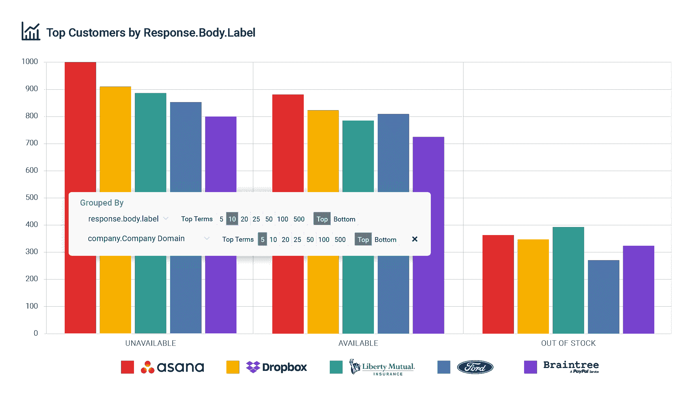

# 如何记录来自 Envoy 代理的 API 流量并使用 Moesif 监控指标

> 原文：<https://www.moesif.com/blog/technical/envoy/How-to-Log-API-Traffic-from-Envoy-Proxy-and-Monitor-Metrics-with-Moesif/>

Envoy 是为微服务和面向服务的架构设计的高性能 C++分布式代理，也是为大规模服务网格设计的可扩展通信总线和“通用数据平面”。Envoy 与每个应用程序一起运行，并通过以平台无关的方式提供通用功能来抽象网络。当基础设施中的所有服务流量都通过 Envoy mesh 流动时，除了在单一位置添加底层功能之外，还可以轻松地集中可观察性、安全性等交叉问题。Envoy 支持静态配置模型，还允许通过 gRPC/proto buf API 进行配置，从而简化大规模管理。Envoy 还提供了各种过滤器来增加对 gRPC、速率限制、阴影、金丝雀路由和 API 可观察性的支持。

[API 可观察性](/blog/api-engineering/api-observability/What-is-API-Observability/)是一种新趋势，它是传统监控的发展，使业务和工程团队能够回答任意问题。传统的监控可以回答*已知的未知数*，如*每分钟错误*或状态，如*红色、黄绿色*，因为监控通过探测已知的指标来工作，因此您将添加性能计数器或其他工具来监控该指标。另一方面，API 可观察性使你能够回答*未知的未知*，这些未知来自复杂的工程和商业挑战。

Moesif 为 Envoy 提供了一个插件，只需几分钟就可以开始使用 API observability，这样您就可以专注于提供客户喜欢的功能，而不是处理构建自己的数据基础设施的维护成本。在本文中，我们将讨论 Moesif 为您提供的见解，以及如何将其集成到您的 Envoy 代理中。然后，我们将讨论如何使用 Moesif 和 Envoy 来最好地利用 API 的可观察性。


## 特使背景

如果您是一名微服务实践者，在为您的组织的 API 产品组合迁移到分布式架构时，担心联网和可观察性问题，那么您最有可能的解决方案是在您的技术堆栈中包含一个服务代理平台。在当今以云为中心的世界中，业务逻辑通常分布在微服务中。每个服务都有依赖于该服务的其他消费者，无论是其他团队、合作伙伴，甚至是产生收入的客户。虽然其中大多数是 RESTful APIs，但它们也可以是 SOAP、gRPC、GraphQL、Thrift 或其他协议。“(从技术上讲，gRPC 仍然使用 http/2，但不像我们典型的 JSON/RESTful API)。管理和观察 L7 对于任何云应用都至关重要，因为应用语义和弹性的很大一部分都依赖于 L7 流量。

在可用的代理中，HAProxy、NGINX 和 Envoy 是可靠的、经过验证的代理，Envoy 是最新的一个。虽然 HAProxy 是一个非常可靠、快速且经过验证的代理，但人们对微服务可用的最小功能集存在担忧。NGINX 最初是作为一个 web 服务器设计的，随着时间的推移，已经发展到支持其他用例，如代理服务器和 API 网关。NGINX 是一个高性能的 web 服务器，支持无中断重新加载，但是 NGINX 开源有很多限制，包括有限的可观察性和健康检查。Envoy 完全是为微服务而设计的，具有无中断重新加载(称为热重启)、可观察性、弹性和高级负载平衡等功能。Envoy 还采用分布式架构，将最终一致性作为核心设计原则，并为配置提供动态 API。

## 如何设置 Envoy API 监控

使用 Moesif Envoy 过滤器，您的 API 流量将被记录到 Moesif 中，以进行分析和报告。Moesif 为工程团队提供了深刻的见解，以了解如何使用他们的 API，并快速解决复杂的问题。因为 Moesif 还跟踪谁在调用你的 API 以及它们是如何被访问的，所以产品驱动的团队可以了解整个客户之旅以及在哪里投入更多的资源。借助 API 可观察性，具有前瞻性思维的工程领导者可以通过对激活漏斗、保留报告等进行自助式分析，增强面向客户的团队的能力。Moesif 还分析您的 API 有效负载，以便进行故障排除和业务洞察，这样您就能够了解特定有效负载键的使用情况，等等。

Envoy 公开了各种 API，允许您动态配置代理。通过配置一个允许 Envoy 在可配置地址监听网络流量的`Listener`，您可以启用通过代理的流量，并使用几个`Filters`增强数据流。HTTP 级过滤器的 API 允许过滤器在不了解底层协议的情况下运行。

Moesif 使用 HTTP Lua 过滤器来捕获 API 请求/响应，以便进行 API 分析和监控。当 Envoy 在配置中加载脚本时，它会查找脚本定义的两个全局函数:`envoy_on_request`和`envoy_on_response`。在请求路径中，Envoy 将运行`envoy_on_request`向请求 API 传递句柄，而在响应路径中，Envoy 将运行`envoy_on_response`向响应 API 传递句柄。

对于每个请求，当调用`envoy_on_request`函数时，Moesif 捕获请求方法、头和主体信息，当调用`envoy_on_response`函数时，moes if 捕获响应状态代码、头和主体信息。它将该事件添加到队列中，并定期刷新队列以将事件发送到 Moesif。Moesif 确保即使在高流量期间也不会通过批处理事件增加延迟。

### 添加 Moesif Envoy 插件

要为特使添加 Moesif 插件，您需要您的 Moesif 应用程序 Id。你可以通过注册一个免费的 [Moesif 账户](https://www.moesif.com)来获得一个，然后在入职时选择 Envoy。Moesif 建议对所有 Envoy 代理实例和数据中心区域使用单一的应用程序 Id。这确保了无论物理拓扑如何，您都有一个 API 使用数据的统一视图。使用 Moesif 的高基数、高维度分析引擎，您仍然可以根据任意数量的属性进行分解。

Moesif 仍然建议为每个环境创建单独的应用程序 id，如*生产*、*试运行*和*开发*，以保持数据隔离。

`envoy.yaml`文件应该是这样的:

```py
 http_filters:
    - name: envoy.filters.http.lua
    typed_config:
        "@type": type.googleapis.com/envoy.extensions.filters.http.lua.v3.Lua
        inline_code: |
        local log = require("moesif.plugins.log")

        -- Moesif configs
        log.set_application_id("Your Moesif Application Id")

        function envoy_on_request(request_handle)
            -- Log Event Request to Moesif
            log.log_request(request_handle)
        end

        function envoy_on_response(response_handle)
            -- Log Event Response to Moesif
            log.log_response(response_handle)
        end 
```

一旦安装了 Moesif Envoy 插件，您的 API 流量应该会出现在 Moesif 的实时事件流中。


[更多信息](https://www.moesif.com/docs/server-integration/envoy-proxy/)关于如何配置您的 Envoy 代理以捕获 Moesif 的流量和日志。

## 如何使用 API 可观察性

### 工程度量

您可能感兴趣的第一件事是工程度量，比如我的 API 性能如何。这种类型的指标可以通过进入 Moesif 中的*事件*->-*时间序列*视图获得。然后，您可以选择第 90 个百分位数的延迟作为要绘制的指标。然后，您可以按 URI 路由分组，以了解哪些端点的性能最差。在这里，您可以通过 API 属性(如 route、verb)以及 HTTP 头和主体字段来过滤流量。


### 业务指标

要将 API 调用与单个客户相关联，请使用`set_user_id_header()`或`set_company_id_header()`配置选项配置 Envoy。

一旦完成，你就可以通过 [Moesif 的用户跟踪](https://www.moesif.com/implementation/track-user-behaviors-with-browser?platform=browser) SDK 存储额外的客户属性，如*公司域名*或*用户电子邮件*。这使得面向客户的团队能够清楚地了解谁在使用您的 API，以及他们是如何使用的。

Moesif 支持分析常见的有效载荷内容类型，包括 JSON 和 XML。例如，您可以按`response.body.label`对 API 调用进行分组，然后按`Company Domain`进行分组，如下图所示。这显示了哪些客户由于遇到缺货问题而收到了不好的体验，即使没有抛出 500 错误。



### 漏斗报告

客户可以在您的 API 之外(比如在您的 UI 中)采取各种各样的操作。为了跟踪这个，你可以添加 [moesif-browser-js](https://www.moesif.com/implementation/track-user-behaviors-with-browser?platform=browser) 来跟踪[用户动作](https://www.moesif.com/docs/getting-started/user-actions/)。用户动作是客户在你的 UI 中完成的目标，例如*签到*或*购买计划*。一旦完成，您就可以从 UI 到 API 跟踪您的端到端客户旅程。


在上面的报告中，我们创建了一个由三个步骤组成的漏斗分析。

1.  第一步是客户登录您的 web 应用程序。
2.  从第一步到第二步显示了通过您的平台进行首次支付交易的客户的减少。到达第二步所需的时间被称为“第一个 Hello World 的时间”或 TTFHW。
3.  从第二步到第三步，显示了最终进行 100 次以上支付交易的用户的百分比。这可能是你的“啊哈”时刻，或者当有人从你的 API 中获得全部价值的时候。

## 处理敏感数据

如果您的应用程序包含敏感数据，如医疗保健或财务数据，您可以通过以下两种方式之一实现数据合规性:

### 1.零知识安全

客户端加密具有低维护 SaaS 的优势，同时仍然让您能够控制您的数据。因为在发送给 Moesif 之前，您在内部对数据进行控制和加密，所以 Moesif 实际上无法访问您的数据。这只需要在您的基础设施中运行一个名为[安全代理](https://www.moesif.com/docs/platform/secure-proxy/)的小型设备，即可动态处理数据的加密/解密。

### 2.数据屏蔽

如果不想客户端加密，也可以直接使用插件屏蔽数据。这通过`set_request_body_masks()`和`set_response_body_masks()`配置选项来处理。例如，您可以屏蔽有效负载中可能出现的名为*密码*的字段。此外，如果您想一起删除日志请求和响应主体，您可以将`set_disable_capture_request_body()`或`set_disable_capture_response_body()`配置选项设置为`false`。

## 结束语

有了 Moesif Envoy 插件，您的工程和业务团队就拥有了深入的 API 可观察性，而无需花费高昂的成本来构建和维护您自己开发的工具。

要查看 Envoy 与 Moesif 的集成，您可以从 [GitHub](https://github.com/Moesif/moesif-envoy-plugin/tree/master/example) 中克隆并运行这个示例应用程序