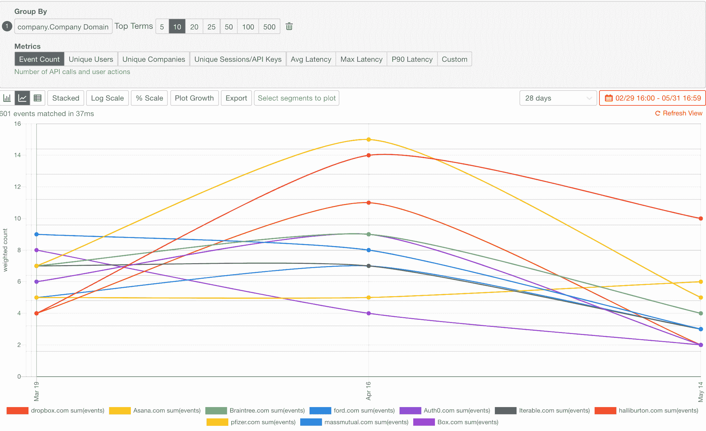
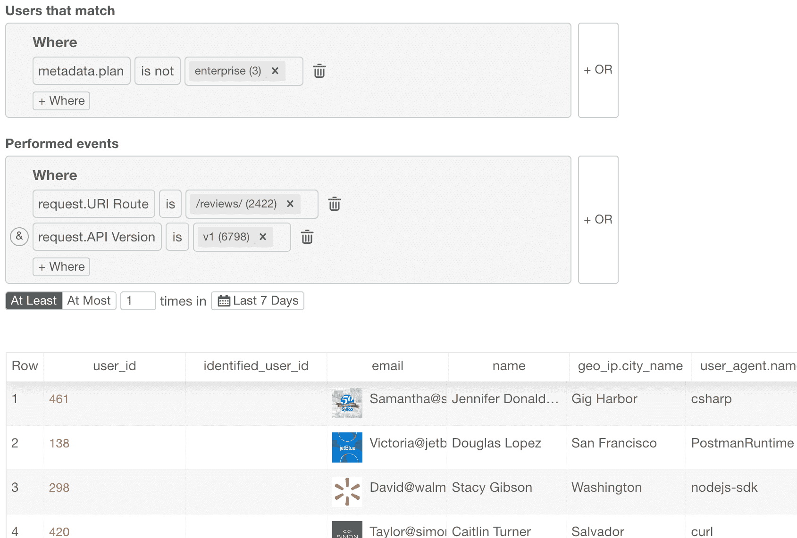
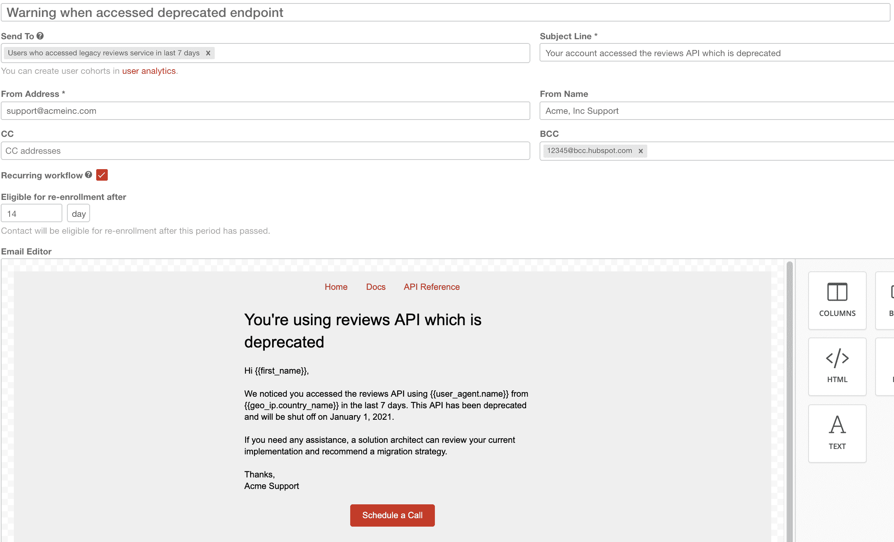
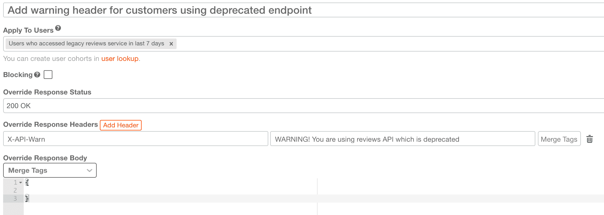
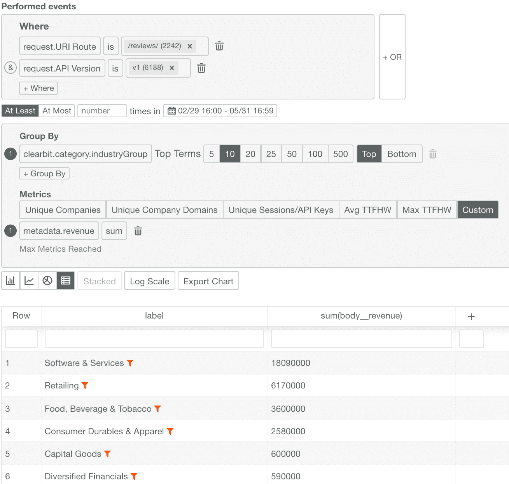

# 如何使用 moesif 正确弃用 api

> 原文：<https://www.moesif.com/blog/api-product-management/deprecation/How-to-Properly-Deprecate-an-API-Using-Moesif/>

与任何产品生命周期一样，API 架构师和 API 产品所有者的主要职责是决定何时终止或淘汰某个特性或产品。API 生命周期也不例外，但是需要仔细规划来执行弃用，以最小化对客户的影响。与更像黑盒的打包解决方案或模块不同，API 使您的客户能够构建可能需要数月集成工作和测试的定制功能。如果没有正确的评估或流程，您可能会过早地弃用某项关键服务，从而导致大量支持票。

本指南介绍了弃用和终结点的最佳实践，以及如何使用 [Moesif API Analytics 轻松做到这一点。](https://www.moesif.com/solutions/api-product-management)

## 为什么反对任何东西？

在一个预算无限的理想世界中，一个 API 产品被完美地设计来处理每一个客户用例，并且可以永远存在。然而，真实的产品受到不断变化的业务需求的约束和影响，因此需要不断发展以满足这些需求。因此，正常的业务过程是淘汰不再符合当今需求和目标的 API 或服务。这可能是删除一些字段、特定的端点，或者停用整个服务。

*   **维护服务的成本超过收入**如果服务不再有利可图，并且维护成本超过了它为您的组织或业务部门带来的收入，您可能希望终止该服务。

*   **迁移到新的 API 平台**如果重新构建平台或重写已经在您的路线图上，这可能是一个移除未充分利用的功能以缩小范围的好时机。

*   **改善开发人员的体验，减少膨胀**有时你想重构你的 API 规范，使其“更简洁”,从客户的角度来看更容易理解。

*   **转向产品战略或业务目标**当转向产品战略以满足新的业务目标时，您可能没有带宽来维护与这些目标不一致的旧用例。

*   **失去关键团队成员和机构知识**如果服务或功能的原所有者从公司离职，培养新成员的成本可能会超过该功能的价值。

*   **传统功能带来安全和合规风险**为传统支持维护易受攻击的终端可能会使您面临不必要的安全或合规风险。应该制定日落计划，将客户转移到更新的实施。

*   **API 效率低下或容易出错**一些 API 可能容易出错，或使您的基础设施面临可靠性问题。例如，一个导出 API 可能没有被广泛采用，却消耗了您的大部分支持票或导致中断。

## 逐步淘汰和废弃的 API

放弃一个端点需要一个定义良好的过程来最小化对 API 消费者的干扰，不管他们是组织中的其他团队还是创收客户。这个过程有时被称为*日落*，不出所料，它指的是夜幕降临前的那段时间，我们知道夜晚即将来临，但还没有到来。在工程术语中，日落是从向客户宣布弃用到该功能被永久关闭*的这段时间。*

## 1.确定客户影响

第一步是通过放弃一个端点或功能来了解影响。您应该很好地理解谁在使用即将过时的 API，以及它如何影响客户的实现。至少，您应该了解有百分之多少的客户在积极地使用不推荐使用的功能。然而，仅仅测量 API 调用的数量是不够的。您应该有一个可量化的业务指标来衡量影响，例如潜在的收入损失、迁移到替代方案所需的工程时间或类似的指标。

### 如何用 Moesif 理解不推荐使用的 API

在本例中，我们放弃了端点`/reviews`的 v1。从两个图表中可以相对容易地看出这种贬值的影响。首先，我们希望看到 API 的使用按公司名称进行分类。在本帖的后面，我们还将展示如何理解美元对收入的影响。

## 2.宣布折旧计划

既然您决定继续进行弃用，那么您需要向您的 API 客户宣布您的弃用(终止)计划。这应该发布在你的项目博客 changelog 上，也可以直接通过电子邮件发给开发者。您还应该在任何开发人员文档或 API 参考中将端点标记为不推荐使用。如果你使用 OpenAPI 或 Swagger，很容易通过将`deprecated`设置为 true 来将*参数对象*或*操作对象*标记为不推荐使用

你的时间表应该有几个关键日期:

*   弃用公告日期
*   限电日期和流程
*   最终关闭日期

**限制用电**或**滚动封锁**是一种不赞成使用的策略，在短时间内(如 15 或 30 分钟)阻止对不赞成使用的功能的访问，以帮助提醒 API 消费者即将关闭。

你会想尽快发送这些邮件，开始你的日落倒计时。

## 3.当客户使用不推荐的功能时，向他们发送电子邮件

即使你通过电子邮件或博客宣布反对，也不是每个人都会阅读该公告，或者他们认为该公告无关紧要而不予理会。这就是提供基于 API 行为的个性化客户之旅的关键所在。每当客户使用不推荐的功能时，马上让他们知道。这可以通过 HTTP 响应头和行为电子邮件(客户生命周期电子邮件)的组合来实现。

### 如何使用 Moesif 自动发送反对电子邮件

要使用 Moesif 自动发送反对警告电子邮件，您需要执行两个步骤。首先，创建一个保存的用户群组，这些用户仍然在使用不推荐使用的功能。在本例中，我们取消了 API 的`v1`版本的`/reviews/`端点，因此我们创建了一组在过去 7 天内至少访问过`reviews`一次的所有用户。我们还排除了拥有专职客户经理的企业客户。

一旦完成，下一步就是设计一封发送给这些用户的 HTML 电子邮件。这可以通过使用[行为邮件](https://www.moesif.com/features/user-behavioral-emails)编辑器来完成。我们希望每 14 天提醒一次客户，只要他们仍然是用户群体的一员(即在过去 7 天内访问过不推荐使用的 API 的用户)。

## 4.使用 HTTP 响应头警告客户

即使您向数据库中的每个客户发送警告电子邮件，有时负责人也不会收到，因为开发人员的联系信息不再有效，电子邮件被发送到垃圾邮件，开发人员跳槽到了另一个项目或雇主，等等。确保相关开发人员收到弃用通知的推荐方式是应用内通知。虽然您可能首先想到的是应用内门户，但并不是每个人都会定期登录 API 提供商的仪表板。

我们建议采用 [Clearbit 的 API 弃用方法](https://clearbit.com/blog/dealing-with-deprecation/),其中包括添加一个`X-API-Warn`响应头。这也可能被您拥有的任何客户端 SDK 截获并打印到 stdout。

### 如何用 Moesif 自动设置 HTTP 响应头

使用 Moesif，这相对来说没有痛苦。您可以利用类似的流程，为使用不推荐的端点的客户创建用户群组。然后，当客户使用废弃的`/reviews`端点时，您可以使用[治理规则](https://www.moesif.com/features/api-governance-rules)来自动添加`X-API-Warn`。在这种情况下，我们还不想阻塞请求，我们只是想添加响应头，所以我们没有选中*阻塞*。只要客户继续使用不推荐使用的端点，此规则将保持启用并添加标头。

## 5.实施限电策略

您永远不能过多地传达可能会破坏客户集成的更改，例如 API 弃用。然而，有时开发者*仍然*不采取行动。一种半强迫客户做某事的方法是用限电或滚动停电策略。该策略暂时关闭对特征或服务的访问，例如一周内每两天关闭 15 分钟。这将有助于触发您的客户可能设置的任何警告和警报。

当开发人员在计算机前的机会很高，他们可以迅速采取行动，但最终用户的影响很小时，建议强制实施限电。例如，您可能需要在正常工作时间进行限电。然而，如果你提供一个位于美国境内的电子餐饮 API，你可能不希望在东海岸或西海岸的午餐时间前几个小时关闭你的 API。

如果您预计会有大量的支持票，您可以实施滚动停电，每次只“关闭”选定的客户，而不是所有人，就像在非常高的需求期间(如热浪期间)计划的滚动停电一样。

## 6.监控使用情况，看弃用是否安全

既然您已经执行了大部分弃用计划，那么分析弃用端点的使用趋势是一个好主意，这样可以了解永久关闭访问是否安全。希望到目前为止，没有多少客户在访问过时的端点或功能。您可能有一些掉队的服务，它们是不再维护的幽灵服务，但是最好是安全的，并且完全了解谁还在使用端点。

如果 API 用户是关键客户，你可能需要推迟一段时间来与这些客户合作。拥有复杂系统的大客户有时是最后迁移的。这可以使用 Moesif 的 API 分析轻松完成。

### 如何理解 Moesif 对收入的影响

有时最好更进一步，不仅要了解谁在使用不推荐的端点，还要了解潜在的收入损失。这取决于 API 如何打包和定价，但无论 API 利用基于使用的定价还是预付费客户合同，都可以做到这一点。在这种情况下，使用`/reviews`的 v1 的所有客户的总收入按客户的行业细分。我们可以看到*软件&服务*(最大的类别)一项就代表了超过 1800 万英镑的收入。

## 7.关闭对该功能的访问

现在您已经添加了正确关闭该特性的所有步骤，是时候永久关闭它了。进行最后一次检查，以确保没有相邻的服务由于之前没有意识到的依赖性而出错。恭喜，您正确地完成了终止 API 的步骤。