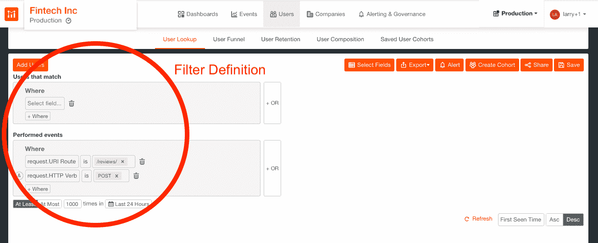
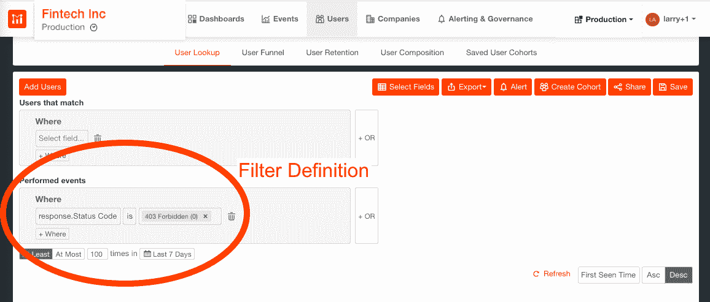
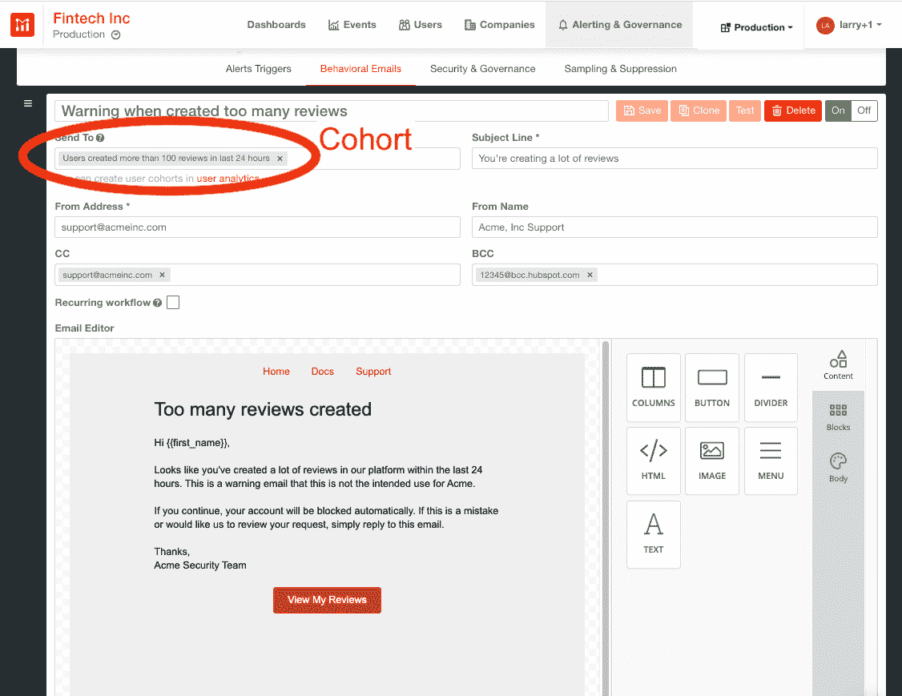
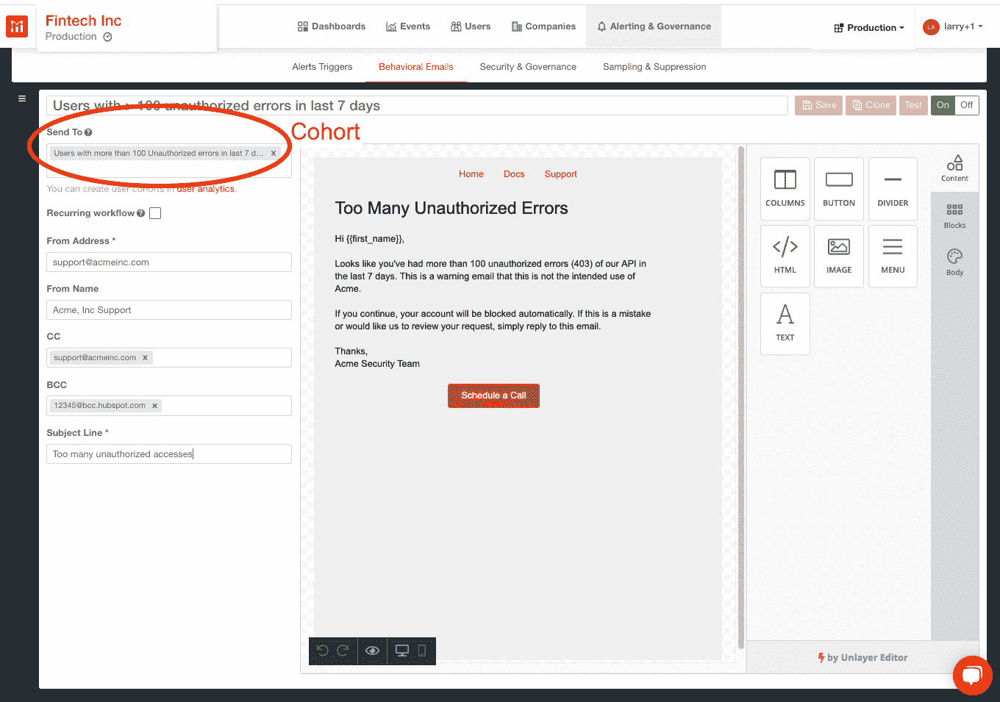

# 如何保护您的 API 免受攻击和故意滥用

> 原文：<https://www.moesif.com/blog/developer-marketing/behavioral-emails/How-to-Secure-Your-API-Against-Attacks-and-Intentional-Misuse/>

聘请一家纽约州或门洛帕克市的律师事务所来编写你的应用程序的服务条款(ToS)可能会让你放心，但你如何确保你昂贵的规则得到切实遵守呢？就像 B2C 公司普遍滥用客户审查指南一样，B2B 公司也存在多重/未经核实的审查问题。

类似地，根据其设计，API 也容易被不良行为者滥用，但这次是通过暴力攻击。如何保护您的 API 平台免受这两种滥用行为的侵害？

## 用例

在线评论本应是对产品和服务提供公正和有益观点的灵丹妙药。不幸的是，Yelp 上的餐馆评论或亚马逊上的产品评论经常被邪恶势力劫持。例如，亚马逊在英国《金融时报》调查后删除了 2 万条可疑评论，而在 2019 年，Yelp 发出了超过 1300 条关于企业[公然试图操纵评级和评论的警告](https://blog.yelp.com/2020/03/yelp-2019-consumer-alert-report)。

为了保持用户的信任，保持平台内容的完整性和质量是非常重要的。如果某些用户藐视你的 ToS，滥用你的 API 来创建多重评论，那么你的解决方案的可信度将会受损，你的客户可能会去别处。尽早发现那些向你发送垃圾邮件的人是很重要的。

API 为开发人员提供了一个易于使用、灵活且可扩展的接口。不幸的是，这也是攻击者社区偏好的特性集。通过将 API 访问权限限制在那些已经向您验证了其帐户的用户，可以确保一个适当的保护级别。

然而，如果一个不良分子决定使用暴力攻击来探测你的平台，那么你的帐户可能会受到威胁。如果发生这种情况，负面的**用户信任**和**品牌资产**，更不用说**的法律后果**可能接踵而至。因此，在受影响的客户的帐户被封锁和无法访问 API 之前，检测这种攻击并向他们发出警告是非常重要的。

## 保护您的 API 免受有意误用和攻击的行动手册

自动化重复过程是整个产品设计的一个关键属性。通过将高级用户行为分析(UBA)与行为电子邮件相结合，Moesif 能够让您通过许多功能、性能和产品问题的复杂工作流程提高工作效率。

本演示手册侧重于防范 ToS 违规和攻击，通过向您展示如何处理在过去 7 天内创建过多评论的警告用户或警告用户过多未经授权的错误，具体说明了 Moesif 的功能。

其他行动手册关注的是[自动通知配额和计费问题](https://www.moesif.com/blog/developer-marketing/behavioral-emails/Automatic-Notification-of-Quota-and-Billing-Issues/)以及[如何指导客户使用 Moesif](https://www.moesif.com/blog/developer-marketing/behavioral-emails/How-to-Guide-Customers-on-API-Integration-Automatically-With-Moesif/) 自动集成 API。这三部行动手册仅仅触及了我们平台的皮毛；一旦你掌握了创建自己的群组、指定触发事件和设计行为邮件的诀窍，你就会想知道在 Moesif 之前你都做了些什么。

## 配料清单

我们将使用 Moesif 的分析工具来构建这个应用程序。如果你还没有创建账户，你可以[免费注册](https://www.moesif.com/wrap?onboard=true)。

## 行动手册创建的步骤

行动手册包括工作流、sop 和文化价值观，它们共同形成了一个一致的反应—行动。不管你想达到什么目的，Moesif 行动手册包含两个关键要素:团队规范和电子邮件创建。

### 群组规范

Moesif 将[用户](https://www.moesif.com/docs/getting-started/users/)和[公司](https://www.moesif.com/docs/getting-started/companies/)定义为不同的实体，这些实体可以被分组到共享相似标准的群组中。不同的群组包括共享类似领域的群组，例如:订阅计划、端点使用、请求代码等。正如之前的[教程](https://www.moesif.com/blog/announcements/features/Leveraging-User-Behavioral-Analytics-For-API-Analytics-Platforms/)中所解释的那样，通过对用户/公司人口统计数据和行为进行过滤，可以创建群组。

要创建新的用户群组，请转到 Moesif 工具的**用户>用户查找**部分，并从下拉菜单中选择与和*执行事件*匹配的*用户字段，如下所示。事件过滤器和用户/公司字段的完整列表可以在我们的[用户分析面板](https://www.moesif.com/docs/api-analytics/#event-filters)中找到。*

*警告创建过多评论的用户*

为了创建那些行为不端用户的群组，从*执行的事件*中选择过滤器:`request.URI route is /reviews/`和`request.HTTP Verb is POST`，然后将时间段设置为`At Least 1000 times in Last 24 Hours`，如下所示。

*提醒用户在过去 7 天内出现超过 100 个未经授权的错误*

要创建在过去 7 天内超过 100 个未授权错误的用户群组，请转到**用户>保存的用户群组**，并在*执行的事件*中选择过滤器:`response.Status.Code is 403 Forbidden (0)`，然后将时间段设置为`At Least 100 times in Last 7 Days`，如下所示。

一旦设置了过滤器，Moesif 将查看所有当前和历史数据，并将所有符合过滤器标准的用户/公司组合在一起。我们还将监控用户/公司是否继续属于该群体，而无需任何人工干预。

然后，该群组可用于填充行为电子邮件中的收件人列表。

### 行为电子邮件创建

你可以使用拖放式所见即所得编辑器在 Moesif 中设计 HTML 邮件。要创建行为电子邮件，请转到 Moesif 工具的**警报和治理>行为电子邮件**部分。

第一步是添加一个新的**+模板**，其中模板包括电子邮件设计以及其他相关信息，例如哪些群组应该接收电子邮件。关于创建电子邮件模板的完整文档在[可用](https://www.moesif.com/docs/behavioral-emails/creating-email-templates/)，但可以说，电子邮件创建非常简单，一旦完成，可以使用**测试**按钮来验证电子邮件。

*警告创建过多评论的用户*

只需将预定义的群组添加到行为电子邮件的收件人列表中，通知他们创建了太多评论，违反了您的 ToS:

每当新客户在过去 24 小时内超过 1，000 条评论时，他们将被自动添加到队列中，并会发送一封电子邮件。

*提醒用户在过去 7 天内出现超过 100 个未经授权的错误*

类似地，只需将您之前定义的用户群组添加到行为电子邮件中，无论何时发生多次未经授权的访问，都会触发该行为电子邮件:

## 外卖食品

维护用户信任和品牌资产从未如此重要。识别并通知那些违反 ToS 的人，或者提醒您的客户他们的帐户可能会受到暴力攻击，这些都是良好产品治理的一部分。

借助我们的 SaaS 平台，我们努力让我们的客户尽可能高效。通过有效负载可观察性和行为电子邮件的结合，我们创建了自动化的警告流程，为您节省时间和资源。