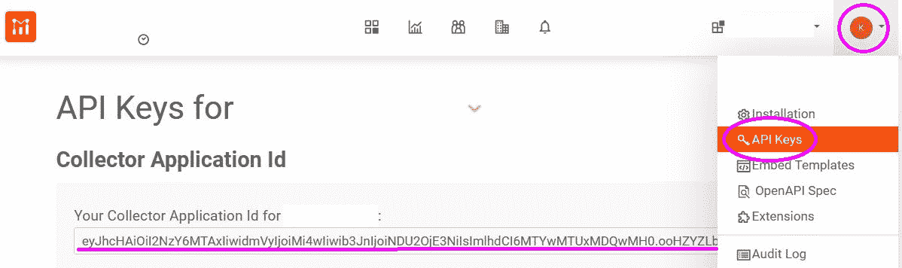
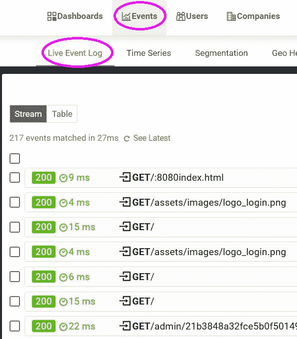

# 如何使用 Moesif 为 Strapi 无头 CMS 设置监控和分析

> 原文：<https://www.moesif.com/blog/technical/how-to/How-to-Set-Up-Monitoring-and-Analytics-for-Strapi-a-Headless-CMS-with-Moesif/>

Strapi 是一个基于 Node.js 的 Headless CMS。Headless 意味着它通过 HTTP API 提供所有内容，因此您可以轻松地围绕它构建面向用户的前端。由于它是一个完全成熟的 CMS，它带来了一个开箱即用的管理前端，使得发布和维护内容变得简单明了——即使对于那些没有技术背景的人来说也是如此。因为 Strapi 中的一切都是通过 api 工作的，所以它非常适合 Moesif API 监控。

在本操作指南中，我们将探讨如何将 Strapi CMS 与 Moesif API 监控和分析相集成。

## 先决条件

按照这个方法，你需要[一个 Strapi 安装](https://strapi.io/documentation/v3.x/getting-started/installation.html)和[一个 Moesif 账户](https://www.moesif.com/wrap?onboard=true)。

## 安装和包装 Moesif SDK

Node.js 的 Moesif SDK 是作为 Express 和 Koa 等框架的中间件提供的。由于 Strapi 构建在 Koa 框架之上，这使得集成非常容易。您需要围绕 Moesif 中间件编写一个小的包装器，使它的行为像一个为 Strapi 定制的中间件，并根据您的需求配置它。

第一步是安装 NPM 包 moesif-nodejs 作为一个新的依赖项。

```py
$ npm i moesif-nodejs 
```

接下来，您需要在`./middlewares/moesif/index.js`在 Strapi 项目中创建一个新的 JavaScript 文件。

它应该有以下内容:

```py
const moesif = require("moesif-nodejs");

const middleware = moesif({
  applicationId: "<MOESIF_APP_ID>",
  // Optional hook to link API calls to users
  identifyUser: (request, response) => {
    if (request.state.user) return request.state.user.id;
    return null;
  },
});

module.exports = (strapi) => ({
  initialize() {
    strapi.app.use(middleware);
  },
}); 
```

你需要用你的钥匙替换`<MOESIF_APP_ID>`。点击右上角的用户菜单，选择“API Keys”，就可以在 Moesif 控制台中找到这个密钥

<noscript></noscript>


一个定制的 Strapi 中间件需要用 initialize 方法公开一个对象，所以您需要在这里用一点胶水代码包装 Moesif 中间件。

> 注意:如果你使用的是 [Strapi 的用户&权限插件](https://strapi.io/documentation/v3.x/plugins/users-permissions.html#user-object-in-strapi-context)，你会发现认证后的用户对象处于请求状态。如果您查看传递给 Moesif 中间件的`identifyUser`函数，您会了解如何提取特定于用户的数据。这同样适用于您可以用来配置 Moesif 中间件的`identifyCompany`函数。

## 配置 Strapi 以加载中间件

既然我们已经创建了 Moesif 中间件，我们必须告诉 Strapi 它应该加载它。为此，我们必须在创建一个配置文件。/config/middleware.js，并将以下配置代码添加到其中:

```py
module.exports = {
  settings: {
    moesif: { enabled: true },
  },
}; 
```

本例中的 moesif 设置对应于目录。/中间件/moesif 在这里。

## 在 Moesif 控制台中查看 Strapi 事件

如果设置正确，现在可以在 Moesif 控制台中看到 Strapi HTTP 事件。只需导航到“事件”，然后“实时事件日志”

<noscript></noscript>


正如您在截图中看到的，甚至管理请求都在事件日志中，这样您就可以跟踪与您的 Strapi 安装的每次交互。

## 摘要

Strapi CMS 是一个低代码解决方案，这意味着它让您无需编码就可以做很多事情，但是当您需要更多定制时，您仍然可以添加代码。这种方法使得非技术团队成员可以轻松使用 Strapi，并允许您在需要时添加定制的功能，如 Moesif API 监控和分析。

由于 moes if API monitoring and analytics 附带了一个出色的图形用户界面，非技术团队成员可以从一开始就独立工作。