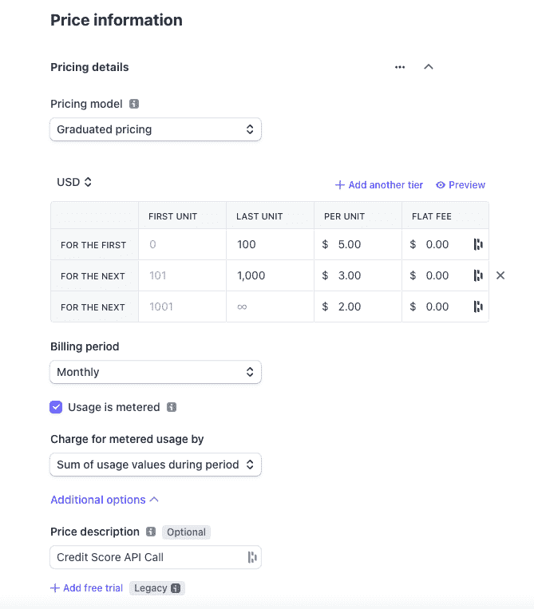
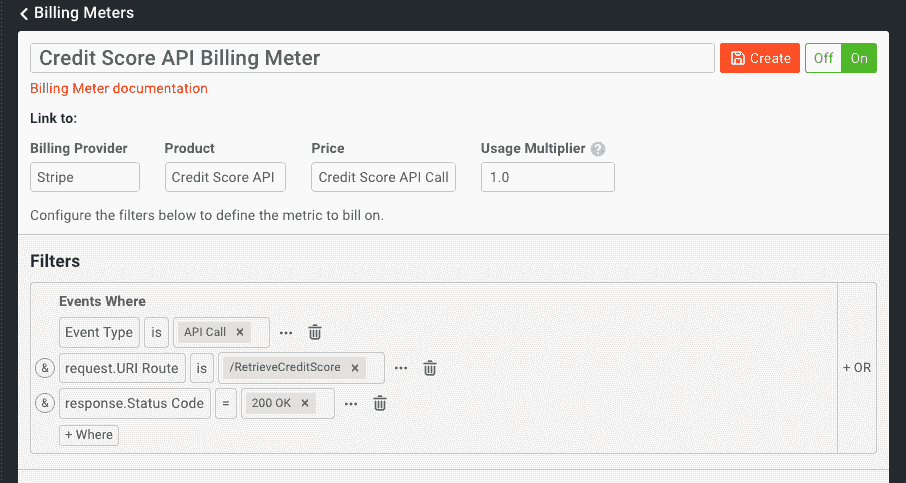

# 如何使用 Stripe 和 Moesif 为您的 API 设置基于使用的计费

> 原文：<https://www.moesif.com/blog/developer-platforms/stripe/How-to-Set-Up-Usage-Based-Billing-with-Stripe-and-Moesif-for-your-API/>

一个好的商业模式是一个容易产生收入的模式。通常，当开发人员构建一些东西时，它很容易被另一个组织打包和使用。对于 API 来说，这一点尤其正确。如果一个 API 正在解决一个众所周知的问题，它很可能会有市场。能够公开 API 供公众使用可以通过许多方式实现，一个流行的选择是使用 API 网关。当你决定开始按使用计费时，真正的障碍就来了。货币化是希望为其 API 实现基于使用计费的公司所面临的最大挑战之一。

API 货币化通常需要大量的集成、大量的代码、定制，还会导致大量的支持负担。当事情没有按计划进行时尤其如此，可能是由于计费设置中的错误，计费问题出现了。简而言之，无论是在实施过程中，还是在计费系统启动并运行后，都存在挑战。

如果有一种更简单的方法是可能的呢？在 Moesif，我们最近为**计费表**引入了一项功能。此功能允许您汇总进入 Moesif 的使用数据，将这些数据发送给计费提供商，并向用户提供准确的账单，所有这些工作只是实现定制解决方案所需工作的一小部分。

为了说明它是如何工作的，让我们假设我们有一个 API，我们希望对客户的使用进行收费。作为一个例子，让我们假设我们已经创建了一个新的信用评分 API，公司可以使用它将消费者的信用评级带回他们的应用程序。我们的 API 将是 **/RetrieveCreditScore** ，用户将为他们发送到端点的每个查询/调用付费。

我们的 API 货币化模型将非常简单。我们将有 3 个使用层级来决定向用户收取多少费用:

*   每月 1-100 次查询(每次查询 5 美元)
*   每月 101-1000 次查询(每次查询 3 美元)
*   每月 1001 次以上的查询(每次查询 2 美元)

这种分级定价方案很常见，使用的服务越多，折扣就越大。

Stripe 将作为计费提供商，我们将使用它向客户开具发票并收取使用费。Stripe 易于使用，使我们能够轻松设置产品和定价，以符合上述定价方案。在 Stripe 中，这种定价方案被称为**分级定价**。

> 当然，有多种方法可以在 Stripe 中实现与 Moesif 兼容的定价方案。这只是如何做到这一点的一个例子。

我们现在将使用 Moesif 来统计端点的使用情况，并将使用指标发送到 Stripe。然后，Stripe 可以使用这些指标，根据指标对应的层，向客户开出相应的账单，并收取费用。

# 将您的应用和 API 与 Moesif 集成

为了使用 Moesif 中的**计费表**特性，您需要将您的 API 与 Moesif 集成。这是因为 Moesif 将需要来自 API 使用的指标，以便向 Stripe 发送准确计费所需的信息。一旦您的 API 与 Moesif 集成，您还可以使用与我们的**计费表**功能配合良好的其他功能，包括行为电子邮件、治理规则和警报。

如果您目前没有使用 Moesif 来监控您的 API，那么集成可以通过几种不同的方式来完成。如果您使用的是 API 网关或 API 管理平台，您可以使用我们众多插件中的一个，这些插件允许您将度量数据从您的 API 快速移动到 Moesif 中。如果您不使用第三方网关或管理平台，或者希望在 API 代码级别使用，您可以使用我们的 SDK 之一。Moesif SDK 将允许您直接从代码中轻松地将 Moesif 与您的 Node、Python 或 Java APIs(加上许多、许多语言和框架)集成在一起。两种方式都很容易支持。

为了使计费正常工作，您需要部署的另一个 Moesif 特性是实现用户和公司跟踪。通常，这可以通过几个简单的步骤来设置。我们需要启用此功能，以便 Moesif 中的使用数据可以绑定到特定的用户和公司。这就是 Stripe 如何将使用情况映射到 Stripe 内的客户，以便他们可以相应地计费。

一旦您与 Moesif 集成，并启用了用户和客户跟踪，您的下一步将是在 Stripe 中实际创建您的产品，以便它们可以在 Moesif 中使用。

# 在条带中创建计划和附加组件

创建 Stripe 帐户并登录后，您可以开始创建用于计费的产品。在本例中，我们将创建一个具有分级定价方案的产品。

您需要创建一个条纹产品，该产品:

*   包括一个**分级**定价模型
*   有一个**月**的计费周期
*   使用**计量计费**
*   在时间段内**使用价值总和的计量使用费用**
*   可选(但推荐)，包括**价格描述**

完成所有配置后，我们将创建我们的定价方案。该配置在条带中将如下所示:

现在，在月末，当 Stripe 创建发票时，它将根据这些层来创建发票。当然，在这一点上，我们只定义了计划，但没有人会被收费，因为我们还没有任何使用数据被发送到条带。

# 将条纹与 Moesif 集成

我们仍然需要将数据从 Moesif 转移到 Stripe，反之亦然。有两种机制用于此:webhook 和 Stripe API。在促进平台之间的数据共享方面，两者各有不同的作用。

通过将 webhook 添加到 Stripe 中，订阅更新可以发送回 Moesif。通过使用 Stripe API，Moesif 可以向 Stripe 发送使用详细信息，还可以检索 Stripe 中可用产品和定价的详细信息。这两个接触点是 Stripe 和 Moesif 集成所需要的。幸运的是，当您将 Stripe 设置为计费提供商时，Moesif 会带您完成这一步，并提供所有需要的详细信息。具体情况，你也可以查看我们关于条带集成的[文档。](https://www.moesif.com/docs/metered-billing/integrate-with-stripe/?utm_campaign=Int-site&utm_source=blog&utm_medium=body-cta&utm_term=usage-based-stripe)

# 设置您的计费参数

一旦你在 Moesif 中集成了 Stripe，你就可以设置你的计费表了。对于我们的例子，这将是非常简单的。我们要做的是，每当对 **/RetrieveCreditScore** 的 API 调用返回一个 **200 OK** 响应时，就向 Stripe 发送使用度量。这意味着我们将只对成功的呼叫计费，而不会意外地对出现错误的呼叫计费。

一旦我们创建了计费表，每个小时每个客户的使用量将被发送到 Stripe。月底，Stripe 将根据我们的分级价格结构创建发票，并向用户收费。

> 您还可以使用 Moesif 为每一个成功的电话自动发送行为电子邮件，或者如果他们即将进入下一个折扣级别。您还可以使用 Moesif 的治理规则来阻止发票过期的用户访问 API，直到他们的发票得到结算。

# 你自己试试吧

如您所见，离易于实现和支持的健壮 API 货币化只有几步之遥。通过同时使用 Moesif 和 Stripe，您可以在几分钟内向客户收取使用费，管理订阅，甚至可以使用 Moesif 的其他功能来创建终极客户体验。我们的计费设置非常简单，甚至不需要任何开发人员的技能就可以完成。

所有 Moesif 用户均可使用**计费表**功能。[立即注册](https://www.moesif.com/wrap?onboard=true&utm_campaign=Int-site&utm_source=blog&utm_medium=body-cta&utm_term=usage-based-stripe)moes if，立即访问我们的**计费表**功能，开始为您客户的 API 使用计费。如果您已经在使用 Moesif，请点击左侧导航菜单中的**计费表**，查看我们的文档，了解让您将 API 货币化的具体步骤。