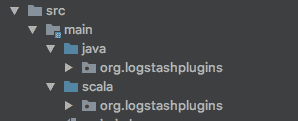

# Logstash Filter 在 Scala 中动态运行 ElasticSearch 查询

> 原文：<https://www.moesif.com/blog/technical/logstash/Logstash-Filter-to-run-ElasticSearch-Queries-Dynamically-on-Events-in-Scala/>

## Scala 中弹性搜索查询的 Logstash 过滤器

不要将此过滤器与 Logstash 内置过滤器 [ElasticSearch](https://www.elastic.co/guide/en/logstash/current/plugins-filters-elasticsearch.html) 混淆，后者可用于将 ElasticSearch 中现有事件(或任何其他对象)的字段加载到当前事件中。这里解释的 Logstash filter 用于检查事件是否与给定的 es 查询相匹配，并根据事件是否满足查询来采取行动。这个 logstash 过滤器也是在 Scala 中开发的(除了 java 中的插件链接部分)。

因此，无论是对设计通过在事件上运行 ES 风格的查询来采取某种行动的解决方案感兴趣的人，还是对在 scala 中开发 Logstash filter 感兴趣的人，这篇文章都是相关的。本文首先关注如何在 scala 中开发 Logstash filter，然后关注如何实现 Logstash filter 来通过 es 风格的查询过滤事件

## 如何在 Scala 中开发 Logstash 过滤器

Logstash 7.2.0 包含对 Java 插件(GA)的原生支持。早期的[版本(6.6.0)](https://www.elastic.co/blog/previewing-native-support-for-java-plugins-in-logstash) 提供了测试版支持。关于[如何编写 java 过滤插件](https://www.elastic.co/guide/en/logstash/current/java-filter-plugin.html)的 Logstash 文档对如何用 Java 编写插件有明确的说明。我将只关注在 scala 中开发插件所需的额外变化。

下面是如何将 scala 源文件链接到 [Java 示例过滤器插件](https://github.com/logstash-plugins/logstash-filter-java_filter_example)的说明

### 创建 scala 源模块

您需要在项目 src/main 下创建一个 scala 目录，并将其标记为 source 文件夹(这些是针对 IntelliJ 的说明，其他 IDE 可能需要遵循不同的步骤)。确保在 IntelliJ 模块设置中包含 scala 库依赖。在 scala 源代码模块下，可以根据需要创建包和源文件。项目结构可能如下所示



### 梯度构建配置

Gradle 构建配置文件可用[此处](https://github.com/logstash-plugins/logstash-filter-java_filter_example/blob/master/build.gradle)需要更改为包括

1.  scala 库依赖

2.  首先编译 scala 代码，然后编译 java 代码的配置

对于步骤 1，当构建插件时，确保 scala 库 jar 包含在最终的 jar 中(grad le dependencies . implementation 选项编译代码，但是除非使用 dependencies.compile 选项，否则不会包含所需的 scala 库)，否则您会遇到问题，插件的 scala 部分不会在 Logstash 中执行。这是因为 Logstash 运行时环境不需要 scala 库

```py
apply plugin: 'java'
// gradle plugin for scala
apply plugin: 'scala'

// step 1 to include scala library into final jar
dependencies {
    compile 'org.scala-lang:scala-library:2.11.12'
}

// step 2 to comple scala code first 
tasks.compileJava.dependsOn compileScala
tasks.compileScala.dependsOn.remove("compileJava")

sourceSets {
    main {
        scala {
            srcDirs = ["src/main/scala"]
            outputDir = file("$buildDir/classes/scala/main")
        }
        java {
            srcDirs = ["src/main/java"]
            outputDir = file("$buildDir/classes/java/main")
        }
    }
} 
```

通过对 gradle.build 文件的上述更改，src/main/scala 中的 scala 源代码应该在 java 和 gem 文件中生成的 fat jar(之后)之前编译。/gradlew gem)应该包含在 Logstash 中运行插件所需的所有库

### 在 java 源文件中使用 scala 类

在 java 类中使用 scala 类/对象/方法非常简单，这里有几个例子

## 针对事件运行 ES 样式查询的 Logstash 过滤器

ElasticSearch 查询支持多种运算符，包括搜索数据的聚合。这里我们只关注测试事件字段的布尔查询。测试事件字段的示例查询

查询 A

```py
{  "query":  {  "range":  {  "time":  {  "gte":  "2022-01-17T18:00:00.000"  }  }  }  } 
```

查询 B

```py
{  "query":  {  "bool":  {  "must":  [  {  "bool":  {  "must":  [  {  "term":  {  "source.type":  "Moesif"  }  }  ]  }  },  {  "exists":  {  "version":  "api_version"  }  }  ]  }  }  } 
```

一旦事件匹配给定的 es 查询，应该做什么取决于您正在处理的项目。在这篇博客中，我们解释，假设每个查询都有唯一的标签，如果事件满足给定的查询，如何用查询标签来标记事件。

我们的方法包括两步

### 使用 and、or 等将 ES 查询优化为简单的平面表达式

上面的示例查询将被转换成如下的平面表达式，并在前面加上查询标记

```py
A:( range [time] gte 2021-07-17T18:00:00.000 )

Query B flat expression equivalent

B:( and ( eq [source][type] Moesif ) ( defined [api_version] ) 
```

将 es 查询转换成平面表达式的 Scala 代码可从这里获得[ElasticSearchQueryTransformer](https://github.com/Moesif/logstash-filter-elasticsearch-query/blob/master/src/main/scala/org/logstashplugins/ElasticSearchQueryTransformer.scala)。ElasticSearchQueryTransformer 不仅转换查询，还通过删除不必要的表达式来优化查询，同时保持逻辑等价

```py
{  "query":  {  "bool":  {  "must":  [  {  "bool":  {  "must":  [  {  "match":  {  "source.type":  "Moesif"  }  }  ]  }  }  ]  }  }  } 
```

上述查询转换成平面表达式

```py
Flat expression without optimization

( and ( and ( eq [source][type] Moesif ) ) )

Flat expression with optimization

( eq [source][type] Moesif ) 
```

### 日志隐藏过滤器弹性搜索 _ 查询 _ 过滤器

在 Apache 许可下可用的 elastic search _ query _ filter[这里](https://github.com/Moesif/logstash-filter-elasticsearch-query)使用简单的平面表达式来评估事件。上面步骤中的平面表达式需要对过滤器可用，这可以通过几种方式实现

1.  将平面表达式存储在 ES 中，并使用内置过滤器 elasticsearch 将平面表达式加载到事件本身中(这是我们所做的，也是 elasticsearch_query_filter 所期望的，不会改变)
2.  平面表达式可以保存到任何其他数据库中，并可以使用特定于该数据库的不同插件加载到事件中
3.  更改 [ElasticSearchQueryFilter](https://github.com/Moesif/logstash-filter-elasticsearch-query/blob/master/src/main/java/org/logstashplugins/ElasticSearchQueryFilter.java) 类，以便在插件初始化时将平面表达式加载到内存中

ElasticSearchQueryFilter 根据平面表达式评估传入事件，并用匹配的查询标签标记事件

### 测试 Logstash 过滤器插件

需要首先安装 Logstash 过滤器

```py
bin/logstash-plugin install logstash-filter-elasticsearch_query_filter-1.0.0.gem 
```

[logstash_test.conf](https://github.com/Moesif/logstash-filter-elasticsearch-query/blob/master/logstash_test.conf) 有测试日志 stash 配置

```py
input {
  generator { 
  message => "Hello world!" 
  add_field => {
    "es_query_config" => ["tag1:( defined [request][time] )", "tag2:( and ( or ( eq testField 10 ) ( defined [request][verb][field] ) ) ( range [request][time] gt 2021-01-01 ) )"]
    "[request][verb][field]" => "GET"
    "[request][status]" => "404"  
  }
  count => 1  
 }
}

filter {
  ruby { 
    code => "event.set('[request][time]', Time.now());"
  }
  elastic_query_filter {}
}
output {
  stdout { codec => rubydebug }
} 
```

安装过滤器后，可以使用上面的配置运行 logstash 来测试过滤器插件，输出事件应该包含值为 tag1 和 tag2 的字段 matched_query_tags

```py
bin/logstash -f logstash_test_conf.conf 
```

## 结论

Java 执行引擎的性能与 Ruby 执行引擎不相上下，甚至更好。现在，如果你像我一样喜欢用 scala 编码，我们可以使用 java 进行更快的插件开发，以及来自其丰富的生态系统或 scala 的其他好处。上面的说明应该可以指导你如何在 scala 中编写插件。如果你的插件项目需要根据事件是否匹配 Elasticsearch 风格的查询对事件采取一些行动，你可以使用代码[这里](https://github.com/Moesif/logstash-filter-elasticsearch-query)