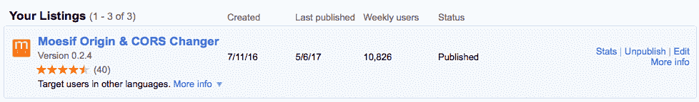

# moesif Chrome CORS 扩展达到重要里程碑

> 原文：<https://www.moesif.com/blog/cors/chrome-extension/Moesif-CORS-Extension-For-Chrome-Milestone/>

我们很高兴看到 Chrome 浏览器的 Moesif CORS 扩展达到了一个重要的里程碑:超过 10，000 周活跃用户。

这也是最高评级的 CORS 浏览器插件。

也可以查看我们在 CORS 的流行指南以及如何用 CORS 设置你的 API。

您是否花费大量时间调试客户问题？
Moesif 使 RESTful APIs 和集成应用的调试更加容易

[了解更多信息](https://www.moesif.com?utm_source=blog)