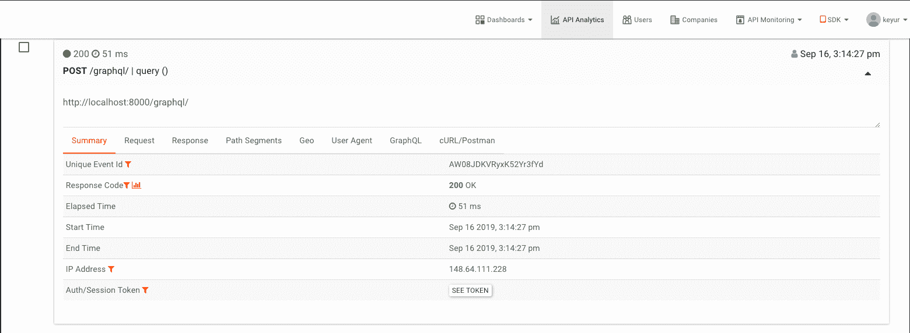
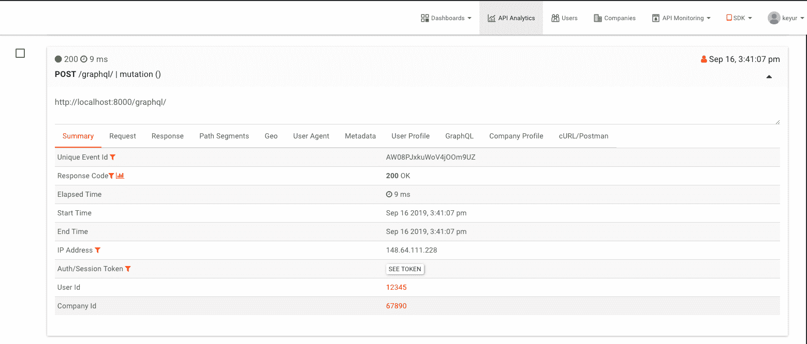

# 监控用 Django 和 Graphene 构建的 GraphQL APIs

> 原文：<https://www.moesif.com/blog/technical/graphql/Monitoring-GraphQL-APIs-built-with-Django-and-Graphene/>

本教程假设您熟悉使用 Django 和 Graphene 的 GraphQL 和 Python。如果没有，你可以参考本系列之前的文章[Python 和 GraphQL 入门](/blog/technical/graphql/Getting-Started-with-Python-GraphQL-Part1/)

在前面的文章中，我们创建了 API 来查询、变异、搜索和过滤数据。在本教程中，我们将讨论如何使用 [Moesif API Analytics](https://www.moesif.com/) 来监控我们构建的 API。

我们将通过在 requirements.txt 或中包含`moesifdjango`来安装`moesifdjango`库

```py
pip install moesifdjango 
```

一旦安装了库，我们需要更新`graphene_python/settings.py`来向应用程序添加中间件。

```py
MIDDLEWARE = [
    ...
    'moesifdjango.middleware.moesif_middleware'
    ...
] 
```

我们还需要将`MOESIF_MIDDLEWARE`添加到`settings.py`文件中

```py
MOESIF_MIDDLEWARE = {
    'APPLICATION_ID': 'Your Moesif Application Id',
    'LOG_BODY': True,
    ...
    # For other options see below. } 
```

您的 Moesif 申请 Id 可以在 [*Moesif 门户*](https://www.moesif.com/) 中找到。注册 Moesif 帐户后，您的 Moesif 申请 Id 将在入职步骤中显示。

登录 [*Moesif 门户*](https://www.moesif.com/) ，点击右上方菜单，然后点击*安装*，您随时可以找到您的 Moesif 应用 Id。

一旦中间件被集成，所有的 API 调用将被 Moesif 捕获，我们将能够分析它。

现在我们将查询`events`对象并选择`id`、`name`和`url`字段，可以看到 API 调用被捕获。



我们可以通过提供配置选项来添加与 API 调用相关联的定制元数据、用户或公司 id。

```py
# User Id def identifyUser(req, res):
    # if your setup do not use the standard request.user.username
    # return the user id here
    return '12345'

# Company Id def identifyCompany(req, res):
    # return the company id here
    return '67890'

# Metadata def get_metadata(req, res):
    return {
        'foo': '12345',
        'bar': '67890',
    }

# Mask Event def mask_event(eventmodel):
    # do something to remove sensitive fields
    # be sure not to remove any required fields.
    return eventmodel

MOESIF_MIDDLEWARE = {
    'APPLICATION_ID': 'Your Moesif Application Id',
    'LOG_BODY': True,
    'IDENTIFY_USER': identifyUser,
    'IDENTIFY_COMPANY': identifyCompany,
    'MASK_EVENT_MODEL': mask_event,
    'GET_METADATA': get_metadata,
    ...
} 
```

关于配置选项的更多细节可在[这里](https://github.com/Moesif/moesifdjango#configuration-options)找到。

设置配置选项后，捕获的所有 API 调用将包括元数据、用户和公司信息。



要查看 GraphQL 的运行情况，您可以从 GitHub 克隆并运行这个示例应用程序[。](https://github.com/Moesif/moesif-graphene-django-example)

在下一个教程中，我们将讨论更多关于分页的内容。同时，如果您有任何问题，请联系 [Moesif 团队](mailto:team@moesif.com)。

本系列前情提要:

*   [Python 和 GraphQL 入门第 1 部分](/blog/technical/graphql/Getting-Started-with-Python-GraphQL-Part1/)
*   [Python 和 GraphQL 入门第 2 部分](/blog/technical/graphql/Getting-Started-with-GraphQL-Part2/)