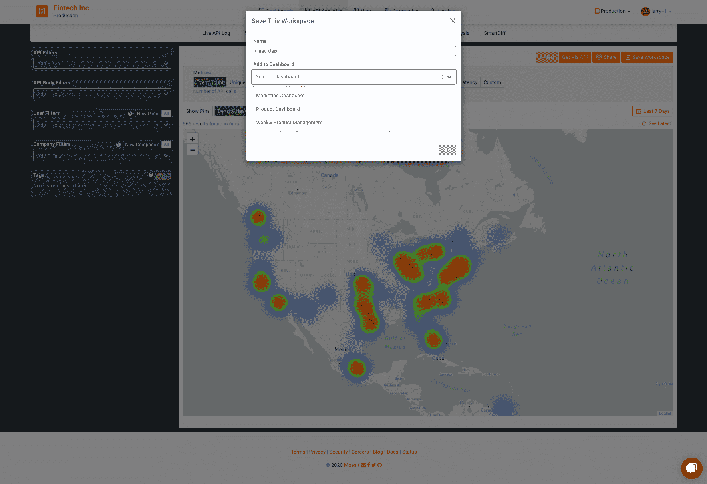
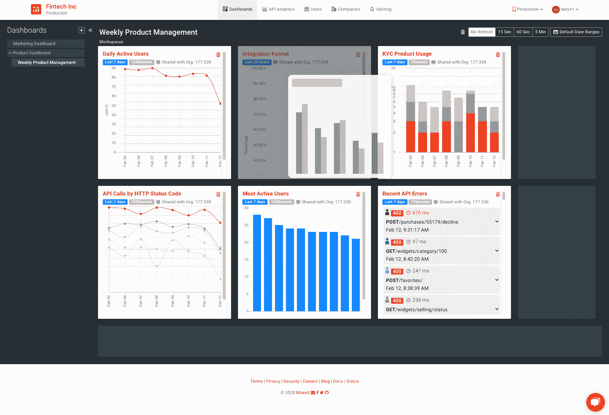
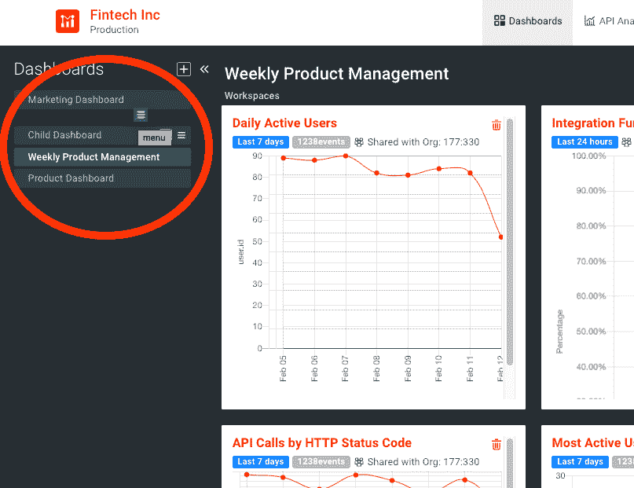
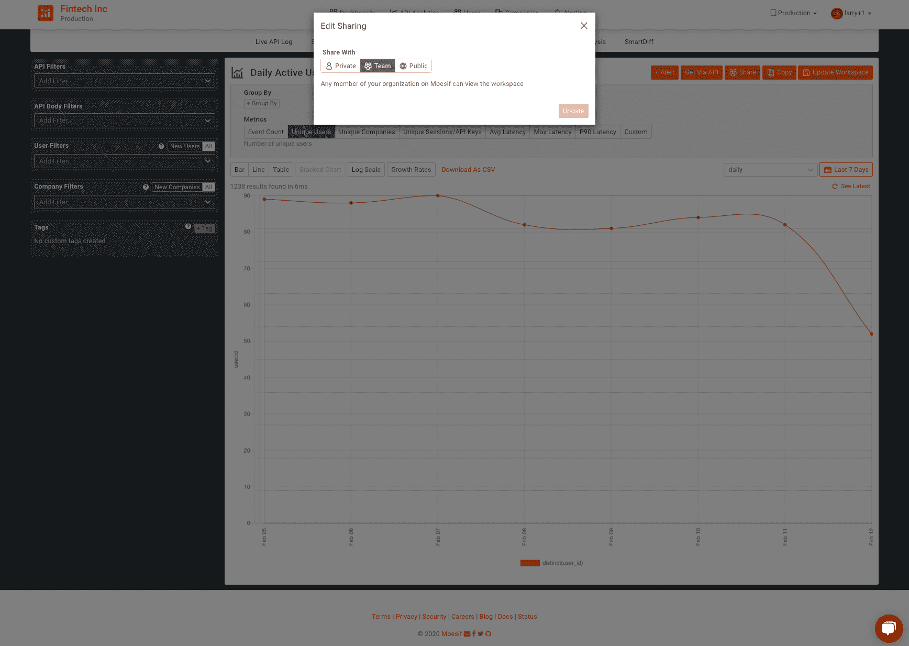
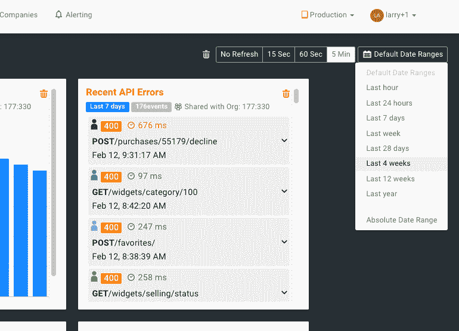

# 自助式定制 API 控制面板允许您轻松跟踪和共享关键 API 指标

> 原文：<https://www.moesif.com/blog/dashboards/technical/Self-Service-Custom-API-Dashboards-Allow-You-to-Easily-Track-and-Share-Key-API-Metrics/>

上个月，我们发布了新的仪表板功能。现在是时候用你自己的仪表板来讲述你的故事了。

> 通过拖放操作轻松创建-清晰说明关键指标-在团队和合作伙伴之间安全共享

## 用你的数据讲一个故事

我们的一个金融科技客户过去常常通过他们所谓的“记录直觉”来决定定价策略、产品变化和用户界面修改。他们会对市场和客户有所了解，可能会与特定用户交谈，然后做出重要的改变。

> *确保您与数据一起前进*

一旦他们整合了 Moesif，他们就开始根据实际数据做出决策。一夜之间，他们可以轻松跟踪关键的 API 指标，监控公司的 KPI，并深入调查客户问题。他们还发现了许多以前不明显的东西，例如我们监管的东西的漏洞和合规性缺陷。

我们的金融科技产品经理的仪表板由一系列工作区组成，包括每日活跃用户(DAU)、整合漏斗、HTTP 状态请求、KYC 产品使用、最活跃用户、最近的 API 错误等等。下面的图 1 显示了他们的仪表板。

图一。金融科技客户仪表板的展示

工作区讲述单一的故事，而仪表盘则完整地描述了产品的性能。对于我们的金融科技客户，集成漏斗工作区总结了客户如何加入平台，注册，确认他们的电子邮件，然后触发 API 调用——他们客户的端到端生活。通过将其与相邻工作区的 KYC 产品进行配对，他们能够看到该产品的表现如何——有多少 KYC 用户在使用实时版本，而不是通过试用交易。通过引入 HTTP 状态，可以确定错误的数量——200 个状态代码对非 200 个状态代码。因此，在一个仪表板上，他们能够看到谁是他们的客户，他们是如何集成的，以及他们正在经历什么。

## 创建自定义仪表板

### 工作区和仪表板

类似于 Google Drive，Moesif 的仪表板可以被认为是一个驱动器中的文件夹，而工作区是填充该文件夹的文档。一旦工作区被配置，它就可以被保存到一个仪表板中，如图 2 所示。

图二。将工作区保存到仪表板中

通过将多个工作区保存到仪表板中，您可以将它们相互关联，并设计您的叙述。

### 排列仪表板

可以通过拖放在仪表板中重新定位工作区。按照您想要的方式创建您的工作区，并按照您希望人们阅读它们的顺序放置它们。

图 3。通过拖放重新排列

### 仪表板层次结构

仪表板可以嵌套在多达三层的层次结构中。只需拖动子仪表板的名称，将其嵌套在父仪表板下，就可以创建子仪表板，如图 4 所示。

图 4。仪表板的层次结构

## 共享仪表板和工作区

> 创建一次。分享很多。

一旦您配置了每日或每周仪表板，就可以轻松地与同事分享。当您需要按月或按季度向管理层报告时，您只需按日/周进行设置，而无需创建不同的仪表板。

工作空间可以是私有的，也可以在团队、组织甚至外部公司的合作伙伴之间共享。例如，在故障排除期间，可以使用我们的自定义链接功能与关键客户共享特定数据。

通过单击 Share 按钮，然后选择“Shared With”下的选项，可以设置工作区的共享权限，如下面的图 4 所示。工作区可以在您的团队内部共享，通过唯一的链接与公众共享，或者设置为私有以便只有您可以查看。通过配置过滤器，可以将访问进一步限制到特定的用户 id、公司 id、时间段等。

图 5。共享选项

仪表板在您的组织中自动共享。一旦创建了实时仪表板，它将与您的团队和经理共享，这样每个人都可以掌握最重要的 KPI。

## 数据范围和刷新率

仪表板会实时更新，因此您永远不必担心会看到过时的数据。刷新率可以在右上角设置为“不刷新，15 秒，60 秒或 5 分钟”，如图 6 所示。同样在右上角，可以通用地设置日期范围，然后应用于仪表板中的工作区。

图 6。设置日期范围和刷新率

## 三大要点

Moesif 的仪表板允许您用数据讲述故事，与同事和合作伙伴分享，并掌握最重要的 KPI。立即部署并做出更明智的决策。

我们的金融科技产品经理最后说一句话:

> “当我查看我的实时产品控制面板时，我可以快速识别趋势。我可以看到按产品划分的国家/地区、他们正在进行的请求类型、按产品划分的其他请求以及他们针对每种产品得到的错误类型。太牛逼了。”