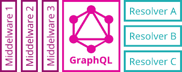

# 为 GraphQL APIs 构建身份验证和授权的步骤

> 原文：<https://www.moesif.com/blog/technical/api-design/Steps-to-Building-Authentication-and-Authorization-For-GraphQL-APIs/>

在构建 API 时，将所有数据提供给互联网上的每个人通常不是一个好主意。出于业务原因，我们需要检查谁是付费客户，出于安全和隐私原因，我们需要限制对系统部分的访问。

我们已经写了一篇关于 REST APIs 的认证和授权的文章。

在本文中，我们将深入 GraphQL 的 auth 主题。

## 身份验证和授权的区别

这两者经常与单词 *Auth* 混为一谈，例如在*中，“我们需要给我们的系统增加认证功能。”*

虽然这两个主题相互交织，但它们涵盖了不同的方面。

认证是关于知道谁想用我们的系统做些什么。

我们可以通过用户名/电子邮件和密码登录或者 GitHub 或脸书等社交网站来解决这个问题。

授权就是要知道**他们被允许对我们的系统做什么**。

这个问题更加复杂，因为它深深依赖于我们的业务案例。虽然不明显，但授权是业务逻辑，应该如此对待。

## 认证、授权和图表

我们将这个逻辑放在 GraphQL APIs 的什么地方呢？

[graph QL 创建者](https://graphql.org/learn/authorization/)的意见是*“将授权逻辑委托给业务逻辑层”*。除了创建*【充分水合的用户对象】*而不是将身份验证令牌传递给我们的业务逻辑之外，他们对身份验证没有任何强烈的意见。

这是什么意思？我们的商业逻辑在哪里？我们将在哪里创建这些用户对象？

### GraphQL 系统的结构

GraphQL 系统的结构如下图所示:



在左边，我们有不同类型的*中间件*，它们将一些逻辑应用于我们所有的请求。

在中间我们有 *GraphQL 引擎*，它计算出如何在 GraphQL 模式的帮助下将我们的 GraphQL 查询翻译成对正确解析器函数的调用。在大多数框架中，比如 Node.js 的 Express framework，GraphQL 引擎也被实现为中间件。

在右边，我们有不同类型的*解析器函数*，它们将 GraphQL 引擎连接到我们的业务逻辑。当查询相应的数据类型时，GraphQL 引擎会执行解析器。

业务逻辑可以是一个整体系统或一堆微服务。

### 将身份验证集成到 GraphQL 中

为了授权请求，我们需要在业务逻辑中访问当前用户的身份。这要求我们将*认证*逻辑放到一个地方，为我们所有的请求执行。如果我们看上面的图，这使得中间件——我们系统的一部分——成为了它的完美位置。

这种方法的另一个好处是:它完全独立于 GraphQL，因此我们可以重用我们的 REST 技能并重新应用它们！

如果您需要更新 REST 认证技能，请阅读我们之前的文章。

### 将授权集成到 GraphQL 中

为了理解这一点，让我们来看一个简单的中间件实现、一个 REST 资源处理函数和一个 GraphQL 解析器函数。对于这个例子，我将在 Express 框架和 Apollo 服务器上使用 Node.js。

首先，我们的业务逻辑:

```py
const getMessage = (id, user) => {
  const message = dataStore[id];

  if (message.recipient.id === user.id) return message;

  if (message.sender.id === user.id) return message;

  throw new Error("no permission");
}; 
```

它通过 ID 从内存存储中加载一条消息。如果用户是该邮件的收件人或发件人，则允许他们阅读该邮件。否则，我们抛出一个错误。

二、认证中间件:

```py
const authMiddleware = (request, response, next) => {
  const token = request.get("authorization");
  const user = loadUser(token);
  if (user) {
    request.user = user;
    next();
  }
  response.status(401).end();
}; 
```

它从请求头中加载一个令牌，并使用它来加载当前用户。如果成功了，它会将这个用户对象添加到请求中，以便以后使用。

现在，让我们看看 REST 的实现。

```py
expressApp.use(authMiddleware);

expressApp.get("/message/:id", (request, response) => {
  try {
    const message = getMessage(request.params.id, request.user);
    response.end(message);
  } catch (e) {
    response.status(403).end({ error: e.message });
  }
}); 
```

首先，我们用我们的`authMiddleware`；这确保了我们的`request`在端点处理程序中有一个`user`对象。

然后，我们定义一个函数，调用该函数向我们的`/messages/:id`端点发出 GET 请求。它使用我们的`request`的`id`参数和`user`对象加载一个带有我们的*业务逻辑*函数的`message`。

当一切正常时，我们得到`message`并可以将它发送给客户机。如果不是，我们将 HTTP 状态设置为`403`(禁止)。

`getMessage`函数在`user`对象的帮助下处理授权。它不在乎它从哪里来。

接下来，让我们看一个 GraphQL 实现，这里是用 [Apollo 服务器](https://github.com/apollographql/apollo-server/tree/master/packages/apollo-server-express)创建的。

```py
expressApp.use(authMiddleware);

const { ApolloServer, gql } = require("apollo-server-express");

const typeDefs = gql`
  type Query {
    message(id: String!): String
  }
`;

const resolvers = {
  Query: {
    message: (parent, args, request, info) =>
      getMessage(args.id, request.user)
  }
};

const server = new ApolloServer({ typeDefs, resolvers });
server.applyMiddleware({ app: expressApp }); 
```

中间件的使用在这里保持不变。所以认证不需要改变。

然后我们使用`apollo-server-express`模块定义一个简单的 GraphQL API，它只有一个带有`message`的`Query`类型。

然后我们定义我们的解析器函数，它看起来几乎与 REST 示例中的一样。

解析器得到四个参数，第三个是我们已经从 REST 实现中知道的`request`。因为我们的中间件使用这个对象来附加`user`对象，所以我们可以像以前一样将它传递给我们的业务逻辑。

GraphQL 引擎解析了查询中的`id`参数，并将其存储到第二个参数中，因此只有它的位置不同。

我们的业务逻辑函数处理授权，与 REST 实现中一样。

这里的区别在于 **GraphQL 不知道 HTTP** 或者它的状态代码。如果它可以处理一个查询(即使结果为空)，它将只使用`200`。

我们的业务逻辑抛出的错误将被放在响应体中的一个`errors`数组中，客户端可以在那里以某种方式进行处理。

我们的响应 JSON 的`message`将被设置为`null`，这允许我们用部分数据来响应客户的请求。例如，如果消息位于 GraphQL 响应树的深处。

```py
{  "data":  {  "message":  null  },  "errors":  [  {  "message":  "no permission",  ...  }  ]  } 
```

> *什么是 Moesif？ [Moesif](https://www.moesif.com/features/graphql-analytics) 是最先进的 REST 和 GraphQL 分析平台，被数以千计的平台用来衡量您的查询执行情况，并了解您最忠实的客户正在使用您的 API 做什么。*

## 客户端中的处理

既然我们已经讨论了 API 中的身份验证和授权，我们还应该看看客户端。

### 客户端身份验证

如果我们采用基于令牌的认证，这是目前最主要的，我们首先需要获得这样一个令牌。我们可以用两种方法做到这一点。

**授权令牌检索**

1.  我们为注册和登录创建额外的 HTTP 端点
2.  我们为注册和登录创建了 GraphQL 变体

额外的 HTTP 端点将整个身份验证过程从 GraphQL API 中分离出来。就像服务器端的中间件方法一样。如果进行身份验证的服务不同于我们的 API，并且我们只需要来自它的令牌，这就更好了。

GraphQL 变体感觉更加完整，但在我们的 API 中需要更多的特例，因为我们需要让用户以某种方式访问它们，而无需经过身份验证。

在我看来，第一种方式风险较小。我们可以在 GraphQL API 中专注于我们的核心竞争力，并为未来保持灵活性。

**令牌存储和放置**

令牌需要和 GraphQL 请求一起发送给我们的 API。

为此，我们需要决定在哪里存储令牌，以及在请求的什么地方放置令牌。

存储方式有两种， [`localStorage`](https://developer.mozilla.org/en-US/docs/Web/API/Window/localStorage) 和[HTTP cookie](https://developer.mozilla.org/en-US/docs/Web/HTTP/Cookies)。

当存储在`localStorage`中时，我们可以通过 HTTP 头发送令牌。当我们将它存储在 cookie 中时，我们会自动将其与 cookie 一起发送。

这与 REST APIs 相同，两种变体各有利弊。我不会详细介绍，但是你可以在我们的 [REST auth 文章](/blog/technical/restful-apis/Authorization-on-RESTful-APIs/#the-real-debate-cookie-vs-local-storage)中读到。

**阿波罗客户端示例**

让我们看一个简单的 Apollo Client 例子，它是一个用 JavaScript 编写的独立于 UI 框架的 GraphQL 客户端库。

```py
import { ApolloClient } from "apollo-client";
import { HttpLink } from "apollo-link-http";
import { ApolloLink, concat } from "apollo-link";

const httpLink = new HttpLink({ uri: "/graphql" });

const authMiddleware = new ApolloLink((operation, forward) => {
  operation.setContext({
    headers: {
      authorization: localStorage.getItem("token") || null
    }
  });

  return forward(operation);
});

const client = new ApolloClient({
  link: concat(authMiddleware, httpLink)
}); 
```

[来源:阿波罗客户端文档](https://www.apollographql.com/docs/react/advanced/network-layer)

这里我们使用`localStorage` /header 变量来存储和发送令牌。

Apollo 客户端有一个网络层叫做 *Apollo Link* 。这用于使不同的协议可插拔。一个**链接**被实现为中间件，正如我们在 Express 示例的后端中看到的。

在这个例子中，我们将 HTTP 中间件配置到我们的 GraphQL API 端点，然后创建一个定制的中间件/链接用于身份验证。

两者都被插入到`ApolloClient`构造函数中，所以它们在我们发送的所有 GraphQL 查询中都被执行。

客户`authMiddleware`在每个请求之前查看`localStorage`,并将`authorization` HTTP 头设置为它找到的令牌。

在这里，我们已经看到了将身份验证排除在 GraphQL 之外的好处。我们可以对 HTTP 端点进行一个简单的`fetch`调用来注册或登录，并在开始创建 GraphQL 客户端对象之前将收到的令牌存储在某个地方。

反之亦然。如果我们想注销一个用户，我们可以丢弃 GraphQL 客户端对象，而不需要以某种方式改变它。

### 客户授权

如果我们正确地设置了身份验证，API 现在知道我们就是我们所说的那个人，但是仍然有可能我们想要查询不允许我们访问的数据。

在客户端，像在后端一样，授权是业务逻辑，所以我们需要考虑在特定的情况下做什么。

我们有一个 UI，发送一个大的 GraphQL 查询来一次性获得所有数据，现在它返回一些字段和一些错误。

**Apollo 客户端**库为此定义了[三个错误策略](https://www.apollographql.com/docs/react/features/error-handling)，我们可以为每个或所有请求设置其中一个。

这些策略定义了我们也可以在定制客户端中使用的行为，或者在没有任何特定 GraphQL 库的情况下直接使用的行为。

1.  如果响应中出现任何 GraphQL 错误，我们认为它失败了，并将其丢弃，就像发生网络错误一样。
2.  我们忽略响应中的所有错误，并尝试按原样使用数据。
3.  我们尝试将响应中的 GraphQL 错误与返回的数据结合使用，向用户展示我们所能做到的最好，并在旁边显示错误，以便他们知道为什么会缺少某些部分。

## 结论

身份验证和授权是 API 设计中非常重要的主题，但是正如本文所示，一旦我们理解了 HTTP APIs 的身份验证基础，我们就可以在 REST 和 GraphQL 上重用我们的技能，而无需做太多的更改。

理解授权是业务逻辑也很重要，它通常完全是为特定的软件产品定制的。这意味着它应该被推到我们代码库的边缘，这样就可以很容易地找到它，并且不会在很多地方重复出现。