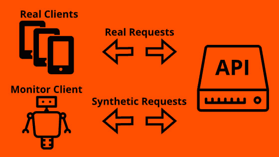
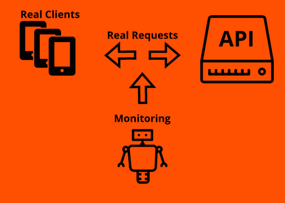

# 合成 API 监控和 API 真实用户监控的区别

> 原文：<https://www.moesif.com/blog/engineering/api-monitoring/The-Difference-Between-Synthetic-API-Monitoring-and-API-Real-User-Monitoring/>

所有 API 创建者共同关心的一个主要问题是**监控**。

## 什么是监控？

监控是了解我们的 API 的健康、性能和使用情况的一种方式。

解决一个请求需要多长时间？

API 在高峰使用时伸缩性好吗？

更新的推出会导致问题吗？

这些只是我们在 API 的生命周期中反复问自己的几个问题。我们可以用良好的监控设置来回答这些问题，但我们在这里可以采取什么方法呢？

在本文中，我们将了解两种主要的监听方式及其区别:**合成&真实监听**

总的来说，我们可以说这两种方法构成了有效监控解决方案的核心，但是让我们了解一下每种具体的方法。

## 综合监控

名称**综合监控**来源于这样一个事实，即这种方法综合使用**和**生成的请求。这些请求可以由 100%生成的数据或真实客户端在过去发出的记录请求组成。当一个真实的客户端发送请求时，实际的监控不会发生，而是当一个特定的**监控客户端**发送请求时。这个**监控客户端**也负责实际的监控。它发送请求并记录它们需要多长时间以及关于它们的其他信息。

合成监控也称为**主动监控**或**主动监控**，因为**监控客户端** (pro-)主动向 API 发送 pings。

这种方法的一大优点是，它允许在 API 中的问题发生在真正的客户端之前定位问题。例如，开发人员可以创建一个请求，该请求只在将来新的客户端版本发布时发送给 API，然后看看会发生什么。

如果监控客户机每周 7 天、每天 24 小时定期运行，那么它还可以在没有真正的客户机在线时，甚至在 API 发布给真正的客户机之前收集数据。

这种方法的缺点是它不允许看到真实的客户端发生了什么。它只能测试开发人员已经预料到的或者过去记录的东西。因此，监控客户机可以发出完美的 API 健康的信号，但是当真正的客户机请求的行为与监控客户机稍有不同时，它们仍然可能一直失败。

此外，生成所有可能类型的请求可能会很快变得昂贵，因此即使开发人员知道如何做，他们通常也不能创建所有的请求类型，而只能创建一小部分测试。通常，一个测试套件可能只包含场景的整个状态空间的个位数覆盖。尤其是使用 GraphQL 这样的工具，客户可以比以往更加灵活。如果您没有为特定的客户场景创建测试，您可能根本不知道有问题。

### 真实用户监控

真实用户监控(简称 T1)之所以这么叫，是因为它在监控真实的客户请求，而不是依赖于合成的 pings。它的另一个名字是**被动监控**，因为没有涉及主动发送请求的主动**客户端**，而是一些被动记录客户端发送的请求的技术。这可以通过网络窃听等硬件解决方案来实现，也可以通过 [Moesif 等工具在应用层实现。](https://www.moesif.com/features/api-monitoring)

这项技术有助于解决目前影响我们客户的实际客户问题。即使您的合成事件都显示绿灯，并且响应为 200 OK，您仍然可能有一些客户遇到麻烦。例如，如果我们在美国积极监控，但有些客户位于世界的不同地方，他们可能会遇到我们没有预料到的性能下降。真实用户监控对于 API 设计不断变化的现代动态微服务驱动的应用程序非常有帮助。这导致测试覆盖面太小，不能覆盖每个客户场景。

由于真正的用户监控查看的是生产流量，因此它也有助于回放过去的客户端行为，以便进行调试。

**合成监听**的好处也是**真实监听**的坏处。

只有当有流量时，才可能检测到真实客户的问题。如果流量微薄或者根本没有流量，我们就拿不到任何有真实监控的数据。

## 结论

合成监控技术和真实监控技术各有利弊，因此完整的监控解决方案应同时依赖这两种方法。

他们可以互相弥补对方的缺点，并带来更好的整体洞察力。

他们甚至可以互相借鉴。例如，真实监控方法的记录请求可以用作对合成监控客户端的请求。这可以通过 [Moesif 的导出到 Postman](https://www.moesif.com/docs/api-search/run-in-postman/) 功能轻松完成。

摘录:使用 Moesif 准确跟踪所有 API 产品指标