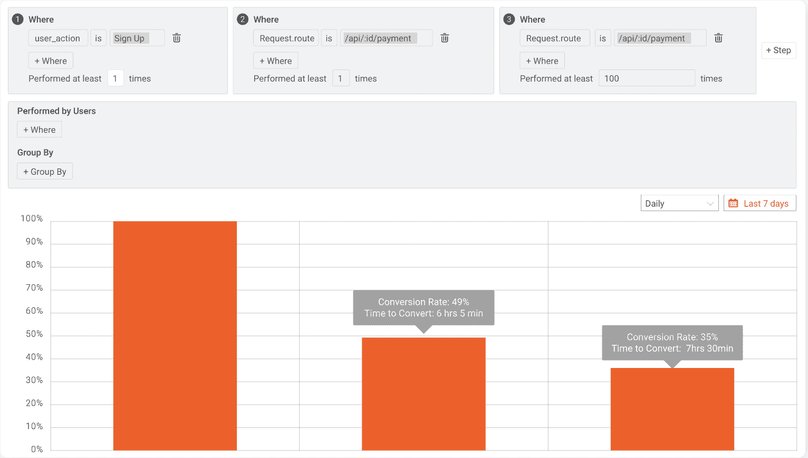
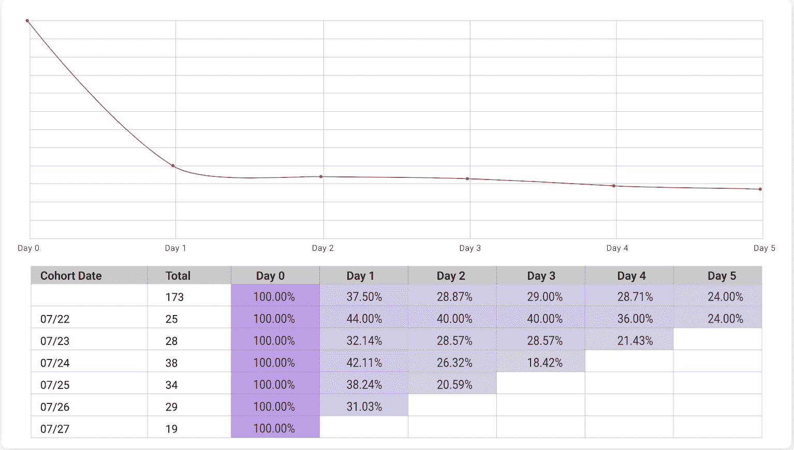
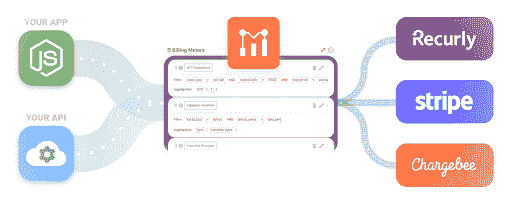
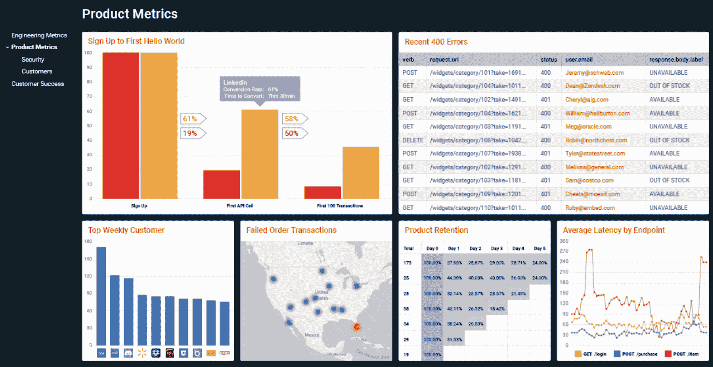
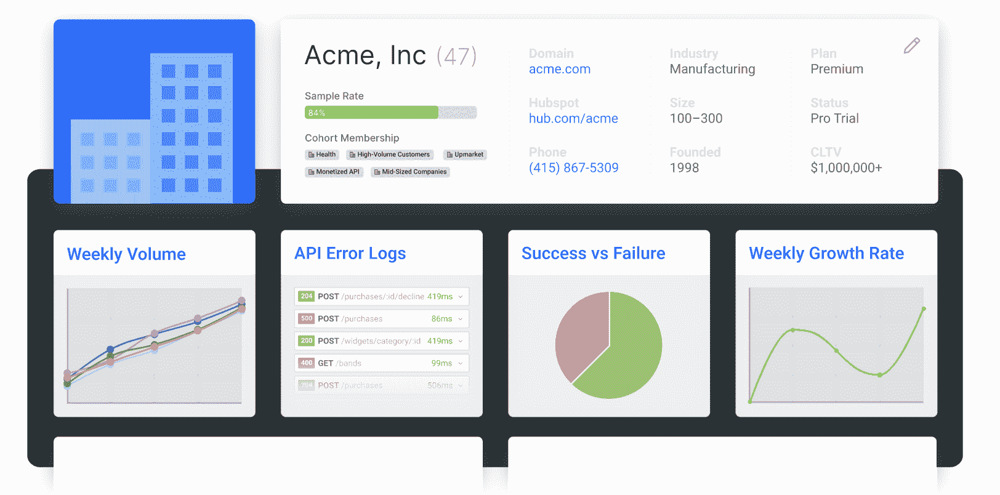

# 面向开发者的 8 大区块链 API

> 原文：<https://www.moesif.com/blog/api-product-management/api-analytics/Top-8-Blockchain-APIs-For-Developers/>

开发人员一直在寻找新的方法来使他们的应用程序更加安全和高效。区块链 API 是实现这一点的一种方式。区块链 API 是一种应用程序编程接口，允许开发人员与区块链进行交互。通过使用区块链 API，开发人员可以访问区块链的数据和功能，而无需构建自己的区块链平台。这可以节省时间和资源，并为开发提供更安全的环境。在本帖中，我们将为开发者探索最好的区块链 API。我们将研究每个区块链 API 的特性和优点，以及如何使用它们来创建更安全、更高效的分散式应用程序。

## 什么是区块链？

区块链是所有加密货币交易的数字账本。随着“完成的”块随着一组新的记录被添加到其中，它不断地增长。每个块都包含前一个块的加密哈希、时间戳和事务数据。比特币节点使用区块链来区分合法的比特币交易和试图重新花费已经在其他地方花费的硬币。

API 允许区块链开发者以多种方式与区块链交互。例如，他们可以为用户创建钱包，发送和接收付款，以及检查余额。该 API 还使开发人员能够监控市场和趋势，并创建可用于跟踪价格或管理投资的应用程序。

最受欢迎的区块链是支持比特币的那个，但还有许多其他类型的区块链正被开发用于各种目的。其中一些包括以太坊，莱特币和 Monero。

## 使用区块链 API 有什么好处？

区块链 API 为开发者提供了许多好处。它们可以帮助简化开发应用程序的过程，并使其更容易与其他系统集成。此外，区块链 API 可以提供对存储在区块链上的数据的访问，使开发人员更容易创建利用这种加密数据的应用程序。

区块链 API 还可以帮助降低开发应用程序的相关成本。通过使访问存储在区块链上的数据变得更加容易，开发人员可以避免构建自己的基础设施来支持他们的分散式应用程序。这可以节省大量的时间和金钱。

此外，区块链 API 可以为开发者提供一种将应用货币化的方式。通过对访问 API 提供的数据或功能进行收费，开发人员可以从他们的应用程序中获得收入。这有助于抵消开发和维护分散式应用程序的成本。

最后，区块链 API 可以帮助为应用程序创建一个更加开放和可访问的生态系统。通过使开发人员更容易访问其他应用程序提供的数据和功能，区块链 API 可以帮助创建一个应用程序可以相互操作的环境。这可能导致新的和创新的应用程序开发被创建，如果不使用 API，这是不可能的。

## 区块链开发的最佳区块链 API

有许多不同的区块链 API 可供开发人员使用，每种 API 都有自己的优缺点。在本文中，我们将看看目前可用的一些最好的区块链 API，并对每个 API 进行简要概述。

### BlockCypher API

**BlockCypher API** 是目前最流行的区块链 API 之一。它提供了一个简单的界面，可以很容易地开始区块链开发。允许开发者在各种平台上与比特币、以太币、莱特币和 Dogecoin 进行交互。多功能开发工具使您能够与智能合约交互，获得关于未确认交易的通知或创建多签名交易。其他功能包括:

*   数据地址。交易、冻结、智能合约。
*   互动。创建交易记录。解码交易。与合同互动。部署合同。
*   通知。交易 webhook。阻止 webhook。双花网钩。Websocket。
*   高级功能，Multisig。Segwit 支持。信心因素。

### 链式 API

链 API 是区块链开发者的另一个受欢迎的选择。它提供了比 BlockCypher 更全面的功能，对于更有经验的开发人员来说，这是一个很好的选择。Chain 还有很好的文档和对多种编程语言的支持。ChainAPI 有一个用户友好的界面，允许 API 提供者很容易地建立第一方的 oracles。API2 员工使用接口来代表 API 提供者进行集成，从而大大提高他们的效率和正确性。Chain API 将使 API 提供者和请求者更容易跨多个链与 Airnode 协议进行交互，包括一个节点仪表板。

### CoinBase API

对于区块链开发来说， **CoinBase API** 可能是一个很好的替代选项。比特币基地专业版提供了一个 API，可以很容易地执行各种任务。这包括获取实时价格、安全存储数字货币、购买或出售加密货币以及处理数字钱包。他们还为您的区块链解决方案提供了一个高级选项和一个更高级的 API。CoinBase API 提供的一些特性:

*   生成比特币现金钱包和地址。
*   安全地存放硬币。
*   获取实时和/或历史价格数据。
*   当付款到达时得到通知。
*   发送/接收或出售/购买比特币现金、比特币、莱特币和以太坊。

### 加密 API

Crypto APIs 是一家区块链基础设施提供商，致力于使 Web 3 解决方案的开发和管理变得简单高效。他们提供钱包即服务(WaaS)、区块链数据、区块链事件、区块链自动化、区块链工具和市场数据，使开发变得更容易。开发人员使用他们的 SDK 访问来自单一提供商的 100 多个终端，以获得各种解决方案，包括数字银行、交易所、钱包、托管机构、借贷产品等。Chainlink、Ledger、Nexo 和 Paypal 已经尝试了 Crypto APIs 公司的 REST APIs。他们喜欢白手套支持和快速有效的功能。区块链开发者很欣赏它们的可靠性。一些功能包括…

*   MPC 的钱包即服务是市场上最好的数字钱包——它结合了目前可用的顶级功能、保护和授权过程。
*   区块链数据-使用 REST APIs 从单点统一访问复杂和动态的数据。
*   借助节点即服务，您将能够通过共享或专用节点基础架构快速部署您的区块链技术。利用 JSON-RPC，它可以插入到现有的基础设施中，并提供一个简单的 Javascript 开发环境。
*   区块链自动化-自动将收到的任何硬币或代币转发到首选的主要存款地址。

### 区块链 API

**区块链 API** 是区块链开发值得考虑的额外选项。区块链 API 是为您的项目提供加密货币支付的完美解决方案。他们的服务和能力的高质量使其易于集成。区块链 API 已经成功与超过 25，000 名开发者集成。他们提供了许多不同的 API 来满足不同客户的需求。他们有用于钱包、支付处理、查询数据、探索区块链网络、分析加密数据等等的 API。

它有几个方面使其成为市场上有竞争力的供应商。这包括在区块链以块形式进行的数据存储。这样做的结果是 JSON 数据，它处理事务。区块链的离线优先方法也意味着他们不需要额外的加密货币存储服务。它有一个庞大的开发人员社区和低超时，以及一个可访问的 JSON 数据格式。您还可以通过电子钱包账户访问区块链网络。

### Block.io API

**Block.io API** 提供了一个简单的接口，使得开始区块链开发变得容易。Block.io 还提供了对多种编程语言的支持，对于希望用自己选择的语言编写代码的开发人员来说，这是一个不错的选择。不要忘了彻底测试你的应用程序，并始终保持你的私钥保密。

### BitPay API

作为一种国际数字资产，BitPay 的 API 允许你执行各种各样的任务。BitPay 提供了一个基于标准的 REST 接口，使应用程序开发人员能够以强大而安全的方式与他们的 BitPay 帐户进行交互。使用 BitPay API，客户可以管理发票、退款、查看商户记录等等。开发人员可以选择使用他们选择的语言通过 HTTPS 调用 API，或者利用我们的代码库。而且，如果他们的首选语言没有列出，他们仍然可以定制集成。

### GetBlock API

GetBlock API 是区块链开发者探索的另一个热门选择。GetBlock 提供了一种简单、容易的方法来使用区块链的力量。发现他们的高速运行节点和对比特币 API 的安全访问，以及币安在区块链的智能链，如比特币，让你高效地运行去中心化的应用程序。GetBlock 提供 API、智能合约和 explorer 数据服务。它还提供了一个可以访问原始数据的区块链开发程序。当您使用我们的服务时，保证您可以快速访问块、交易和合同，这可以通过简单地使用基本 API 数据来实现。GetBlock API 拥有有用的技术指南和文档，并提供定制的 SLA，这些 SLA 是为满足您的业务需求而定制的解决方案。

### 确定区块链 API 时要考虑的因素

在选择最佳编程语言、架构模式、框架或库时，开发人员和开发团队都有偏好。区块链 API 是相似的。

技术:使用开源代码很重要，因为它可以被其他开发者测试，这有助于避免错误和提高整体安全性。

**性能**:区块链 API 的性能和容量各不相同，因此选择一个符合您应用需求的 API 非常重要。如果您只需要加密几个文档，每秒几个事务可能就足够了，但每秒几千个事务的应用程序将需要称为微服务的子系统。这将允许在处理用户请求时处理高负载和持续响应。

兼容性:你需要确保你选择的 API 能够支持你需要的硬币。

## 如何使用区块链 API

如果你是一名区块链开发者，想要开始使用区块链技术，你首先需要的是一个区块链 API。这将允许您与区块链进行交互，并在其上构建您的区块链应用程序。

有许多不同的区块链 API 可用，因此选择一个适合您需求的 API 非常重要。要考虑的一些因素包括您正在使用的编程语言、您需要的特性以及所提供的开发工具的级别。

一旦你选择了一个区块链 API，你需要注册一个账户并获得一个 API 密钥。然后，您可以开始构建您的应用程序开发。

在部署应用程序之前，一定要彻底测试它。此外，请始终监控区块链中可能影响您的应用的变化。像 Moesif 这样的工具可以帮助利用浏览器 SDK 从客户端访问 API 调用数据。从那里，我们可以生成调试和监控报告，以确保您的网站运行顺利。如果出了问题，我们会立即提醒您，这样就没有时间扩展成更大的问题。

### 与 Moesif 一起支持和监测

Moesif 具有独特的功能，允许您将应用程序中发生的每个事件与用户和/或公司相关联。这让我们对开发人员的体验以及每个人如何使用 API 有了更细致的了解。漏斗和滞留就是一个很好的例子。

[漏斗](https://www.moesif.com/docs/user-analytics/conversion-funnel-analysis/?utm_campaign=Int-site&utm_source=blog&utm_medium=body-cta&utm_content=top-8-blockchains)是你的应用程序中流程的逐步分解。例如，您可能正在优化您的注册过程，并寻找加快注册速度的方法。该分析为您提供了洞察，以及用户完成这些步骤需要多长时间，以及完成这些步骤的客户比例。这一点很重要，因为它有助于建立一个基线，您可以在尝试提高转化率和 API 使用率时使用这个基线。

[T2】](https://www.moesif.com/solutions/api-product-management/?utm_campaign=Int-site&utm_source=blog&utm_medium=body-cta&utm_content=top-8-blockchains)

一个[保留分析](https://www.moesif.com/docs/user-analytics/cohort-retention-analysis/?utm_campaign=Int-site&utm_source=blog&utm_medium=body-cta&utm_content=top-8-blockchains)可以帮助确定客户何时退出或对你的产品和 API 变得不活跃。这有助于提高保留率，并让您知道您的开发人员体验何时出现问题。这将使您能够建立基线，将您的开发人员体验的改善或恶化与用户的保留联系起来。

[T2】](https://www.moesif.com/solutions/api-product-management/?utm_campaign=Int-site&utm_source=blog&utm_medium=body-cta&utm_content=top-8-blockchains)

跟踪 API 使用情况的另一种方法是使用警报，让您知道用户遇到了什么困难，或者让您知道流量的异常情况。例如，警报可能用于让客户成功团队了解用户遇到的问题，以便他们能够伸出援手。警报还允许产品团队从短期问题反馈中学习，并在未来做出改进。警报由两种类型组成:静态和动态。

静态警报可以设置为一个特定的阈值，比如在一个小时内有**个以上的 401 -未授权错误。动态警报允许您设置一个阈值，例如当用户的 401 错误**与他们的平均数量**相比激增时，您会注意到。它允许您监视趋势或峰值，而无需为阈值输入具体的数字。**

这两种形式的提醒都可以改善你的产品的用户体验，特别是如果它是高质量的并且得到团队成员的支持。有关如何在 Moesif 中创建提醒的更多信息，请查看我们的文档。

Moesif 允许您根据用户经历的事件设置自动电子邮件流。这是通过创建[行为电子邮件](https://www.moesif.com/docs/behavioral-emails/?utm_campaign=Int-site&utm_source=blog&utm_medium=body-cta&utm_content=top-8-blockchains)来完成的。例如，如果一个用户有大量的 **401 -未授权**响应，那么你可能想给他们发送一封电子邮件，建议他们如何解决这个问题或一个指南。这减轻了支持团队的压力，也使得采取即时和主动的行动成为可能。

### 通过 Moesif 实现 API 货币化

作为一个 API 提供者，你可能想用你的 API 创造一些收入。当第一次开始货币化过程，你可能会发现挑战是陡峭和复杂的。为了解决这些问题并创造流畅的体验，需要进行大量的定制和测试。幸运的是，Moesif 是一个强大的 API 货币化平台，可以提供帮助。通过该平台提供的无限选项，作为 API 提供商，您可以轻松推动 API 的采用和收入。

有了 Moesif，您可以灵活地做出明智的决策，以增加收入和利润。您还将拥有其他工具来补充您的用户旅程并改进您的 API 产品。

使用 Moesif，使用数据可以同步到提供商。计算出的 API 使用量被发送给计费提供商，并用于为用户生成发票。或者，您可以支持预付费计费，即开发者在需要时购买积分。

[T2】](https://www.moesif.com/solutions/metered-api-billing/?utm_campaign=Int-site&utm_source=blog&utm_medium=body-cta&utm_content=top-8-blockchains)

关于如何在 Moesif 中赚钱的更多信息，请查看我们的文档。

### 使用 Moesif 的客户成功

引领客户成功对于 API 优先或以开发人员为中心的企业来说，与传统的企业软件有很大不同，最好的 API 产品是以一种易于使用和放手的方式构建的，这意味着一旦平台实现，客户就不必登录平台。

当客户成功与 API 优先的企业合作时，他们应该准备好两种不同的客户体验。第一个体验是当客户注册并登录到您的门户时。第二，客户在与您的 API 平台集成和交互时的体验。两者都被认为是入职体验的一部分，应该记录每一项的指标。更重要的是，API 具有提供长期价值的潜力。注册但从未完全整合或使用该平台的客户可能会很快流失(如果他们已经付费)。

在 Moesif 中，每个 API 调用都可以归属于一个用户和/或公司。Moesif 为这些公司和用户创建了一个档案，允许客户成功团队对客户属性有一个 CRM 风格的视图。

[T2】](https://www.moesif.com/features/api-dashboards/?utm_campaign=Int-site&utm_source=blog&utm_medium=body-cta&utm_content=top-8-blockchains)

客户成功团队还可以轻松跟踪客户与平台的互动，并关注关键的客户健康指标。这些指标将显示在用户或公司概况控制面板下。能够在显示客户使用情况的可视化仪表板中查看客户指标，包括可能发生的错误和集成问题。

[T2】](https://www.moesif.com/features/api-dashboards/?utm_campaign=Int-site&utm_source=blog&utm_medium=body-cta&utm_content=top-8-blockchains)

## 结论

该列表中的区块链 API 提供了广泛的功能，从允许开发人员创建自己的数字货币钱包，到帮助他们与以太坊区块链上的智能合约进行交互。虽然其中一些 API 仍在开发中，因此可能不如其他 API 可靠，但它们都显示了区块链技术未来的巨大前景。同时，我们鼓励您尝试所有这些 API，看看哪一个最适合您的项目。

在为自己创建 API 时，使用像 Moesif 这样的解决方案来监控和改善用户的 API 体验是至关重要的。使用本文中讨论的许多特性，可以很容易地跟踪和增强 API 的采用。我们涵盖的特性包括 [API 分析](https://www.moesif.com/docs/api-analytics/?utm_campaign=Int-site&utm_source=blog&utm_medium=body-cta&utm_content=top-8-blockchains)、 [API 监控](https://www.moesif.com/docs/api-monitoring/?utm_campaign=Int-site&utm_source=blog&utm_medium=body-cta&utm_content=top-8-blockchains)和 [API 计量计费](https://www.moesif.com/docs/metered-billing/?utm_campaign=Int-site&utm_source=blog&utm_medium=body-cta&utm_content=top-8-blockchains)。要为自己的 Web3 APIs 尝试这些特性，请登录 Moesif 或[立即注册](https://www.moesif.com/signup?utm_campaign=Int-site&utm_source=blog&utm_medium=body-cta&utm_content=top-8-blockchains)开始。