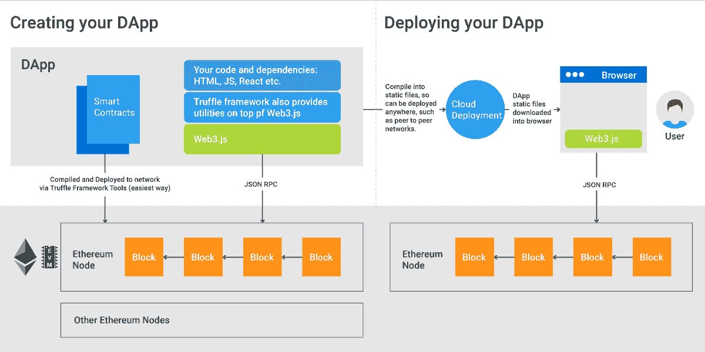
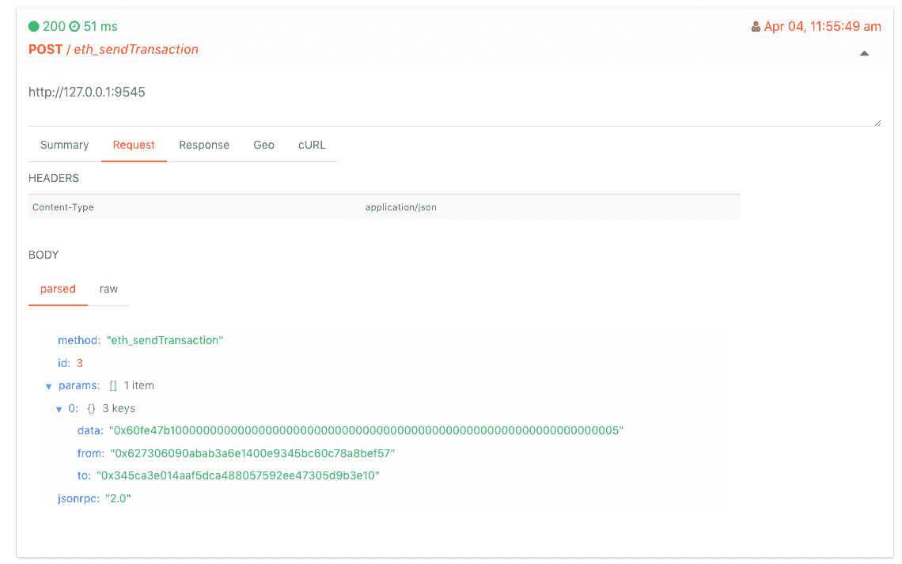

# 构建集成 Web3 监控的以太坊 DApp 教程

> 原文：<https://www.moesif.com/blog/blockchain/ethereum/Tutorial-for-building-Ethereum-Dapp-with-Integrated-Error-Monitoring/>

这篇文章介绍了使用 Web3.js 和 Truffle 创建一个简单以太坊 DApp 的步骤，并设置了对发送到区块链的 API 事务的监控。本文还解释了开发 DApps 所涉及的各种技术。

## 介绍

### 什么是区块链

[分散式应用(或 dapp)](https://ethereum.stackexchange.com/questions/383/what-is-a-dapp)是不依赖于运行在 AWS 或 Azure 中的集中式后端的应用，这些后端支持传统的 web 和移动应用(在托管前端代码本身之外)。相反，应用程序直接与区块链交互，这可以被认为是分布式节点群集，类似于应用程序直接与 Cassandra 节点的“无主”群集交互，该群集在不可信对等网络中的每个对等点上都具有完全复制。

这些区块链节点不需要一个会违背真正分散的目的的领导者。与各种共识协议(如 [Raft](https://raft.github.io/) 和 [Paxos](https://en.wikipedia.org/wiki/Paxos_(computer_science)) )中的领导者选举不同，区块链事务通过工作证明或利益证明被发送到“随机”节点并由其处理。这些节点是不受信任的节点，运行在世界各地各种计算设备上的任意大小的网络中。

这种技术可以实现真正的分散分类账和记录系统。

DApps 是通过 API 与这些区块链交互的前端应用。对于[以太坊](https://www.ethereum.org/)，这个 API 是一个 [JSON-RPC](http://www.jsonrpc.org/specification) 层，叫做以太坊 Web3 API，Moesif 原生支持。

### 以太坊是什么？

[以太坊](https://www.ethereum.org/)是区块链技术的实现，可以运行*智能合约*。以太坊虚拟机是图灵完全的，可以直接在区块链网络上运行任意计算。尽管比特币的命令集有限，但以太坊合约允许应用程序开发者准确指定合约上可以执行的交易。简单的*智能合约*可以被认为是一个[有限状态机(FSM)](https://en.wikipedia.org/wiki/Finite-state_machine) 带有一组自定义转换。

### 什么是智能合约？

[智能合约](https://en.wikipedia.org/wiki/Smart_contract)可以使区块链用户在一组用户之间交换金钱和财产或执行其他操作，如投票，而无需任何中央授权。

对于以太坊平台，智能合约是用一种叫做 [Solidity](https://solidity.readthedocs.io/en/v0.4.21/) 的语言定义的。

### 什么是 JSON-RPC

JSON-RPC 是一个无状态的轻量级远程过程调用(RPC)协议，使用 JSON 作为有效负载。与以资源为中心的 RESTful API 不同，像 JSON-RPC 这样的 RPC APIs 是过程化的，可以比 RESTful API 耦合得更紧密。

前端应用程序使用 JSON-RPC 与以太坊集群通信。Web3 是以太坊兼容的 API 和绑定，它是使用 JSON-RPC 规范构建的。

任何去中心化的应用都必须使用 Web3 SDK，例如 [Web3.js](https://github.com/ethereum/web3.js/) 用于基于浏览器的 d app。

### 这些部分是如何组合在一起的



上面是生态系统的示意图，以及所有技术是如何结合在一起的。

## 构建 DApp 的教程

现在你已经有了一些以太坊 DApps 的背景知识，让我们浏览一下教程。

我们将使用 [Truffle Framework](http://truffleframework.com/) ，它为搭建以太坊的 DApps 提供了一套工具和样板代码。在我们开始之前，让我们先来看看一些注意事项。

*   DApp 有用户界面吗？除非您的 DApp 是一个自动化流程。dapp 通常有一个 UI 组件，如 web 或移动应用程序，因为它通常是人类与智能合约或以太网进行交互的一种方式。如果你的 DApp 需要在浏览器中运行，那么你可以像任何传统的单页面应用一样用 Javascript 构建你的 UI。作为最流行的 SPA 框架之一，我们将选择 React。

    Truffle 框架提供了一个样板文件(称为 box)，`truffle-react`，它派生自`create-react-app` [样板文件代码生成器](https://github.com/facebook/create-react-app)。

*   *你设计好你的智能合约了吗？*智能合约为你的 DApp 定义了规则和过渡，是运行在以太坊虚拟机中的一部分。避免在你的智能合约中加入不必要的逻辑，因为运行其计算的*气体*可能非常昂贵。我们将从 truffle 的简单智能合约开始，称为*简单存储。*它存储一个无符号整数`storedData`，并提供一个 setter 和 getter。

```py
pragma solidity ^0.4.18;

contract SimpleStorage {
  uint storedData;

  function set(uint x) public {
    storedData = x;
  }

  function get() public view returns (uint) {
    return storedData;
  }
} 
```

*   *测试环境呢？*由于以太坊合约上的任何写交易都将花费*汽油*你将需要一个测试网络来避免这种情况。以太坊提供官方测试网络，而 Truffle Framework 提供本地测试环境。

### 逐步指南

#### 1.安装 Truffle 框架

```py
npm install -g truffle 
```

我们在这里使用 *-g* 标志，这样我们就可以在其他项目中继续使用这个框架。

#### 2.生成样板代码

```py
truffle unbox react 
```

松露框架称样板文件为*盒子*。react 样板文件基于脸书的`create-react-app`样板文件。

这将生成一组文件和文件夹。

需要关注的文件夹很少。

*   文件夹是存储 react 代码的地方。
*   文件夹是存储用 solidity 编写的智能合同的地方。注意我们之前提到的`SimpleStorage.sol`文件。
*   是管理以太坊网络上的合同部署的脚本。
*   在`public/`中，`index.html`文件是 react 应用程序被注入的入口点。

#### 3.启动开发环境

```py
truffle develop 
```

这引发了两件事。首先，在`http://127.0.0.1:9545`的以太坊节点模拟器，创建 10 个测试账户，每个账户有 100 个以太。其次，它会启动 truffle 命令行提示符。

#### 4.汇编合同

在 truffle development 命令提示符下:

```py
compile 
```

这将把你的 solidity 契约编译成 JSON 工件，包括称为*以太坊虚拟机(=EVM)字节码*的字节码。你会在`build/contracts`文件夹中找到编译好的合同。

#### 5.部署合同

在 truffle development 命令提示符下:

```py
migrate 
```

这将把合同部署到仿真以太网。(注意，您可以稍后通过修改`truffle-config.js`文件部署到真正的以太坊网络。)

现在，您可以在 DApp 中添加一些交互功能，例如编辑`App.js`文件。

#### 6.跑 DApp

此时，您可以在浏览器中运行 DApp:

```py
npm run start 
```

但是，它和以太坊还没有太多的互动。所以我们在这里补充一些。

首先，我们需要通过获取 Web3 对象的句柄并设置提供者来连接到以太网。

注意:如果你想知道 DApp 是如何连接到 Web3.js 的，请查看`utils/getWeb3.js`。Web3 首先检查浏览器窗口中是否已经注入了 Web3 对象，并使用该对象。但是如果没有注入 Web3 实例，Web3 会尝试连接到作为网络提供者的`http://127.0.0.1/9545`。如果你正在使用[薄雾浏览器](https://github.com/ethereum/mist)或使用[元蒙版扩展](https://metamask.io/)，web3 对象将被注入。您可以配置元掩码扩展(或 Mist 浏览器)将您的 DApp 连接到哪个网络，等等。

#### 7.修改 DApp 代码

在`App.js`中，我们在 React `componentWillMount()`生命周期方法中获得对 web3 对象的引用，并将其存储在本地状态中。我们还实例化了契约的本地版本。

```py
getWeb3
.then(results => {
  this.setState({
    web3: results.web3
  })

  // Instantiate contract once web3 provided.
  this.instantiateContract()
})
.catch(() => {
  console.log('Error finding web3.')
}) 
```

现在，我们可以添加一个小表单:

```py
<form className="pure-form pure-form-stacked">
  <fieldset>
    <label htmlFor="storage">Storage Amount</label>
    <input id="storage" type="number" ref={c => { this.storageAmountInput = c }} />
    <button
      className="pure-button"
      onClick={(e) => {
        e.preventDefault();
        this.addToSimpleStorage()
      }}
    >
      Set Storage
    </button>
  </fieldset>
</form> 
```

该表单将允许用户设置他们希望存储在 SimpleStorage 契约中的值。按钮的操作处理程序如下:

```py
addToSimpleStorage() {
  if (this.state.simpleStorageInstance && this.state.accounts) {
    const value = this.storageAmountInput.value;
    this.state.simpleStorageInstance.set(value, {from: this.state.accounts[0]})
      .then((result) => {
        return this.state.simpleStorageInstance.get.call(this.state.accounts[0])
      }).then((result) => {
        this.setState(prevState => ({
          ...prevState,
          storageValue: result.c[0]
        }));
      }).catch((err) => {
        console.log('error');
        console.log(err);
      });
  } else {
    this.setState(prevState => ({
      ...prevState,
      error: new Error('simple storage instance not loaded')
    }))
  }
} 
```

在处理程序中，我们从本地状态获得 SimpleStorage 和 accounts 的实例化契约。然后，我们使用从 html 表单中获得的值设置 storageValue。

就是这样，我们简单的小 DApp。需要注意的几件事:

*   `simpleStorageInstance.set`触发简单存储契约的 set 方法。
*   关于如何工作的细节，请查看 Truffle 的契约库，它有点像 Web3js 的包装器。

#### 8.运行我们简单的 DApp

```py
npm run start 
```

您应该能够设置智能合约的存储值，该值将存储在以太坊区块链上。

## 设置以太坊 Web3 API 监控。

由于 DApp 没有集中的服务器，当你在生产中部署你的 DApp 时，就没有服务器来安装监控工具，如 [Datadog](https://www.datadoghq.com/) 或 [New Relic](https://newrelic.com/) 。为了监控与智能合约和以太坊网络的交互，我们希望安装一个支持 DApps 的监控解决方案。

[Moesif](https://www.moesif.com) 很乐意支持以太坊 Web3 作为监控和分析的兼容 API。

Moesif 可以使用浏览器 SDK 直接从客户端捕获 API 调用数据，进而用于调试和监控问题，并在出现异常时向您发出警报。

我们将使用 [moesif-browser-js](https://www.moesif.com/docs/client-integration/browser-js/) 来集成 [GitHub](https://github.com/moesif/moesif-browser-js) 上可用的。

#### 1.创建一个 [Moesif 账户](https://www.moesif.com)以获得一个*应用 id。*

#### 2.将以下代码片段添加到`public/index.html`

```py
<script src="//unpkg.com/moesif-browser-js@1.2.0/moesif.min.js"></script>
<script type="text/javascript">
var options = {
  applicationId: 'Your Moesif application id'
  // add other option here.
};

// for options see below.
moesif.init(options);

// this starts the capturing of the data.
moesif.start();
</script> 
```

#### 3.重新加载您的应用程序

Moesif 自动检测以太坊 Web3 调用并跟踪它们。您可以通过登录 Moesif 并查看事件流来验证事件是否被捕获。



### 源代码

本教程的源代码可以在 [Github 上找到。](https://github.com/Moesif/moesif-ethereum-js-example)

### Moesif 以太坊 DApp 支持

[请查阅这篇文档，了解 Moesif 如何支持基于以太坊 Web3 和 JSON-RPC 构建的去中心化应用。](https://www.moesif.com/docs/platform/ethereum-web3/)。还有更多信息设置自动[解码十六进制值为人类可读值](https://github.com/Moesif/moesif-eth-cli)。

### 元掩码的常见问题和常见问题

我收到了很多人们经常遇到的问题，特别是关于从默认的松露开发网络切换到 Metamask 的问题。所以，我写了一篇博文:[关于 Metamask 和 Web3 的常见陷阱和解决方案的 FAQ](/blog/blockchain/ethereum/Common-Problems-Developing-Ethereum-DApps-With-Metamask/)。