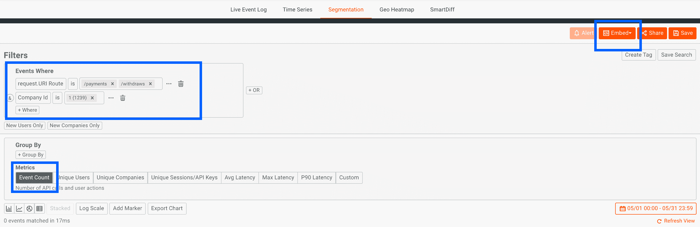
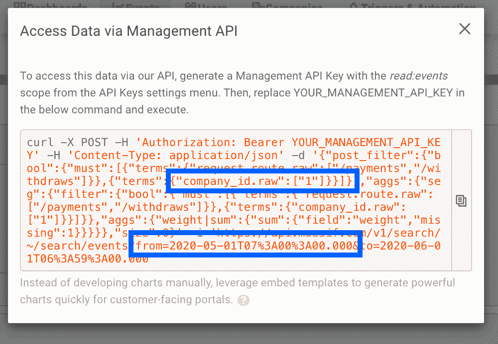

# 使用 Moesif 和 Chargebee 设置基于使用的 API 计费的教程

> 原文：<https://www.moesif.com/blog/developer-platforms/chargebee/Tutorial-to-Set-Up-Usage-Based-API-Billing-with-Moesif-and-Chargebee/>

现代 API 企业正在向基于使用量的计费模式迁移，这种模式能够自动扩大收入，同时消除采用新 API 的障碍。使用 Moesif，您可以与 Recurly 和 Chargebee 等订阅管理解决方案集成，在几分钟内快速添加基于使用的高级计费。在本指南中，我们将介绍 Moesif 与 Chargbee 的集成，以及一些基于使用计费的建议。然后，我们将讨论如何利用[嵌入模板](https://www.moesif.com/api-dashboards/embed-templates/)和[行为电子邮件](https://www.moesif.com/features/user-behavioral-emails)让您的客户了解它们的使用情况。

本指南假设您已经熟悉 [Moesif 的计量 API 计费](https://www.moesif.com/solutions/metered-api-billing)和[收费人的订阅管理](https://www.chargebee.com/)。我们还建议[阅读一份正确实施现收现付定价的行动手册](/blog/developer-platforms/self-service/A-Playbook-To-Properly-Implement-Pay-As-You-Go-Pricing/)，以熟悉不同的计费模式。

## 解决方案的工作原理

为了正确实施基于使用的计费，除了标准订阅管理之外，您还需要一些组件:

*   计量每个客户的平台使用情况，并根据使用情况开具发票
*   当客户接近或超过配额或阈值时，向他们发送自动提醒
*   为客户提供一个仪表板，以检查他们的订阅使用情况

此示例演示了如何设置后付费账单，其中客户根据其上个月的使用情况按月付费。虽然这是最常见的基于使用的计费形式，但也有其他模式，如预付费计费、基于信用的余额和基于阈值的发票。查看[行动手册以正确实施现收现付定价](/blog/developer-platforms/self-service/A-Playbook-To-Properly-Implement-Pay-As-You-Go-Pricing/)进行深入比较。

> GitHub 上有一个工作示例应用

在每个续订期(通常每月一次)，收费人将调用 webhook 从 Moesif 获取客户的使用情况。这是通过您的 Moesif 帐户中的预定义查询来完成的。Moesif 还会在客户接近预定义的配额时发送提醒电子邮件，该配额可能是客户指定的。

## 1.安装 Moesif 监控 SDK

为了处理基于使用量的计费，您需要准确地计量每个客户的 API 使用量。这可以通过 [Moesif 服务器集成或 API 网关插件](https://www.moesif.com/implementation)来完成。下面的 Node.js 就是一个例子。

```py
// 1\. Import Modules
const express = require('express');
const app = express();
const moesif = require('moesif-nodejs');

// 2\. Set the options, the only required field is applicationId
const moesifMiddleware = moesif({
  applicationId: 'Your Moesif Application Id',

  // Optional hook to link API calls to users
  identifyUser: function (req, res) {
    return req.user ? req.user.id : undefined;
  },
});

// 3\. Enable the Moesif middleware to start logging incoming API Calls
app.use(moesifMiddleware); 
```

## 2.将收费订阅信息同步到 Moesif

为了正确地向客户发送配额和计费通知，您需要将客户电子邮件存储在 Moesif 中。您还需要存储客户的计划。我们建议使用以下映射:

| 穆塞夫 | 受款人 | 描述 |
| --- | --- | --- |
| [用户](https://www.moesif.com/docs/getting-started/users/) | [客户/联系人](https://www.chargebee.com/docs/customers.html) | 一个帐户中的单个用户及其姓名、电子邮件和用户 id |
| [公司](https://www.moesif.com/docs/getting-started/companies/) | [订阅](https://www.chargebee.com/docs/subscriptions.html) | 订阅信息及其相关的计划配额或价格 |

### 每个帐户处理多封电子邮件

在 Chargebee 中，每个订阅对象只能与一个客户对象相关联。如果一个订阅可以有许多席位(用户),这就使数据模型变得有些复杂。作为一种变通办法，Chargebee 的确可以让你存储两个[特殊联系人](https://www.chargebee.com/docs/customers.html#add-contact):*账户电子邮件*和*账单电子邮件*。

因为 Moesif 是为基于账户的业务(即 B2B)设计的，所以 Moesif 对用户的处理是不同的。一个 Moesif 公司可以与许多用户相关联，每个用户都有自己的元数据。我们建议通过拆分客户对象，而不仅仅是主要客户，将该客户下的所有联系人同步到 Moesif，这样可以更灵活地确定由谁接收电子邮件通知。每个用户都有一个指定用户标签或角色的字段。

为了将 Chargebee 订阅同步到 Moesif，我们将使用一个重复的 cron 作业获取过去 24 小时内所有最近创建或更新的订阅。付费订阅 id 将映射到 Moesif 公司 Id，而客户 Id/联系人 Id 将映射到 Moesif 用户 Id。

### 费用的变化

*   在 Billing LogIQ 设置中，选择*通知并等待关闭发票*。
*   对于发票日期，我们推荐*发票关闭日期*

### 通过 cron 作业同步的代码

下面我们将保存所有用于分析的订阅字段，但您可以选择将哪些属性保存为 Moesif 公司或用户元数据。我们循环浏览订阅和公司。Chargebee API 将分页限制为 100 项，因此我们在静默期之后继续重复代码。

> GitHub 上有一个工作示例应用

```py
const chargebee = require('chargebee');
const cron = require('cron');
const basicAuth = require('express-basic-auth');
const bodyParser = require('body-parser');
const express = require('express');
const safeGet = require('lodash/get');
const superagent = require('superagent');
const moesifapi = require('moesifapi');
const moment = require('moment');

// Initialize SDKs
chargebee.configure({ site: process.env.CHARGEBEE_SITE, api_key: process.env.CHARGEBEE_API_KEY });

moesifapi.configuration.ApplicationId = process.env.MOESIF_APPLICATION_ID;

chargebee.configure({ site: process.env.CHARGEBEE_SITE, api_key: process.env.CHARGEBEE_API_KEY });

const CronJob = cron.CronJob;
new CronJob('*/10 * * * *', function() {
  try {
    console.log('Run syncSubscriptions');
    syncSubscriptions();
  } catch (err) {
    console.log(err);
  }
}, null, true, 'America/Los_Angeles', null, true);

function syncSubscriptions() {
    chargebee.subscription
    // We only need to sync subscriptions that have been updated in the last 24 hrs. 
    .list({
        limit: 100,
        'sort_by[asc]': 'updated_at',
        'updated_at[after]': moment().utc().subtract(24, 'hour').unix(),
    })
    .request()
    .then((subscriptions) => {

            console.log(`Received subscriptions`)

            // Save Chargebee subscriptions as Moesif companies
            const companies = subscriptions.list.map((s) => {
                return {
                    company_id: s.subscription.id,
                    metadata: s.subscription // Rest of metadata
                }
            })

           // console.log(JSON.stringify(companies));
            moesifapi.ApiController.updateCompaniesBatch(companies, (error, response, context) => {
                if (error) {
                    console.log(error) 
                } else {
                    console.log(`Synced Chargebee Subscriptions to Moesif Companies Successfully statusCode=${context.response.statusCode}`)
                }

                // Save Chargebee customers and contacts as Moesif users
                const users = subscriptions.list.map((s) => {
                    const contacts = s.customer.contacts ? 
                        contacts.map(c => {
                            return {
                                user_id: c.id,
                                company_id: s.subscription.id,
                                email: c.email,
                                first_name: c.first_name,
                                last_name: c.last_name,
                                metadata: { label: c.label, ...s.customer } // Rest of metadata
                            };
                        }) : [];

                    return [
                        ...contacts, 
                        {
                            user_id: s.customer.id,
                            company_id: s.subscription.id,
                            email: s.customer.email,
                            first_name: s.customer.first_name,
                            last_name: s.customer.last_name,
                            metadata: s.customer // Rest of metadata
                        }
                    ];

                });

                usersFlattened = users.reduce(function(a, b){
                    return a.concat(b);
               }, []);

                moesifapi.ApiController.updateUsersBatch(usersFlattened, (error, response, context) => { 
                    if (error) {
                        console.log(error) 
                    } else {
                        console.log(`Synced Chargebee Subscriptions to Moesif Users Successfully statusCode=${context.response.statusCode}`)
                    }
                });
            });
        }
    );
} 
```

## 3.处理计量计费网络挂钩

Chargebee 的发票 API 有一个[方便的 webhook](https://www.chargebee.com/tutorials/usage-based-billing-example.html) ，可以在发票生成时触发。这为您提供了一种方式来告诉 Chargbee 根据客户在 Moesif 中的使用情况，在客户的计费周期内向客户收取多少费用。

您可以通过以下两种方式添加费用:

*   [向发票](https://apidocs.chargebee.com/docs/api/invoices#add_one-time_charge_to_a_pending_invoice)添加费用，发票直接添加行项目。
*   [向发票](https://apidocs.chargebee.com/docs/api/invoices#add_non-recurring_addon_to_a_pending_invoice)添加附加费用，这使您能够设置附加费用的数量，而不是直接添加费用。

在本例中，我们将直接在发票中添加费用。然而，更复杂的设置可能需要利用附加组件。

### 计算账单周期

一旦发票处于待定状态，订阅就已经续订，因此我们开始了一个全新的计费周期。因此，我们希望根据上一个计费周期而不是当前计费周期来计算客户的使用量。

### 公司用途查询

为了确定客户的使用情况，我们首先需要确定哪些 API 调用是“可收费的”，这是由您的定价和业务模型决定的。例如，通信 API 可以基于发送的 SMS 来收费，而电子商务平台可以基于进行的购买来收费。我们可以利用 Moesif 的高级过滤机制和管理 API，只需点击几下鼠标就可以构建这个查询。在这个例子中，我们包括了所有路由匹配`/purchases`或`/withdraws`的 API 调用。

*   要在`getCompanyUsageQuery()`函数中生成 JSON，登录 Moesif，进入*事件* - > *分段*。
*   从这里，添加应该包括的任何过滤器，例如特定的端点或字段。



*   确保在公司 id 上添加过滤器。实际值和图表的日期范围无关紧要，因为它们将在代码中被覆盖。
*   点击右上角的橙色“嵌入”按钮，然后“通过 API 获取”。这将为该报告提供完整的 JSON 查询。
*   查询参数`from`和`to`以及有效负载值`company_id.raw`将在下面的代码中被覆盖。



### 处理基于用量的开票的代码

> GitHub 上有一个工作示例应用

```py
const chargebee = require('chargebee');
const cron = require('cron');
const basicAuth = require('express-basic-auth');
const bodyParser = require('body-parser');
const express = require('express');
const safeGet = require('lodash/get');
const superagent = require('superagent');
const moesifapi = require('moesifapi');
const moment = require('moment');

const app = express();
chargebee.configure({ site: process.env.CHARGEBEE_SITE, api_key: process.env.CHARGEBEE_API_KEY });

app.use(
  basicAuth({
    users: { [process.env.CHARGEBEE_WEBHOOK_USERNAME]: process.env.CHARGEBEE_WEBHOOK_PASSWORD },
  })
);
const UNIT_COST_IN_CENTS = 1; // How much each transaction is worth in cents

// Simple sample query which can be found going to "Events" -> "Segmentation" in Moesif.
// Then select the orange Get Via API button under "Embed".
function getCompanyUsageQuery(companyId) {
    return {
        aggs: {
            seg: {
                filter: {
                    bool: {
                        must: [
                            {
                                terms: {
                                    'request.route.raw': [
                                        '/purchases',
                                        '/withdraws',
                                        '/'
                                    ]
                                }
                            },
                            {
                                term: {
                                    'company_id.raw': companyId
                                }
                            }
                        ]
                    }
                },
                aggs: {
                    weight: {
                        sum: {
                            field: 'weight',
                            missing: 1
                        }
                    }
                }
            }
        },
        size: 0
    }
}

app.use(bodyParser.json());
app.post('/chargebee/webhooks', (req, res) => {
    const event = req.body;

    if (event && event.event_type === 'pending_invoice_created') {

        const invoice = event.content.invoice;

        // Retrieve subscription for this invoice to get billing period
        return chargebee.subscription
            .retrieve(invoice.subscription_id)
            .request()
            .then((subscriptionResult) => {
                const subscription = subscriptionResult.subscription;
                console.log('Retrieved subscription');
                console.log(JSON.stringify(subscription));

                // We should query metric the previous billing period.
                const params = {
                    from: (moment.unix(subscription.current_term_start)
                        .subtract(parseInt(subscription.billing_period), `${subscription.billing_period_unit}s`)).toISOString(),

                    to: moment.unix(subscription.current_term_start).toISOString()
                };

                console.log('Params: ' + moment.unix(subscription.current_term_start).toISOString());
                console.log(JSON.stringify(params));

                // Get usage from Moesif
                return superagent
                    .post(`https://api.moesif.com/v1/search/~/search/events`)
                    .set('Authorization', `Bearer ${process.env.MOESIF_MANAGEMENT_API_KEY}`)
                    .set('Content-Type', 'application/json')
                    .set('accept', 'json')
                    .query(params)
                    .send(getCompanyUsageQuery(subscription.id))
                    .then((countResult) => {

                        const count = safeGet(countResult, 'body.aggregations.seg.weight.value');

                        console.log(`Received count of ${count}`)
                        const amount = count * (UNIT_COST_IN_CENTS); // How much each transaction is worth in cents

                        console.log(`Adding cost for subscription=${subscription.id} of ${amount}`);

                        chargebee.invoice.add_charge(invoice.id,{
                            amount : amount,
                            description : `Usage of ${amount} widgets`
                        }).request(function(error, chargeResult) {
                            if(error){
                                //handle error
                                console.log(JSON.stringify(event));
                                console.log(error);
                                res.status(500).json({ status: 'internal server error' });
                            } else {
                                console.log(chargeResult);
                                res.status(201).json({ status: 'ok ' });
                            }
                        });
                    })
                    .catch((error) => {
                        console.log(error.text);
                        res.status(500).json({ status: 'internal server error' });
                    });
            })
    } 
    console.log(JSON.stringify(event));
    res.status(500).json({ status: 'internal server error' });
});

app.listen(process.env.PORT || 5000, function() {
    console.log('moesif-chargebee-example is listening on port ' + (process.env.PORT || 5000));
}); 
```

## 3.嵌入使用报告

现在，Moesif 和 Chargebee 已经完全设置好了基于使用情况的发票，您还需要想办法让您的客户了解他们的使用情况。有两种方法可以做到这一点。第一个是[嵌入式仪表盘](https://www.moesif.com/features/embedded-api-logs)，这样您就可以显示使用情况的指标。


嵌入式使用情况报告使您能够向客户提供自助服务指标，以便他们了解他们所支付的费用。这些报告为您的客户创造了额外的透明度和信任，因为他们可以跟踪他们获得的相对于成本的价值。首先，查看[嵌入模板文档](https://www.moesif.com/docs/api-dashboards/embed-templates/)和[示例 GitHub 项目](https://github.com/Moesif/moesif-browser-embedded-api-dashboard)

## 4.设置配额提醒和电子邮件

您还可以利用 [Moesif 行为电子邮件](https://www.moesif.com/features/user-behavioral-emails)在客户接近或超过其账单周期配额时自动通知客户。这可以是一个静态阈值，特定于一个计划，甚至特定于一组客户。


首先，请按照我们的指南[设置配额和计费问题的自动通知](/blog/developer-marketing/behavioral-emails/Automatic-Notification-of-Quota-and-Billing-Issues/)。

## 结束语

有了 Moesif 和 Chargebee，您现在有了一个准确的机制来根据客户的使用情况向他们收费。因为遥测数据已经存储在 Moesif 中，所以您可以利用其附加的小部件，如行为电子邮件和[嵌入式仪表板](https://www.moesif.com/features/embedded-api-logs)，只需点击几下鼠标，就可以让您的客户了解他们的订阅情况。此外，您还可以在 Moesif 中设置提醒，以便您自己的客户成功团队能够主动联系，这在账单可能会在账单周期之间大幅波动时非常重要。首先，查看 GitHub 上的示例应用[。](https://github.com/Moesif/moesif-chargebee-example)