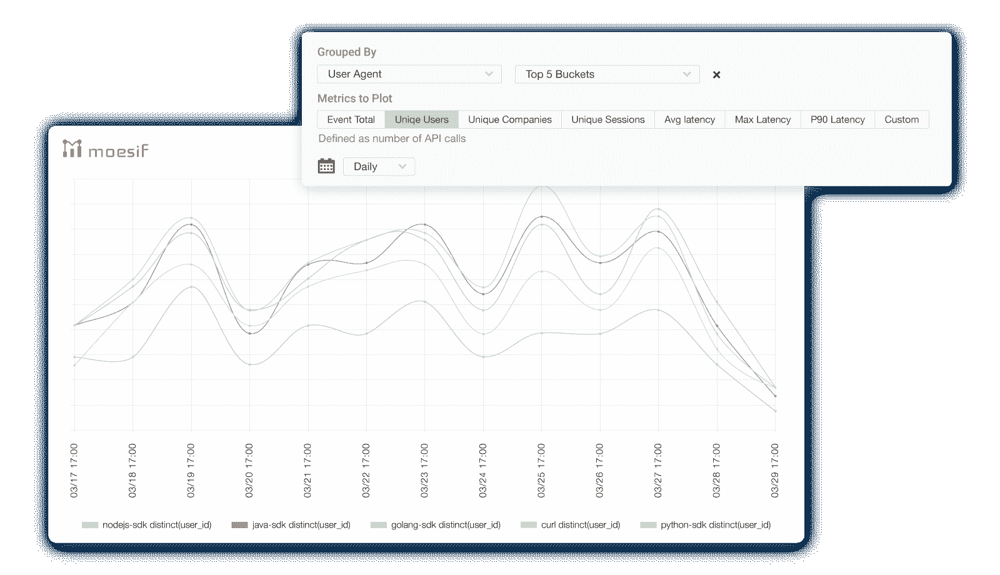
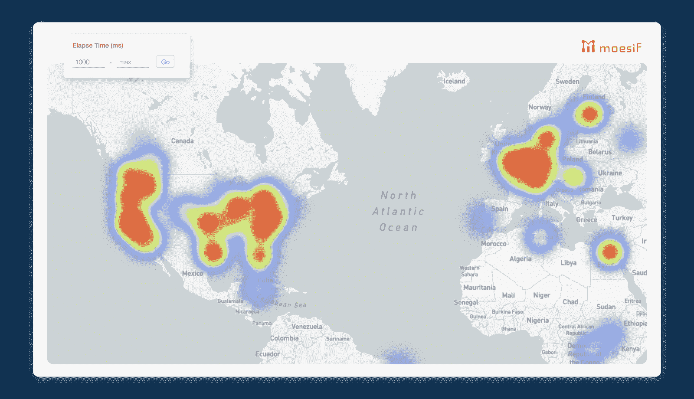
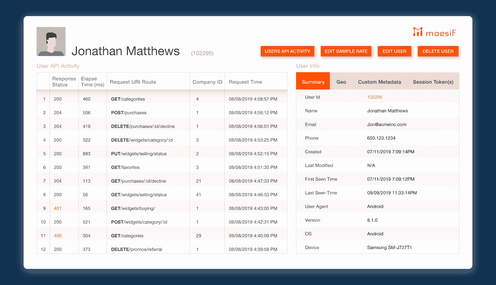
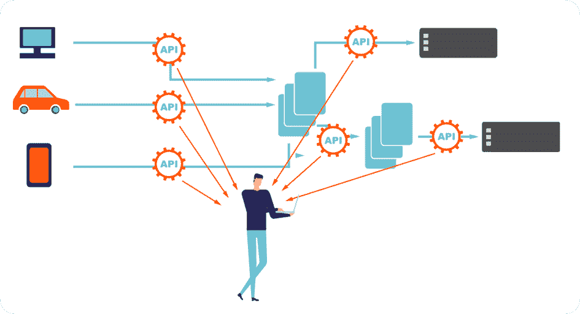

# 通过 Kong API Gateway 使用人工智能支持的 API 分析

> 原文：<https://www.moesif.com/blog/technical/kong/Using-AI-Powered-API-Analytics-with-Kong-API-Gateway/>

Kong 是一个流行的开源 API 网关，可以帮助你管理你的 API。有了 Kong，即使您有多个微服务，您也可以从一个集中的位置处理身份验证、速率限制、数据转换等事务。Kong 的核心是 NGINX，这是最流行的 HTTP 服务器之一。

由于是开源的，Kong 很容易在内部部署，除了 Postgres 或 Cassandra 商店之外，不需要安装许多组件。事实上，你可以在几分钟内完成跑步。

Moesif 在 Kong hub 中有一个[插件，可以让你了解 API 的使用情况并监控你的 API 流量。像谷歌分析一样，Moesif 是一项托管服务，因此您不必担心维护大型数据管道和数据存储，同时获得类似于 Mixpanel 或谷歌分析的洞察力。借助 Moesif，您可以了解 API 的使用方式和用户，确定哪些用户遇到了集成问题，并监控需要优化的终端。](https://docs.konghq.com/hub/moesif/kong-plugin-moesif/)

## 概观

Moesif Kong plugin 是一个代理，它收集指标并发送给 Moesif 收集网络。这使您能够全面了解 API 的使用情况，即使是跨不同的 Kong 实例和数据中心区域。Moesif 建议对在 Kong 配置的所有服务和路由使用相同的 Moesif 应用程序 Id。但是，建议对每个隔离环境使用单独的 Moesif 应用程序 id，例如*生产*和*开发*环境。

### 装置

要安装插件，安装 Lua Rock，然后启用插件:

```py
luarocks install --server=http://luarocks.org/manifests/moesif kong-plugin-moesif 
```

您可能需要更新您的 kong.conf，方法是将 moesif 附加到 plugins 字段(如果是旧版本的 kong，则为 custom_plugins)。确保该字段未被注释掉。

```py
plugins = bundled,moesif         # Comma-separated list of plugins this node
                                 # should load. By default, only plugins
                                 # bundled in official distributions are
                                 # loaded via the `bundled` keyword. 
```

现在插件已经安装好了，启用插件。

```py
curl -i -X POST --url http://localhost:8001/plugins/ --data "name=moesif" --data "config.application_id=Your Moesif Application Id"; 
```

一旦你启用了 Moesif 插件，数据应该开始出现在你的 Moesif 仪表板上。下面，我将按照请求`User-Agent`来分组 API 的使用情况。我们可以看到 Node SDK 是这个 API 最流行的 SDK。



### 插件如何工作

该插件在本地捕获指标，并在您的本地 Kong 实例上对它们进行排队。这使得插件能够在不影响应用程序的情况下将指标数据带外发送到 Moesif 收集网络。关于设计 SDK 的最佳实践，请看这篇文章。

该插件是开源的，可以在 GitHub 上获得[。](https://github.com/Moesif/kong-plugin-moesif)

## 支持的功能

使用 Moesif SDK 时可用的大多数功能在使用 Kong 插件时也是可用的。具体来说:

### 服务/路线检测

Moesif 丰富了数据，使其更有条理。例如，不是在`GET /service_a/items/1 OR GET /service_a/items/2 OR GET /service_a/items/3`上过滤，Moesif 将检测剩余的模板，包括在`GET /service_a/items/:id`上启用单个过滤器的任何参数和 id。类似地，如果您将 Kong 用于 GraphQL API，这也是受支持的。

### 地理分段

Kong 插件将从 NGINX 捕获 IP 数据，以及计时指标，以启用地理热图和过滤，如下图所示，显示用户体验到的延迟超过 1 秒。



### 用户会话

如果您为 Kong 配置了身份验证，Moesif Kong 插件将自动捕获经过身份验证的凭证，对此不需要进行任何配置。捕获会话信息使得 Moesif 能够生成 *API 会话跟踪*和*用户配置文件*以及关于用户第一次看到时间、用户最后一次看到时间等信息。

您可能会发现添加用户人口统计信息(如客户电子邮件和名字)非常有用。只要您拥有用户的 API 密钥/会话令牌，您就可以使用任何 Moesif API 库在任何时候添加/更新用户配置文件元数据。

这使您能够为您的 API 消费者之一调出完整的客户旅程。您将看到客户的人口统计信息以及他们进行的任何 API 活动。



因此，Moesif 能够执行更高级的用户群组分析，这允许您跟踪 30 天的活动保留时间。保持率衡量的是一群人中再次使用你的产品并保持活跃的用户的百分比。对于您的产品，什么被认为是有效的取决于产品的类型。对于流媒体移动应用程序来说，在某一天活跃可能意味着播放一首歌曲。对于一个支付 API，它可以在一天中处理一次信用卡支付。


### 传入和传出 API

Moesif Kong 插件可以用于你自己的 API，也可以用于你所依赖的合作伙伴的 API。这对于了解合作伙伴的基础架构发生了什么以及了解任何问题非常有用。只要流量流经您的 Kong 实例，Moesif 就可以对其进行分析。



## 结论

通过这种方式，该插件将捕获 API 请求和响应，并记录到 Moesif，以便通过 Kong 和处理应用程序周围所有其他服务的 Kong 轻松检查和实时调试您的 API 流量。