# 在 Moesif 中使用事件标签

> 原文：<https://www.moesif.com/blog/technical/api-analytics/Using-Event-Tags-In-Moesif/>

有时，您可能希望将相关的事件分组在一起，或者希望给事件起一个友好的名称。如果您想要将一组 API 调用合并到一个 API 产品中，这一点尤其正确。幸运的是，有了 Moesif，你就可以做到这一点，这样一组事件就可以作为一个单元来看待，就像 SKU 一样。在 Moesif 中，这可以通过使用**事件标签**特性来完成。

## 创建事件标签

创建事件标记的第一步是导航到实时事件日志屏幕。这可以通过转到 **+新**按钮并选择**实时事件日志**来完成。

一旦在实时事件日志屏幕上，我们可以确定我们的标签的过滤器。在本例中，我们将筛选两个相关的端点。将两条路由添加到过滤器后，我们现在可以创建标记了。点击**创建标签**按钮。

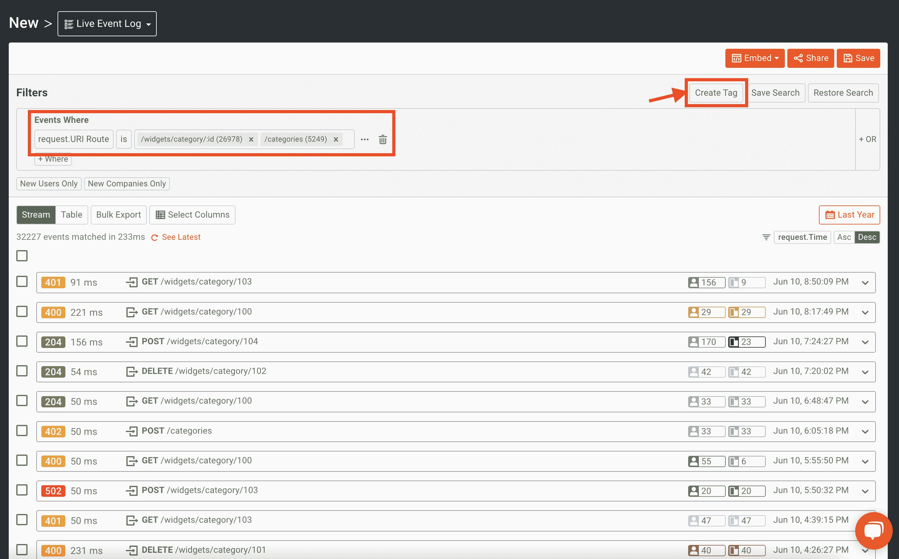

然后会出现一个显示标签过滤器的模式。我们将为标签键入一个名称， **Categories API** ，然后点击**创建“Categories API”**。

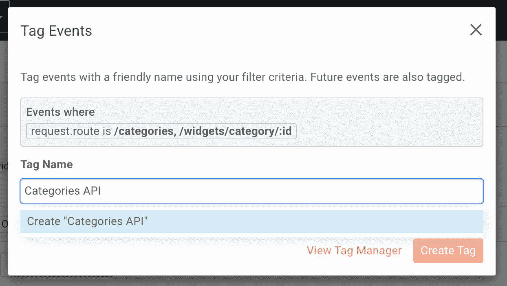

最后，您将点击**创建标签**按钮。

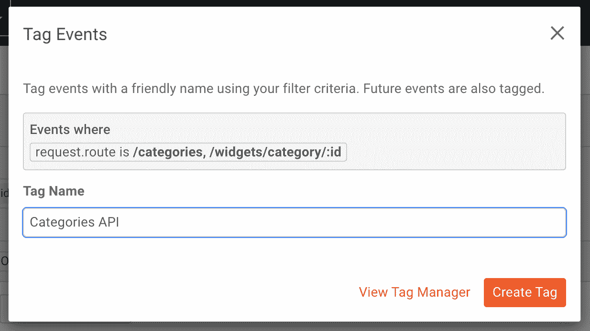

现在，标签已经创建好了，可以在 Moesif 中使用，这样就可以使用一个标准来查看事件。

更新标签也会更新旧事件。但是，这可能需要几分钟时间。您可以从标签管理器中查看标签的处理状态。

## 使用事件标签

使用事件标签可以像任何其他属性一样使用。一个很好的例子就是在实时事件日志查询中使用标签。不必指定端点，只需指定包含与标记匹配的事件。下面是该过滤器的外观和输出的快速演示。

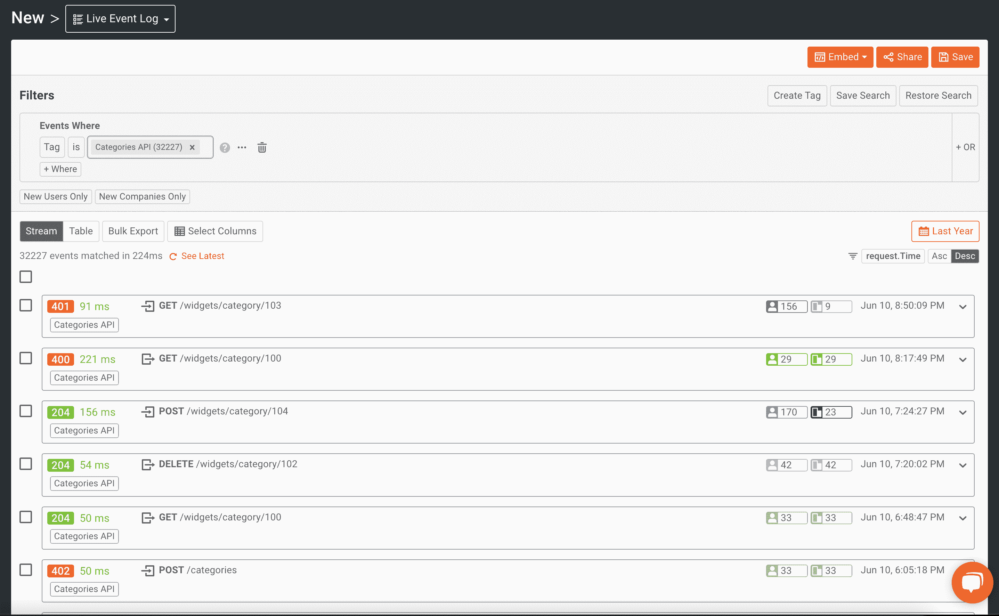

您还会注意到，条目还会显示它们所属的标签。每个条目都显示了**类别 API** 标签。

类似地，您可以像任何其他属性一样按标记名分组。下面我们可以看到每个 API 的流量。这有助于在创建[计费表](https://www.moesif.com/docs/metered-billing/)时将您的端点组织到 API 产品中。

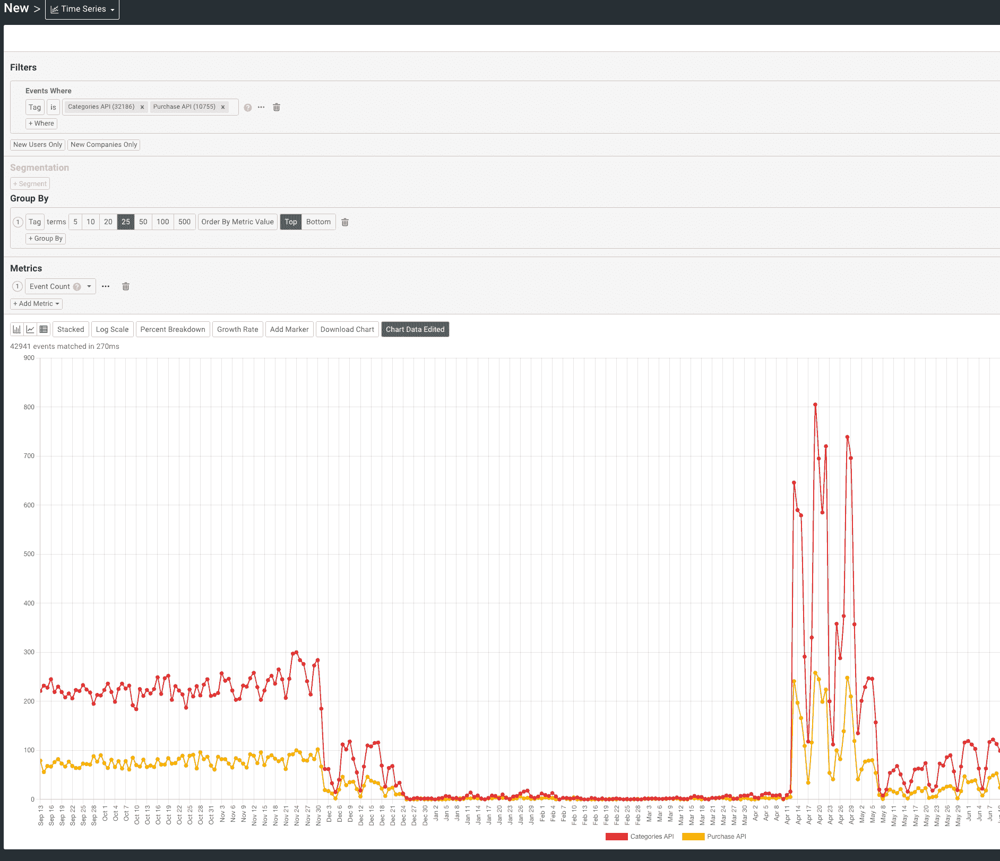

## 访问和编辑现有标签

要编辑现有标签，您可以通过**标签管理器**访问它们。这可以通过 Moesif 中屏幕底部的**设置**菜单来访问。

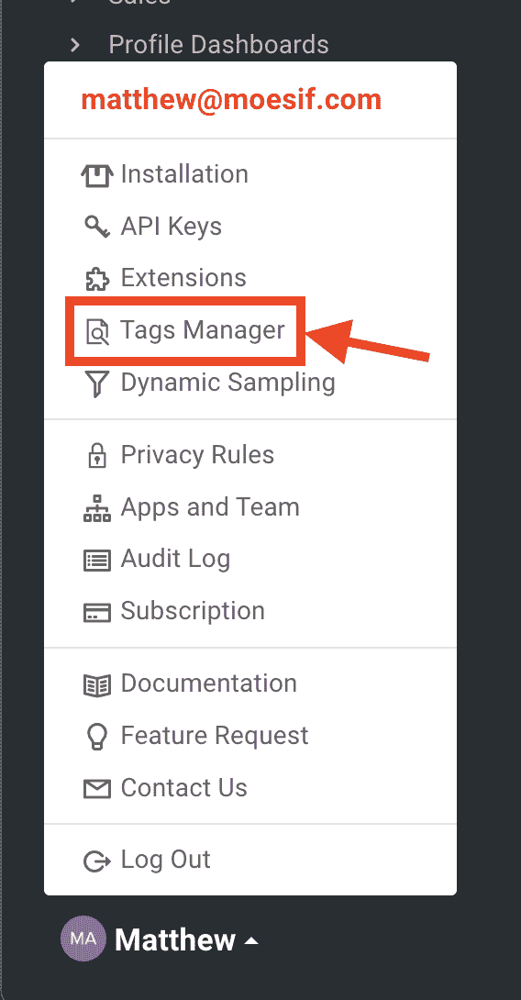

点击后，您将能够看到以前创建的标签，编辑它们，并删除它们。

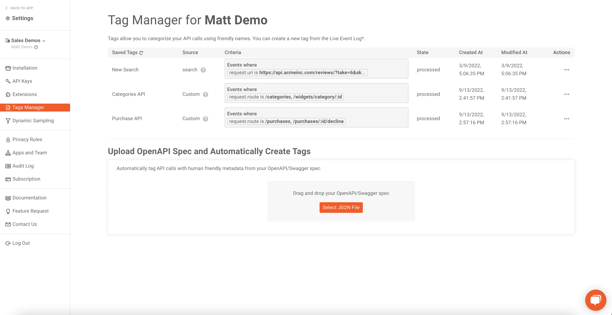

要编辑标签，只需点击条目末尾的省略号按钮，然后点击**编辑**。

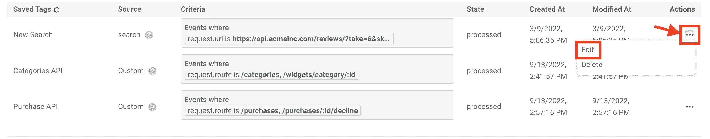

然后会弹出一个模式，允许您编辑标签的过滤器。完成后，点击**保存**按钮。

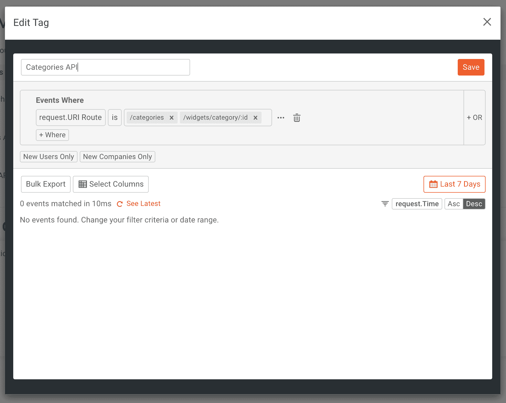

要删除不想再使用的标签，只需点击条目的省略号按钮，然后点击**删除**。

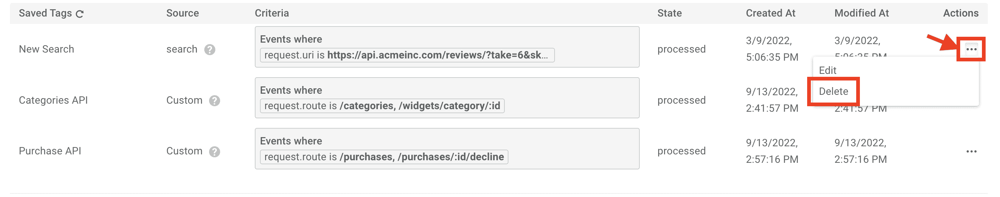

然后会出现一个模式来确认删除。点击**是**删除标签。

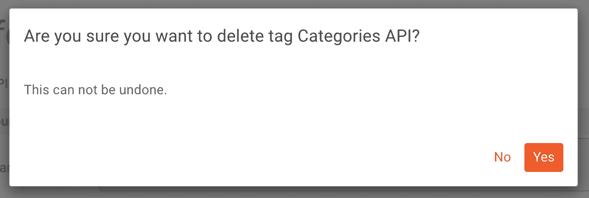

## 从 OpenAPI 规范生成标签

在**标签管理器**屏幕中的另一个可用特性是基于您的 OpenAPI 规范自动创建标签的能力。为此，只需上传或拖放您的 OpenAPI 规范，标签就会自动生成。

## 包扎

这就是创建标签的全部内容，这样您就可以在一个标签下将事件指标组合在一起。无论是试图更容易地查找相关事件，还是将 API 产品的概念添加到您的指标中， **Event Tags** 都是实现这一点的好方法。

还没用 Moesif？轻松[创建账户](https://www.moesif.com/signup?utm_campaign=Int-site&utm_source=blog&utm_medium=blog-cta&utm_term=event-tags)并在几分钟内将 Moesif 与您喜爱的编程语言或 API 管理工具集成。立即试用 Moesif 和事件标签，释放 API 和产品分析的力量。